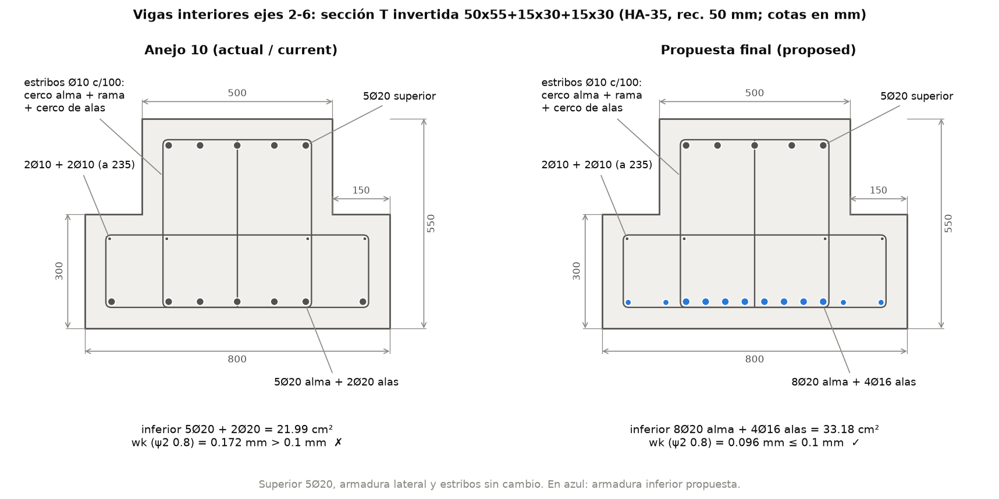
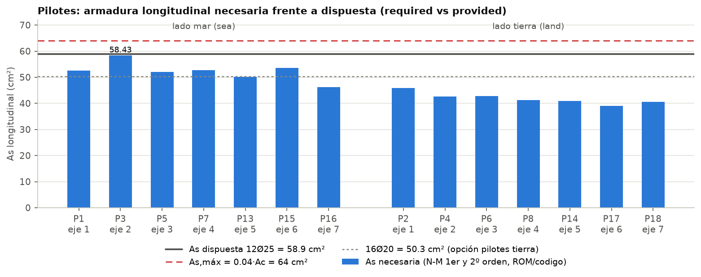
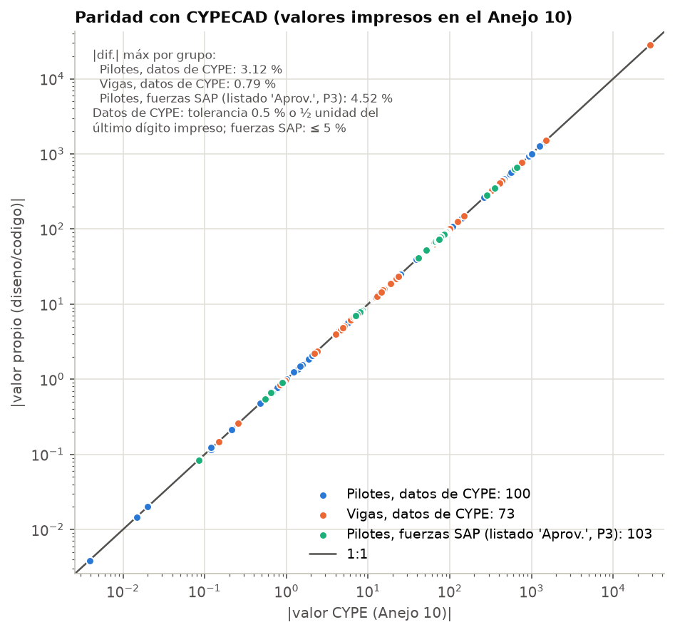

# توضیح کامل طراحی: کنترل و طراحی شمع‌ها و تیرهای اسکلهٔ Trasmallo طبق Código Estructural

> این متن ادامهٔ `documentacion/01_توضیح_کامل_پروژه.md` است و برای کسی نوشته شده که هیچ چیز دربارهٔ این پروژه نمی‌داند و فقط آشنایی اولیه‌ای با مهندسی سازه دارد. هر مفهوم، هر فرمول (با معنی همهٔ نمادها، واحدها و یک مثال عددی با عددهای خود این پروژه) و هر بند آیین‌نامه (چه می‌گوید و چرا وجود دارد) قدم‌به‌قدم توضیح داده شده است. همهٔ عددها از خروجی‌های `diseno/output/*.json` و `*.md`، از `diseno/ref` و از `diseno/investigacion` برداشته شده‌اند؛ هر جا عددی را خودمان با دست دوباره حساب کرده‌ایم، صریحاً گفته‌ایم.

---

## فهرست

1. [این مرحله چیست و چه خواسته شده بود](#۱-این-مرحله-چیست-و-چه-خواسته-شده-بود)
2. [مفاهیم پایه](#۲-مفاهیم-پایه)
3. [مصالح و آرماتورهای موجود](#۳-مصالح-و-آرماتورهای-موجود)
4. [روش تحلیل مقطع](#۴-روش-تحلیل-مقطع)
5. [شمع‌ها](#۵-شمعها)
6. [تیرها](#۶-تیرها)
7. [طراحی نهایی](#۷-طراحی-نهایی)
8. [بخش SAP2000](#۸-بخش-sap2000)
9. [مقایسه با Anejo 10](#۹-مقایسه-با-anejo-10)
10. [محدودیت‌ها و نکات باز](#۱۰-محدودیتها-و-نکات-باز)
11. [فایل‌ها و نحوهٔ اجرا](#۱۱-فایلها-و-نحوهٔ-اجرا)
12. [واژه‌نامه](#۱۲-واژهنامه)

---

## ۱. این مرحله چیست و چه خواسته شده بود

### ۱.۱ از مرحلهٔ قبل تا این مرحله
در مرحلهٔ قبل (سند `documentacion/01_توضیح_کامل_پروژه.md`) ماژول ۴۰ متری **Muelle de Trasmallo** در بندر Cullera (اسپانیا) در نرم‌افزار **SAP2000 v27.1** دوباره مدل و تحلیل شد و نیروهای داخلی آن (نیروی محوری، برش، لنگر) با خروجی **CYPECAD** در پیوست محاسبات پروژه، **Anejo 10**، مقایسه شد. اختلاف‌ها در حد ۰ تا ۵ درصد بود؛ یعنی مدل SAP قابل اعتماد است.

تحلیل فقط می‌گوید «در هر عضو چه نیرویی هست». **طراحی** یعنی جواب دادن به این سؤال: «آیا مقطع بتن‌آرمهٔ این عضو، با میلگردهایی که دارد، این نیرو را با حاشیهٔ اطمینان کافی تحمل می‌کند، در بهره‌برداری ترک و تغییرشکل بیش از حد نمی‌دهد و جزئیات اجرایی‌اش طبق آیین‌نامه است؟» اگر نه، چه میلگردی لازم است؟

آیین‌نامهٔ حاکم در اسپانیا **Código Estructural** (مصوب ۲۰۲۱، به اختصار CE) است. پیوست ۱۹ آن، **Anejo 19**، همان یوروکد ۲ (EN 1992-1-1، طراحی سازه‌های بتنی) است که مقادیر ملی اسپانیا در متنش نوشته شده است. در این متن بندهای آن را به شکل `A19.x.y` می‌نویسیم؛ مثلاً `A19.6.2` یعنی بند 6.2 یوروکد ۲ (برش) در نسخهٔ اسپانیایی.

### ۱.۲ آنچه خواسته شده بود
کاربر (به فارسی) این هفت کار را خواسته بود:

| # | خواسته | کجای این متن |
|---|---|---|
| 1 | آرماتور لازم شمع‌ها | بخش ۵.۱۰ |
| 2 | طراحی آرماتور تیرها | بخش ۶ و ۷ |
| 3 | As لازم در برابر As موجود (As required / As provided) | بخش‌های ۵.۱۰، ۶.۳ و ۶.۴ |
| 4 | مقاومت مقطع بتن‌آرمه | بخش ۴ (روش)، ۵.۶ تا ۵.۷ و ۶.۳ (نتایج) |
| 5 | کنترل ترک | بخش‌های ۵.۱۱ تا ۵.۱۴ و ۶.۸ تا ۶.۱۱ |
| 6 | طراحی برشی همراه با آرماتور برشی | بخش‌های ۵.۸ و ۶.۵ تا ۶.۷ |
| 7 | طراحی نهایی طبق Código Estructural | بخش ۷ |

و اینکه کار **مثل مرحلهٔ قبل** آماده شود: هم فایل‌هایی برای SAP2000 (فایل متنی `.$2k` و اسکریپت پایتون OAPI، بخش ۸) و هم برنامه‌های پایتون مستقل، و همه در یک بخش جدای مخزن به نام `diseno/` («طراحی» به اسپانیایی).

### ۱.۳ پاسخ کوتاه: آیا با Anejo 10 کنترل شد؟
**بله.** سه کار انجام شد:
1. **بازتولید دقیق CYPE:** برنامهٔ مقطع ما در حالت «CYPE» همهٔ ظرفیت‌هایی را که CYPE در Anejo 10 چاپ کرده است (مثلاً مقاومت سر شمع P3 و لنگر مقاوم تیر P3-P4) با اختلاف **0.00٪** دوباره حساب می‌کند. در شمع‌ها ۲۰۳ سطر از ۲۰۳ سطر مقایسه در محدودهٔ مجاز است و در کل ۳۶۸ سطر مقایسه در کتاب Excel آمده است (بخش ۹).
2. **کنترل با فرض‌های خود Anejo 10:** با همان فرض‌های بارگذاری CYPE (مبنای «CYPE»)، شمع‌ها و تیرهای عرضی در مقاومت نهایی قبول‌اند، همان‌طور که CYPE به دست آورده بود. دو استثنا پیدا شد که CYPE اصلاً کنترلشان نکرده بود یا مدلش فرق داشت: تنش مشخصهٔ بتن سر چهار شمع و تیرهای لبه (بخش ۹).
3. **کنترل با مبنای مناسب بندر (ROM):** با ضرایب ترکیب توصیه‌شدهٔ مقررات بندری اسپانیا (ROM 2.0-11)، تیرهای عرضی میانی در کنترل ترک رد می‌شوند و میلگرد پایینشان باید بیشتر شود (بخش‌های ۶.۸ و ۷).

### ۱.۴ نتیجهٔ نهایی در یک جدول
حکم نهایی با «کد سخت‌گیرانه» (Mode.CODIGO) + مبنای ROM + حد ترک 0.1 میلی‌متر (کلاس محیطی XS3) صادر شده است (تصمیم F0، بخش ۲.۶). η نسبت «نیروی وارده به ظرفیت» است و باید ≤ 1 باشد (بخش ۲.۷).

| عضو | آرماتور نهایی | تغییر نسبت به Anejo 10 | η حاکم | حکم |
|---|---|---|---|---|
| ۱۴ شمع P1 تا P18 | 12Ø25؛ ۳ خاموت Ø10 با فاصلهٔ 150، **با فاصلهٔ 100 در ۰.۴۰ متر بالایی** | فقط خاموت‌های سر شمع فشرده‌تر (محصورشدگی، +2.8 کیلوگرم در هر شمع) | 0.987 (خمش و نیروی محوری مرتبهٔ دوم، سر P3) | **قبول** (با خاموت‌های محصورکننده) |
| تیرهای عرضی میانی، محورهای ۲ تا ۶ | بالا 5Ø20؛ **پایین 8Ø20 در جان + 4Ø16 در بال‌ها (33.18 cm²)** | پایین 7Ø20 (21.99 cm²) → 8Ø20 + 4Ø16 | 0.962 (عرض ترک 0.096 mm) | **قبول** |
| تیرهای عرضی انتهایی، محورهای ۱ و ۷ | بالا 5Ø20؛ پایین 5Ø20 + 1Ø20 | هیچ | 0.973 (پیچش) | **قبول** |
| تیرهای لبه ۲۵×۳۰ | **بالا 3Ø25 روی تکیه‌گاه‌ها**؛ پایین 2Ø16 | بالا 2Ø16 → 3Ø25 | 0.872 | **قبول، مشروط** به نحوهٔ تقسیم بار مدل SAP (F5) |

---

## ۲. مفاهیم پایه

### ۲.۱ بتن‌آرمه چطور کار می‌کند؟
- **بتن** در فشار قوی است (مثلاً بتن HA-50 مقاومت مشخصهٔ فشاری ۵۰ مگاپاسکال دارد) ولی در کشش ضعیف است (حدود ۴ مگاپاسکال). وقتی یک تیر خم می‌شود، یک طرفش فشرده و طرف دیگرش کشیده می‌شود. بتن طرف کششی خیلی زود **ترک** می‌خورد.
- **میلگرد فولادی** در کشش بسیار قوی است (تنش تسلیم ۵۰۰ مگاپاسکال). میلگرد را در طرف کششی می‌گذارند تا بعد از ترک خوردن بتن، کشش را او تحمل کند.
- **چسبندگی** (bond): میلگرد آجدار به بتن اطرافش می‌چسبد؛ پس کرنش (افزایش طول نسبی) میلگرد و بتن کنار آن یکی است. همین فرض پایهٔ همهٔ محاسبات مقطع است.
- **ترک خوردن عیب نیست**، رفتار عادی بتن‌آرمه است؛ ولی **عرض ترک** باید محدود بماند تا آب دریا و کلرید به میلگرد نرسد و آن را زنگ نزند. در اسکلهٔ دریایی این مهم‌ترین کنترل بهره‌برداری است.
- **خاموت** (cerco یا estribo): میلگرد بسته‌ای که دور میلگردهای طولی پیچیده می‌شود. کارهایش: تحمل برش، تحمل پیچش، نگه داشتن میلگردهای طولی فشاری از کمانش، و محصور کردن بتن.

### ۲.۲ حالت‌های حدی ELU و ELS
یادآوری از سند قبلی: آیین‌نامه سازه را در دو وضعیت کنترل می‌کند.

| حالت حدی | پرسش | بارها | کنترل‌های این پروژه |
|---|---|---|---|
| **ELU** (نهایی، Estado Límite Último) | آیا سازه نمی‌شکند؟ | بزرگ‌شده با ضرایب ۱.۳۵ و ۱.۵ | خمش با نیروی محوری، کمانش (مرتبهٔ دوم)، برش، پیچش، آرماتور آویز |
| **ELS** (بهره‌برداری، Estado Límite de Servicio) | آیا سازه در استفادهٔ روزمره خوب کار می‌کند؟ | بدون بزرگ‌نمایی (ضریب ۱) و با ضرایب ψ | عرض ترک، تنش‌های بهره‌برداری، خیز |

علاوه بر این دو، **جزئیات** (disposiciones) هم کنترل می‌شود: قطر و فاصلهٔ میلگردها، حداقل و حداکثر آرماتور، فاصلهٔ خاموت‌ها. این‌ها قاعده‌های تجربی‌اند که رفتار شکل‌پذیر و اجرای درست را تضمین می‌کنند.

### ۲.۳ ضرایب جزئی ایمنی و مقادیر طراحی مصالح
آیین‌نامه مقاومت «مشخصه» (مقداری که فقط ۵٪ نمونه‌ها کمتر از آن‌اند) را بر یک **ضریب جزئی ایمنی** تقسیم می‌کند تا مقاومت «طراحی» به دست آید. در اسپانیا برای حالت‌های پایدار و گذرا (A19.2.4.2.4، جدول A19.2.1): $\gamma_c = 1.5$ برای بتن و $\gamma_s = 1.15$ برای فولاد.

**مقاومت فشاری طراحی بتن** (A19.3.1.6(1)، رابطهٔ 3.15):

$$f_{cd} = \alpha_{cc} \cdot \frac{f_{ck}}{\gamma_c}$$

- $f_{ck}$: مقاومت مشخصهٔ فشاری (MPa)؛ در نام بتن آمده است: HA-50 یعنی ۵۰ و HA-35 یعنی ۳۵.
- $\alpha_{cc}$: ضریبی برای اثر بارهای طولانی‌مدت. **اسپانیا 1.00** گذاشته است (یوروکد اجازهٔ 0.85 تا 1.0 می‌دهد).
- مثال: شمع‌ها HA-50: $f_{cd} = 1.0 \times 50/1.5 = 33.33$ MPa. تیرها HA-35: $35/1.5 = 23.33$ MPa.

**تنش تسلیم طراحی فولاد** (A19.3.2.7):

$$f_{yd} = \frac{f_{yk}}{\gamma_s} = \frac{500}{1.15} = 434.78 \text{ MPa}, \qquad \varepsilon_{yd} = \frac{f_{yd}}{E_s} = \frac{434.78}{200000} = 2.17\text{‰}$$

- $f_{yk} = 500$ MPa برای فولاد B500SD؛ $E_s = 200\,000$ MPa مدول الاستیسیتهٔ فولاد؛ $\varepsilon_{yd}$ کرنشی که فولاد در آن تسلیم می‌شود (‰ یعنی در هزار).

**مقاومت کششی میانگین بتن** (جدول A19.3.1):

$$f_{ctm} = 0.30 \cdot f_{ck}^{2/3} \quad (f_{ck} \le 50)$$

- HA-35: $0.30 \times 35^{2/3} = 0.30 \times 10.70 = 3.21$ MPa. HA-50: $0.30 \times 50^{2/3} = 4.07$ MPa.
- این عدد معیار «ترک خوردن» است: اگر تنش کششی بتن کمتر از $f_{ctm}$ باشد، مقطع ترک نخورده فرض می‌شود.

**مقاومت کششی خمشی** (A19.3.1.8، رابطهٔ 3.23): بتن در خمش کمی بیشتر از کشش خالص مقاومت نشان می‌دهد:

$$f_{ctm,fl} = \max\left\{(1.6 - h/1000)\cdot f_{ctm};\; f_{ctm}\right\}$$

- $h$ ارتفاع مقطع به میلی‌متر. تیر ۵۵ سانتی: $(1.6 - 0.55) \times 3.21 = 3.37$ MPa. این عدد در حداقل آرماتور تیرها به کار می‌رود (بخش ۶.۴).

**مقاومت کششی طراحی**: $f_{ctd} = \alpha_{ct} \cdot 0.7 f_{ctm}/\gamma_c$؛ برای HA-35: $0.7 \times 3.21/1.5 = 1.498$ MPa. در پیچش به کار می‌رود.

**مدول الاستیسیتهٔ بتن** (جدول A19.3.1 و A19.3.1.3(2)):

$$E_{cm} = 22 \cdot \left(\frac{f_{ck} + 8}{10}\right)^{0.3} \text{ GPa} \times 0.9$$

- ضریب 0.9 برای **سنگ‌دانهٔ آهکی** (caliza) است که در listing CYPE آمده است.
- HA-35: $22 \times 4.3^{0.3} \times 0.9 = 30\,669$ MPa. HA-50: $22 \times 5.8^{0.3} \times 0.9 = 33\,550$ MPa.
- **نسبت مدول‌ها** $\alpha_e = E_s/E_{cm}$: برای تیرها $200000/30669 = 6.52$ و برای شمع‌ها $200000/33550 = 5.96$. یعنی یک میلی‌متر مربع فولاد در بهره‌برداری به اندازهٔ حدود ۶ میلی‌متر مربع بتن سختی دارد.

**جدول خلاصهٔ مصالح:**

| کمیت | HA-35 (تیرها) | HA-50 (شمع‌ها) | B500SD (میلگرد) |
|---|---|---|---|
| مقاومت مشخصه | $f_{ck} = 35$ | $f_{ck} = 50$ | $f_{yk} = 500$ |
| مقاومت طراحی | $f_{cd} = 23.33$ | $f_{cd} = 33.33$ | $f_{yd} = 434.78$ |
| کششی میانگین $f_{ctm}$ | 3.21 | 4.07 | — |
| کششی خمشی $f_{ctm,fl}$ | 3.37 (h = 550) | — | — |
| مدول $E$ | 30 669 | 33 550 | 200 000 |
| کرنش‌های حدی | $\varepsilon_{c2} = 2.0\text{‰}$، $\varepsilon_{cu2} = 3.5\text{‰}$ | همان | $\varepsilon_{yd} = 2.17\text{‰}$ |

(همه به MPa، مگر کرنش‌ها.)

### ۲.۴ ترکیب بارها و ضرایب ψ
بارهای این اسکله (از سند قبلی): **PP** وزن خودی، **CM** بار مرده (کف‌سازی و جانداران دریایی)، **Qa** بار زندهٔ عرشه (۱۵ kN/m²) و **TB1/TB2/TB3** کشش بولارد (افقی و مؤلفه‌های قائم) همراه با باد روی کالاها.

احتمال اینکه همهٔ بارهای متغیر هم‌زمان به حداکثر برسند کم است. آیین‌نامه برای هر بار متغیر سه ضریب کاهش (ψ، «پسی») تعریف می‌کند:
- **ψ0**: مقدار «ترکیبی»؛ وقتی بار همراه بار اصلی دیگری است.
- **ψ1**: مقدار «متداول» (frequent)؛ چیزی که بارها دیده می‌شود.
- **ψ2**: مقدار «شبه‌دائمی» (quasi-permanent)؛ بخشی از بار که **تقریباً همیشه** هست. مثلاً اگر ψ2 = 0.3 باشد یعنی به‌طور میانگین ۳۰٪ بار زنده همیشه روی سازه فرض می‌شود.

سه خانواده ترکیب در این مرحله به کار رفته است (Código Estructural، Anejo 18):

| خانواده | فرمول | کاربرد |
|---|---|---|
| **ELU** (نهایی) | $\sum \gamma_G G + \gamma_Q Q_1 + \sum \gamma_Q \psi_{0,i} Q_i$ | مقاومت: خمش، برش، پیچش، کمانش |
| **مشخصه** (característica) | $\sum G + Q_1 + \sum \psi_{0,i} Q_i$ | حد تنش‌های بهره‌برداری ($\sigma_c \le 0.6 f_{ck}$، $\sigma_s \le 0.8 f_{yk}$) |
| **شبه‌دائمی** (cuasipermanente، QP) | $\sum G + \sum \psi_{2,i} Q_i$ | عرض ترک، خیز بلندمدت |

- $\gamma_G = 1.35$ (نامطلوب) یا $1.00$ (مطلوب)؛ $\gamma_Q = 1.50$.
- در SAP ترکیب‌های ELU01 تا ELU22 همان ترکیب‌های CYPE‌اند. ما ترکیب‌های **ELR01 تا ELR22** را هم ساختیم که همان‌ها هستند ولی با ψ0 بار زندهٔ مبنای ROM (بخش ۲.۶). ترکیب‌های ELS01 تا ELS08 همه با ضریب ۱ (حد بالای ترکیب مشخصه) هستند.

**مثال عددی: سر شمع P3** (تراز زیر تیر، z = 6.70 m). نیروی محوری N و لنگر اصلی (حول محور x مقطع) برای هر حالت بار، از خروجی SAP:

| حالت بار | PP | CM | Qa | TB1 |
|---|---|---|---|---|
| N (kN) | 88.31 | 27.90 | 239.11 | 147.01 |
| M (kN·m) | 6.79 | 2.52 | 21.62 | 166.84 |

- **ELR08** = 1.35·PP + 1.35·CM + 1.5·Qa + 1.5·TB1 (بولارد اصلی، بار زنده همراه با ψ0 = 1.0):
$$N = 1.35(88.31 + 27.90) + 1.5 \times 239.11 + 1.5 \times 147.01 = 156.88 + 358.67 + 220.52 = 736.06 \text{ kN}$$
$$M = 1.35(6.79 + 2.52) + 1.5 \times 21.62 + 1.5 \times 166.84 = 295.26 \text{ kN·m}$$
- **ELU08** (مبنای CYPE، ψ0,Qa = 0.7، پس ضریب بار زنده 1.5 × 0.7 = 1.05): N = 628.46 kN و M = 285.53 kN·m.
- **شبه‌دائمی QP با ψ2 = 0.8**: $N = 88.31 + 27.90 + 0.8 \times 239.11 = 307.5$ kN؛ بولارد ψ2 = 0 دارد پس اصلاً وارد نمی‌شود.
- **مشخصه ELS04** = PP + CM + Qa + TB1: N = 502.33 kN و M = 197.77 kN·m.

**اصل جمع آثار:** چون تحلیل خطی است، هر ترکیب فقط جمع ضرب‌شدهٔ نتایج حالت‌های بار است (`diseno/esfuerzos.py`، تابع `combine`). نیروها از جدول Excel خروجی SAP خوانده و به قرارداد علامت CYPE تبدیل می‌شوند (همان جدول تبدیل سند قبلی).

### ۲.۵ چرا ψ2 بار زندهٔ اسکله این‌قدر مهم است؟
عرض ترک در ترکیب **شبه‌دائمی** کنترل می‌شود؛ پس اینکه چه کسری از بار ۱۵ kN/m² «همیشه» روی عرشه است، مستقیماً عرض ترک را تعیین می‌کند.

| منبع | نوع بار | ψ0 / ψ1 / ψ2 |
|---|---|---|
| **CTE DB SE جدول 4.2** (آیین‌نامهٔ ساختمان اسپانیا؛ همان که CYPE به کار برده است) | مسکونی/اداری (گروه A و B) | 0.7 / 0.5 / **0.3** |
| EN 1990 جدول A1.1 | انبار (گروه E) | 1.0 / 0.9 / **0.8** |
| **ROM 2.0-11 جدول 4.6.4.1** (توصیه‌نامهٔ بنادر اسپانیا برای اسکله‌ها، ۲۰۱۲) | بار انبار و بهره‌برداری بدون دادهٔ آماری | **1.0** / 0.95 / **0.8** |

- عدد 0.3 برای آپارتمان و دفتر است که بیشتر وقت‌ها خالی‌اند. روی عرشهٔ یک اسکلهٔ ماهیگیری، جعبه‌ها و تورها و وسایل نقلیه مدت زیادی می‌مانند؛ به همین دلیل ROM برای بار بهره‌برداری بدون آمار، مقدار شبه‌دائمی را 0.8 مقدار اسمی می‌گیرد. متن ROM (ص. ۱۲۵) صریحاً می‌گوید کنترل‌های بهره‌برداری با ترکیب متداول یا شبه‌دائمی از همین مقادیر جدول استفاده کنند.
- CYPE مقدار 0.3 را به کار برده است؛ این را هم از ترکیب شبه‌دائمی خود CYPE در کنترل خیز («...+0.3Sobrecarga de uso») و هم از ضرایب listing می‌دانیم (قرارداد C19، بخش ۴.۶).
- **اثر عددی:** لنگر مثبت شبه‌دائمی تیرهای میانی در مدل SAP با ψ2 = 0.3 برابر **90.41** kN·m و با ψ2 = 0.8 برابر **151.9** kN·m است؛ لنگر ترک‌خوردگی همان تیر **125.2** kN·m است. پس با 0.3 تیر ترک نمی‌خورد و با 0.8 ترک می‌خورد (بخش ۶.۹).
- **بولارد:** CYPE کشش بولارد را «باد» تعریف کرده است (0.6 / 0.5 / **0**). ψ2 = 0 یعنی کشش طناب کشتی بار شبه‌دائمی نیست. ما این را نگه داشتیم (تصمیم F2، بخش ۵.۱۴) و 0.5 را فقط به‌عنوان حساسیت بررسی کردیم.

### ۲.۶ دو مبنای بارگذاری و دو حالت محاسبهٔ مقطع
برای اینکه هم بتوانیم نتایج CYPE را عیناً بازتولید کنیم و هم طراحی درست بندری انجام دهیم، دو انتخاب مستقل داریم:

**الف) مبنای بارگذاری (basis):**

| مبنا | ψ0,Qa | ψ2,Qa | بولارد | ترکیب‌های ELU | کاربرد |
|---|---|---|---|---|---|
| **CYPE** | 0.7 | 0.3 | ψ0 0.6، ψ2 0 | ELU01…22 | فرض‌های Anejo 10؛ برای مقایسه |
| **ROM** | 1.0 | 0.8 | ψ0 0.6، ψ2 0 (0.5 حساسیت) | ELR01…22 | توصیهٔ بندری؛ برای حکم نهایی |

**ب) حالت محاسبهٔ مقطع (mode):**

| موضوع | Mode.CYPE (بازتولید CYPE) | Mode.CODIGO (سخت‌گیرانه طبق متن آیین‌نامه) |
|---|---|---|
| کرنش‌های حدی | ۹۹.۵٪ حدها، کرنش فولاد حداکثر ۱۰‰ | $\varepsilon_{cu2}$ دقیق، بدون حد کرنش فولاد |
| سطح بتن | ناخالص (میلگرد جای بتن را نمی‌گیرد) | خالص |
| دو میلگرد Ø10 جان تیر میانی | غیرفعال (مثل CYPE) | فعال |
| نقص هندسی شمع | در هر دو محور | فقط در محور بدتر (A19.5.8.9) |
| d در انحنا | تا ردیف آخر میلگرد | $h/2 + i_s$ (A19 رابطهٔ 5.35) |
| حداکثر آرماتور شمع | $f_{cd} A_c/f_{yd}$ (پیوست ملی) | $0.04 A_c$ (A19.9.5.2(3)) |
| برش تیرها | θ = 45°، بدون آرماتور آویز | cot θ بهینه در [0.5، 2]، با آرماتور آویز |

از ترکیب این دو، سه «ستون» نتیجه در همهٔ خروجی‌ها داریم:
1. **CYPE/cype (paridad):** برای مقایسه با Anejo 10.
2. **CYPE/codigo:** فرض‌های بار Anejo 10 ولی محاسبهٔ سخت‌گیرانه.
3. **ROM/codigo (veredicto):** **حکم نهایی**. در فایل تیرها این سه به ترتیب `CYPE`، `CE-CYPE` و `CE-ROM` نام دارند.

**تصمیم F0:** حکم نهایی = Mode.CODIGO + مبنای ROM + کلاس XS3 با $w_{max} = 0.1$ mm (CE مادهٔ 27، جدول 27.2) در ترکیب شبه‌دائمی.

### ۲.۷ ضریب بهره‌برداری η
در همهٔ جدول‌ها:

$$\eta = \frac{\text{اثر بار (Demanda)}}{\text{ظرفیت (Capacidad)}}$$

- η ≤ 1 یعنی **CUMPLE** (قبول) و η > 1 یعنی **NO CUMPLE** (رد).
- مثلاً η = 0.987 یعنی ۹۸.۷٪ ظرفیت مصرف شده است. برای عرض ترک، η = wk/0.1 mm است؛ برای مقطع ترک‌نخورده η = σct/fctm.
- CYPE همین عدد را «Aprovechamiento» (Aprov.، «بهره‌برداری») و به درصد می‌نویسد.

### ۲.۸ کلاس محیطی XS3 و پوشش بتن
- اسکله در **منطقهٔ جزر و مد و پاشش آب دریا** است؛ کلاس محیطی آن **XS3** است (سخت‌ترین کلاس کلرید دریایی). بتن پروژه «HA-50/F/12/XS3» نام دارد.
- پوشش بتن روی خاموت‌ها **۵۰ میلی‌متر** است؛ پس فاصلهٔ سطح بتن تا مرکز میلگرد طولی Ø20 تیر: 50 + 10 (خاموت) + 10 (نصف قطر) = **70 mm** و عمق مؤثر تیر ۵۵ سانتی: $d = 550 - 70 = 480$ mm.
- جدول 27.2 مادهٔ 27 Código Estructural برای بتن‌آرمه در XS3: **حداکثر عرض ترک 0.1 mm** در ترکیب شبه‌دائمی (برای XS1/XS2 مقدار 0.2 mm و برای محیط داخلی 0.4 mm است). این کوچک‌ترین مقدار جدول است.

---

## ۳. مصالح و آرماتورهای موجود

آرماتورهای «موجود» (dispuesta) از نقشه‌های آرماتوربندی داخل Anejo 10 (تصاویر 203 تا 212 ضمیمهٔ 1) و از ستون «Área Real» listing CYPE خوانده شده‌اند و در `diseno/ref/cype_design_reference.json` با منبع هر عدد ثبت شده‌اند.

### ۳.۱ شمع‌ها (Pilotes)
- **۱۴ شمع پیش‌ساختهٔ ۴۰×۴۰** از بتن **HA-50** و فولاد **B500SD** (CYPE آن را «B 500 S» چاپ کرده است).
- **12Ø25**، یعنی ۴ میلگرد در هر وجه با احتساب گوشه‌ها: $A_s = 12 \times 4.909 = 58.91$ cm²؛ درصد آرماتور $\rho = 58.91/1600 = 3.68٪$.
- محل میلگردها: گوشه‌ها در ±127.5 mm از مرکز (50 پوشش + 10 خاموت + 12.5 نصف قطر = 72.5 از وجه) و میلگردهای میانی وجه در ±42.5 mm؛ فاصلهٔ مرکز به مرکز 85 mm و فاصلهٔ آزاد 60 mm.
- **سه خاموت بسته Ø10** (2eØ10+1eØ10): یک خاموت دور تا دور و دو خاموت داخلی (یکی دور دو ستون میانی میلگردها و یکی دور دو ردیف میانی)، با فاصلهٔ **150 mm** در تنهٔ شمع. پس در هر امتداد **۴ ساق** Ø10 داریم.
- در محل گیرداری (Arranque) CYPE یک خاموت Ø8 گذاشته است و میلگردها آنجا در ±129.5 mm هستند.
- نام‌گذاری شمع‌ها: سمت دریا P1، P3، P5، P7، P13، P15، P16 (محورهای ۱ تا ۷) و سمت خشکی P2، P4، P6، P8، P14، P17، P18.


*شکل ۱: چپ: مقطع شمع ۴۰×۴۰ با 12Ø25 و سه خاموت Ø10. راست: نمای شماتیک شمع؛ خاموت‌های آبی، فاصلهٔ ۱۰۰ میلی‌متری پیشنهادی در ۰.۴۰ متر بالایی است (تصمیم F1، بخش ۵.۱۳).*

### ۳.۲ تیرهای عرضی (Vigas transversales)
نام‌گذاری: در CYPE به هر قاب «Pórtico» می‌گویند و شمارهٔ Pórtico = شمارهٔ محور + ۲ است. ما تیرها را VT1 تا VT7 نامیده‌ایم.

| تیر | Pórtico | محور | مقطع |
|---|---|---|---|
| VT1 | 3 | ۱ (X = 0) | L معکوس 80x55+15x30 (انتهایی) |
| VT2 تا VT6 | 4 تا 8 | ۲ تا ۶ | T معکوس 50x55+15x30+15x30 (میانی) |
| VT7 | 9 | ۷ (X = 39) | L معکوس 80x55+15x30 (انتهایی) |
| VBM / VBT | 1 / 10 | لبهٔ دریا / لبهٔ خشکی | 25x30 (تیر لبه) |

**آرماتور تیرهای میانی (T معکوس، HA-35):**
- بالا: **5Ø20** = 15.71 cm².
- پایین: **5Ø20 در جان + 1Ø20 در هر بال** (در نقشه «I1Ø20+D1Ø20»؛ I = چپ، D = راست) = **7Ø20 = 21.99 cm²**.
- جانبی: 4Ø10 در ارتفاع 235 mm از زیر تیر (در نقشه «I1Ø10+D1Ø10» و «M. Alas»، میلگردهای بال‌ها): دو تا در x = ±335 و دو تا در x = ±185. CYPE دو میلگرد ±185 را بدون تنش حساب کرده است (قرارداد C3، بخش ۴.۶).
- خاموت: در نقشه «37x{(1eØ10+1rØ10)+(1eØ10)}/10»: یعنی ۳۷ دسته با فاصلهٔ ۱۰ سانتی‌متر، هر دسته یک خاموت بستهٔ Ø10 دور جان (e = estribo، دو ساق) + یک ساق تنهای Ø10 (r = rama) + یک خاموت بستهٔ Ø10 دور بال‌ها. برای برش جان **۳ ساق Ø10 با فاصلهٔ 100 mm** حساب می‌شود: $A_{sw}/s = 3 \times 0.785/0.10 = 23.56$ cm²/m.

**آرماتور تیرهای انتهایی (L معکوس):** بالا 5Ø20 (15.71)؛ پایین 5Ø20 + 1Ø20 در تنها بال = 6Ø20 = **18.85 cm²**؛ یک Ø20 روی بال در ارتفاع 235 و 2Ø10 بال؛ همان خاموت‌ها.

**تیرهای لبه ۲۵×۳۰:** 2Ø16 بالا و 2Ø16 پایین (هر کدام 4.02 cm²)؛ خاموت یک‌تکهٔ Ø8 با فاصلهٔ ۱۵۰ ($A_{sw}/s = 6.70$ cm²/m).



*شکل ۲: مقطع T معکوس تیرهای میانی. چپ: آرماتور Anejo 10؛ راست: پیشنهاد نهایی (میلگردهای آبی). عرض پایین ۸۰۰، عرض جان ۵۰۰، ارتفاع کل ۵۵۰ و ضخامت بال‌ها ۳۰۰ میلی‌متر است.*

---

## ۴. روش تحلیل مقطع

«مقاومت مقطع» یعنی بزرگ‌ترین ترکیب نیروی محوری و لنگری که مقطع قبل از شکستن تحمل می‌کند. برنامهٔ `diseno/codigo/seccion.py` آن را به روش **فیبر** (تقسیم مقطع به تکه‌های کوچک) حساب می‌کند؛ همان روشی که CYPE دارد.

### ۴.۱ فرض‌ها (A19.6.1(2) تا (6))
1. **مقطع صفحه‌ای می‌ماند** (فرض برنولی): کرنش در مقطع خطی تغییر می‌کند. در هر نقطه با مختصات (x, y) از مرکز مقطع:
$$\varepsilon(x, y) = \varepsilon_0 + k_x \cdot x + k_y \cdot y$$
   - $\varepsilon_0$: کرنش مرکز مقطع؛ $k_x$ و $k_y$: انحنا در دو امتداد. این سه عدد «صفحهٔ کرنش» را می‌سازند.
2. **چسبندگی کامل**: کرنش هر میلگرد = کرنش بتن در همان نقطه.
3. **بتن کشش نمی‌گیرد** (در ELU).
4. رفتار مصالح طبق نمودارهای بخش ۴.۲.
5. قرارداد علامت (همان CYPE): **فشار مثبت**.

### ۴.۲ نمودار تنش‌کرنش بتن و فولاد
**بتن: سهمی‌مستطیل** (A19.3.1.7، روابط 3.17 و 3.18):

$$\sigma_c = f_{cd}\left[1 - \left(1 - \frac{\varepsilon_c}{\varepsilon_{c2}}\right)^n\right] \quad \text{برای } 0 \le \varepsilon_c \le \varepsilon_{c2}; \qquad \sigma_c = f_{cd} \quad \text{برای } \varepsilon_{c2} \le \varepsilon_c \le \varepsilon_{cu2}$$

- $\varepsilon_c$: کرنش فشاری بتن؛ $\varepsilon_{c2} = 2.0\text{‰}$ جایی که تنش به حداکثر می‌رسد؛ $\varepsilon_{cu2} = 3.5\text{‰}$ کرنش شکست؛ $n = 2$ (برای $f_{ck} \le 50$).
- مثال (HA-35): در $\varepsilon_c = 1\text{‰}$: $\sigma_c = 23.33 \times [1 - (1 - 0.5)^2] = 23.33 \times 0.75 = 17.5$ MPa. از 2‰ به بعد تنش ثابت 23.33 است.

**فولاد: دوخطی با شاخهٔ افقی** (A19.3.2.7(2)b): تا $\varepsilon_{yd} = 2.17\text{‰}$ خطی با شیب $E_s$ و بعد از آن ثابت $f_{yd} = 434.78$ MPa، **بدون حد کرنش**. CYPE شاخهٔ افقی را در **۱۰‰** قطع می‌کند (قرارداد C1)؛ این انتخاب خود CYPE است، نه آیین‌نامه.


*شکل ۳: چپ: نمودار سهمی‌مستطیل بتن HA-35 و HA-50. وسط: فولاد B500SD؛ نقطهٔ نارنجی جایی است که CYPE فولاد را متوقف می‌کند (0.995 × 10‰). راست: حوزه‌های شکست و سه پیوت A، B و C؛ هر خط یک صفحهٔ کرنش در لحظهٔ شکست است (این شکل با `diseno/documentacion/fig_teoria.py` ساخته شده است).*

### ۴.۳ حدود کرنش و «پیوت‌ها» (A19.6.1، شکل 6.1)
مقطع وقتی «می‌شکند» که یکی از حدود کرنش برسد. همهٔ صفحه‌های کرنش ممکن در لحظهٔ شکست از یکی از سه نقطهٔ ثابت («پیوت») می‌گذرند:

| پیوت | کجا | شرط | رفتار |
|---|---|---|---|
| **A** | ردیف میلگرد کششی | کرنش فولاد = حد کرنش ($-\varepsilon_{su}$؛ CYPE: −10‰) | شکست با تسلیم زیاد فولاد (کشش خالص یا خمش با آرماتور کم) |
| **B** | دورترین تار فشاری بتن | $\varepsilon_c = \varepsilon_{cu2} = 3.5\text{‰}$ | خمش معمولی تا خمش با فشار زیاد؛ بتن خرد می‌شود |
| **C** | عمق $(1 - \varepsilon_{c2}/\varepsilon_{cu2})\,h = (3/7)\,h$ | $\varepsilon_c = \varepsilon_{c2} = 2\text{‰}$ | فشار تقریباً خالص؛ کرنش میانگین به 2‰ محدود می‌شود |

- برنامه صفحه‌های شکست را با دو پارامتر می‌سازد: جهت تار خنثی α و یک عدد t بین 0 و 3 (t از 0 تا 1 حوزهٔ A، از 1 تا 2 حوزهٔ B و از 2 تا 3 حوزهٔ C).
- در Mode.CODIGO فولاد حد کرنش ندارد؛ پس عملاً همهٔ صفحه‌های واقعی در حوزه‌های B و C‌اند.
- **خروج از مرکز حداقل** (A19.6.1(4)): در فشار، لنگر نباید کمتر از $N \cdot e_0$ با $e_0 = \max(h/30,\ 20 \text{ mm})$ باشد؛ برای شمع ۴۰۰ میلی‌متری $e_0 = 20$ mm. دلیلش: هیچ ستونی کاملاً مستقیم و هیچ باری کاملاً محوری نیست.

### ۴.۴ از صفحهٔ کرنش تا نیروها
برای یک صفحهٔ کرنش، تنش هر تکهٔ بتن و هر میلگرد از نمودارها به دست می‌آید و جمع زده می‌شود:

$$N = \int_{A_c} \sigma_c\, dA + \sum_i A_{s,i}\,\sigma_{s,i}, \qquad M_x = \int_{A_c} \sigma_c\, y\, dA + \sum_i A_{s,i}\,\sigma_{s,i}\, y_i, \qquad M_y = \int_{A_c} \sigma_c\, x\, dA + \sum_i A_{s,i}\,\sigma_{s,i}\, x_i$$

- $A_{s,i}$ سطح میلگرد i، $\sigma_{s,i}$ تنش آن، $(x_i, y_i)$ مختصات آن.
- انتگرال بتن روی شبکه‌ای از مربع‌های ۱ تا ۴ میلی‌متری عددی حساب می‌شود (خطای کمتر از ۰.۰۱٪).
- CYPE نتیجه را به شکل سه برآیند گزارش می‌کند: $C_c$ (فشار بتن)، $C_s$ (فشار میلگردها) و $T$ (کشش میلگردها)؛ $N_{Rd} = C_c + C_s - T$. مثلاً برای سر شمع P3 با نیروهای خود CYPE: $C_c = 1422.97$، $C_s = 536.86$ و $T = 1280.67$ kN، پس $N_{Rd} = 679.16$ kN. برنامهٔ ما 1422.96، 536.85 و 1280.65 می‌دهد.

### ۴.۵ سطح اندرکنش N-Mx-My و ضریب η «در امتداد پرتو»
اگر همهٔ صفحه‌های شکست ممکن را بسازیم، نقطه‌های $(N_{Rd}, M_{Rd,x}, M_{Rd,y})$ یک **سطح بسته** در فضای سه‌بعدی می‌سازند: سطح اندرکنش. هر نیروی داخل آن تحمل می‌شود.

دو تعریف برای η وجود دارد:
1. **در امتداد پرتو** («mismas excentricidades»، تعریف بدنهٔ محاسبات CYPE و SAP): از مبدأ به سمت نقطهٔ نیرو $S = (N_{Ed}, M_{Ed,x}, M_{Ed,y})$ یک خط (پرتو) می‌کشیم تا به سطح برسد (نقطهٔ R). خروج از مرکزها ثابت می‌مانند.
$$\eta = \frac{|S|}{|R|} = \frac{\sqrt{N_{Ed}^2 + M_{Ed,x}^2 + M_{Ed,y}^2}}{\sqrt{N_{Rd}^2 + M_{Rd,x}^2 + M_{Rd,y}^2}} = \frac{N_{Ed}}{N_{Rd}}$$
2. **در N ثابت**: $N_{Rd} = N_{Ed}$ نگه داشته می‌شود و فقط لنگر تا سطح بزرگ می‌شود؛ $\eta = |M_{Ed}|/|M_{Rd}|$.

**مثال: سر شمع P3، ترکیب ELR08، مرتبهٔ دوم (بخش ۵.۶):** $S = (736.06;\ 377.13;\ -91.89)$ و نقطهٔ شکست روی همان پرتو $R = (745.4;\ 381.92;\ -93.06)$. پس $\eta = 736.06/745.4 = 0.987$. در N ثابت عدد کمی بیشتر است: 0.989. حکم با تعریف پرتو (مثل CYPE) داده شده و تعریف دوم هم در جدول‌ها آمده است.


*شکل ۴: نمودار اندرکنش شمع ۴۰×۴۰ با 12Ø25 در Mode.CODIGO. سیاه: اندرکنش یک‌محوره؛ آبی: برش سطح N-Mx-My در جهت لنگر برآیند نقطهٔ حاکم (13.7°). راست: بزرگ‌نمایی نقاط حاکم؛ فلش نشان می‌دهد اثر مرتبهٔ دوم ($e_2 + e_i$) نقطهٔ مرتبهٔ اول سر P3 را (η = 0.695) تا نزدیک سطح (η = 0.987) جلو می‌برد. نقطهٔ لوزی، پای P2 در کشش است (η = 0.815).*

### ۴.۶ قراردادهای پنهان CYPE که پیدا شد
مثل مرحلهٔ قبل، اعداد CYPE را با «مهندسی معکوس» تحلیل کردیم تا بفهمیم دقیقاً با چه فرض‌هایی حساب کرده است. فرمول‌های CYPE در Anejo 10 به‌صورت تصویر (WMF) بودند و با یک ابزار جداگانه متنشان استخراج شد. فهرست کامل (C1 تا C21) در `diseno/investigacion/codigo_estructural_spec.md` است؛ مهم‌ترین‌ها:

| # | قرارداد CYPE | متن آیین‌نامه (Mode.CODIGO) | اثر |
|---|---|---|---|
| C1 | صفحهٔ شکست در **۹۹.۵٪ حدهای کرنش** متوقف می‌شود ($\varepsilon_{cu2} = 3.4825\text{‰}$) و کرنش فولاد به **۱۰‰** محدود است. شاهد: CYPE کرنش میلگرد را −0.009950 چاپ کرده است. | $\varepsilon_{cu2} = 3.5\text{‰}$، فولاد بدون حد | ضریب 0.995 فقط 0.09٪؛ حذف حد ۱۰‰ لنگر مقاوم تیر را **2.15٪** بالا می‌برد (تیر «فولاد-حاکم» است). |
| C2 | **سطح ناخالص بتن**: میلگرد جای بتن را نمی‌گیرد. | سطح خالص | $N_{Rd}$ حدود 0.9٪ کمتر |
| C3 | دو Ø10 جان تیر میانی (x = ±185) **تنش صفر** دارند (احتمالاً میلگرد نگه‌دارندهٔ خاموت بال). | همه فعال | $M_{Rd}$ = −338.26 به جای −325.78 (+3.8٪) |
| C4 | بدنهٔ محاسبات: η **در امتداد پرتو**. | هر دو تعریف مجاز | — |
| C5 | نقص هندسی $e_i$ در **هر دو** محور هم‌زمان. | فقط محور بدتر (A19.5.8.9(2)) | CYPE محافظه‌کارتر |
| C6 | خروج از مرکز حداقل فقط وقتی هر دو $e_0$ کوچک‌اند. | در امتداد مورد نظر | در شمع‌های ما بی‌اثر |
| C7 | در انحنای مرتبهٔ دوم، d تا **ردیف آخر میلگرد** (327.5 mm). | $d = h/2 + i_s = 307$ mm | $e_2$ آیین‌نامه **6.9٪ بیشتر** (بخش ۵.۶) |
| C8 | $B = \sqrt{1 + 2\omega}$ در $\lambda_{lim}$. متن BOE به اشتباه $1 + \sqrt{1+2\omega}$ چاپ کرده است (غلط چاپی). | همان فرم یوروکد | — |
| C9 | ضریب خزش مؤثر $\varphi_{ef} = 1.75$ ورودی کاربر. | A19.5.8.4 (با بولارد ψ2 = 0 تقریباً صفر می‌شد) | 1.75 محافظه‌کارانه؛ نگه داشته شد |
| C10 | برش شمع فقط با $V_{Rd,c}$ (بدون خاموت) که CYPE اشتباهاً «VRd,s» نامیده است. | همان | — |
| C12 | بازوی لنگر z برای $V_{Rd,max}$ شمع عددی داخلی CYPE است (249.16 mm). | $z = 0.9d$ | 4.7٪ کمتر؛ η فقط 0.09 |
| C13 | برش با θ = 45°، $f_{ywd} = 0.8 f_{ywk} = 400$ MPa و $\nu_1 = 0.6$. | اسپانیا $0.5 \le \cot\theta \le 2.0$ | بخش ۶.۵ |
| C14 | حداقل آرماتور تیر با $z = 0.9d$. | $z \approx 0.8h$ | 5.09 در برابر 4.99 cm² |
| C15 | حداقل و حداکثر آرماتور ستون از **پیوست ملی** یوروکد ($0.004A_c$ و $f_{cd}A_c/f_{yd}$). | $0.04A_c$ در A19.9.5.2(3) | 122.67 در برابر 64 cm² |
| C16 | فاصلهٔ آزاد حداقل با $1.25 d_g$ (آیین‌نامهٔ قدیمی EHE). | $d_g + 5$ mm | برای $d_g = 20$ یکسان (25 mm) |
| C19 | ضرایب ψ از CTE (ساختمان)؛ بولارد به‌عنوان «باد». | ROM برای بندر | بخش ۲.۵ |
| C20 | «Área Nec.» (سطح لازم) listing تیرها **تک‌آرماتوره** است و با لنگر گره حساب شده. | — | بخش ۶.۳ |

### ۴.۷ چرا حالت CYPE برنامهٔ ما دقیقاً (۰.۰۰٪) با CYPE یکی است؟
چون وقتی قراردادهای C1 تا C3 (و برای مرتبهٔ دوم و برش شمع، C5 تا C7 و C10 تا C12) در برنامه روشن باشند، مدل ریاضی ما و CYPE یکی است: همان نمودار مصالح، همان حدود کرنش، همان سطح بتن و همان میلگردهای فعال. نمونه‌ها (نیروهای ورودی = نیروهای چاپ‌شدهٔ خود CYPE):

| کمیت | CYPE (Anejo 10) | برنامهٔ ما (Mode.CYPE) |
|---|---|---|
| سر P3، مرتبهٔ دوم: $N_{Rd}$ / $M_{Rd,x}$ / $M_{Rd,y}$ (kN، kN·m) | 679.16 / 387.20 / −75.52 | 679.15 / 387.19 / −75.53 |
| سر P3، η مرتبهٔ دوم | 0.913 | 0.913 |
| سر P3، مرتبهٔ اول: $N_{Rd}$ / $M_{Rd,x}$ | 925.83 / 430.56 | 925.82 / 430.55 |
| گیرداری P3، مرتبهٔ دوم: $N_{Rd}$ / $M_{Rd,x}$ | 733.05 / −393.69 | 733.04 / −393.68 |
| تیر P3-P4، لنگر مقاوم منفی $M_{Rd,x}$ | −325.78 | −325.78 |
| همان، عمق تار خنثی x / فشار بتن $C_c$ | 68.52 mm / 767.00 kN | 68.52 / 767.00 |
| تیر P3-P4: $V_{Rd,s}$ / $V_{Rd,max}$ | 407.15 / 1512.00 kN | 407.15 / 1512.00 |

اختلاف‌های ۰.۰۱ فقط از گرد کردن اعداد چاپ‌شده است. حکم نهایی اما با **Mode.CODIGO** داده می‌شود، چون قراردادهای CYPE (مثل حد ۱۰‰ فولاد یا غیرفعال بودن دو میلگرد) در متن آیین‌نامه نیستند؛ اثرشان در اینجا چند درصد است و در دو جهت: بعضی CYPE را محافظه‌کارتر می‌کنند (C1، C3، C5) و بعضی کمتر محافظه‌کار (C2، C7).

---

## ۵. شمع‌ها

### ۵.۱ شمع‌ها چه باری دارند؟
- شمع‌ها ستون‌های یک **قاب جانبی‌شونده** (sway) هستند: عرشه روی آن‌ها است و بار افقی بولارد و باد، عرشه را به پهلو هل می‌دهد.
- چون شمع در پا (7.25 متر زیر عرشه، نقطهٔ گیرداری مدل) و در سر (داخل تیر) گیردار است، زیر بار افقی در **دو انحنا** خم می‌شود: لنگر سر و پای شمع تقریباً هم‌اندازه و با علامت مخالف‌اند (در P3 حدود 295 kN·m در سر و 287 kN·m در پا برای ELR08).
- شمع‌های **سمت دریا** (P1، P3، …) زیر بولارد فشار بیشتری می‌گیرند (P3 تا 769 kN) و شمع‌های **سمت خشکی** در ترکیب ELR05 = PP + CM + 1.5·TB1 (بدون بار زنده) **کشش** دارند (P2 تا −156 kN).
- **مقاطع کنترل** (همان CYPE): **Cabeza** (سر، z = 6.70 m، زیر تیر)، **Pie** (پا، z = 0 با مقطع تنه و خاموت Ø10) و **Arranque** (همان z = 0 با مقطع ناحیهٔ گیرداری و خاموت Ø8). ایستگاه‌های میانی هم بررسی شدند؛ در همهٔ شمع‌ها دو انتها حاکم‌اند.

### ۵.۲ لاغری (A19.5.8.3.2)
شمع بلند و باریک زیر فشار ممکن است **کمانش** کند: کمی خم می‌شود، نیروی محوری روی این خمیدگی لنگر اضافه می‌سازد، و این لنگر خمیدگی را بیشتر می‌کند. به این «اثر مرتبهٔ دوم» می‌گویند. معیار حساسیت، **ضریب لاغری** است:

$$\lambda = \frac{l_0}{i}, \qquad i = \sqrt{\frac{I_c}{A_c}} = \frac{h}{\sqrt{12}}$$

- $l_0$: طول کمانش. CYPE $l_0 = 6.70$ m گرفته است (β = 1 روی طول آزاد 7.25 − 0.55 = 6.70 m؛ بخش ۵.۱ سند قبلی).
- $i$: شعاع ژیراسیون مقطع ناخالص؛ برای مربع ۴۰۰: $400/\sqrt{12} = 115.47$ mm.
- $\lambda = 6700/115.47 = 58.02$ (در هر دو امتداد، چون مقطع مربع است).

### ۵.۳ لاغری حدی (A19.5.8.3.1، رابطهٔ 5.13)
اگر $\lambda \le \lambda_{lim}$ باشد، اثر مرتبهٔ دوم کوچک است و می‌توان از آن گذشت:

$$\lambda_{lim} = \frac{20 \cdot A \cdot B \cdot C}{\sqrt{n}}$$

- $A = 1/(1 + 0.2\varphi_{ef})$: اثر خزش. با $\varphi_{ef} = 1.75$ (C9): $A = 1/1.35 = 0.7407$.
- $B = \sqrt{1 + 2\omega}$: اثر آرماتور؛ $\omega = A_s f_{yd}/(A_c f_{cd})$ درصد مکانیکی آرماتور است.
  $\omega = 5890.5 \times 434.78/(160000 \times 33.33) = 0.4802$، پس $B = \sqrt{1.9604} = 1.4001$.
- $C = 0.7$: برای عضو جانبی‌شونده (یا وقتی نسبت لنگرهای دو انتها معلوم نیست).
- $n = N_{Ed}/(A_c f_{cd})$: نیروی محوری نسبی. سر P3، ELR08: $n = 736.06/(160000 \times 33.33 \times 10^{-3}) = 736.06/5333.3 = 0.1380$.

$$\lambda_{lim} = \frac{20 \times 0.7407 \times 1.4001 \times 0.7}{\sqrt{0.1380}} = \frac{14.52}{0.3715} = 39.09$$

چون $\lambda = 58.02 > 39.09$، **اثر مرتبهٔ دوم باید حساب شود**. در شمع‌های کششی (n منفی) یا کم‌فشار، λlim بزرگ یا تعریف‌نشده است و اثر مرتبهٔ دوم لازم نیست (در جدول‌ها «–» یا $e_2 = 0$).

### ۵.۴ نقص هندسی (A19.5.2)
هیچ شمعی کاملاً قائم ساخته و کوبیده نمی‌شود. آیین‌نامه یک کج‌شدگی فرضی اضافه می‌کند:

$$\theta_i = \theta_0 \cdot \alpha_h \cdot \alpha_m, \qquad e_i = \theta_i \cdot \frac{l_0}{2}$$

- $\theta_0 = 1/200$؛ $\alpha_h = 2/\sqrt{l}$ (با $2/3 \le \alpha_h \le 1$، l به متر) $= 2/\sqrt{6.70} = 0.7727$؛ $\alpha_m = \sqrt{0.5(1 + 1/m)} = 1$ برای یک عضو تنها (m = 1).
- $\theta_i = 0.005 \times 0.7727 = 0.003863$ و $e_i = 0.003863 \times 6700/2 = 12.94$ mm (همان عدد CYPE).
- در Mode.CODIGO، $e_i$ فقط در محور بدتر اضافه می‌شود (A19.5.8.9)؛ CYPE در هر دو محور (C5).

### ۵.۵ خروج از مرکز مرتبهٔ اول
$$e_0 = \frac{M_{0Ed}}{N_{Ed}} \ge e_{min} = 20 \text{ mm}$$

سر P3، ELR08: $e_{0,x} = 295.26/736.06 = 0.4011$ m = **401.1 mm** و در امتداد دیگر $e_{0,y} = -19.55/736.06 = -26.56$ mm.

### ۵.۶ روش انحنای اسمی (A19.5.8.8)
این روش لنگر مرتبهٔ دوم را از یک «انحنای اسمی» تخمین می‌زند:

$$M_{Ed} = M_{0Ed} + M_2, \qquad M_2 = N_{Ed} \cdot e_2, \qquad e_2 = \frac{1}{r} \cdot \frac{l_0^2}{c}$$

- $c = \pi^2 \approx 9.87$ برای مقطع ثابت (شکل سینوسی تغییر شکل).
- $1/r$ انحنای مقطع در شکست:
$$\frac{1}{r} = K_r \cdot K_\varphi \cdot \frac{1}{r_0}, \qquad \frac{1}{r_0} = \frac{\varepsilon_{yd}}{0.45\, d}$$
- **d برای میلگردهای پخش در وجوه** (A19 رابطهٔ 5.35): $d = h/2 + i_s$ که $i_s$ شعاع ژیراسیون کل آرماتور است:
$$i_s = \sqrt{\frac{\sum y_i^2}{12}} = \sqrt{\frac{8 \times 127.5^2 + 4 \times 42.5^2}{12}} = 106.96 \text{ mm} \;\Rightarrow\; d = 200 + 106.96 = 306.96 \text{ mm}$$
  (CYPE به جای آن d را تا ردیف آخر میلگرد، 327.5 mm، می‌گیرد؛ قرارداد C7.)
- $1/r_0 = 0.0021739/(0.45 \times 0.30696) = 0.015738$ 1/m.
- **ضریب اصلاح نیروی محوری** $K_r = (n_u - n)/(n_u - n_{bal}) \le 1$ با $n_u = 1 + \omega = 1.4802$ و $n_{bal} = 0.4$: $(1.4802 - 0.1380)/(1.0802) = 1.24$، پس $K_r = 1.0$. (در فشار کم، انحنای شکست کاهش نمی‌یابد.)
- **ضریب خزش** $K_\varphi = 1 + \beta\varphi_{ef} \ge 1$ با $\beta = 0.35 + f_{ck}/200 - \lambda/150 = 0.35 + 0.25 - 0.3868 = 0.2132$: $K_\varphi = 1 + 0.2132 \times 1.75 = 1.373$.
- $1/r = 1.0 \times 1.373 \times 0.015738 = 0.02161$ 1/m.
- $e_2 = 0.02161 \times 6.70^2/\pi^2 = 0.02161 \times 4.548 = 0.0983$ m = **98.29 mm**.

**خروج از مرکز کل و لنگر طراحی** (سر P3، ELR08، Mode.CODIGO):

| امتداد | $e_0$ | $e_i$ | $e_2$ | $e_{tot}$ | $M_{Ed} = N \cdot e_{tot}$ |
|---|---|---|---|---|---|
| x (اصلی) | 401.14 | 12.94 | 98.29 | 512.37 mm | $736.06 \times 0.51237 = 377.13$ kN·m |
| y | −26.56 | — | −98.29 | −124.84 mm | −91.89 kN·m |

لنگر مرتبهٔ دوم $M_2 = 736.06 \times 0.0983 = 72.3$ kN·m است (حدود ۲۵٪ لنگر مرتبهٔ اول)؛ با نقص هندسی، لنگر طراحی از 295.3 به 377.1 kN·m (حدود ۲۸٪ بیشتر) می‌رسد. نقطهٔ $(736.06;\ 377.13;\ -91.89)$ با نقطهٔ شکست $(745.4;\ 381.92;\ -93.06)$ روی همان پرتو مقایسه می‌شود: **η = 0.987**. این بیشترین بهره‌برداری همهٔ شمع‌ها است (شکل ۴).

**مقایسه با CYPE:** با نیروهای خود CYPE ($N = 620.06$) و قراردادهای CYPE، $\lambda_{lim} = 42.58$، $e_2 = 92.12$ mm (با d = 327.5) و η = 0.913 به دست می‌آید؛ دقیقاً همان اعداد چاپ‌شده. با نیروهای SAP در حالت CYPE η = 0.920 است. تفاوت 0.920 تا 0.987 عمدتاً از سه چیز است: ψ0 = 1.0 بار زنده در ROM (N از 628 به 736 kN می‌رسد)، d کوچک‌تر آیین‌نامه ($e_2$ بزرگ‌تر) و سطح خالص بتن.

### ۵.۷ نتایج N-M همهٔ شمع‌ها
| شمع | سمت | η مرتبهٔ اول (ROM) | η مرتبهٔ دوم (ROM) | η حداکثر ELU (CYPE/cype) |
|---|---|---|---|---|
| P1 | دریا | 0.719 | 0.919 | 0.872 |
| P2 | خشکی | 0.815 (پا، کشش) | 0.774 | 0.837 |
| P3 | دریا | 0.695 | **0.987** | 0.920 |
| P4 | خشکی | 0.764 | 0.638 | 0.760 |
| P5 | دریا | 0.652 | 0.915 | 0.865 |
| P6 | خشکی | 0.763 | 0.646 | 0.766 |
| P7 | دریا | 0.663 | 0.924 | 0.866 |
| P8 | خشکی | 0.739 | 0.620 | 0.736 |
| P13 | دریا | 0.630 | 0.893 | 0.842 |
| P14 | خشکی | 0.735 | 0.618 | 0.734 |
| P15 | دریا | 0.649 | 0.937 | 0.868 |
| P16 | دریا | 0.659 | 0.843 | 0.795 |
| P17 | خشکی | 0.710 | 0.585 | 0.707 |
| P18 | خشکی | 0.730 | 0.690 | 0.739 |

(ستون آخر بیشینهٔ خمش و برش در مبنای CYPE و حالت CYPE است.) **همهٔ شمع‌ها در هر سه حالت (CYPE/cype، CYPE/codigo و ROM/codigo) در ELU قبول‌اند.**


*شکل ۵: η خمش و نیروی محوری مرتبهٔ دوم هر شمع در سه حالت. سبز: CYPE/cype؛ نارنجی: CYPE/codigo؛ آبی: ROM/codigo (حکم). خط‌چین قرمز حد η = 1 است. «n/a» یعنی در آن حالت اثر مرتبهٔ دوم لازم نبوده است.*

### ۵.۸ برش شمع‌ها (A19.6.2)
**مقاومت بدون آرماتور برشی** (A19.6.2.2، رابطهٔ 6.2):

$$V_{Rd,c} = \left[C_{Rd,c}\, k\, (100\,\rho_l\, f_{ck})^{1/3} + k_1\, \sigma_{cp}\right] b_w\, d \;\ge\; (v_{min} + k_1 \sigma_{cp})\, b_w\, d$$

- $C_{Rd,c} = 0.18/\gamma_c = 0.12$؛ $k_1 = 0.15$؛ $k = 1 + \sqrt{200/d} \le 2$ (d به mm)؛ $\rho_l = A_{sl}/(b_w d) \le 0.02$؛ $\sigma_{cp} = N_{Ed}/A_c$ (فشار مثبت)؛ $v_{min} = 0.035\, k^{3/2} f_{ck}^{1/2}$.
- **چرا فشار کمک می‌کند؟** فشار محوری ترک‌های مورب را می‌بندد؛ کشش آن‌ها را باز می‌کند.
- **مثال (سر P3 با نیروهای CYPE، ترکیب G + 1.5·TB):** $b_w = 400$، $A_{sl}$ = همهٔ میلگردها جز ردیف وجه فشاری = 8Ø25 = 39.27 cm²، d = مرکز آن‌ها = 263.75 mm (C10):
  $k = 1 + \sqrt{200/263.75} = 1.871$؛ $\rho_l = 3927/(400 \times 263.75) = 0.037 \to 0.02$؛ $\sigma_{cp} = 332.81 \times 10^3/160000 = 2.08$ MPa.
  $V_{Rd,c} = [0.12 \times 1.871 \times (100 \times 0.02 \times 50)^{1/3} + 0.15 \times 2.08] \times 400 \times 263.75 = (1.042 + 0.312) \times 105500 = 142.85$ kN، دقیقاً عدد CYPE.
- **مثال حاکم (پای P2، Arranque، ELR05، شمع کششی):** $N = -131.7$ kN پس $\sigma_{cp} = -0.82$ MPa؛ $V_{Rd,c} = 97.2$ kN (بازمحاسبهٔ دستی ما با d = 264.75 mm، مرکز ۸ میلگرد غیرفشاری در ±129.5، همین عدد را می‌دهد)؛ $V_{Ed} = \sqrt{3.41^2 + 79.00^2} = 79.1$ kN؛ **η = 0.814**. این بیشترین η برش شمع‌ها در حکم است. در Arranque فقط $V_{Rd,c}$ حساب شده (خاموت آنجا یک Ø8 است).
- **در تنه، با خاموت‌ها** (A19.6.2.3): $V_{Rd,s} = (A_{sw}/s)\, z\, f_{ywd} \cot\theta$ با ۴ ساق Ø10 با فاصلهٔ 150: $A_{sw}/s = 314.2/150 = 2.094$ mm²/mm؛ $z = 0.9d = 237.4$ mm؛ $f_{ywd} = 400$ MPa؛ $\cot\theta = 2$: $V_{Rd,s} = 2.094 \times 237.4 \times 400 \times 2 = 397.7$ kN؛ پس در سر P2 η = 0.199.
- **خرد شدن دستک‌های بتنی:** $V_{Rd,max} = b_w\, z\, \nu_1 f_{cd}/(\cot\theta + \tan\theta) = 400 \times 237.4 \times 0.6 \times 33.33/2 = 949.5$ kN (θ = 45°). CYPE با بازوی داخلی خودش (z = 249.16) 996.63 گرفته است (C12). η حدود 0.09 است.

### ۵.۹ جزئیات آرماتوربندی شمع (A19.8.2، A19.9.5)
| قاعده | بند | مقدار لازم | موجود | η |
|---|---|---|---|---|
| تعریف ستون: $h \le 4b$ | A19.9.5.1 | ≤ 1600 | 400 | 0.25 |
| قطر میلگرد طولی ≥ 12 mm | A19.9.5.2(1) | 12 | 25 | 0.48 |
| فاصلهٔ آزاد ≥ max(Ø، $d_g$ + 5، 20) | A19.8.2(2) | 25 mm | 60 mm | 0.42 |
| قطر خاموت ≥ max(6، Ømax/4) | A19.9.5.3(1) | 6.25 | 10 | 0.63 |
| فاصلهٔ خاموت ≤ min(15Ømin، 300، b) | A19.9.5.3(3) | 300 | 150 | 0.50 |
| نزدیک تیر و گیرداری: ≤ 0.6 × 300 روی طولی برابر بعد بزرگ‌تر مقطع (400 mm) | A19.9.5.3(4) | 180 | 150 | 0.83 |
| هیچ میلگرد فشاری دورتر از 150 mm از میلگرد مهارشده نباشد | A19.9.5.3(6) | — | همه در گوشهٔ خاموت‌ها | قبول |
| **حداکثر آرماتور** $A_s \le 0.04 A_c$ | A19.9.5.2(3) | 64.00 cm² | 58.91 | **0.920** |
| (پیوست ملی، CYPE) $A_s \le f_{cd}A_c/f_{yd}$ | AN 9.5.2(3) | 122.67 | 58.91 | 0.48 (فقط اطلاع) |
| حداقل: $A_s \ge 0.10 N_{Ed}/f_{yd}$ | A19.9.5.2(2) | مثلاً P3: 1.77 | 58.91 | 0.03 |
| حداقل در هر وجه ≥ $0.05 N_{Ed}/f_{yc,d}$ ($f_{yc,d} \le 400$) | A19.9.5.2(2) | P3: 0.96 | 19.64 | 0.05 |
| (پیوست ملی، CYPE) $A_s \ge 0.004 A_c$ | AN 9.5.2(2) | 6.40 | 58.91 | 0.11 (در متن A19 نیست) |

**چرا حداکثر آرماتور؟** اگر میلگرد خیلی زیاد باشد، بتن ریختن و متراکم کردن بین میلگردها دشوار می‌شود و در وصله‌ها ازدحام پیش می‌آید. 12Ø25 با 58.91 cm² به ۹۲٪ این حد رسیده است؛ پس **جای اضافه کردن میلگرد در شمع تقریباً نیست**. این نکته در بخش‌های ۵.۱۰، ۵.۱۲ و ۵.۱۴ مهم است.

### ۵.۱۰ آرماتور لازم در برابر موجود (As required / As provided)
**روش:** محل ۱۲ میلگرد ثابت نگه داشته می‌شود و فقط قطرشان (یعنی سطحشان) کوچک یا بزرگ می‌شود تا بهره‌برداری N-M (مرتبهٔ اول و دوم، همهٔ ترکیب‌ها و مقاطع) دقیقاً به 1 برسد. آن سطح «As لازم» است. برنامه کل کنترل را برای یک شبکه از قطرها (Ø12 تا Ø36) تکرار می‌کند و بین آن‌ها خطی درون‌یابی می‌کند؛ چون ω با آرماتور عوض می‌شود، λlim و $K_r$ هم در هر قطر دوباره حساب می‌شوند.

| شمع | سمت | As لازم (cm²) | As موجود | نسبت |
|---|---|---|---|---|
| P1 | دریا | 52.55 | 58.91 | 0.89 |
| P3 | دریا | **58.43** | 58.91 | **0.99** |
| P5 | دریا | 52.05 | 58.91 | 0.88 |
| P7 | دریا | 52.71 | 58.91 | 0.89 |
| P13 | دریا | 50.24 | 58.91 | 0.85 |
| P15 | دریا | 53.60 | 58.91 | 0.91 |
| P16 | دریا | 46.16 | 58.91 | 0.78 |
| P2 | خشکی | 45.84 | 58.91 | 0.78 |
| P4 | خشکی | 42.70 | 58.91 | 0.72 |
| P6 | خشکی | 42.75 | 58.91 | 0.73 |
| P8 | خشکی | 41.19 | 58.91 | 0.70 |
| P14 | خشکی | 40.99 | 58.91 | 0.70 |
| P17 | خشکی | 39.09 | 58.91 | 0.66 |
| P18 | خشکی | 40.65 | 58.91 | 0.69 |

**نتیجه:**
- در P3 (حاکم) As لازم 58.43 cm² است و 12Ø25 = 58.91 cm²: **12Ø25 هم لازم است و هم کافی**. هیچ چیدمان عملی سبک‌تری (مثلاً 16Ø20 = 50.27 cm²) برای P3 کافی نیست.
- شمع‌های خشکی فقط حدود 39 تا 46 cm² لازم دارند و از نظر N-M با 16Ø20 (50.27 cm²) هم کافی بودند؛ ولی **یک شمع پیش‌ساختهٔ یکسان** برای همه نگه داشته شد (دلیل عملی: یک نوع قطعه در کارخانه و بدون خطر جابه‌جا نصب شدن شمع‌ها در کارگاه).
- چیدمان‌هایی که از $0.04A_c$ بیشترند (12Ø32، 16Ø25، 20Ø25) طبق A19.9.5.2(3) مجاز نیستند.



*شکل ۶: As لازم هر شمع (ستون‌ها) در برابر As موجود 12Ø25 = 58.9 cm² (خط سیاه)، حداکثر مجاز $0.04A_c$ = 64 cm² (خط‌چین قرمز) و گزینهٔ 16Ø20 = 50.3 cm² (نقطه‌چین).*

### ۵.۱۱ بهره‌برداری: آیا شمع ترک می‌خورد؟ (A19.7.1(2))
در ترکیب شبه‌دائمی، ابتدا تنش کششی بتن روی **مقطع همگن ترک‌نخورده** حساب می‌شود؛ «همگن» یعنی سطح هر میلگرد در $\alpha_e = E_s/E_{cm} = 5.96$ ضرب و به بتن اضافه می‌شود:

$$\sigma_{ct} = -\frac{N}{A_h} + \frac{M_x\, y}{I_{h,x}} + \frac{M_y\, x}{I_{h,y}} \quad \text{(در گوشهٔ کشیده‌تر)}$$

اگر $\sigma_{ct} \le f_{ctm} = 4.07$ MPa، مقطع ترک نمی‌خورد و کنترل عرض ترک لازم نیست. **مثال: سر P2، QP با ψ2 = 0.8:** N = 141.1 kN، لنگرها 37.9 و 9.7 kN·m؛ روی مقطع ناخالص: $-141.1/0.16 + (37.9 + 9.7)/0.010667 = -0.88 + 4.46 = 3.58$ MPa؛ روی مقطع همگن 3.11 MPa. پس $\eta = 3.11/4.07 = 0.764$: **ترک نمی‌خورد**. این بیشترین η در همهٔ شمع‌ها است؛ **هیچ شمعی در ترکیب شبه‌دائمی ترک نمی‌خورد** (چون بولارد ψ2 = 0 دارد و بار ثقلی شمع را می‌فشارد).

### ۵.۱۲ تنش‌های مشخصه و مسئلهٔ σc ≤ 0.6fck (A19.7.2)
**قاعده** (A19.7.2(2)): در محیط‌های XD، XF و **XS**، تنش فشاری بتن در ترکیب **مشخصه** باید $\sigma_c \le k_1 f_{ck} = 0.6 f_{ck}$ باشد؛ برای HA-50: **30 MPa**. در کنار آن $\sigma_s \le 0.8 f_{yk} = 400$ MPa (A19.7.2(5)).

**چرا این قاعده؟** وقتی تنش فشاری بتن از حدود ۶۰٪ مقاومتش بیشتر شود، **ترک‌های ریز طولی** (موازی نیروی فشاری) باز می‌شوند. در محیط دریایی این ترک‌ها راه نفوذ کلرید به میلگردها هستند (و در کلاس‌های XF راه آب و آسیب یخ‌زدگی) و دوام را کم می‌کنند. متن بند می‌گوید این حد «در نبود تدابیر دیگر، مانند افزایش پوشش در ناحیهٔ فشاری یا **محصور کردن با آرماتور عرضی**» اعمال می‌شود.

**محاسبه:** تنش در سر شمع با ترکیب ELS04 = PP + CM + Qa + TB1 (همه با ضریب ۱؛ این همان ترکیب مشخصهٔ ROM با ψ0,Qa = 1 است و در هر دو مبنا یکی است) روی مقطع ترک‌خورده با مدول کوتاه‌مدت $E_{cm}$:

| شمع | $\sigma_c$ (MPa) با $E_{cm}$ | $\sigma_c/30$ | با $E_{c,eff}$ (اطلاع) |
|---|---|---|---|
| P1 سر | 33.27 | **1.109** | 0.966 |
| P2 سر | 31.66 | **1.055** | 0.896 |
| P3 سر | 30.30 | **1.010** | 0.923 |
| P16 سر | 31.03 | **1.034** | 0.890 |
| P18 سر (بیشینهٔ بقیه) | 28.89 | 0.963 | 0.805 |

- P1، P2، P3 و P16 از حد رد می‌شوند. $\sigma_s$ همه جا زیر 400 MPa است (حداکثر 276.9 MPa در پای P2، η = 0.692).
- **مدول مؤثر:** قسمت پایدار بار (G + ψ2·Qa) خزش ایجاد می‌کند؛ خزش بتن را «نرم‌تر» می‌کند و بخشی از فشار را به میلگردهای فشاری منتقل می‌کند. اگر این قسمت با
$$E_{c,eff} = \frac{E_{cm}}{1 + \varphi \cdot M_{qp}/M_k}, \qquad \varphi = 1.75$$
  حساب شود ($M_{qp}$ لنگر شبه‌دائمی و $M_k$ لنگر مشخصه)، همهٔ شمع‌ها قبول‌اند (بیشینه 0.966). ولی چون بولارد و بار زنده حدود ۷۵ تا ۸۵٪ لنگر مشخصه‌اند و کوتاه‌مدت هستند، خواندن محافظه‌کارانه (با $E_{cm}$) قابل دفاع‌تر است.
- **هیچ آرایش میلگردی در محدودهٔ $A_s \le 0.04A_c$ این حد را برآورده نمی‌کند** (فقط 12Ø32، 16Ø25 و 20Ø25 که از حد مجاز بیشترند). راه دیگر بتن HA-60 ($f_{ck} \ge 55.5$ MPa) است.

### ۵.۱۳ تدبیر نهایی: خاموت‌های محصورکننده در سر شمع (تصمیم F1)
از آنجا که خود بند A19.7.2(2) «محصور کردن با آرماتور عرضی» را به‌عنوان تدبیر جایگزین نام می‌برد، طراحی نهایی:
- **12Ø25 را نگه می‌دارد**؛
- **فاصلهٔ خاموت‌های Ø10 را در ۰.۴۰ متر بالایی هر شمع از 150 به 100 میلی‌متر کاهش می‌دهد.** طول ۰.۴۰ متر از A19.9.5.3(4) آمده است («ناحیهٔ انتهایی» به طول بعد بزرگ‌تر مقطع). هزینه: حدود **2.8 کیلوگرم فولاد اضافه در هر شمع**.
- حکم: **قبول با این تدبیر**.

**تخمین کمّی (فقط نشان‌دهنده، خارج از حکم)** با رابطهٔ بتن محصور A19.3.1.9 (روابط 3.24 و 3.25) و ضریب اثربخشی محصورشدگی $\alpha = \alpha_n \alpha_s$ از ادبیات فنی (EC8-1 و MC2010):

$$\sigma_2 = \alpha_n\, \alpha_s\, \rho_w\, f_{yd}, \qquad f_{ck,c} = f_{ck}\left(1.000 + 5.0\frac{\sigma_2}{f_{ck}}\right) \quad (\sigma_2 \le 0.05 f_{ck}), \qquad f_{ck,c} = f_{ck}\left(1.125 + 2.5\frac{\sigma_2}{f_{ck}}\right) \quad (\sigma_2 > 0.05 f_{ck})$$

- $b_0 = 400 - 2 \times 50 - 10 = 290$ mm: عرض هستهٔ محصور (تا محور خاموت).
- $\alpha_n = 1 - \sum b_i^2/(6 b_0^2) = 1 - 12 \times 85^2/(6 \times 290^2) = 0.828$: اثربخشی در مقطع ($b_i = 85$ mm فاصلهٔ میلگردهای مهارشده).
- $\alpha_s = (1 - s/(2b_0))^2$: اثربخشی در طول؛ با s = 100: $(1 - 100/580)^2 = 0.685$.
- $\rho_w = 4 \times 78.54/(100 \times 290) = 0.01083$: نسبت حجمی ۴ ساق Ø10 در هر امتداد.
- $\sigma_2 = 0.828 \times 0.685 \times 0.01083 \times 434.78 = 2.67$ MPa (فشار جانبی مؤثر)؛
- چون $\sigma_2 = 2.67 > 0.05 f_{ck} = 2.5$ MPa، رابطهٔ 3.25: $f_{ck,c} = 50 \times (1.125 + 2.5 \times 2.67/50) = 62.9$ MPa؛ $0.6 f_{ck,c} = 37.8$ MPa > $\sigma_{c,max} = 33.3$ MPa (نسبت 0.88).
- برای مقایسه، با فاصلهٔ فعلی 150: $\alpha_s = (1 - 150/580)^2 = 0.550$، $\rho_w = 0.00722$، $\sigma_2 = 1.43$ MPa ($\le 0.05 f_{ck} = 2.5$، پس رابطهٔ 3.24): $f_{ck,c} = 50 + 5 \times 1.43 = 57.1$ و $0.6 f_{ck,c} = 34.3$ MPa؛ حاشیه فقط حدود ۳٪ است. به همین دلیل فشرده‌تر کردن خاموت‌ها انتخاب شد.

### ۵.۱۴ ψ2 کشش بولارد = 0 (تصمیم F2)
- پروژهٔ اصلی و CYPE کشش بولارد را بار شبه‌دائمی نمی‌دانند (ψ2 = 0): کشتی ماهیگیری مدت کوتاهی با طناب کشیده به اسکله بسته است. ROM 2.0-11 مقدار شبه‌دائمی را «چارک ۵۰٪» بارهای ثبت‌شدهٔ مهاربندی تعریف می‌کند که بدون دادهٔ ثبت‌شده تقریباً صفر است؛ ROM 0.2-90 برای بار بهره‌برداری 0.5 را حد بالا می‌داند.
- **حساسیت با ψ2 = 0.5:** شش شمع (P1، P2، P3، P15، P16، P18) ترک می‌خورند و عرض ترک در مبنای ROM تا **0.153 mm** (پای P2) می‌رسد که از 0.1 بیشتر است.
- هیچ آرماتوری در محدودهٔ $0.04 A_c$ این را حل نمی‌کند، چون در رابطهٔ عرض ترک (بخش ۶.۸) حداقل $s_{r,max} \ge 3.4c = 3.4 \times 60 = 204$ mm است و $\varepsilon_{sm} - \varepsilon_{cm} \ge 0.6\sigma_s/E_s$.
- **تصمیم:** ψ2 = 0 مثل طرح اصلی نگه داشته شد و به‌عنوان **فرض** مستند شد (نکتهٔ باز ۲: تأیید با مقام بندری؛ جایگزین: پذیرش wk ≤ 0.2 mm برای این حالت).

### ۵.۱۵ جدول نهایی شمع‌ها (ROM/codigo)
| شمع | η N-M مرتبهٔ ۲ | η برش | σct/fctm (QP) | σc/0.6fck ($E_{cm}$) | σc/0.6fck ($E_{c,eff}$) | حکم با Anejo 10 | حکم نهایی |
|---|---|---|---|---|---|---|---|
| P1 | 0.919 | 0.560 | 0.755 | 1.109 | 0.966 | رد (σc) | قبول (محصورشدگی) |
| P2 | 0.774 | 0.814 | 0.764 | 1.055 | 0.899 | رد (σc) | قبول (محصورشدگی) |
| P3 | 0.987 | 0.538 | 0.345 | 1.010 | 0.923 | رد (σc) | قبول (محصورشدگی) |
| P4 | 0.638 | 0.734 | 0.381 | 0.806 | 0.752 | قبول | قبول |
| P5 | 0.915 | 0.515 | 0.160 | 0.893 | 0.836 | قبول | قبول |
| P6 | 0.646 | 0.745 | 0.194 | 0.799 | 0.753 | قبول | قبول |
| P7 | 0.924 | 0.524 | 0.119 | 0.900 | 0.837 | قبول | قبول |
| P8 | 0.620 | 0.711 | 0.156 | 0.777 | 0.730 | قبول | قبول |
| P13 | 0.893 | 0.499 | 0.160 | 0.873 | 0.816 | قبول | قبول |
| P14 | 0.618 | 0.714 | 0.194 | 0.766 | 0.720 | قبول | قبول |
| P15 | 0.937 | 0.506 | 0.345 | 0.947 | 0.862 | قبول | قبول |
| P16 | 0.843 | 0.519 | 0.755 | 1.034 | 0.890 | رد (σc) | قبول (محصورشدگی) |
| P17 | 0.585 | 0.675 | 0.381 | 0.760 | 0.706 | قبول | قبول |
| P18 | 0.690 | 0.719 | 0.764 | 0.963 | 0.805 | قبول | قبول |

(در همهٔ شمع‌ها کنترل جزئیات η = 0.920 دارد: $A_s/0.04A_c$.)

---

## ۶. تیرها

### ۶.۱ تیرها چه باری دارند؟
- **تیرهای عرضی** (VT1 تا VT7) روی دو شمع (دریا در y = 0 و خشکی در y = 3.45 m) قرار دارند؛ طرهٔ کوتاهی به سمت دریا (تا y = −0.50) و خشکی (تا y = 3.80) دارند. فاصلهٔ آزاد بین بر دو شمع 3.05 m است.
- دال alveoplaca روی **بال‌های پایین** تیر می‌نشیند؛ پس بار دال از پایین به تیر وارد می‌شود (مهم برای بخش ۶.۶).
- **لنگر منفی** (کشش بالا) در بر شمع دریا عمدتاً از **بولارد** است: در VT2 لنگر بر شمع دریا از TB1 به تنهایی −171 kN·m است، در حالی که وزن و بار زنده آنجا فقط چند kN·m لنگر می‌دهند. در ELU (ELR08) لنگر منفی بر شمع −265.2 kN·m می‌شود.
- **لنگر مثبت** (کشش پایین) در دهانه از بار ثقلی است: در VT2 وسط دهانه (y = 1.725) از PP 39.18، از CM 14.35 و از Qa **122.97** kN·m.
- **تیرهای لبه** (VBM و VBT) در طول اسکله روی تیرهای عرضی تکیه دارند و دهانه‌شان حدود ۶ متر است.

### ۶.۲ مقاطع طراحی: بر شمع، نه محور شمع
- در مدل، ناحیهٔ داخل شمع صلب است («گره صلب»). لنگر در محور شمع بزرگ‌تر از لنگر در بر شمع است.
- **A19.5.3.2.2(3):** وقتی تیر با تکیه‌گاهش یکپارچه ریخته شده است، لنگر طراحی بحرانی را می‌توان **در بر تکیه‌گاه** گرفت. دلیلش: داخل تکیه‌گاه مقطع بسیار بزرگ‌تر است و تیر آنجا نمی‌شکند.
- پس مقاطع کنترل تیر عرضی: «cara pilote mar - voladizo» (بر شمع دریا، سمت طره، y = −0.20)، «cara pilote mar - vano» (بر شمع دریا، سمت دهانه، y = 0.20)، «cara pilote tierra - vano» (y = 3.25)، «cara pilote tierra - vuelo» (y = 3.65) و «vano: máx. positivo» (بیشترین لنگر مثبت دهانه).
- لنگرهای محور شمع فقط **برای اطلاع** گزارش شده‌اند (تصمیم F6، بخش ۷.۵). CYPE لنگر منفی را در نقطه‌ای بین بر و محور گزارش کرده است (مثلاً −273.71 kN·m برای P3-P4؛ قرارداد C20).

### ۶.۳ خمش: لنگر مقاوم و آرماتور لازم
**لنگر مقاوم** $M_{Rd}$ با همان روش فیبر بخش ۴ و Mode.CODIGO حساب شد (خمش حول محور افقی، N = 0):

| تیر | $M_{Rd}$ منفی (کشش بالا، 5Ø20) | $M_{Rd}$ مثبت (کشش پایین) |
|---|---|---|
| میانی (T) | 344.48 kN·m | 453.1 kN·m (7Ø20) |
| انتهایی (L) | 362.57 kN·m | 429.26 kN·m (6Ø20) |

(در Mode.CYPE لنگر منفی تیر میانی 325.78 kN·m است، دقیقاً مثل CYPE؛ تفاوت عمدتاً از قراردادهای C1 و C3 است.)

**مثال:** VT3 (محور ۳)، بر شمع دریا، ELR08: $M_{Ed} = -302.8$ kN·m؛ $\eta = 302.8/344.48 = 0.879$. این بیشترین η خمشی تیرهای میانی است.

**آرماتور لازم تک‌آرماتوره («Área Nec.» CYPE، قرارداد C20):** سطح میلگرد کششی‌ای که به تنهایی (بدون میلگرد فشاری و جانبی) لنگر را تحمل کند. به‌عنوان تصور ساده با **بلوک مستطیلی تنش** (A19.3.1.7(3): عمق 0.8x و تنش $f_{cd}$) برای لنگر مثبت VT2 ($M_{Ed} = 315.96$ kN·m، فشار در جان ۵۰۰ میلی‌متری):

$$A_s f_{yd} = 0.8\,x\,b\,f_{cd}, \qquad M = A_s f_{yd}\,(d - 0.4x)$$

با $A_s = 16.18$ cm²: $T = 1618 \times 434.78 = 703.5$ kN؛ $x = 703500/(0.8 \times 500 \times 23.33) = 75.4$ mm؛ $M = 703.5 \times (0.480 - 0.030) = 316.4$ kN·m. (این بازمحاسبهٔ دستی ماست؛ برنامه با سهمی‌مستطیل دقیقاً 16.18 cm² می‌دهد.)

| تیر، مقطع | $M_{Ed}$ (kN·m) | As لازم (cm²) | As موجود | نسبت |
|---|---|---|---|---|
| VT1 بر شمع دریا، بالا | −316.33 | 15.67 | 15.71 | 0.998 |
| VT2 بر شمع دریا، بالا | −265.23 | 13.14 | 15.71 | 0.836 |
| VT3 بر شمع دریا، بالا | −302.78 | 15.07 | 15.71 | 0.960 |
| VT5 بر شمع دریا، بالا | −293.96 | 14.62 | 15.71 | 0.931 |
| VT7 بر شمع دریا، بالا | −289.42 | 14.30 | 15.71 | 0.910 |
| VT2 دهانه، پایین | +315.96 | 16.18 | 21.99 | 0.736 |
| VT1 دهانه، پایین | +275.61 | 13.67 | 18.85 | 0.725 |
| VBT بر تکیه‌گاه (X = 32.75)، بالا | −38.41 | 4.04 | 4.02 | 1.005 |

- در VT1، As لازم تک‌آرماتوره تقریباً برابر موجود است ولی η خمشی واقعی 0.873 است، چون در محاسبهٔ دقیق میلگردهای فشاری و جانبی هم کمک می‌کنند.
- در تیر لبهٔ خشکی نسبت تک‌آرماتوره کمی از ۱ بیشتر است (1.005) ولی η خمشی دقیق 0.953 است (قبول).
- **As لازم نهایی** = max(As از ELU، As,min آیین‌نامه) (بخش ۶.۴).

### ۶.۴ حداقل و حداکثر آرماتور تیر (A19.9.2.1.1)
**حداقل آرماتور کششی** (رابطهٔ 9.1، فرمول اسپانیایی از EHE-08):

$$A_{s,min} = \frac{W}{z} \cdot \frac{f_{ctm,fl}}{f_{yd}}$$

- $W$: اساس مقطع ناخالص نسبت به تار کشیده‌تر؛ $z \approx 0.8h$ بازوی لنگر (CYPE: 0.9d، قرارداد C14).
- **چرا؟** وقتی مقطع ترک می‌خورد، کششی که بتن تحمل می‌کرد ناگهان به میلگرد منتقل می‌شود. اگر میلگرد کم باشد، همان لحظه تسلیم می‌شود و تیر بدون هشدار می‌شکند. این رابطه میلگرد را طوری می‌گذارد که لنگر ترک‌خوردگی ($W \cdot f_{ctm,fl}$) را تحمل کند.
- **تیر میانی، وجه بالا:** مرکز سطح 244.18 mm بالای زیر تیر؛ $W = I/(550 - 244.18) = 28\,339$ cm³؛ $z = 0.8 \times 550 = 440$ mm:
$$A_{s,min} = \frac{28\,339\,000}{440} \times \frac{3.37}{434.78} = 499 \text{ mm}^2 = 4.99 \text{ cm}^2$$
  CYPE با $z = 0.9d = 432$ عدد 5.09 cm² را داده است (برنامهٔ ما در حالت CYPE: 5.085).
- **تیر میانی، وجه پایین:** $W = I/244.18 = 35\,494$ cm³ → **6.25 cm²**. تیرهای انتهایی: بالا 7.42 و پایین 8.07 cm²؛ تیرهای لبه 1.50 cm².
- **حداکثر:** $A_{s,max} = 0.04 A_c$؛ برای T میانی $0.04 \times 3650 = 146$ cm².

### ۶.۵ برش با خاموت (A19.6.2.3)
**مدل خرپا:** بعد از ترک خوردن مورب، تیر مثل یک خرپا کار می‌کند: **خاموت‌ها** اعضای کششی قائم، **دستک‌های بتنی** مورب با زاویهٔ θ اعضای فشاری، و میلگردهای طولی بالا و پایین «بال‌ها»ی خرپا هستند.

$$V_{Rd,s} = \frac{A_{sw}}{s}\, z\, f_{ywd} \cot\theta, \qquad V_{Rd,max} = \frac{\alpha_{cw}\, b_w\, z\, \nu_1\, f_{cd}}{\cot\theta + \tan\theta}$$

- $A_{sw}/s$: سطح همهٔ ساق‌های خاموت در واحد طول؛ $z = 0.9d = 432$ mm؛ $b_w$ عرض جان (500 یا 800)؛ $\alpha_{cw} = 1$ (بدون پیش‌تنیدگی).
- **زاویهٔ دستک:** **اسپانیا $0.5 \le \cot\theta \le 2.0$** (A19 رابطهٔ 6.7)؛ یوروکد پایه 1 تا 2.5 است. cot θ بزرگ‌تر (دستک خوابیده‌تر) یعنی خاموت‌های بیشتری در ترک مشارکت دارند و $V_{Rd,s}$ بیشتر می‌شود، ولی دستک‌ها زودتر خرد می‌شوند ($V_{Rd,max}$ کمتر). برنامه بزرگ‌ترین cot θ مجاز را انتخاب می‌کند که شرط خرد شدن را هم برآورده کند (cot θ «بهینه»). CYPE θ = 45° (cot θ = 1) گرفته است.
- **$\nu_1$ و $f_{ywd}$** (A19.6.2.3(3)، رابطهٔ 6.10 و یادداشت آن): اگر تنش طراحی خاموت کمتر از $0.8 f_{yk}$ باشد، می‌توان $\nu_1 = 0.6$ گرفت، **به شرطی که $f_{ywd}$ به $0.8 f_{ywk} = 400$ MPa کاهش یابد**. CYPE و ما همین را به کار برده‌ایم؛ در غیر این صورت $\nu = 0.6(1 - f_{ck}/250) = 0.516$ با $f_{ywd} = 434.78$ است (SAP همین دومی را دارد؛ بخش ۸).
- **مقطع کنترل:** برای بار گسترده، $V_{Rd,s}$ با برش در فاصلهٔ d از بر تکیه‌گاه و $V_{Rd,max}$ با برش در خود بر (A19.6.2.1(8)).

**مثال: VT2، بر شمع دریا، ELR08:**
- برش در بر: 539.2 kN؛ برش در فاصلهٔ d (y = 0.20 + 0.48 = 0.68 m): **443.2 kN**.
- خاموت موجود: ۳ ساق Ø10 با فاصلهٔ 100 → $A_{sw}/s = 2.356$ mm²/mm.
- با cot θ = 2: $V_{Rd,s} = 2.356 \times 432 \times 400 \times 2 = 814.3$ kN → η = 443.2/814.3 = 0.544.
- $V_{Rd,max} = 500 \times 432 \times 0.6 \times 23.33/(2 + 0.5) = 1209.6$ kN → η = 539.2/1209.6 = 0.446.
- با θ = 45° (CYPE): $V_{Rd,s} = 407.15$ kN و $V_{Rd,max} = 1512.0$ kN (اعداد دقیق CYPE). با برش خود CYPE (390.18 kN) η = 0.958 مثل Anejo 10؛ با برش‌های SAP در حالت CYPE، η = 0.944.
- بدون خاموت، $V_{Rd,c} = 134.6$ kN است؛ یعنی خاموت حتماً لازم است.
- **حداقل خاموت** (A19.9.2.2، رابطهٔ 9.5): $\rho_{w,min} = 0.08\sqrt{f_{ck}}/f_{yk} = 0.08\sqrt{35}/500 = 0.000947$ → برای جان ۵۰۰: 4.73 cm²/m (موجود 23.56). حداکثر فاصلهٔ طولی خاموت $0.75d = 360$ mm (موجود 100) و فاصلهٔ عرضی ساق‌ها ≤ 360 mm.
- **نیروی کششی اضافه در میلگرد طولی** (A19.6.2.3(7)): خرپا به میلگرد کششی نیروی $\Delta F_{td} = 0.5 V_{Ed}(\cot\theta - \cot\alpha)$ اضافه می‌کند؛ معادل آن «قاعدهٔ انتقال» (decalaje) $a_l = z\cot\theta/2$ است (A19.9.2.1.3). در بر شمع لنگر طراحی به لنگر بر محدود می‌شود؛ اثر این قاعده در طول قطع میلگردها است (F6، بخش ۷.۵).

### ۶.۶ آرماتور آویز برای بال‌ها (A19.6.2.1(9))
**مشکل:** دال‌ها روی **بال‌های پایین** تیر نشسته‌اند. بار آن‌ها از پایین مقطع وارد می‌شود، ولی مدل خرپا فرض می‌کند بار از بالا (روی دستک‌های فشاری) وارد شود. پس این بار باید اول **به بالای مقطع آویزان شود**؛ یعنی خاموت‌های جان باید آن را مثل طناب بالا بکشند. بند A19.6.2.1(9) می‌گوید برای بار واردشده نزدیک پایین مقطع، آرماتور قائم کافی برای بالا بردن آن «**علاوه بر** آرماتور لازم برای برش» لازم است.

$$\frac{A_{sw,susp}}{s} = \frac{\sum q \cdot L_p/2}{f_{yd}}$$

- $q$: بار طراحی دال (وزن alveoplaca + بار مرده + بار زنده، ضریب‌دار)؛ $L_p$: دهانهٔ دال در هر طرف؛ هر بال نصف دهانهٔ دال مجاورش را می‌گیرد.
- **مثال VT2، ELR08:** $q = 1.35 \times 4.10 + 1.35 \times 1.75 + 1.5 \times 15 = 30.40$ kN/m²؛ دهانهٔ دال‌ها 5.787 m (دهانهٔ انتهایی) و 5.854 m (دهانهٔ میانی): بار آویز $30.40 \times (5.787 + 5.854)/2 = 176.9$ kN/m.
  $A_{sw,susp}/s = 176.9/434.78 = 0.407$ mm²/mm = **4.07 cm²/m**.
- **جمع با برش** (مقطع d از بر شمع دریا): برش $443.2 \times 10^3/(432 \times 400 \times 2) = 12.82$ cm²/m، به‌علاوهٔ آویز 4.07 = **16.89 cm²/m** در برابر 23.56 موجود: **η = 0.717** (بیشینهٔ تیرهای میانی؛ «0.72» در F3).
- **CYPE این کنترل را انجام نداده است** (F8). در حالت CYPE فقط برای اطلاع گزارش شده و در حالت‌های CE در حکم است.

### ۶.۷ پیچش تیرهای انتهایی (A19.6.3)
- **پیچش تعادلی در برابر سازگاری** (A19.6.3.1(2)): اگر تعادل سازه به پیچش یک عضو وابسته باشد (مثلاً باری با فاصله از محور)، پیچش «تعادلی» است و باید طراحی شود. اگر پیچش فقط از چرخش اعضای کناری تحمیل شده باشد و با ترک خوردن کم شود، «سازگاری» است و آرماتور حداقل کافی است.
- تیرهای انتهایی (L معکوس، فقط یک بال) پیچش واقعی دارند و **در حکم** کنترل می‌شوند. در تیرهای میانی و لبه، پیچش SAP از نوع سازگاری است و فقط گزارش شده است (CYPE هم «N.P.» یعنی غیرقابل‌اعمال نوشته).

**مدل لولهٔ جدار نازک:** مقطع توپر با یک لولهٔ فرضی به ضخامت $t_{ef}$ جایگزین می‌شود؛ جریان برشی پیچشی در این جدار حرکت می‌کند. برای مستطیل جان 800×550:
- $t_{ef} = A/u = 800 \times 550/(2 \times 1350) = 162.96$ mm (≥ دو برابر فاصلهٔ وجه تا محور میلگرد = 140).
- $A_k$ سطح محصور خط میانی جدار: $(800 - 163)(550 - 163) = 637.04 \times 387.04 = 246\,560$ mm²؛ محیط آن $u_k = 2048$ mm.
- **خرد شدن بتن** (6.29 و 6.30): $T_{Rd,max} = 2\nu\,\alpha_{cw} f_{cd} A_k t_{ef} \sin\theta\cos\theta$ با $\nu = 0.516$ و cot θ = 2: $2 \times 0.516 \times 23.33 \times 246\,560 \times 162.96 \times 0.4 = 387.0$ kN·m. شرط: $T_{Ed}/T_{Rd,max} + V_{Ed}/V_{Rd,max} \le 1$ → در VT1 بر شمع دریا: 0.254.
- **آرماتور طولی پیچش** (6.28): $\sum A_{sl} = T_{Ed}\, u_k \cot\theta/(2 A_k f_{yd})$. در VT1، بر شمع دریا، ELR08، $T_{Ed} = 26.49$ kN·m:
$$\sum A_{sl} = \frac{26.49 \times 10^6 \times 2048 \times 2}{2 \times 246\,560 \times 434.78} = 506 \text{ mm}^2 = 5.06 \text{ cm}^2$$
  این سطح دور تا دور لوله پخش می‌شود؛ سهم وجه بالا به نسبت $b_k/u_k = 637/2048 = 0.311$ یعنی 1.57 cm².
- **کنترل تار کششی (cordón traccionado):** وجه بالا هم کشش خمشی دارد و هم کشش پیچشی:
$$\frac{M_{Ed}}{M_{Rd}} + \frac{\sum A_{sl,T} \cdot b_k/u_k}{A_s} = \frac{316.33}{362.57} + \frac{1.57}{15.71} = 0.873 + 0.100 = \mathbf{0.973}$$
  این حاکم‌ترین کنترل تیرهای انتهایی است (F4). VT7: 0.906.
- **خاموت پیچش** (در هر ساق خاموت بسته): $A_t/s = T_{Ed}/(2A_k f_{yd}\cot\theta)$، که به سهم برش هر ساق اضافه می‌شود؛ بیشینه در بر شمع دریای VT1: η = 0.541.

**حساسیت (خارج از حکم، F4):** در نقشه‌ها دال روی **تنها بال** تیر انتهایی تکیه دارد، به فاصلهٔ حدود 0.42 m از محور شمع؛ نه SAP و نه CYPE این خروج از مرکز را مدل نکرده‌اند (CYPE: «la alveoplaca apoya en el eje de los pilotes»، یعنی دال روی محور شمع‌ها تکیه دارد). اگر واقعاً روی بال باشد، یک **پیچش تعادلی** اضافه ایجاد می‌شود:
$$T = q \cdot \frac{L_p}{2} \cdot e \cdot \frac{L}{2} = 30.40 \times \frac{5.787}{2} \times 0.4175 \times \frac{3.05}{2} = 56.0 \text{ kN·m}$$
(بار دال بر واحد طول × بازو، در نصف دهانهٔ آزاد ۳.۰۵ متری که به هر شمع می‌رسد.) با $T = 26.49 + 56.0 = 82.49$ kN·m، کنترل تار کششی به **1.18** می‌رسد (دقیق: 1.1845). اگر جزئیات تکیه‌گاه این را تأیید کند، بالا **4Ø25** به جای 5Ø20 لازم است (η = 0.982).

### ۶.۸ کنترل ترک قدم‌به‌قدم (A19.7.3.4 و CE مادهٔ 27)
مثال: **VT2 (محور ۲)، وسط دهانه، لنگر مثبت، ترکیب شبه‌دائمی با ψ2 = 0.8** (مبنای ROM)، آرماتور Anejo 10 (پایین 7Ø20).

**قدم ۱: لنگر شبه‌دائمی.** $M_{qp} = M_{PP} + M_{CM} + 0.8\, M_{Qa} = 39.18 + 14.35 + 0.8 \times 122.97 = 151.9$ kN·m.

**قدم ۲: آیا ترک می‌خورد؟** روی مقطع همگن ($\alpha_e = 6.52$) تنش کششی تار پایین 3.89 MPa است؛ بیشتر از $f_{ctm} = 3.21$ (η = 1.213)، پس **ترک می‌خورد** و باید عرض ترک حساب شود. لنگر ترک‌خوردگی همگن تیر میانی **$M_{cr} = 125.23$ kN·m** است.

**قدم ۳: تار خنثی مقطع ترک‌خورده.** در مقطع ترک‌خورده بتن کششی حذف می‌شود و فولاد با ضریب $n = \alpha_e = 6.521$ به بتن معادل تبدیل می‌شود. تعادل لنگر اول سطح نسبت به تار خنثی (عمق x از بالا):
$$\frac{b\,x^2}{2} + n A'_s (x - d') = n A_s (d - x) + n A_{s,side} (d_{side} - x)$$
- $b = 500$ (فشار در جان)؛ $A'_s$ = 5Ø20 = 1571 mm² در $d' = 70$؛ $A_s$ = 7Ø20 = 2199 mm² در $d = 480$؛ $A_{s,side}$ = 4Ø10 = 314 mm² در عمق 315 mm (ارتفاع 235 از زیر).
- $250x^2 + 10\,245(x - 70) = 14\,340(480 - x) + 2\,048(315 - x)$ → $x = 136.0$ mm.

**قدم ۴: تنش فولاد.** ممان اینرسی مقطع ترک‌خورده $I_{cr} = b x^3/3 + \sum n A_s (\ldots)^2 = 2.227 \times 10^9$ mm⁴:
$$\sigma_s = n \cdot \frac{M\,(d - x)}{I_{cr}} = 6.521 \times \frac{151.9 \times 10^6 \times (480 - 136)}{2.227 \times 10^9} = 153.0 \text{ MPa}$$
(قدم‌های ۳ و ۴ را با دست بازمحاسبه کرده‌ایم؛ همان اعداد برنامه، x = 136.0 و σs = 153.04، به دست می‌آید.)

**قدم ۵: ناحیهٔ مؤثر کششی.** بتنی که دور میلگرد کششی با آن «همکاری» می‌کند، ارتفاعی دارد به اندازهٔ:
$$h_{c,ef} = \min\left\{2.5(h - d);\ \frac{h - x}{3};\ \frac{h}{2}\right\} = \min\{175;\ 138.0;\ 275\} = 138.0 \text{ mm}$$
$A_{c,eff} = 800 \times 138.0 = 110\,400$ mm² (عرض پایین T = 800). **درصد مؤثر آرماتور:** $\rho_{p,eff} = A_s/A_{c,eff} = 2199/110\,400 = 0.0199$.

**قدم ۶: فاصلهٔ حداکثر ترک‌ها** (رابطهٔ 7.11):
$$s_{r,max} = k_3\,c + k_1\,k_2\,k_4\,\frac{\phi}{\rho_{p,eff}} = 3.4 \times 60 + 0.8 \times 0.5 \times 0.425 \times \frac{20}{0.0199} = 204 + 170.7 = 374.7 \text{ mm}$$
- $c = 50 + 10 = 60$ mm پوشش تا میلگرد طولی؛ $k_1 = 0.8$ (میلگرد آجدار)؛ $k_2 = 0.5$ (خمش)؛ $k_3 = 3.4$ و $k_4 = 0.425$ (مقادیر اسپانیا، همان یوروکد)؛ $\phi$ قطر میلگرد.
- معنی: ترک‌ها تقریباً هر ۳۷ سانتی‌متر یکی تشکیل می‌شوند؛ بتن بین دو ترک از طریق چسبندگی کشش می‌گیرد.

**قدم ۷: کرنش میانگین** (رابطهٔ 7.9):
$$\varepsilon_{sm} - \varepsilon_{cm} = \frac{\sigma_s - k_t \dfrac{f_{ct,eff}}{\rho_{p,eff}}(1 + \alpha_e \rho_{p,eff})}{E_s} \;\ge\; 0.6\frac{\sigma_s}{E_s}$$
- $k_t = 0.4$ (بار بلندمدت)؛ $f_{ct,eff} = f_{ctm} = 3.21$.
- جملهٔ اول: $[153.0 - 0.4 \times 3.21/0.0199 \times (1 + 6.52 \times 0.0199)]/200000 = (153.0 - 72.8)/200000 = 0.401\text{‰}$.
- حد پایین: $0.6 \times 153.0/200000 = 0.459\text{‰}$ → **حد پایین حاکم است: 0.459‰**. (کشش‌سختی بتن بین ترک‌ها نمی‌تواند بیش از ۴۰٪ کرنش فولاد را کم کند.)

**قدم ۸: عرض ترک** (رابطهٔ 7.8):
$$w_k = s_{r,max}\,(\varepsilon_{sm} - \varepsilon_{cm}) = 374.7 \times 0.000459 = 0.172 \text{ mm} > 0.1 \text{ mm} \quad \Rightarrow \quad \textbf{رد}\ (\eta = 1.72)$$

**همان محاسبه با پیشنهاد نهایی (8Ø20 جان + 4Ø16 بال‌ها، 33.18 cm²):** x = 159.4 mm، $\sigma_s = 105.2$ MPa، $h_{c,ef} = (550 - 159.4)/3 = 130.2$ mm، $A_{c,eff} = 104\,166$ mm²، $\rho_{p,eff} = 3318/104\,166 = 0.0319$، قطر معادل $\phi_{eq} = \sum n\phi^2/\sum n\phi = (8 \times 20^2 + 4 \times 16^2)/(8 \times 20 + 4 \times 16) = 18.86$ mm (رابطهٔ 7.12)، $s_{r,max} = 204 + 0.17 \times 18.86/0.0319 = 304.7$ mm، $\varepsilon_{sm} - \varepsilon_{cm} = 0.6 \times 105.2/200000 = 0.316\text{‰}$ → **$w_k = 0.096$ mm ≤ 0.1** (η = 0.962). **قبول.**

دو اهرم کاهش عرض ترک در این مثال پیداست: **آرماتور بیشتر** تنش فولاد را کم می‌کند (153 → 105 MPa) و **میلگرد بیشتر و ریزتر** فاصلهٔ ترک‌ها را کم می‌کند (375 → 305 mm).

### ۶.۹ آستانهٔ ψ2: بار زنده تا کجا مجاز است؟
با آرماتور Anejo 10، تیرهای میانی تا وقتی ترک نخورده‌اند قبول‌اند. آستانه، ψ2ای است که لنگر شبه‌دائمی به لنگر ترک‌خوردگی برسد:

$$M_G + \psi_2\, M_{Qa} = M_{cr} \quad\Rightarrow\quad \psi_2 = \frac{M_{cr} - M_G}{M_{Qa}} = \frac{125.23 - 53.53}{122.97} = 0.583 \quad \text{(VT2)}$$

| تیر | $M_{qp}$ با ψ2 = 0.3 | $M_{qp}$ با ψ2 = 0.8 | ψ2 آستانه (7Ø20) | wk با ψ2 = 0.8، 7Ø20 | wk با ψ2 = 0.8، پیشنهاد |
|---|---|---|---|---|---|
| VT2 (محور ۲) | 90.41 | 151.90 | **0.583** | 0.172 mm | 0.096 mm |
| VT3 (محور ۳) | 81.68 | 136.85 | 0.695 | 0.155 mm | 0.087 mm |
| VT4 (محور ۴) | 83.43 | 139.83 | 0.671 | 0.158 mm | 0.089 mm |
| VT5 (محور ۵) | 81.68 | 136.85 | 0.695 | 0.155 mm | 0.087 mm |
| VT6 (محور ۶) | 90.41 | 151.90 | **0.583** | 0.172 mm | 0.096 mm |

(لنگرها kN·m؛ $M_{cr}$ = 125.23 kN·m برای 7Ø20 و 129.15 kN·m برای پیشنهاد.)

- اگر در $f_{ct,eff}$ به جای $f_{ctm}$ مقدار $f_{ctm,fl}$ گرفته شود (A19.7.1(2) این را مجاز می‌داند وقتی حداقل آرماتور هم با همان حساب شده باشد)، آستانه 0.634 می‌شود.
- **نکتهٔ مهم:** با 7Ø20 به محض ترک خوردن، عرض ترک به حدود 0.14 تا 0.149 mm «می‌پرد» (حتی در $M = M_{cr}$، چون حد پایین $0.6\sigma_s/E_s$ حاکم است). پس با آرماتور فعلی راهی جز ترک‌نخوردن نیست؛ یعنی 7Ø20 فقط برای ψ2 ≤ 0.58 تا 0.70 کافی است.
- با پیشنهاد نهایی، عرض ترک تا ψ2 حدود **0.85** زیر 0.1 می‌ماند (آستانهٔ حداقل 0.849، در محورهای ۲ و ۶).
- **با ψ2 = 0.3 (CYPE) تیرها ترک نمی‌خورند** (σct/fctm حداکثر 0.722)؛ این همان نتیجهٔ CYPE است که همهٔ وجه‌ها را «N.P.(1)» (ترک‌نخورده) گزارش کرده است.


*شکل ۷: چپ: نسبت σct/fctm تیرهای میانی (پوش پنج تیر) بر حسب ψ2 بار زنده؛ خط‌چین قرمز شروع ترک است. راست: عرض ترک wk؛ خاکستری: 7Ø20 موجود (در ψ2 = 0.583 ترک می‌خورد و wk به حدود 0.14 mm می‌پرد)؛ آبی: پیشنهاد 8Ø20 + 4Ø16 (wk = 0.096 در ψ2 = 0.8). خطوط قائم ψ2 = 0.3 (CYPE/CTE) و 0.8 (ROM) هستند.*

### ۶.۱۰ تنش‌های بهره‌برداری و خیز
**تنش‌ها (A19.7.2) در ترکیب‌های مشخصه ELS01 تا ELS08:** $\sigma_c \le 0.6 f_{ck} = 21$ MPa و $\sigma_s \le 0.8 f_{yk} = 400$ MPa. در VT2: $\sigma_c = 13.06$ MPa (η = 0.622) و $\sigma_s = 243.4$ MPa در بر شمع (η = 0.609). همهٔ تیرها قبول‌اند (بیشینه 0.789 در تیر لبهٔ خشکی).

**خیز (A19.7.4.1):** خیز کل در ترکیب شبه‌دائمی ≤ L/250 (ظاهر و کارکرد) و **خیز فعال** (بخشی که بعد از ساخت اضافه می‌شود و به اجزای غیرسازه‌ای آسیب می‌زند) ≤ L/500. برای دهانهٔ آزاد 3.05 m: L/250 = 12.2 mm و L/500 = 6.1 mm. برنامه انحنا را بین دو بر شمع انتگرال می‌گیرد، با درون‌یابی بین مقطع ترک‌خورده و ترک‌نخورده (A19.7.4.3) و ضریب خزش φ = 2.0. VT2: خیز کل 1.21 mm و خیز فعال 1.09 mm (η = 0.178). همهٔ تیرها با فاصلهٔ زیاد قبول‌اند.

### ۶.۱۱ تیرهای لبه ۲۵×۳۰ (تصمیم F5)
- **در مدل SAP** دال به صورت یک پوستهٔ «ارتوتروپ» (سخت در یک جهت) مدل شده و به تیرهای لبه متصل است؛ پس بخشی از بار دال به تیرهای لبه می‌رسد. نتیجه: برش حدود **۲ برابر** و لنگر **۱۳ تا ۲۱٪ بیشتر** از CYPE که بار را به صورت نواری به تیر لبه داده است.
- **ترک:** لنگر منفی شبه‌دائمی روی تکیه‌گاه‌ها (مثلاً X = 6.25): −22.17 kN·m در برابر $M_{cr} = 12.71$ kN·m؛ $\sigma_s = 256.6$ MPa، $s_{r,max} = 331.9$ mm، **$w_k = 0.306$ mm** (η = 3.06). این تیرها حتی با ψ2 = 0.3 هم ترک می‌خورند (آستانه ψ2 ≈ 0.25).
- **برش:** با θ = 45° (حالت CYPE) η = 1.041 (لبهٔ دریا) و 1.081 (لبهٔ خشکی)؛ با cot θ بهینه (= 2) قبول است (0.522 و 0.547).
- **خمش ELU:** 0.931 و 0.953، قبول.
- **تصمیم F5 (مشروط):** بالا **3Ø25 روی تکیه‌گاه‌ها** (14.73 cm²، $w_k = 0.067$ mm)؛ جایگزین: تیر لبهٔ عمیق‌تر. اگر فقط بارگذاری نواری CYPE درست باشد، 2Ø16 موجود برای ELU کافی است. پس این تغییر به درستی مدل دال SAP وابسته است (نکتهٔ باز ۴).

### ۶.۱۲ جدول نتایج تیرها
**با آرماتور Anejo 10، مبنای ROM، Mode.CODIGO (CE-ROM):**

| تیر | خمش | برش (+ آویز) | پیچش | جزئیات | ترک (wk/0.1) | تنش | خیز | حکم |
|---|---|---|---|---|---|---|---|---|
| VT1 (محور ۱) | 0.873 | 0.478 | 0.973 | 0.958 | 0 | 0.715 | 0.069 | قبول |
| VT2 (محور ۲) | 0.770 | 0.717 | — | 0.542 | **1.720** | 0.622 | 0.178 | رد |
| VT3 (محور ۳) | 0.879 | 0.700 | — | 0.542 | **1.550** | 0.696 | 0.161 | رد |
| VT4 (محور ۴) | 0.744 | 0.684 | — | 0.542 | **1.584** | 0.588 | 0.164 | رد |
| VT5 (محور ۵) | 0.853 | 0.693 | — | 0.542 | **1.550** | 0.675 | 0.161 | رد |
| VT6 (محور ۶) | 0.719 | 0.703 | — | 0.542 | **1.720** | 0.609 | 0.178 | رد |
| VT7 (محور ۷) | 0.798 | 0.456 | 0.906 | 0.958 | 0 | 0.654 | 0.069 | قبول |
| VBM (لبهٔ دریا) | 0.931 | 0.522 | — | 0.855 | **3.063** | 0.771 | 0.328 | رد |
| VBT (لبهٔ خشکی) | 0.953 | 0.547 | — | 0.855 | **3.083** | 0.789 | 0.328 | رد |

«0» در ستون ترک یعنی مقطع ترک نخورده است. «جزئیات» حاکم تیرهای عرضی فاصلهٔ عرضی ساق‌های خاموت ($s_t \le 0.75d = 360$ mm) است.

**در حالت CYPE/cype (برای مقایسه):** در تیرهای عرضی خمش 0.756 تا 0.926 و برش با θ = 45° از 0.678 تا 0.944؛ همهٔ تیرهای عرضی قبول (مثل CYPE)؛ تیرهای لبه رد (ترک 1.56 و برش 1.04 تا 1.08).


*شکل ۸: η خمش، برش و پیچش همهٔ تیرها با آرماتور Anejo 10 در سه حالت (سبز CYPE/cype، نارنجی CYPE/codigo، آبی ROM/codigo). در حالت CYPE برش با θ = 45° و بدون آویز است؛ در حالت‌های CE با cot θ بهینه و با آویز. تفاوت ستون‌های سبز و آبی برش به همین دلیل است.*

---

## ۷. طراحی نهایی

### ۷.۱ اصل کار
طرح نهایی **تا حد ممکن همان طرح Anejo 10 است** و فقط جایی عوض شده که یک کنترل رد شده است. برای هر گروه (شمع‌ها، تیرهای میانی، تیرهای انتهایی، تیرهای لبه) برنامه چیدمان‌های عملی را جست‌وجو کرده است (برای تیرهای میانی ۱۱۵ چیدمان: یک ردیف میلگرد در هر وجه، میلگردهای جان داخل خاموت جان، میلگردهای بال هم‌قطر یا یک سایز کوچک‌تر، Ø16 تا Ø25، فاصلهٔ آزاد ≥ max(Ø، $d_g$ + 5، 20) و فاصلهٔ محوری ≤ 350 mm) و سبک‌ترین چیدمانی را انتخاب کرده که **همهٔ** کنترل‌ها را قبول شود. تصمیم‌های F0 تا F8 در `diseno/run_diseno.py` (ثابت `DECISIONS`) یک‌جا نوشته شده‌اند و در Excel و `diseno_final.md` عیناً تکرار می‌شوند.

### ۷.۲ شمع‌ها (F1، F2)
- **12Ø25 بدون تغییر** (لازم و کافی؛ As لازم 58.43 در برابر 58.91 cm²).
- **خاموت‌ها:** سه خاموت Ø10 (2eØ10+1eØ10) با فاصلهٔ 150 در تنه؛ **فاصلهٔ 100 در ۰.۴۰ متر بالایی** هر شمع (محصورشدگی، A19.7.2(2))؛ یک خاموت Ø8 در ناحیهٔ گیرداری.
- η حاکم 0.987 (N-M مرتبهٔ دوم، سر P3، ELR08). σc/0.6fck: 1.109 با $E_{cm}$ و 0.966 با $E_{c,eff}$؛ با محصورشدگی قبول.
- ψ2 بولارد = 0 به‌عنوان فرض طراحی (F2).

### ۷.۳ تیرهای میانی، محورهای ۲ تا ۶ (F3)
- **پایین: 8Ø20 در جان + 4Ø16 در بال‌ها = 33.18 cm²** به جای 5Ø20 + 2Ø20 = 21.99 cm².
- بالا 5Ø20، میلگردهای جانبی و خاموت‌ها (خاموت بستهٔ Ø10 + ساق Ø10 + خاموت بال Ø10، با فاصلهٔ 100) **بدون تغییر**.
- وزن میلگرد طولی: 32.1 → **40.8 kg/m**.
- کنترل پیشنهاد (همهٔ تیرهای VT2 تا VT6 قبول): VT2 و VT6 ترک 0.962 (wk = 0.096 mm)؛ VT3 خمش 0.878؛ VT4 ترک 0.885؛ VT5 ترک 0.867. برش (با آویز) حداکثر 0.717، فاصلهٔ آزاد میلگردها 0.795 (31 mm ≥ 25 mm).
- چیدمان‌های جایگزین نزدیک که برنامه یافت: 3Ø25 جان + 6Ø20 بال (33.58 cm²، η 0.999)، 7Ø20 جان + 6Ø16 بال (34.05، 0.921) و 11Ø20 در چند آرایش (34.56). پیشنهاد انتخاب‌شده سبک‌ترین است.
- **برای اطلاع:** در حساسیت ψ2 بولارد = 0.5، چند تیر میانی حتی با پیشنهاد بالای حد می‌مانند (مثلاً VT3 = 1.57، به‌خاطر ترک خوردن وجه بالا در بر شمع دریا)؛ این یک بار دیگر نشان می‌دهد فرض F2 مهم است.
- با ψ2 = 0.3 مبنای CYPE، آرماتور موجود قبول بود (همان‌طور که CYPE یافت).

### ۷.۴ تیرهای انتهایی، محورهای ۱ و ۷ (F4)
- **بدون تغییر:** بالا 5Ø20، پایین 5Ø20 + 1Ø20 در بال (18.85 cm²)، 1Ø20 روی بال و 2Ø10؛ همان خاموت‌ها.
- η حاکم 0.973 (تار کششی زیر خمش و پیچش، VT1)؛ خمش 0.873.
- **توصیه:** جزئیات تکیه‌گاه دال بررسی شود. اگر دال روی بال (نه روی محور شمع) تکیه دارد، پیچش تعادلی 56 تا 61 kN·m در بر شمع‌ها کنترل را به 1.18 می‌رساند؛ در آن صورت بالا **4Ø25** به جای 5Ø20 (وزن طولی 30.8 → 33.9 kg/m، η = 0.982).

### ۷.۵ قاعدهٔ انتقال و قطع میلگردهای بالا (F6، فقط اطلاع)
- در مدل خرپای برش (بخش ۶.۵) نیروی میلگرد کششی در فاصلهٔ $a_l = z\cot\theta/2$ «جلوتر» از جایی است که نمودار لنگر نشان می‌دهد. با cot θ = 2: $a_l = 432 \times 2/2 = 432$ mm ≈ **0.43 m**.
- اگر این انتقال در بر شمع دریا تا لنگر گره (محور شمع) اعمال شود، کنترل تار کششی بالا به **1.03 تا 1.18** می‌رسد (مثلاً VT2: −373.3/344.48 = 1.08؛ VT3: −406.4/344.48 = 1.18).
- **توصیه:** میلگردهای بالا در فاصلهٔ ۰.۴۳ متری از بر شمع‌ها قطع نشوند و روی شمع‌ها کاملاً مهار شوند (در نقشه‌ها میلگردها سرتاسری و قلاب‌دار هستند). با cot θ = 1 (CYPE) اثر کمتر است. این مورد جزء حکم نیست.
- **مشاهدهٔ مرتبط در Anejo 10:** در listing CYPE دو ناحیه هست که «Área Nec.» بالا از «Área Real» بیشتر است (Pórtico 3: 15.98 > 15.71؛ Pórtico 5: 15.75 > 15.71 cm²) و CYPE همچنان «قبول» نوشته است؛ این‌ها هم با لنگر گره حساب شده‌اند.

### ۷.۶ تیرهای لبه (F5، مشروط)
- **بالا 3Ø25 روی تکیه‌گاه‌ها** (14.73 cm²)، پایین 2Ø16، خاموت Ø8 با فاصلهٔ 150؛ wk = 0.067 mm؛ η حاکم 0.872 (یک کنترل جزئیات؛ خمش 0.44، برش 0.53 تا 0.56، ترک 0.67).
- مشروط به نحوهٔ تقسیم بار مدل SAP؛ جایگزین: تیر لبهٔ عمیق‌تر. با بارگذاری نواری CYPE، 2Ø16 موجود برای ELU کافی است.

### ۷.۷ جدول آرماتوربندی نهایی

| عضو | طولی بالا | طولی پایین | جانبی | عرضی | تغییر | η | حکم |
|---|---|---|---|---|---|---|---|
| شمع‌های P1-P18 (۱۴ عدد، ۴۰×۴۰ HA-50 پیش‌ساخته) | 12Ø25 (۴ در هر وجه، ρ = 3.68٪) | — | — | ۳ خاموت Ø10 (2eØ10+1eØ10) c/150 در تنه؛ **c/100 در ۰.۴۰ m بالایی**؛ گیرداری 1eØ8 | خاموت سر شمع فشرده‌تر (+2.8 kg/شمع) | 0.987 | قبول (با محصورشدگی) |
| تیرهای میانی محور ۲-۶ (T معکوس 50x55+15x30+15x30) | 5Ø20 (15.71 cm²) | **8Ø20 جان + 4Ø16 بال (33.18 cm²)** | 2Ø10 + 2Ø10 در ارتفاع 235 | خاموت Ø10 + ساق Ø10 (۳ ساق در جان) + خاموت بال Ø10، c/100 | پایین 7Ø20 → 8Ø20 + 4Ø16؛ 32.1 → 40.8 kg/m | 0.962 | قبول |
| تیرهای انتهایی محور ۱ و ۷ (L معکوس 80x55+15x30) | 5Ø20 (15.71 cm²) | 5Ø20 جان + 1Ø20 بال (18.85 cm²) | 1Ø20 روی بال + 2Ø10 در 235 | همان تیر میانی (۳ ساق) + خاموت بال | هیچ (اگر دال روی بال: بالا 4Ø25) | 0.973 | قبول |
| تیرهای لبه (Pórtico 1 و 10، ۲۵×۳۰) | **3Ø25 روی تکیه‌گاه‌ها (14.73 cm²)** | 2Ø16 (4.02 cm²) | — | خاموت Ø8 c/150 | بالا 2Ø16 → 3Ø25 | 0.872 | قبول (مشروط، F5) |

**مقدار فولاد:**

| عضو | موجود (Anejo 10) | پیشنهادی | kg/m طولی موجود | kg/m طولی پیشنهادی |
|---|---|---|---|---|
| شمع (تنه) | 12Ø25 + 3 خاموت Ø10/150 | همان + خاموت Ø10/100 در ۰.۴۰ m بالایی | 60.2 (طولی + خاموت) | 60.2 + 2.8 kg در هر شمع |
| تیر میانی | 5Ø20 / 5Ø20 + 2Ø20 | 5Ø20 / 8Ø20 + 4Ø16 | 32.1 | 40.8 |
| تیر انتهایی | 5Ø20 / 5Ø20 + 1Ø20 | بدون تغییر | 30.8 | 30.8 |
| تیر لبه | 2Ø16 / 2Ø16 | 3Ø25 بالا / 2Ø16 | 6.3 | 14.7 (کران بالا: 3Ø25 در کل طول) |

در هر ماژول: ۱۴ شمع، ۵ تیر میانی، ۲ تیر انتهایی و ۲ تیر لبه.

---

## ۸. بخش SAP2000

### ۸.۱ چرا طراحی SAP؟
کاربر خواسته بود کار «مثل قبل» هم برای SAP آماده باشد. طراحی بتن خود SAP (با آیین‌نامهٔ «Eurocode 2-2004») یک **کنترل مستقل** است: اگر SAP با فرمول‌های خودش به اعدادی نزدیک به ما برسد، اشتباه بزرگی در برنامه‌های ما نیست. ولی SAP پیوست ملی اسپانیا و کنترل‌های بهره‌برداری ما را ندارد؛ پس **حکم نهایی از برنامه‌های `diseno/codigo` است** (F7). راهنمای کامل گام‌به‌گام فارسی در `diseno/sap/GUIA_SAP_DISENO.md` است؛ اینجا خلاصه‌اش آمده است.

### ۸.۲ فایل‌ها
| فایل | کاربرد |
|---|---|
| `diseno/sap/output/Muelle_Trasmallo_40m_diseno.$2k` | **فایل اصلی Import**: کل مدل + جدول‌های طراحی (کد، فولاد B500SD، مقاطع، آرماتور شمع و تیرها، اعضای طراحی‌شونده، ترکیب‌های طراحی ELU و ELR، گروه‌ها، Preferences) |
| `…_diseno_overwrites.$2k` | همان + جدول Overwrites (۲۵۴ سطر)؛ اختیاری، چون نام فیلدهای آن فقط در خروجی نسخهٔ 20 دیده شده است |
| `…_rect.$2k` | فقط تغییر مقطع تیرها، بدون جدول طراحی؛ برای اثبات اینکه تحلیل عوض نشده است |
| `diseno/sap/sap_oapi_diseno.py` | اسکریپت پایتون (OAPI): مدل را می‌سازد، تنظیمات را اعمال و بازخوانی می‌کند، تحلیل و طراحی می‌کند و نتایج را در JSON و Excel می‌نویسد |
| `diseno/sap/leer_diseno_sap.py` | خروجی Excel یا JSON طراحی SAP را می‌خواند و با طراحی ما مقایسه می‌کند |
| `diseno/sap/output/valores_esperados_SAP_CYPE.md` و `_ROM.md` | اعدادی که **پیش از اجرا** انتظار داریم SAP نشان دهد |
| `diseno/sap/write_s2k_diseno.py` | سازندهٔ فایل‌های `.$2k` (گزینه‌ها: `--base ROM`، `--kphi`، `--areas-cero`، `--decimal ,`) |

### ۸.۳ ترفند «مستطیل + ضرایب اصلاح»
- در مدل تحلیلی، تیرهای عرضی مقطع **General** (T و L معکوس) دارند. ماژول طراحی بتن SAP فقط مقاطعی را طراحی می‌کند که «دادهٔ آرماتور» داشته باشند و این داده فقط به مستطیل، دایره، T و نبشی داده می‌شود؛ پس مقطع General اصلاً طراحی نمی‌شود.
- **راه‌حل:** هر تیر با **مستطیل جان** خودش تعریف شد (۰.۵۰×۰.۵۵ برای T و ۰.۸۰×۰.۵۵ برای L) و با هشت **ضریب اصلاح مقطع** خواص تحلیلی دقیقاً به مقطع مرکب برگردانده شد:

$$A \cdot \text{AMod} = A_T, \quad I_{33} \cdot \text{I3Mod} = I_{33,T}, \quad J \cdot \text{JMod} = J_T, \quad \ldots, \quad \text{MMod} = \text{WMod} = \text{AMod}$$

| مقطع | AMod = MMod = WMod | A2Mod | A3Mod | JMod | I2Mod | I3Mod |
|---|---|---|---|---|---|---|
| T معکوس (مستطیل ۰.۵۵×۰.۵۰) | 1.327273 | 1.313245 | 1.433600 | 1.467072 | 2.688727 | 1.250206 |
| L معکوس (مستطیل ۰.۵۵×۰.۸۰) | 1.102273 | 1.105216 | 1.135065 | 1.107293 | 1.396113 | 1.087939 |

  مثلاً $A_T = 0.365$ m² و مستطیل $0.50 \times 0.55 = 0.275$ m²، پس AMod = 0.365/0.275 = 1.327.
- **چرا تحلیل عیناً همان است؟** طبق راهنمای CSI ضرایب اصلاح فقط روی **تحلیل** اثر دارند؛ تحلیل همهٔ خواص (سطح، اینرسی‌ها، ثابت پیچشی، سطوح برشی، وزن) را از «مستطیل × ضریب» می‌گیرد که با دقت 1e-9 برابر مقطع مرکب است (آزمون `diseno/tests/test_sap_diseno.py`). طراحی، مستطیل جان را می‌بیند. اسکریپت OAPI بعد از تحلیل، نیروهای ۶ حالت بار را با خروجی قبلی SAP مقایسه می‌کند و باید `analysis identical to SAP27 export: True` چاپ کند.
- **پیامد برای طراحی:** لنگر مثبت دقیق است (فشار در بالای جان ۵۰ سانتی)؛ لنگر منفی کمی محافظه‌کارانه است (مستطیل در پایین عرض کمتری از ۸۰ یا ۹۵ سانتی دارد)؛ برش با عرض جان مثل CYPE.

### ۸.۴ تنظیمات کلیدی
- **آیین‌نامه:** Eurocode 2-2004، کشور CEN Default با ضرایب اسپانیا: γc = 1.5، γs = 1.15، αcc = αct = 1.0، θ0 = 0.005؛ روش مرتبهٔ دوم **Nominal Curvature**؛ حد نسبت 1.0.
- **شمع:** Column، «Reinforcement to be Checked» (SAP 12Ø25 **داده‌شده** را کنترل می‌کند)؛ پوشش تا خاموت 0.05 m؛ ۴ میلگرد در هر وجه؛ Ø25 و خاموت Ø10.
- **تیرها:** Beam؛ پوشش تا مرکز میلگرد 0.07 m (d = 0.48 m).
- **Overwrites شمع:** Framing Type = **DC Low** (بدون قواعد لرزه‌ای)؛ Unbraced Length Ratio = **0.924138** ($6.70/7.25$، چون طول عضو گره به گره 7.25 m است)؛ β = 1؛ **$K_\varphi = 1.1129$**. دلیل عدد آخر: SAP در $e_2 = (1/r) l_0^2/c$ همیشه **c = 8** می‌گیرد، ولی CE و CYPE $c = \pi^2$. با $K_\varphi = 1.373 \times 8/\pi^2 = 1.1129$، $e_2$ در SAP دقیقاً برابر CYPE (92.1 mm) می‌شود.
- **Overwrites تیرها:** DC Low؛ Tan(θ) = 1 (مثل CYPE).
- **ترکیب‌های طراحی:** ELU01 تا ELU22 (مبنای CYPE) یا ELR01 تا ELR22 (مبنای ROM)؛ ترکیب‌های خودکار SAP خاموش؛ ترکیب‌های پوش (ENV)، پی (CIM) و بهره‌برداری (ELS) انتخاب نشوند.
- ۲۱ قطعهٔ صلب داخل عرض شمع‌ها «No Design».

### ۸.۵ اجرا
- **مسیر الف (پیشنهادی):** در ویندوز با SAP نصب‌شده: `python diseno\sap\sap_oapi_diseno.py` (یا با `--base ROM`، `--attach`، `--kphi cype`). همهٔ تنظیمات با توابع مستند OAPI اعمال و بازخوانی می‌شوند. دو مقدار Tan(θ) و Kφ تابع OAPI ندارند و از راه DatabaseTables تنظیم می‌شوند؛ اگر نشد، اسکریپت یک خط `TO DO:` چاپ می‌کند تا دستی وارد شوند.
- **مسیر ب (رابط گرافیکی):** Import فایل `.$2k`، کنترل جمع واکنش‌ها (PP = 1355.2، CM = 301.0، Qa = 2580.0، TB2 = 212.0 kN و افقی TB1 = 691.0 kN)، کنترل Preferences و Overwrites، انتخاب ترکیب‌ها، **Design › Concrete Frame Design › Start Design/Check**. جزئیات منو به منو در راهنما.
- **مقایسه:** `python3 diseno/sap/leer_diseno_sap.py SAP27_Diseno_Hormigon.xlsx` (یا فایل JSON اسکریپت) → `comparacion_diseno_SAP.md/.json`.

### ۸.۶ SAP چه نشان خواهد داد؟ (F7)
- **شمع‌ها:** نسبت P-M-M سر P3 در SAP حدود **0.71** (مبنای CYPE) یا **0.73** (مبنای ROM) خواهد بود، در حالی که η مرتبهٔ دوم ما 0.93 تا 0.99 است. **این خطا نیست، تفاوت روش است:** SAP در روش انحنای اسمی لنگر معادل
$$M_{0e} = 0.6 M_{02} + 0.4 M_{01} \ge 0.4 M_{02}$$
  را به کار می‌برد ($M_{02}$ و $M_{01}$ لنگرهای بزرگ‌تر و کوچک‌تر دو انتها). شمع‌های ما در دو انحنا خم می‌شوند ($M_{01} \approx -M_{02}$)، پس $M_{0e} = 0.4 M_{02}$ و لنگر مرتبهٔ دوم به یک لنگر کوچک‌تر اضافه می‌شود؛ در نتیجه کنترل **مرتبهٔ اول** در انتها حاکم می‌شود. SAP فرض می‌کند اثر مرتبهٔ دوم جانبی (P-Δ) از خود تحلیل آمده است، ولی مدل ما تحلیل خطی مرتبهٔ اول است. پس عدد SAP با ستون `sap_est_M0e` فایل‌های «valores_esperados» مقایسه می‌شود (نزدیک η مرتبهٔ اول ما + ۱ تا ۶٪)، نه با η مرتبهٔ دوم. **حکم شمع با η مرتبهٔ دوم ماست.**
- **تیرها:** As بالای SAP کمی بیشتر (مستطیل). در برش، SAP در **بر** تکیه‌گاه و با $f_{ywd} = 434.8$ MPa طراحی می‌کند؛ برای VT2 در بر شمع دریا حدود 25.0 cm²/m انتظار داریم که از 23.56 موجود بیشتر است؛ این به‌خاطر برش در بر (نه در فاصلهٔ d) و قرارداد متفاوت است، نه خرابی.

### ۸.۷ آنچه SAP کنترل نمی‌کند
| کنترل | چرا مهم است | کجا انجام شده |
|---|---|---|
| عرض ترک XS3 (0.1 mm در شبه‌دائمی) | حاکم تیرهای میانی و لبه | `diseno/codigo/vigas.py`، `pilotes.py` |
| قرارداد $\nu_1 = 0.6$ با $f_{ywd} = 400$ اسپانیا | SAP: $\nu = 0.516$ و $f_{ywd} = 434.8$ | همان |
| حداقل آرماتور اسپانیایی (W/z · fctm,fl/fyd) | SAP فرمول EN (0.26 fctm/fyk bt d) با عرض مستطیل | همان |
| آرماتور آویز بال‌ها | در F3 وارد حکم است | `vigas.py` |
| تنش‌های بهره‌برداری، خیز، جزئیات، ψ بندری | — | همان |
| خمش جانبی تیرهای انتهایی (SAP فقط M3 و V2 و T) | — | `vigas.py` |

---

## ۹. مقایسه با Anejo 10

### ۹.۱ بازتولید اعداد CYPE
در کتاب Excel (برگهٔ `Comparacion_CYPE`) **۳۶۸ سطر** مقایسه هست (۲۰۹ سطر شمع و ۱۵۹ سطر تیر؛ ۲۷۹ سطر PASS، ۸۹ سطر INFO و هیچ FAIL)؛ ستون «Tipo» نوع هر سطر را نشان می‌دهد:
- **«datos de CYPE (reproducción exacta)»**: ورودی = نیروهای چاپ‌شدهٔ خود CYPE؛ باید با تلورانس 0.5٪ یا نصف واحد آخرین رقم چاپ‌شده برابر باشد (شمع‌ها ۱۰۰ سطر PASS، تیرها ۷۳ سطر PASS).
- **«fuerzas SAP frente a resultados CYPE (≤ 5 %)»**: ورودی = نیروهای SAP؛ اختلاف در حد اختلاف دو مدل (≤ ۵٪؛ شمع‌ها ۱۰۳ سطر PASS).
- **«fuerzas SAP (comprobación cruzada)»**: سه سطر تیر که با نیروهای SAP کنترل متقابل شده‌اند (PASS).
- سطرهای INFO جایگزین‌های سخت‌گیرانهٔ آیین‌نامه یا مقادیر اطلاعاتی‌اند و جزء پاریته نیستند.



*شکل ۹: هر نقطه یک کمیت (ظرفیت، خروج از مرکز، η، سطح لازم و…) است؛ محور افقی عدد CYPE و محور قائم عدد برنامهٔ ما، در مقیاس لگاریتمی. خط ۱:۱ یعنی تطابق کامل. بیشترین اختلاف: شمع‌ها با دادهٔ CYPE 3.12٪ (عدد n که CYPE با دو رقم «0.12» چاپ کرده)، تیرها 0.79٪ (فاصلهٔ آزاد 62.5 در برابر 63 چاپ‌شده) و شمع‌ها با نیروهای SAP در برابر «Aprov.» listing 4.52٪.*

نمونه‌های کلیدی (با نیروهای خود CYPE):

| کمیت | CYPE | ما |
|---|---|---|
| سر P3: λ / λlim / $e_i$ / $e_2$ | 58.02 / 42.58 / 12.94 / 92.12 | 58.02 / 42.58 / 12.94 / 92.12 |
| سر P3: $M_{Sd,x}$ مرتبهٔ دوم | 353.51 kN·m | 353.51 |
| سر P3: η مرتبهٔ اول / دوم | 0.670 / 0.913 | 0.670 / 0.913 |
| سر P3: $V_{Rd,c}$ («VRd,s» CYPE) / η | 142.85 kN / 0.552 | 142.85 / 0.552 |
| تیر P3-P4: $M_{Rd}$ / η خمش | −325.78 / 0.84 | −325.78 / 0.84 |
| تیر P3-P4: «Área Inf. Nec.» / «Área Sup. Nec.» | 15.10 / 13.72 cm² | 15.10 / 13.725 |
| تیر P3-P4: «Área Transv. Nec.» | 22.58 cm²/m | 22.58 |
| تیر P3-P4: $A_{s,min}$ بالا (z = 0.9d) | 5.09 cm² | 5.085 |
| تنش کششی دستی مهندس در M = 86 kN·m | −2.20 MPa | −2.205 |

### ۹.۲ حکم با آرماتور Anejo 10 در هر مبنا
| عضو | CYPE/cype (پاریته) | CYPE/codigo | ROM/codigo | نهایی |
|---|---|---|---|---|
| شمع‌ها | رد P1، P2، P3، P16 (σc ≤ 0.6fck) | رد همان‌ها | رد همان‌ها | قبول (محصورشدگی) |
| VT1 محور ۱ | قبول | قبول | قبول | قبول (0.973، پیچش) |
| VT2 محور ۲ | قبول | قبول | **رد** (ترک) | قبول (0.962، ترک) |
| VT3 محور ۳ | قبول | قبول | **رد** | قبول (0.878، خمش) |
| VT4 محور ۴ | قبول | قبول | **رد** | قبول (0.885، ترک) |
| VT5 محور ۵ | قبول | قبول | **رد** | قبول (0.867، ترک) |
| VT6 محور ۶ | قبول | قبول | **رد** | قبول (0.962، ترک) |
| VT7 محور ۷ | قبول | قبول | قبول | قبول (0.958، جزئیات) |
| VBM لبهٔ دریا | رد | رد | رد | قبول مشروط (0.872) |
| VBT لبهٔ خشکی | رد | رد | رد | قبول مشروط (0.872) |

- رد شمع‌ها در هر سه ستون یکسان است، چون کنترل σc با ترکیب‌های مشخصهٔ ELS01 تا ELS08 انجام می‌شود که در هر دو مبنا یکی‌اند.
- تیرهای میانی فقط در مبنای ROM رد می‌شوند؛ آستانه ψ2 = 0.583 در محورهای ۲ و ۶.
- تیرهای لبه در همهٔ حالت‌ها رد می‌شوند (به‌خاطر تقسیم بار مدل SAP؛ F5).

### ۹.۳ آنچه CYPE درست انجام داده است
- ظرفیت‌های مقطع، کنترل مرتبهٔ دوم (λlim، $e_i$، $e_2$ با انحنای اسمی)، برش شمع و تیر، حداقل‌ها و فاصله‌ها: همه با فرمول‌های A19 سازگارند و ما آن‌ها را **دقیقاً** بازتولید کردیم (اختلاف ظرفیت‌ها 0.00٪).
- چند قرارداد CYPE محافظه‌کارانه‌اند: $e_i$ در هر دو محور (C5)، حد ۱۰‰ فولاد (C1)، غیرفعال کردن دو Ø10 (C3)، $\varphi_{ef} = 1.75$ (C9).

### ۹.۴ آنچه CYPE کنترل نکرده یا قابل‌بحث است (F8)
1. **ψ2 = 0.3:** حکم ترک CYPE به این عدد ساختمانی (CTE) وابسته است؛ برای بار انبار اسکله ROM مقدار 0.8 را می‌دهد (بخش ۲.۵).
2. **آرماتور آویز بال‌ها** (A19.6.2.1(9)) کنترل نشده است (در طرح موجود قبول است: 0.717).
3. **حد تنش مشخصهٔ بتن** σc ≤ 0.6fck در محیط XS کنترل نشده است (شمع‌های P1، P2، P3، P16).
4. **پیچش تعادلی بال تیرهای انتهایی** (اگر دال روی بال تکیه دارد) مدل نشده است («la alveoplaca apoya en el eje de los pilotes»).
5. **«Aprov.» listing** شمع‌ها = **1.014 × η پرتو** (انحراف معیار 0.002، بازهٔ 1.008 تا 1.018، ۴۲ سطر، شمع‌های فشاری و کششی)؛ علتش توضیح داده نشده است (احتمالاً سطح اندرکنش گسسته‌شده). کنترل تفصیلی بدنه (0.913 و 0.894) با تعریف پرتو دقیقاً بازتولید می‌شود. تعریف «N ثابت» فقط برای P3 منطبق است.
6. **لغزش حسابی در متن Anejo 10** (بند «viga cantil»، P607): «410/4.65 = 83 kN» نوشته شده، در حالی که $410/4.65 = 88.2$ kN است؛ نتیجه همچنان کمتر از ظرفیت 502 kN چاپ‌شده است.
7. حداقل و حداکثر آرماتور ستون از پیوست ملی یوروکد (C15) گرفته شده، نه از متن A19؛ در این پروژه بی‌اثر است (58.91 ≤ 64).

### ۹.۵ تفاوت‌های دو مدل (SAP در برابر CYPE)
- **تیرهای لبه:** در SAP بخشی از بار دال را می‌گیرند (برش ~۲ برابر، لنگر +۱۳ تا ۲۱٪)؛ F5.
- **لنگر شبه‌دائمی Pórtico 6 (VT4) با ψ2 = 0.3:** SAP 83.43 و شکل CYPE 86.66 kN·m (−3.7٪).
- **پیچش تیرهای انتهایی:** در طره‌ها در SAP بزرگ‌تر از CYPE است (مثلاً η پیچش طرهٔ P9-P1: 7.8٪ در برابر 4.6٪؛ به‌خاطر پیوستگی با تیرهای لبه)؛ در دهانه نزدیک به هم (4.8٪ در برابر 4.9٪).
- بقیهٔ نیروها در حد ۰ تا ۵٪ (سند قبلی).

---

## ۱۰. محدودیت‌ها و نکات باز

**نکات باز (عیناً فهرست `diseno_final.md`):**
1. **محصورشدگی سر شمع (F1):** خاموت‌های Ø10 با فاصلهٔ 100 در ۰.۴۰ متر بالایی باید در نقشهٔ قطعهٔ پیش‌ساخته آورده شوند. توجیه کمّی محصورشدگی به‌عنوان «تدبیر دیگر» A19.7.2(2) فقط نشان‌دهنده است (A19.3.1.9)؛ جایگزین: HA-60 ($f_{ck} \ge 55.5$ MPa).
2. **ψ2 بولارد = 0 (F2):** با مقام بندری (سوابق مهاربندی) تأیید شود. با 0.5، شش شمع ترک می‌خورند (wk تا 0.153 mm) و راه‌حلی با $A_s \le 0.04A_c$ نیست؛ جایگزین: پذیرش wk ≤ 0.2 mm برای این حالت.
3. **تکیه‌گاه دال روی تیرهای انتهایی (F4):** روی محور شمع است یا روی بال؟ اگر روی بال: بالا 4Ø25 به جای 5Ø20.
4. **تقسیم بار روی تیرهای لبه (F5):** پیشنهاد 3Ø25 به مدل دال وابسته است (پوستهٔ ارتوتروپ SAP در برابر نوارهای CYPE)؛ مدل تأیید شود یا تیر لبه عمیق‌تر شود.
5. **قطع میلگردهای بالا (F6):** در ۰.۴۳ متری بر شمع‌ها قطع نشوند؛ مهار کامل روی شمع‌ها.
6. **آرماتور جدید پایین تیرهای میانی (F3):** 8Ø20 در جان با فاصلهٔ آزاد 31 mm (≥ $d_g$ + 5 = 25 mm)؛ بتن‌ریزی و مهار میلگردها در گره با شمع کنترل شود؛ 4Ø16 بال‌ها داخل خاموت بال قرار می‌گیرند.
7. **کنترل EC2 خود SAP (F7):** نسبت شمع‌ها در SAP (~0.71) با مرتبهٔ دوم ما (0.93 تا 0.99) قابل مقایسه نیست؛ حکم ما حاکم است. SAP عرض ترک XS3، قرارداد $\nu_1$/$f_{ywd}$ اسپانیا، حداقل آرماتور اسپانیایی و آرماتور آویز را کنترل نمی‌کند.
8. **Anejo 10 (F8):** «Aprov.» listing = 1.014 × η پرتو (بی‌توضیح)؛ لغزش 410/4.65 = 88 kN (نه 83)؛ CYPE آویز بال‌ها، σc مشخصه و پیچش بال تیرهای انتهایی را کنترل نکرده است.
9. **$\varphi_{ef} = 1.75$** (ورودی CYPE) در مرتبهٔ دوم شمع‌ها محافظه‌کارانه است (A19.5.8.4 با ψ2 بولارد = 0 تقریباً صفر می‌داد)؛ کاهش داده نشده است.

**محدودیت‌های کلی:**
- نیروها از **مدل خطی SAP** با شمع گیردار در 7.25 m (همان روش سادهٔ CYPE) آمده‌اند؛ مدل دقیق‌تر با فنرهای خاک کار بعدی است.
- محل عرضی میلگردهای تیرها در بعضی گروه‌ها از نقشه‌های تصویری Anejo 10 «فرض» شده است (مثلاً فاصلهٔ یکنواخت)؛ منبع هر گروه در `vigas.json` (جدول `reinforcement_provided`) ثبت است.
- طول مهاری و وصله محاسبه نشده است؛ فرض: میلگردها سرتاسری با قلاب انتهایی (مثل نقشه‌ها).
- خیز با ضریب خزش فرضی φ = 2.0 حساب شده است.
- طراحی SAP هنوز در SAP واقعی اجرا نشده است؛ فقط «مقادیر مورد انتظار» آماده است.
- زلزله و حرارت، مثل پروژهٔ اصلی، در نظر گرفته نشده‌اند.

---

## ۱۱. فایل‌ها و نحوهٔ اجرا

### ۱۱.۱ فایل‌های بخش `diseno/`
| مسیر | محتوا |
|---|---|
| `diseno/esfuerzos.py` | خواندن نیروهای SAP (`sap2000/resultados_sap/SAP27_Element_Forces_Frames.xlsx`)، تبدیل به قرارداد CYPE، ترکیب‌ها (مبنای CYPE و ROM، شبه‌دائمی) |
| `diseno/codigo/seccion.py` | موتور مقطع فیبری (Mode.CYPE و Mode.CODIGO)، سطح اندرکنش، η پرتو و N ثابت، As لازم |
| `diseno/codigo/armado_pilote.py`، `pilotes.py` | آرماتور موجود شمع و همهٔ کنترل‌های شمع → `diseno/output/pilotes.json/.md` |
| `diseno/codigo/armado_vigas.py`، `vigas.py` | آرماتور موجود تیرها و همهٔ کنترل‌های تیر و جست‌وجوی آرماتور → `diseno/output/vigas.json/.md` |
| `diseno/run_diseno.py` | اجرای یکجا: کنترل‌ها، کتاب Excel، خلاصهٔ طراحی نهایی و شکل‌ها |
| `diseno/output/Diseno_Codigo_Estructural.xlsx` | کتاب Excel با ۱۰ برگه (Resumen، Pilotes_ELU، Pilotes_As، Pilotes_ELS، Vigas_Flexion، Vigas_Cortante، Vigas_Fisuracion، Propuesta، Comparacion_CYPE، Supuestos) و ۱۱ نمودار بومی Excel |
| `diseno/output/diseno_final.md/.json` | طراحی نهایی، تصمیم‌های F0-F8، جدول آرماتوربندی و نکات باز |
| `diseno/sap/` | فایل‌های SAP2000، اسکریپت OAPI، خواننده، مقادیر مورد انتظار، راهنمای فارسی `GUIA_SAP_DISENO.md` |
| `diseno/ref/cype_design_reference.json/.md` | همهٔ اعداد طراحی CYPE با منبع (شمارهٔ پاراگراف Anejo 10) |
| `diseno/investigacion/codigo_estructural_spec.md` | فرمول‌ها، مقادیر ملی اسپانیا، قراردادهای C1-C21، بحث ψ |
| `diseno/investigacion/sap_design_spec.md` | مشخصات طراحی SAP (OAPI، جدول‌های `.$2k`، رفتار SAP) |
| `diseno/investigacion/validate_codigo.py` | بازمحاسبهٔ همهٔ فرمول‌ها با اعداد CYPE (151 PASS، 0 FAIL) |
| `diseno/tests/` | آزمون‌های pytest (۱۲۵ آزمون) |
| `diseno/documentacion/01_توضیح_کامل_طراحی.md` | همین متن |
| `diseno/documentacion/figuras/` | شکل‌های d0 تا d8 این متن؛ d1 تا d8 با `run_diseno.py` و d0 با `diseno/documentacion/fig_teoria.py` |

### ۱۱.۲ دستورها
```bash
# همه چیز یکجا (کنترل شمع‌ها و تیرها ~90 ثانیه، سپس Excel، md و شکل‌ها)
python3 diseno/run_diseno.py
# استفاده از pilotes.json و vigas.json موجود (~15 ثانیه)
python3 diseno/run_diseno.py --reuse
#   گزینه‌ها: --no-figs (بدون شکل)، --no-curves (بدون منحنی‌های ψ2)، --out، --fig-dir

# فقط شمع‌ها (پیش‌فرض: مبنای ROM، حالت codigo)
python3 diseno/codigo/pilotes.py --basis ROM --mode codigo
# فقط تیرها (هر سه حالت CYPE، CE-CYPE و CE-ROM)
python3 diseno/codigo/vigas.py            # --no-search: بدون جست‌وجوی آرماتور

# بازمحاسبهٔ فرمول‌ها با اعداد CYPE
python3 diseno/investigacion/validate_codigo.py
# آزمون‌ها
python3 -m pytest diseno/tests -q
# شکل نظری d0
python3 diseno/documentacion/fig_teoria.py

# فایل‌های SAP2000
python3 diseno/sap/write_s2k_diseno.py              # --base ROM، --decimal ,
python  diseno\sap\sap_oapi_diseno.py               # در ویندوز با SAP2000 v27.1
python3 diseno/sap/leer_diseno_sap.py SAP27_Diseno_Hormigon.xlsx
```

---

## ۱۲. واژه‌نامه

| اصطلاح | معنی |
|---|---|
| Código Estructural (CE) | آیین‌نامهٔ سازه‌ای اسپانیا (۲۰۲۱) |
| Anejo 19 (A19) | پیوست ۱۹ CE: یوروکد ۲ با مقادیر ملی اسپانیا |
| Anejo 18 | پیوست ۱۸ CE: مبانی طراحی و ترکیب بارها |
| Anejo 10 | پیوست محاسبات سازهٔ پروژه (خروجی CYPECAD) |
| AN / Anejo Nacional | پیوست ملی یوروکد (AN/UNE-EN 1992-1-1) |
| CTE DB SE | آیین‌نامهٔ فنی ساختمان اسپانیا (منبع ψ = 0.3 در CYPE) |
| ROM 2.0-11 / ROM 0.2-90 | توصیه‌نامه‌های بنادر اسپانیا (Puertos del Estado) |
| ELU / ELR | ترکیب‌های حالت حدی نهایی مبنای CYPE / مبنای ROM |
| ELS | حالت حدی بهره‌برداری؛ ELS01-08 ترکیب‌های مشخصه |
| Característica / Cuasipermanente | ترکیب مشخصه / شبه‌دائمی |
| ψ0، ψ1، ψ2 | ضرایب ترکیبی، متداول و شبه‌دائمی بار متغیر |
| η / Aprovechamiento (Aprov.) | ضریب بهره‌برداری (نیرو/ظرفیت) |
| CUMPLE / NO CUMPLE | قبول / رد |
| Mode.CYPE / Mode.CODIGO | محاسبهٔ مقطع با قراردادهای CYPE / طبق متن آیین‌نامه |
| paridad | بازتولید دقیق نتایج CYPE |
| Pilote، Cabeza، Pie، Arranque، Fuste | شمع، سر، پا، ناحیهٔ گیرداری، تنه |
| Viga، Pórtico، Eje | تیر، قاب، محور |
| Alma، Ala | جان، بال (تیر T یا L) |
| Cerco / Estribo، Rama | خاموت بسته، ساق خاموت |
| Armadura de suspensión | آرماتور آویز (بالا بردن بار واردشده از پایین) |
| Alveoplaca | دال توخالی پیش‌ساخته |
| Bolardo / Tiro de bolardo (TB) | بولارد / کشش بولارد |
| Sobrecarga de uso (Qa) | بار زندهٔ عرشه |
| Área Nec. / Área Real | سطح آرماتور لازم / موجود در listing CYPE |
| As,req / As,prov | آرماتور لازم / موجود |
| Fisuración، wk، wmax | ترک خوردن، عرض ترک محاسباتی، حد عرض ترک |
| XS3 | کلاس محیطی جزر و مد و پاشش آب دریا |
| fck، fcd، fctm، fctm,fl، fyd | مقاومت مشخصه و طراحی بتن، کششی میانگین و خمشی، تسلیم طراحی فولاد |
| Ecm، Ec,eff، αe | مدول بتن، مدول مؤثر با خزش، نسبت مدول‌ها |
| Parábola-rectángulo | نمودار سهمی‌مستطیل بتن |
| Pivote A/B/C، Dominio | پیوت (نقطهٔ ثابت) و حوزهٔ صفحهٔ کرنش شکست |
| Rayo («mismas excentricidades») | پرتو؛ η با خروج از مرکز ثابت |
| λ، λlim | ضریب لاغری و لاغری حدی |
| ei، e2، etot | خروج از مرکز نقص هندسی، مرتبهٔ دوم و کل |
| Curvatura nominal | روش انحنای اسمی (مرتبهٔ دوم) |
| Kr، Kφ، φef | ضرایب اصلاح انحنا برای نیروی محوری و خزش؛ ضریب خزش مؤثر |
| VRd,c، VRd,s، VRd,max | مقاومت برشی بدون خاموت، با خاموت، خرد شدن دستک |
| cot θ | زاویهٔ دستک خرپا (اسپانیا 0.5 تا 2) |
| ν1، fywd | ضریب کاهش مقاومت دستک، تنش طراحی خاموت |
| tef، Ak، uk | ضخامت، سطح و محیط لولهٔ جدار نازک در پیچش |
| Torsión de equilibrio / compatibilidad | پیچش تعادلی / سازگاری |
| Decalaje (al) | قاعدهٔ انتقال نمودار نیروی میلگرد کششی |
| Confinamiento | محصور کردن بتن با خاموت |
| hc,ef، Ac,eff، ρp,eff، sr,max | ارتفاع، سطح و درصد آرماتور ناحیهٔ مؤثر کششی؛ فاصلهٔ حداکثر ترک‌ها |
| Mcr | لنگر ترک‌خوردگی |
| Flecha activa | خیز فعال (بعد از ساخت) |
| Property Modifiers | ضرایب اصلاح مقطع در SAP |
| DC Low | کلاس شکل‌پذیری کم (بدون قواعد لرزه‌ای) در SAP |
| OAPI | رابط برنامه‌نویسی SAP2000 |
| `.$2k` | فایل متنی مدل SAP2000 |
