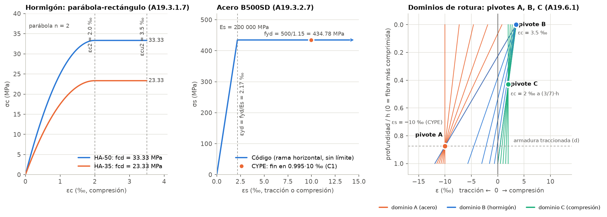
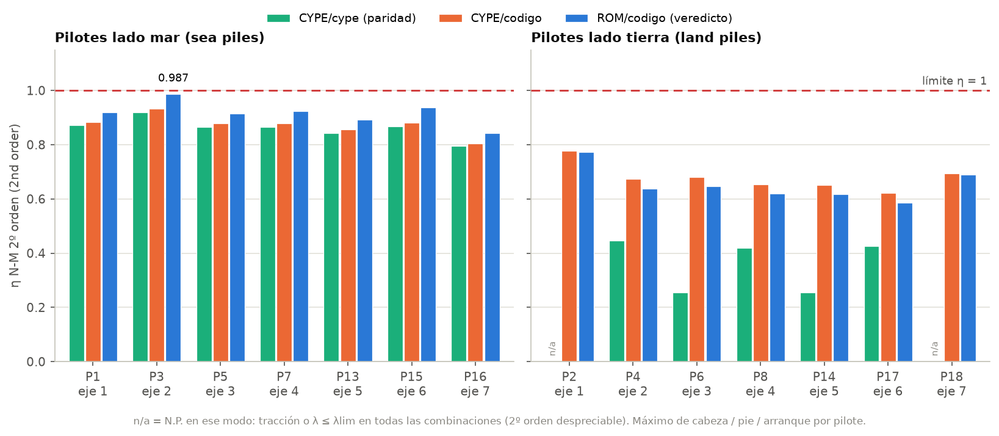
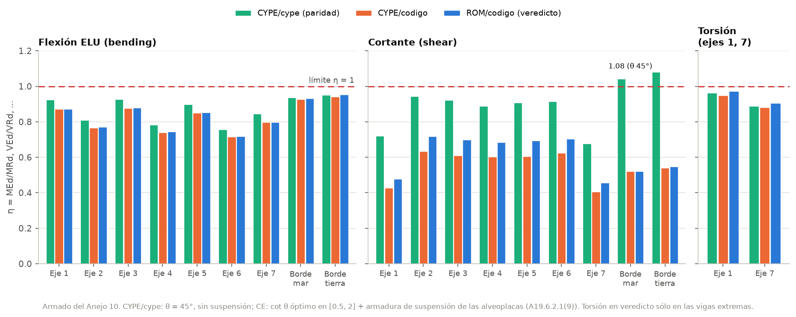
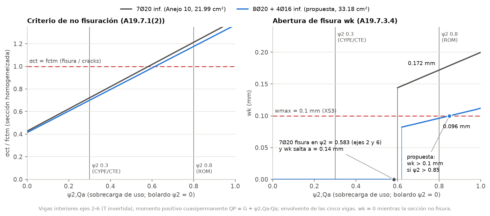
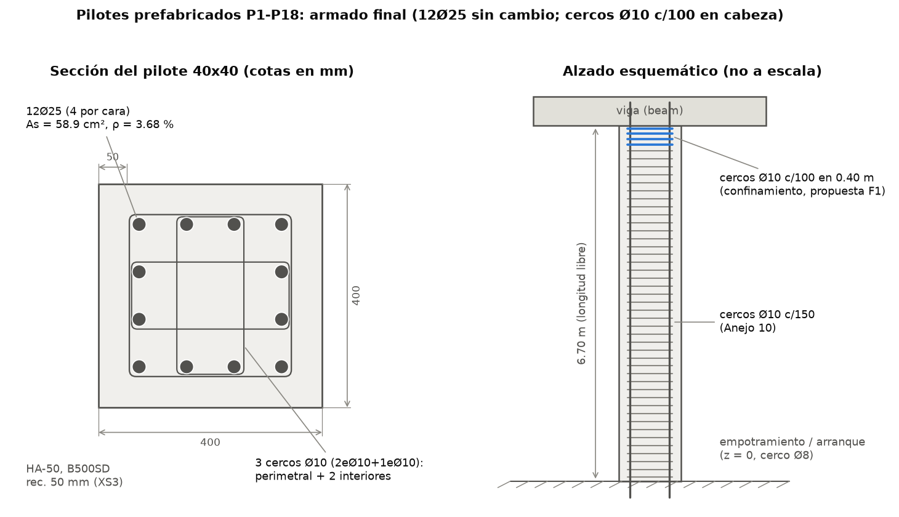
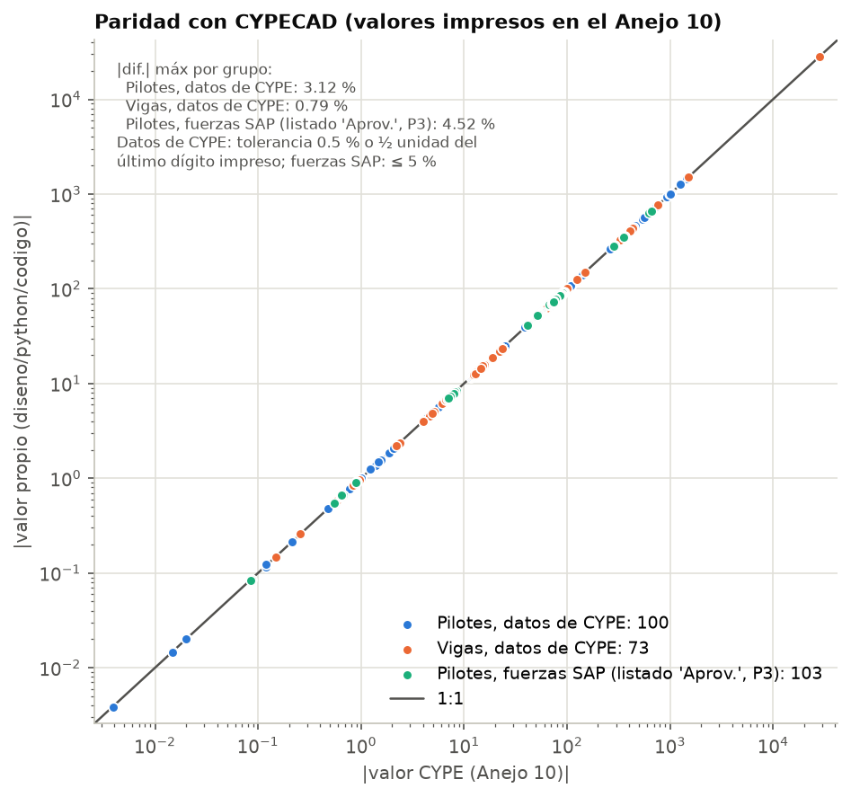
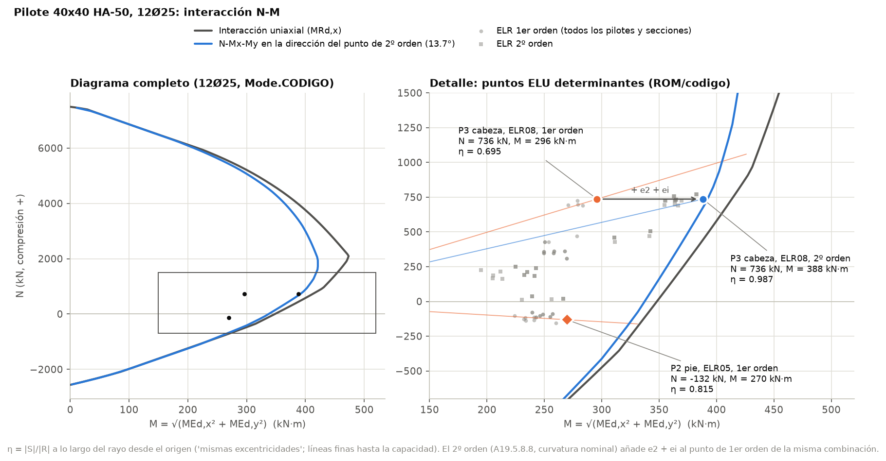

# روش‌های مستقل (غیر از SAP2000): توضیح فنی کامل

این سند همهٔ روش‌هایی را توضیح می‌دهد که برای حل و مقایسه، به‌جز خود SAP2000، به کار رفته‌اند. سه بخش دارد: (۱) استخراج همهٔ مقادیر طراحی CYPECAD از Anejo 10؛ (۲) ابزارهای غیر-SAP مرحلهٔ تحلیل، یعنی خواص مقطع، مهندسی معکوس فرض‌های CYPE، تحلیل مستقل با PyNite، ابزارهای مقایسه و کنترل قراردادهای علامت با نتایج مصنوعی؛ (۳) روش پایتونی کنترل و طراحی شمع‌ها و تیرها طبق Código Estructural با نیروهای SAP2000 v27.1. برای هر روش، الگوریتم، فرمول‌ها (با معنی نمادها)، بند آیین‌نامه، مقدار ملی اسپانیا و محل دقیق در کد (`فایل:تابع`) آمده است. طراحی بتن در خود SAP2000 (پوشهٔ `diseno/sap/`) موضوع این سند نیست. همهٔ اعداد نتیجهٔ کنترل مستقل پایتون‌اند؛ **نتیجه‌گیری نهایی بعد از دریافت نتایج طراحی SAP** در گزارش‌ها می‌آید.

**قراردادهای نگارش این سند**
- مسیرهایی که با `sap2000/` یا `diseno/` یا `report/` شروع می‌شوند نسبت به ریشهٔ مخزن‌اند؛ بقیه نسبت به همین پوشه (`diseno/python/`). مثلاً `codigo/seccion.py:RCSection.ult_plane` یعنی متد `ult_plane` از کلاس `RCSection` در `diseno/python/codigo/seccion.py`.
- بندها به شکل `A19.x.y` نوشته شده‌اند: Anejo 19 از Código Estructural (RD 470/2021)، یعنی EN 1992-1-1 با مقادیر ملی اسپانیا. `A18` یعنی Anejo 18 (مبانی و ترکیب بارها) و «CE Art. 27» یعنی مادهٔ ۲۷ خود Código Estructural.
- «C1» تا «C21» در این سند قراردادهای CYPE فهرست `investigacion/codigo_estructural_spec.md` است (جدول بخش ۱۲). فهرست جداگانهٔ «caveat C1–C16» داخل `diseno/ref/cype_design_reference.json` (کلید `discrepancies_and_caveats`) چیز دیگری است و هر جا لازم شده، با همین نام «caveat» آمده است.
- η = اثر بار / ظرفیت؛ η ≤ 1 یعنی CUMPLE (قبول).

---

## فهرست

1. دامنه، نقشهٔ پوشه‌ها و جریان داده
2. استخراج مرجع CYPE از Anejo 10 (`extraccion_anejo10/`)
3. روش‌های غیر-SAP مرحلهٔ تحلیل (`sap2000/model`، `sap2000/tools`، `sap2000/tests`)
4. نیروهای طراحی: `esfuerzos.py`
5. موتور مقطع: `codigo/seccion.py`
6. شمع‌ها: `codigo/pilotes.py` و `codigo/armado_pilote.py`
7. تیرها: `codigo/vigas.py` و `codigo/armado_vigas.py`
8. اعتبارسنجی
9. خروجی‌های `run_diseno.py` و شکل‌ها
10. نتایج فعلی روش پایتون
11. نحوهٔ اجرا
12. فرض‌ها، محدودیت‌ها و قراردادهای CYPE (C1 تا C21)

---

## ۱. دامنه، نقشهٔ پوشه‌ها و جریان داده

### ۱.۱ نقشهٔ پوشه‌ها

| مسیر | نقش |
|---|---|
| `esfuerzos.py` | خواندن نیروهای SAP2000، تبدیل علامت به قرارداد CYPE، ترکیب بارها در دو مبنا (CYPE و ROM) و ترکیب‌های شبه‌دائمی |
| `codigo/seccion.py` | موتور مقطع فیبری: مصالح، صفحه‌های شکست، ظرفیت در امتداد پرتو و در N ثابت، مقطع الاستیک همگن و ترک‌خورده، عرض ترک |
| `codigo/armado_pilote.py` | آرماتور موجود شمع طبق CYPE، چیدمان مربعی پارامتری، چیدمان‌های عملی برای جست‌وجو |
| `codigo/pilotes.py` | همهٔ کنترل‌های شمع (ELU، برش، جزئیات، ELS)، As لازم، پیشنهاد، پاریته با CYPE → `output/pilotes.json/.md` |
| `codigo/armado_vigas.py` | هندسهٔ مقاطع T معکوس، L معکوس و مستطیل؛ آرماتور موجود تیرها؛ مش نواری؛ مولد چیدمان‌ها |
| `codigo/vigas.py` | همهٔ کنترل‌های تیر، آستانهٔ ψ2، جست‌وجوی آرماتور، پاریته → `output/vigas.json/.md` |
| `run_diseno.py` | اجرای یکجا، تصمیم‌های F0 تا F8، کتاب Excel، `diseno_final.md/.json`، شکل‌های d1 تا d8 |
| `fig_teoria.py` | شکل نظری d0 (نمودار مصالح و پیوت‌ها) |
| `extraccion_anejo10/` | استخراج مرجع CYPE از فایل Word: `extraer.py`، `volcado.py`، `wmftext.py`، `tablas.py`، `construir.py`، `datos_imagenes.py`، `generar_md.py`، `validar.py`، `README.md` |
| `investigacion/codigo_estructural_spec.md` | مشخصات فرمول‌ها، مقادیر ملی اسپانیا، قراردادهای CYPE (C1 تا C21)، بحث ψ |
| `investigacion/validate_codigo.py` (+ `validate_codigo_output.txt`) | بازمحاسبهٔ مستقل فرمول‌ها با اعداد چاپ‌شدهٔ CYPE: 151 PASS، 0 FAIL، 25 INFO |
| `tests/` | آزمون‌های pytest روش پایتون: `test_extraccion.py`، `test_pilotes.py`، `test_vigas.py`، `test_run_diseno.py` (۱۰۷ آزمون) |
| `output/` | `pilotes.json/.md`، `vigas.json/.md`، `diseno_final.json/.md`، `Diseno_Codigo_Estructural.xlsx` |
| `figuras/` | شکل‌های d0 تا d8 (مقایسه‌های روش پایتون) |
| `diseno/ref/cype_design_reference.json/.md` | خروجی استخراج: همهٔ مقادیر طراحی CYPE، هر عدد با منبعش |
| `sap2000/model/trasmallo.py` | منبع واحد داده‌های مدل (هندسه، مصالح، مقاطع، دال، بارها، ترکیب‌ها) |
| `sap2000/model/sections.py` | خواص مقطع مرکب (Steiner، ثابت پیچشی Prandtl با تفاضل محدود، سطح برشی انرژی) |
| `sap2000/tools/verify_pynite.py` | تحلیل مستقل قاب سه‌بعدی با PyNite |
| `sap2000/tools/compare.py`، `compare_sap_tables.py`، `excel_report.py`، `check_s2k.py` | مقایسهٔ نیروها با CYPE، کتاب Excel مقایسه، کنترل فایل `.$2k` |
| `sap2000/tests/synth.py`، `mock_sap.py`، `run_mock.py` | نتایج مصنوعی SAP از حل PyNite + OAPI شبیه‌سازی‌شده: کنترل مستقل قراردادهای علامت مسیر SAP (بخش ۳.۶) |
| `sap2000/ref/cype_reference.json` | مرجع نیروهای CYPE برای مرحلهٔ تحلیل (بخش ۳.۶) |
| `sap2000/resultados_sap/SAP27_Element_Forces_Frames.xlsx` | نیروهای اعضای SAP2000 v27.1 (ورودی روش پایتون) |

ابزارهای `sap2000/model`، `sap2000/tools` و `sap2000/tests` جابه‌جا نشده‌اند، چون مسیر SAP (`write_s2k.py`، `sap_oapi_run.py`) هم از آن‌ها استفاده می‌کند. در این سند فقط بخش غیر-SAP آن‌ها توضیح داده شده است.

### ۱.۲ جریان داده

```
report/A10_CALC_ESTRUCTURAS.docx
   |  extraccion_anejo10/extraer.py : volcado -> construir (+datos_imagenes) -> generar_md -> validar
   v
diseno/ref/cype_design_reference.json/.md  ----------------------------+  (CYPE printed values)
                                                                        |
sap2000/model/trasmallo.py + sections.py  (CYPE back-calculation)       |
   |-- sap2000/tools/verify_pynite.py --> sap2000/output/verificacion_pynite.md
   '-- SAP2000 v27.1 model --> sap2000/resultados_sap/SAP27_Element_Forces_Frames.xlsx
                                   |-- compare_sap_tables.py --> comparacion_SAP2000.md/.json --> excel_report.py
                                   v
diseno/python/esfuerzos.py   (CYPE sign convention, stations, combinations CYPE / ROM / QP)
          |                                  |
          v                                  v
codigo/pilotes.py                    codigo/vigas.py        (both on codigo/seccion.py)
   output/pilotes.json|md               output/vigas.json|md
          \______________  _________________/
                         \/      <-- parity rows against diseno/ref (Mode.CYPE)
                   run_diseno.py --> Diseno_Codigo_Estructural.xlsx, diseno_final.md|json, figuras/d1..d8
investigacion/validate_codigo.py  <-- CYPE printed numbers (independent formula check, 151 PASS)
```

### ۱.۳ دو انتخاب مستقل: مبنای بارگذاری و حالت مقطع

روش پایتون دو «کلید» مستقل دارد تا هم نتایج CYPE عیناً بازتولید شود و هم کنترل سخت‌گیرانه طبق متن آیین‌نامه انجام شود:

| کلید | مقدار | تعریف | محل در کد |
|---|---|---|---|
| مبنای بارگذاری | `CYPE` | فرض‌های Anejo 10: ψ0,Qa = 0.7، ψ2,Qa = 0.3 (CTE DB SE جدول 4.2، گروه A/B)، کشش بولارد مثل «باد»: ψ0 = 0.6، ψ2 = 0 | `esfuerzos.py:BASES` |
| | `ROM` | ROM 2.0-11 جدول 4.6.4.1 (بار بهره‌برداری بدون آمار): ψ0,Qa = 1.0، ψ2,Qa = 0.8؛ بولارد ψ0 = 0.6، ψ2 = 0 (0.5 فقط حساسیت) | `esfuerzos.py:BASES` |
| حالت مقطع | `Mode.CYPE` | قراردادهای CYPE: ۹۹.۵٪ حدود کرنش، حد کرنش فولاد ۱۰‰، سطح ناخالص بتن، میلگردهای غیرفعال، قواعد C5 تا C7، C10 تا C12، C15 | `codigo/seccion.py:Mode`، `codigo/pilotes.py:RULES`، `codigo/vigas.py:CASES` |
| | `Mode.CODIGO` | طبق متن A19: εcu2 دقیق، فولاد بدون حد کرنش، سطح خالص، همهٔ میلگردها فعال | همان |

سه ترکیب از این دو کلید در همهٔ خروجی‌ها گزارش می‌شود: **CYPE/cype** (پاریته با Anejo 10)، **CYPE/codigo** و **ROM/codigo**. در فایل تیرها همین سه به ترتیب `CYPE`، `CE-CYPE` و `CE-ROM` نام دارند (`codigo/vigas.py:CASES`). حکم روش پایتون (تصمیم F0 در `run_diseno.py:DECISIONS`) = Mode.CODIGO + مبنای ROM + کلاس محیطی XS3 با $w_{max} = 0.1$ mm در ترکیب شبه‌دائمی.

واحدها: داخل موتور مقطع N، mm، MPa (لنگر N·mm)؛ در رابط‌ها kN و kN·m (`codigo/seccion.py:KN, KNM`). قرارداد علامت مقطع همان listing CYPE است: **فشار مثبت** برای کرنش، تنش و نیروی محوری.

---

## ۲. استخراج مرجع CYPE از Anejo 10 (`extraccion_anejo10/`)

### ۲.۱ هدف و شکل خروجی

همهٔ مقادیر طراحی CYPECAD برای ماژول Trasmallo در یک JSON جمع می‌شود: کنترل‌های تفصیلی سر و پای شمع P3، کنترل‌های تیر P3-P4، listingهای Apéndice 1 برای همهٔ شمع‌ها و تیرها، مصالح، ضرایب جزئی، ترکیب‌ها، دال و viga cantil. هر مقدار یک شیء است:

```
{"value": 142.85, "unit": "kN", "src": "P237 table: ...", "printed": "...", "note": "..."}
```

- `src = "P<n>"`: اندیس پاراگراف در `Document.paragraphs` کتابخانهٔ python-docx.
- `"P<n> table"`: جدولی که در ترتیب سند بعد از پاراگراف n می‌آید؛ اگر چند جدول بعد از یک پاراگراف باشد، `#k` اضافه می‌شود. `Tab.seg("A", "B")` جدول را به سطرهای بین دو سطر عنوان محدود می‌کند و منبعی مثل `P245 table: [Comprobación de resistencia de la sección] NEd` می‌سازد (`extraccion_anejo10/tablas.py:Tab`).
- `"P<n> image imageNN.png"`: مقداری که از روی تصویر خوانده شده است (بخش ۲.۶).
- `printed` فقط وقتی نگه داشته می‌شود که نمایش float با متن چاپ‌شده فرق کند، مثلاً `1.000` (`tablas.py:V`).

خروجی‌ها: `diseno/ref/cype_design_reference.json` و `.md`. کل خط لوله در حدود ۷ ثانیه اجرا می‌شود و این دو فایل را **بایت‌به‌بایت** یکسان با نسخهٔ ثبت‌شده می‌سازد (`meta.generated` روی `2026-09-23` ثابت است).

| گام | اسکریپت:تابع | ورودی | خروجی |
|---|---|---|---|
| ۱ | `volcado.py:todos` (و `wmftext.py`) | فایل docx | متن‌های dump در `extraccion_anejo10/trabajo/` (git-ignored، حدود 1.4 MB) |
| ۲ | `construir.py:construir` + `tablas.py` + `datos_imagenes.py` | `trasmallo_body.txt`، `trasmallo_app.txt`، `trasmallo_pre.txt` | دیکشنری مرجع → `construir.py:escribir_json` |
| ۳ | `generar_md.py:render` | JSON | فایل MD |
| ۴ | `validar.py:validar` | JSON + dumpها | `trabajo/validacion.txt`؛ کد خروج 1 در صورت خطا |
| ۵ | `extraer.py:ejecutar` | — | مقایسهٔ بایت‌به‌بایت با `diseno/ref` |

محدودهٔ dumpها (`volcado.py:RANGOS`): بدنهٔ نتایج Trasmallo P215 تا P609، Apéndice 1 P1449 تا P1835، متن پروژه (آیین‌نامه‌ها، مصالح، پوشش‌ها) P100 تا P214. فایل‌های کمکی: `a10_full.txt` (کل سند با `.text` سادهٔ python-docx؛ شمارهٔ سطرهایش در `investigacion/codigo_estructural_spec.md` و `diseno/sap/sap_design_spec.md` نقل شده است)، `a10_independiente.txt` (کل سند با پارسر دوم، فقط برای اعتبارسنجی B)، `trasmallo_body_formulas.txt` (P217 تا P609)، `trasmallo_app_formulas.txt` و `formulas_unicas.txt`.

### ۲.۲ مشکل اول: نویسه‌های فونت Symbol (`volcado.py:_ptext, _sym_char, SYM`)

`Paragraph.text` در python-docx نمادهای یونانی و ریاضی CYPE را از دست می‌دهد، چون در XML به دو شکل ذخیره شده‌اند: عنصر `w:sym` با `w:font="Symbol"` و کد هگز در `w:char`، یا نویسه‌های ناحیهٔ خصوصی U+F000 تا U+F0FF داخل `w:t`. تابع `_ptext` درخت XML پاراگراف را به ترتیب پیمایش می‌کند:

- `w:t`: هر نویسهٔ U+F0xx به کد `ord(c) − 0xF000` برگردانده و با جدول `SYM` نگاشت می‌شود: a→α، b→β، g→γ، d→δ، e→ε، h→η، q→θ، l→λ، m→μ، n→ν، p→π، r→ρ، s→σ، t→τ، f→φ، j→ϕ، y→ψ، w→ω و علامت‌ها `\xa3`→≤، `\xb3`→≥، `\xb0`→°، `\xd7`→·، `\xb4`→×، `\xa5`→∞.
- `w:sym`: کد `w:char` (منهای 0xF000 اگر ≥ 0xF000) و اگر فونت Symbol باشد، همان نگاشت.
- `w:tab`: فاصله.
- `a:blip` و `v:imagedata`: از روی شناسهٔ رابطه (`r:embed` یا `r:id`) نام فایل تصویر پیدا و `[IMG imageNN.ext]` نوشته می‌شود؛ بنابراین جای هر تصویر در متن حفظ می‌شود.

### ۲.۳ مشکل دوم: جدول‌های تودرتو (`volcado.py:_cell_text, _tbl_text, volcado_rango`)

جدول‌های «Datos del pilar» و «Datos de la viga» داخل سلول جدول دیگری‌اند و `cell.text` آن‌ها را به‌هم می‌ریزد. `_cell_text` فرزندان هر سلول را به ترتیب می‌خواند: پاراگراف‌ها با « / » به هم وصل می‌شوند و هر جدول تودرتو به شکل `{row ;; row}` درون خط می‌آید. هر جدول سطح بالا به شکل بلوک `TABLE>>` … `<<TABLE` با سلول‌های جداشده با « | » نوشته می‌شود. سطرهای متن به شکل `P<n>\t<text>` هستند.

### ۲.۴ مشکل سوم: فرمول‌ها به‌صورت تصویر WMF (`wmftext.py:parse, render`)

CYPE هر فرمول listing را به شکل تصویر Windows Metafile (MathType) چاپ کرده است؛ پس متن docx فقط اعداد را دارد. `wmftext.py` رکوردهای WMF را دوباره اجرا می‌کند:

1. اگر چهار بایت اول `0x9AC6CDD7` باشد، سرآیند Aldus (۲۲ بایت) رد می‌شود؛ سپس سرآیند استاندارد (طولش بر حسب word در بایت‌های ۲ و ۳).
2. هر رکورد: اندازه (word) + کد تابع. رکوردهای مهم:
   - `0x02FB` CreateFontIndirect: ارتفاع فونت و نام فونت (۳۲ بایت از آفست ۱۸) در اولین جای خالی جدول اشیا ثبت می‌شود؛ رکوردهای دیگری که شیء GDI می‌سازند (`0x00F7`، `0x02FA`، `0x02FC`، `0x06FF`، `0x0142`، `0x01F9`) هم یک جا اشغال می‌کنند تا شماره‌گذاری اشیا درست بماند.
   - `0x012D` SelectObject (فونت جاری)، `0x01F0` DeleteObject.
   - `0x012E` SetTextAlign: اگر بیت TA_UPDATECP روشن باشد، متن از «موقعیت جاری» نوشته می‌شود.
   - `0x0214` MoveTo: موقعیت جاری.
   - `0x0A32` ExtTextOut: (y، x، تعداد، گزینه‌ها، مستطیل برش اختیاری)، رشته با کدگذاری cp1252 و آرایهٔ dx (فاصلهٔ افقی هر نویسه). موقعیت هر نویسه = x شروع + جمع dxها. اگر فونت Symbol باشد، نویسه با جدول `SYM` به Unicode نگاشت می‌شود.
3. `render`: بیشینهٔ ارتفاع فونت $h_{max}$ فونت اصلی است؛ خط پایه میانهٔ y نویسه‌های بزرگ ($h \ge 0.85 h_{max}$) است. نویسهٔ کوچک‌تر، اگر $y > y_{base} - 0.3h$ زیرنویس (`_`) و در غیر این صورت بالانویس (`^`) است؛ اگر فاصلهٔ قائمش از خط پایه بیش از $0.9 h_{max}$ باشد، با `{num}` یا `{den}` (صورت یا مخرج کسر) علامت می‌خورد. نویسهٔ بزرگی که بیش از $0.5 h_{max}$ از خط پایه فاصله دارد هم `{num}` (بالای خط) یا `{den}` (پایین خط) می‌گیرد. نویسه‌ها به ترتیب x مرتب و به یک رشتهٔ خطی تبدیل می‌شوند، مثلاً `VRd,max=αcw·bw·z·ν1·fcd·( _cotθ+cotα)( _1+cot ^2 _θ)`.

محدودیت: خط کسر و رادیکال «خط» هستند نه متن، پس از دست می‌روند؛ خروجی خوانا است ولی رونویسی عین‌به‌عین نیست. `volcado.py:volcado_formulas` در همان پیمایش هر تصویر WMF را با `«متن»` جایگزین می‌کند و تصاویر را مستقیم از داخل docx می‌خواند (نه unzip لازم است نه LibreOffice). فرمول‌های بازیابی‌شده، که پایهٔ کشف قراردادهای C1 تا C21 بودند، در `investigacion/codigo_estructural_spec.md` بخش 0.1 فهرست شده‌اند.

### ۲.۵ ساختن JSON (`construir.py`، `tablas.py`)

- `tablas.py:load_text` متن dump را به جدول‌ها و پاراگراف‌های قابل‌آدرس‌دهی تبدیل می‌کند. سطرهای listing CYPE دو نوع‌اند و هر دو پارس می‌شوند:
  - «مدخل» (entry): `'Esfuerzo cortante efectivo: |  | VEd,y |  : | 390.18 | kN'` → (برچسب، نماد، مقدار، واحد).
  - «کنترل» (check): `' |  | 390.18 kN | ≤ | 407.15 kN | [IMG image18.png]'` → (سمت چپ، عملگر، سمت راست، علامت تیک).
- `tablas.py:num` و `split_vu` عدد و واحد را جدا می‌کنند؛ `nested_kv` جدول‌های تودرتوی «Datos del pilar/viga» را به کلید-مقدار تبدیل می‌کند (`construir.py:datos_table`).
- **قاعدهٔ توضیح (description):** مدخلی که برچسب ندارد (مقدار زیر یک تصویر فرمول چاپ شده)، برچسب سطر بالایی را فقط وقتی به ارث می‌برد که هیچ سطر غیرخالی دیگری بینشان نباشد؛ وگرنه توضیحش «(no text label: value printed under an equation image)» است (`tablas.py:NO_LABEL`). مدخل‌هایی که پیش از اولین سطر برچسب‌دار می‌آیند توضیح خالی دارند (۲۱ مورد، مثلاً خلاصه‌های NRd، MRd,x و MRd,y). این قاعده جایگزین ۱۰۳ اصلاح دستی قبلی است.
- **متن‌هایی که دستی نوشته شده‌اند** (و در `construir.py` به‌صورت متن ثابت‌اند): یادداشت‌ها و یادداشت‌های INFERENCE، caveatهای C1 تا C16 مرجع، فهرست «not in document»، نقل قول عین‌به‌عین P276، حساب viga cantil، برچسب‌های image97، یادداشت محل مقطع ۲، `x_origin_note`. هر عددی غیر از این‌ها **پارس** شده است، نه تایپ.
- `generar_md.py:render` از JSON فایل MD می‌سازد.

### ۲.۶ مقادیری که از روی تصاویر خوانده شده‌اند (`datos_imagenes.py`)

بعضی داده‌ها فقط در تصاویر rasterشدهٔ CYPE هستند. این‌ها روی تصویر (با بزرگ‌نمایی) خوانده و به‌صورت جدول دادهٔ مستند نگه داشته شده‌اند تا `construir.py` فقط پارسر بماند. هر مقدار `src = "P<n> image imageNN.png"` دارد (`imageNN.png` = فایل `word/media/imageNN.png` داخل docx). `python3 extraccion_anejo10/datos_imagenes.py` این ۷۱ مدخل را فهرست می‌کند.

| تصویر | پاراگراف | محتوا |
|---|---|---|
| image16 | P220 | کروکی مقطع شمع (میلگردها، خاموت‌ها) |
| image50، image94 | P245، P300 | برچسب‌های نمودار اندرکنش N-M سر و پای شمع (هر کدام ۶ مقدار) |
| image84، image88، image95، image96 | P257، P265، P312، P320 | نمودارهای تعادل شمع (هر کدام x، εmax، εmin، σmax) |
| image92 | P275 | جدول‌های 5.9 و 5.10 CEB (ضرایب ψ) |
| image97 | P336 | برچسب‌های نقشهٔ میلگرد تیر P3-P4 |
| image112، image113 | P381، P389 | نمودارهای تعادل تیر (x = 68.52 mm، εmax = 1.66‰، εmin = −11.64‰، σmax = 22.65 MPa در image112) |
| image117 | P569 | لنگرهای شبه‌دائمی Pórtico 6: −8.47، 86.66، −12.21 kN·m |
| image118 | P571 | کنترل دستی ترک: ۱۲ کرنش و تنش، wk = 0.00 |
| image120 | P586 | تاریخچهٔ خیز |
| image121 تا image124 | P593 تا P603 | دال: پوش نوار ۱ متری، مشخصات alveoplaca، نقشهٔ میلگرد منفی، جدول خمش منفی |
| image203 تا image212 | P1607 تا P1660 | نقشه‌های آرماتور Apéndice 1 (جدول میلگرد، وصله‌ها، برچسب‌های پوش)؛ اطمینان: زیاد برای Pórticos 3 تا 9، کم برای Pórtico 1، متوسط برای Pórtico 10 |

### ۲.۷ اعتبارسنجی (`validar.py:validar`)

**A. کنترل منبع:** هر شیء `{value, src}` و هر سطر جدولی دارای `src` در متن پاراگراف یا جدولِ ذکرشده جست‌وجو می‌شود؛ مقدار با ۰ تا ۶ رقم اعشار (یا متن `printed`) باید در آن متن باشد.

| نتیجه | تعداد |
|---|---|
| مقدار پیدا‌شده در منبع ذکرشده | 3744 |
| پیدا نشده | 0 |
| استثنای مستند | 1: مقدار ترکیبی `12Ø25` که سند آن را در سه سلول جدا به شکل `4Ø25` چاپ کرده است |
| رد شده | 62: ۵۴ مقدار خوانده‌شده از تصویر + ۸ مقدار بدون متن چاپی متناظر |

**B. پارس مستقل:** همان سند با پیمایشگر دوم (`volcado.py:volcado_independiente`: جدول نمادهای دیگر، جدول تودرتو به شکل `<<NESTED ... NESTED>>`) dump و با کد جداگانه پارس می‌شود:

| کنترل | نتیجه |
|---|---|
| B1: مقادیر جدولی آدرس‌دهی‌شده با «[A > B] نماد (وقوع k)» | 932 برابر، 0 متفاوت |
| B2: ضرایب ۵۲ ترکیب CYPE (§1.6.2) | 312 ضریب، 0 متفاوت |
| B2: مقادیر listing تیرها (لنگر، برش، پیچش و x آن‌ها، As واقعی و لازم، مقطع، خیز) | 1197 مقدار، 0 متفاوت |
| B3: جدول‌های شمع §3.2 / §3.3 / §3.5 / §4.2 | 28 / 84 / 56 / 56 سطر (جمع 224)، 0 متفاوت |
| B4: توضیح (description) مقادیر | 451، 0 متفاوت |

آزمون `tests/test_extraccion.py:test_validation_detects_a_wrong_value` یک عدد را عمداً تغییر می‌دهد و کنترل می‌کند که اعتبارسنجی شکست بخورد؛ یعنی کنترل تهی نیست.

اجرا: `python3 diseno/python/extraccion_anejo10/extraer.py` (گزینه‌ها: `--salida DIR` نوشتن در DIR و مقایسه با `diseno/ref`، `--trabajo DIR` محل dumpها، `--sin-formulas` بدون dump فرمول‌ها). تنها وابستگی python-docx است.

---

## ۳. روش‌های غیر-SAP مرحلهٔ تحلیل (`sap2000/model`، `sap2000/tools`، `sap2000/tests`)

### ۳.۱ منبع واحد داده‌های مدل (`sap2000/model/trasmallo.py:build_model`)

همهٔ مسیرها (فایل `.$2k`، OAPI، PyNite و اکنون `esfuerzos.py`) مدل را از همین ماژول می‌گیرند، پس مدل در همهٔ مسیرها یکی است. واحدها kN، m.

| موضوع | مقدار در کد | منبع یا دلیل |
|---|---|---|
| محورها | ۷ محور با فاصلهٔ 6.50 m: X = 0 تا 39 (`AXES_X`) | Apéndice 1 §1.7 |
| خطوط عرضی | لبهٔ دریا −0.50، محور تیر لبهٔ دریا −0.375 (= محل بولاردها)، شمع دریا 0.00، شمع خشکی 3.45، محور تیر لبهٔ خشکی 3.675، لبهٔ خشکی 3.80 | اندازه‌گیری روی تصاویر CYPE (بخش ۳.۳) |
| طول شمع | `PILE_LENGTH = 7.25`، که 0.55 m بالایی داخل تیر و صلب است (`PILE_TOP_RIGID`)؛ طول آزاد 6.70 m | بخش ۳.۳ |
| نواحی صلب | تیر در عرض شمع ±0.20 m (`BEAM_RIGID_AT_PILE`) با ضریب سختی 100 (`RIGID_MOD`) | «nudos con dimensión finita» CYPE |
| وزن | `PILE_WEIGHT_MOD = 6.70/7.25 = 0.924138`؛ `EDGE_BEAM_WEIGHT_MOD = 0.920769` (بخش داخل جان تیرهای عرضی یک بار شمرده شود)؛ `AMod = 2` شمع («coeficiente de rigidez axil» CYPE) | |
| مصالح | HA-50: E = 33550 MPa؛ HA-35: E = 30669 MPa؛ ν = 0.2؛ γ = 24.525 kN/m³ | Apéndice 1 §1.11؛ بخش ۳.۳ |
| دال | پوستهٔ ارتوتروپ t = 0.30 m، $m_{11} = EI_{span}/(E t^3/12) = 63550/69005 = 0.921$، $m_{22} = m_{12} = 0.01$؛ نوار کنار تیرهای انتهایی با $m_{11} \times 0.01$ (مفصل) | `slab_m11`، `SLAB_END_FACTOR`؛ PRENOR P-25+5، Apéndice 1 §1.10 |
| بارها | وزن دال 4.10 kN/m² فقط روی سطح واقعی دال‌ها (Y = −0.306 تا 3.603؛ فاصلهٔ 0.323 m از محور تیرهای میانی، X = 0.39 و 38.61 در انتها)؛ CM = 1.75؛ Qa = 15.0 kN/m² | `PLATE_Y`، `Q_CM`، `Q_SCU` |
| بولارد | TB1: 75 kN افقی در P9، P11، P19، P20 (Y = −0.375) با My = −37.5 kN·m؛ TB2/TB3: ±53 kN قائم؛ بارهای سر شمع ±17/±34 kN (باد روی کالا) طبق جدول `PILE_HEAD_LOADS` | Apéndice 1 §1.4.5 |
| ترکیب‌ها | `_family(g, q, ψq, ψw)` ۲۲ ترکیب را به ترتیب listing می‌سازد؛ `COMBOS` = ELU (1.35/1.50، ψ 0.7/0.6)، CIM (1.60/1.60)، ELS (۸ ترکیب مشخصه) | Apéndice 1 §1.6.2 |
| تبدیل بار سر شمع | `cype_to_global(N, Mx, My, Qx, Qy, T) = (Qx, Qy, −N, −My, Mx, T)` | My در CYPE جفت Qy است |

### ۳.۲ خواص مقطع مرکب (`sap2000/model/sections.py`)

مقطع اجتماع مستطیل‌های بدون هم‌پوشانی $(z_{3,min}, z_{3,max}, z_{2,min}, z_{2,max})$ است (`Section`، `rectangle`، `inverted_tee`، `inverted_l`).

**سطح و مرکز سطح** (`section_properties`):
$$A = \sum_i b_i h_i, \qquad \bar z_2 = \frac{\sum_i A_i z_{2,i}}{A}, \qquad \bar z_3 = \frac{\sum_i A_i z_{3,i}}{A}$$

**ممان‌های اینرسی با قضیهٔ محورهای موازی (Steiner):**
$$I_{33} = \sum_i \left(\frac{b_i h_i^3}{12} + A_i\, d_{2,i}^2\right), \qquad I_{22} = \sum_i \left(\frac{h_i b_i^3}{12} + A_i\, d_{3,i}^2\right), \qquad I_{23} = \sum_i A_i\, d_{2,i}\, d_{3,i}$$
$b_i$ عرض (امتداد محور ۳)، $h_i$ ارتفاع (امتداد محور ۲)، $d$ فاصلهٔ مرکز جزء تا مرکز کل. اساس مقطع $S = I/c_{max}$ و اساس پلاستیک $Z = \sum |z - z_{PNA}|\, dA$ با محور خنثای تساوی سطح (`_plastic_modulus`، ۴۰۰۰ نوار).

**ثابت پیچشی St Venant با تابع تنش Prandtl** (`torsion_constant`):
$$\nabla^2\phi = \frac{\partial^2\phi}{\partial z_2^2} + \frac{\partial^2\phi}{\partial z_3^2} = -2 \;\;\text{در مقطع}, \qquad \phi = 0 \;\;\text{روی مرز}, \qquad J = 2\iint \phi\, dA$$
گسسته‌سازی: شبکهٔ سلول‌های مربعی $h = 2.5$ mm (مرکز سلول‌ها)؛ برای هر سلول داخلی معادلهٔ پنج‌نقطه‌ای $\phi_{i+1,j} + \phi_{i-1,j} + \phi_{i,j+1} + \phi_{i,j-1} - 4\phi_{i,j} = -2h^2$. همسایهٔ بیرونی با قاعدهٔ «سلول شبح» $\phi_{ghost} = -\phi$ اعمال می‌شود (مرز در نیم‌سلول)، یعنی به‌جای جملهٔ همسایه، $-1$ به قطر اضافه می‌شود (دقت مرتبهٔ دوم). دستگاه تُنُک با `scipy.sparse.linalg.spsolve` حل و $J = 2 h^2 \sum \phi$ می‌شود. کنترل: مربع ۴۰×۴۰ → $J = 0.0035993$ m⁴ در برابر فرمول بسته $0.1406\,a^4 = 0.0035994$.

**سطح برشی با روش انرژی (Jourawski)** (`_shear_area`):
$$A_s = \frac{I^2}{\displaystyle\int \frac{Q(z)^2}{b(z)^2}\, dA}$$
$Q(z)$ لنگر اول سطحِ بخش بالای برش نسبت به مرکز سطح، $b(z)$ عرض در همان تراز؛ انتگرال عددی روی ۴۰۰۰ نوار. برای مستطیل دقیقاً $\tfrac{5}{6}A$ به دست می‌آید.

| مقطع (`trasmallo.py:frame_sections`) | A (m²) | I33 (m⁴) | I22 (m⁴) | J (m⁴) | AS2 (m²) | مرکز از پایین (m) |
|---|---|---|---|---|---|---|
| T معکوس 50x55+15x30+15x30 | 0.365 | 0.008667 | 0.015404 | 0.015461 | 0.300952 | 0.244178 |
| L معکوس 80x55+15x30 (و قرینهٔ `_M`) | 0.485 | 0.012067 | 0.032762 | 0.028245 | 0.405246 | 0.263402 |
| تیر لبه 25x30 | 0.075 | 0.000563 | 0.000391 | 0.000779 | 0.0625 | 0.15 |
| شمع 40x40 | 0.160 | 0.002133 | 0.002133 | 0.003599 | 0.133333 | 0.20 |

### ۳.۳ مهندسی معکوس فرض‌های CYPE

هدف مرحلهٔ تحلیل بازتولید نیروهای CYPE بود؛ متن Anejo 10 در چند جا با عددهای خود CYPE نمی‌خواند. فرض واقعی هر مورد از روی اعداد listing بازمحاسبه و در `trasmallo.py` با پارامتر قابل‌تغییر ثبت شد:

| مورد | متن | اجرای CYPE | استدلال |
|---|---|---|---|
| طول شمع تا گیرداری (`PILE_LENGTH`) | 7.00 m (§9.1) | **7.25 m** | (۱) تعادل لنگر §3.7 برای TB1: $M_y = \sum N_i y_i + \sum M_{y,i} + \sum Q_{y,i}\, z$ → $-5864 = -703.8 - 150 - 691\,z$ → $z = 7.25$ m (با ۷.۰۰ مقدار −5690.8 می‌شد)؛ (۲) listing: «Tramo 0.000/7.250 m» و «Altura libre 6.70 m»؛ (۳) شیب لنگر P1 در TB1: $(177.9 + 169.7)/51.9 = 6.70$ m فاصلهٔ مقطع سر تا پا |
| وزن مخصوص بتن (`GAMMA_CONCRETE`) | 25 kN/m³ | **24.525** | اختلاف N وزن خودی پا و سر (§3.3) 26.2 تا 26.3 kN روی 6.70 m: $26.3/(0.16 \times 6.70) = 24.5$؛ یعنی $2.5 \times 9.81$ (با ۲۵، 26.8 kN) |
| بار مرده (`Q_CM`) | 1.8 kN/m² | **1.75** | $N_{CM}/N_{Qa} = 0.1167$ در همهٔ شمع‌ها → $0.1167 \times 15 = 1.75$؛ کنترل: $297.5/1.75 = 2550.1/15 = 170.0$ m² |
| بار سر شمع P16 (`ADD_MISSING_P16_LOAD`) | قرینهٔ P1 باید N = +17، Qy = −17 داشته باشد | **ندارد** | جمع‌های §3.7 ($\sum Q_y = -691$ kN، $\sum N = -17$ kN) فقط بدون آن درست است |
| عرض عرشه | — | Y = −0.50 تا 3.80 | مرکز بار Qa: $M_y/N = 4193.6/2550.1 = 1.644$ m ≈ مرکز 1.65 این عرشه؛ اندازه‌گیری روی تصاویر آرماتور؛ خطای شمع‌های خشکی از حدود ۱۰٪ به ۱ تا ۳٪ رسید |
| پیوستگی دال | — | پیوسته روی تیرهای میانی، ساده روی تیرهای انتهایی | نسبت واکنش‌های شمع‌ها الگوی تیر پیوسته (≈0.394 / 1.132 / 1.0 qL) را دارد و listing دال لنگر منفی −100.32 kN·m/m دارد |
| سطح بارگذاری‌شده | — | باز: مدل 172 m² و جمع‌های CYPE 170 m² | منشأ ۲ m² مشخص نشد (اثر حدود ۱٪ روی جمع‌ها) |

### ۳.۴ تحلیل مستقل قاب با PyNite (`sap2000/tools/verify_pynite.py`)

SAP2000 روی لینوکس اجرا نمی‌شد؛ پس همان دادهٔ `trasmallo.py` با حل‌گر متن‌باز PyNiteFEA (قاب سه‌بعدی) تحلیل شد تا هندسه، بارها، علامت‌ها و ایده‌آل‌سازی دال پیش از اجرای SAP کنترل شوند. تفاوت‌های ایده‌آل‌سازی با مدل SAP:
- دال ارتوتروپ به‌جای پوسته با نوارهای تیر در امتداد هر خط مش Y = ثابت با $EI = 63550 \times$ عرض بارگیر مدل شده است؛
- دیافراگم صلب با قطری‌های سخت دو سر مفصل در هر سلول؛
- بار سطحی به چهار گوشهٔ هر سلول متمرکز شده است؛
- نواحی صلب با زیرعضوهای بسیار سخت (در SAP: end offset با RZ = 1 و ضریب سختی ×100).

خروجی: `sap2000/output/verificacion_pynite.md/.json` و فایل‌های CSV، با همان جدول‌های `compare.py` (بخش ۳.۵). این تحلیل جایگزین SAP نیست؛ کنترل مستقل ورودی‌ها است.

### ۳.۵ ابزارهای مقایسه

- `sap2000/tools/compare.py:build_report`: نتایج هر حالت بار را به قرارداد CYPE می‌برد و با اصل جمع آثار و ضرایب `trasmallo.COMBOS` ترکیب می‌کند. تبدیل SAP → CYPE: واکنش پای شمع $N = F_3$، $Q_x = -F_1$، $Q_y = -F_2$، $M_x = -M_2$، $M_y = M_1$، $T = -M_3$؛ نیروی عضو شمع $N = -P$، $Q_x = V_2$، $Q_y = V_3$، $M_x = M_3$، $M_y = M_2$؛ تیر عرضی (رسم‌شده از دریا به خشکی) $M = M_3$، $V = -V_2$. جدول‌ها:
  - `totals_rows`: جمع N و Qy پای شمع‌ها برای هر حالت بار در برابر §3.7؛
  - پوش شمع‌ها در ELU، CIM، ELS: N max، N min، |My| max، |Mx| max؛ با اختلاف قدر مطلق‌ها $\text{diff}\% = 100\,(|m| - |c|)/|c|$ (`pile_envelope_rows`)؛
  - پوش تیرهای عرضی: M− در بر شمع دریا، M+ دهانه، V در دو بر؛ $\text{diff}\% = 100\,(m - r)/|r|$ که r برچسب نقشهٔ CYPE (اگر باشد) یا پوش listing است؛
  - بیشینهٔ اختلاف علامت‌دار هر مؤلفه در پا (§3.4) و سر (z = 6.70، §3.3) برای هر حالت بار.
- `compare_sap_tables.py`: همان گزارش از جدول‌های Excel خروجی رابط گرافیکی SAP (Joint Reactions و Element Forces - Frames) → `comparacion_SAP2000.md/.json/.csv`.
- `excel_report.py`: کتاب `Comparacion_SAP2000_vs_CYPE.xlsx` با یک برگه و نمودار برای هر مقایسه.
- `check_s2k.py`: پارس همهٔ جدول‌های `.$2k` و کنترل تعریف‌شدن همهٔ ارجاع‌ها (گره، عضو، سطح، مقطع، مصالح، حالت بار، ترکیب)، ASCII بودن، پایان درست فایل و جمع بارها.

**نتایج** (`sap2000/output/comparacion_SAP2000.md` و `verificacion_pynite.md`):

| کمیت | CYPE | SAP2000 v27.1 | PyNite |
|---|---|---|---|
| ΣN وزن خودی (kN) | 1343.9 | 1355.2 (+0.8٪) | 1355.2 |
| ΣN بار مرده | 297.5 | 301.0 (+1.2٪) | 301.0 |
| ΣN بار زنده | 2550.1 | 2580.0 (+1.2٪) | 2580.0 |
| ΣQy و ΣN در TB1 | −691.0 / −17.0 | −691.0 / −17.0 | −691.0 / −17.0 |
| ΣN در TB2 | 212.0 | 212.0 | 212.0 |
| ELU: N max (P3، ELU10) | 673.9 | 680.7 (+1.0٪) | 685.3 (+1.7٪) |
| ELU: N min (P2، ELU05) | −136.1 | −131.7 (−3.2٪) | −131.6 (−3.3٪) |
| ELU: \|My\| max (P3، ELU08) | 283.4 | 281.9 (−0.5٪) | 281.9 (−0.5٪) |
| ELU: \|Mx\| max (P16) | 20.9 | 36.1 | 28.3 |
| تیرها، M− بر شمع دریا (در برابر برچسب نقشه) | — | +0.7 تا +3.6٪ | +1.4 تا +2.7٪ |
| تیرها، M+ دهانه | — | −4.9 تا −0.2٪ | −2.9 تا +0.1٪ |
| تیرها، V بر شمع دریا | — | −2.6 تا +1.4٪ | −1.2 تا +0.7٪ |
| تیرها، V بر شمع خشکی (مقدار منفی) | — | −8.5 تا +4.4٪ | −9.8 تا −4.9٪ |

درصدهای شمع‌ها $100\,(|m| - |c|)/|c|$ اند (مثبت یعنی مدل بزرگ‌تر). درصدهای تیرها $100\,(m - r)/|r|$ اند؛ برای برش بر خشکی که خودش منفی است، درصد منفی یعنی بزرگی مدل بیشتر از CYPE است. لنگر محور ضعیف |Mx| در شمع‌های انتهایی (P16) کوچک است و به سختی طولی مدل وابسته است؛ در طراحی اثرش کم است (بخش ۶.۱۲).

### ۳.۶ کنترل قراردادهای علامت با نتایج مصنوعی (`sap2000/tests/`) و مرجع نیروهای CYPE

**هدف:** فرمول‌های تبدیل SAP → CYPE (بخش ۳.۵) بدون خود SAP2000 کنترل شوند، با داده‌ای که مستقل از همان فرمول‌ها ساخته شده است.

- `synth.py:Synth`: مدل `trasmallo.build_model()` را با PyNite (`verify_pynite.run`) حل می‌کند و خروجی را به **قرارداد خروجی CSI** می‌برد. محورهای محلی پیش‌فرض SAP (`sap_local_axes`): عضو قائم، محور 2 = +X؛ عضو افقی، صفحهٔ 1-2 قائم و محور 2 رو به بالا؛ $e_3 = e_1 \times e_2$. نیروی مقطع در فاصلهٔ x از سر I با تعادل قطعهٔ [سر I، برش] از نیروهای انتهایی سراسری PyNite و بار گستردهٔ آن حالت بار ساخته می‌شود ($F_{cut} = -(F_a + F_q)$، $M_{cut} = -(M_a + (p_a - p_c) \times F_a + (p_a + \tfrac{x}{2}e_1 - p_c) \times F_q)$) و روی محورهای محلی تصویر می‌شود: $P = F \cdot e_1$، $V_2 = F \cdot e_2$، $V_3 = F \cdot e_3$، $T = M \cdot e_1$، $M_2 = -M \cdot e_2$، $M_3 = M \cdot e_3$ (CSI: $+M_2$ وجه +3 را می‌فشارد). `_check` در پای هر شمع کنترل می‌کند که نیروی برش برابر منفی واکنش تکیه‌گاه باشد (تلورانس $10^{-6}$).
- `mock_sap.py`: شبیه‌ساز سخت‌گیر OAPI (`SAP2000v1` از طریق comtypes): هر متد دقیقاً فهرست پارامترهای مستندات CSI را دارد (تعداد نادرست آرگومان → TypeError)، نوع، بازهٔ enum و وجود اشیای ارجاع‌شده کنترل می‌شود (`MockError`) و مقادیر بازگشتی قرارداد comtypes (مقادیر ByRef + کد بازگشت) را دارند. نتایج تحلیل از `Synth` می‌آیند.
- `run_mock.py`: `sap_oapi_run.define_model` و `extract` را روی شبیه‌ساز اجرا می‌کند، گزارش `compare.build_report` را می‌سازد و با گزارش مسیر PyNite مقایسه می‌کند. نتیجهٔ اجرای فعلی: مدل 1134 گره، 275 عضو، 1014 سطح، 6 حالت بار و 55 ترکیب؛ بیشینهٔ |SAP − PyNite| در پا و سر شمع‌ها 0.0000 برای هر شش مؤلفه (و |SAP + PyNite| تا 483 kN، یعنی خطای علامت دیده می‌شد)؛ جدول‌های گزارش 12 / 504 / 336 / 35 سطر (جمع‌ها، حالت‌های بار شمع، پوش شمع، پوش تیر)، 0 سطر متفاوت. خروجی در پوشهٔ موقت سیستم (`trasmallo_mock_out/reports.json`) نوشته می‌شود.

**مرجع نیروهای CYPE مرحلهٔ تحلیل** (`sap2000/ref/cype_reference.json`): در مرحلهٔ تحلیل از یک تبدیل Markdown از Anejo 10 استخراج شد؛ فیلدهای `line` شمارهٔ سطر همان تبدیل‌اند و اسکریپت یک‌بارمصرف آن مرحله در مخزن نیست. بخش‌ها: داده‌های مدل، بارهای سر شمع §1.4.5، ترکیب‌های §1.6.2، listing تیرها §2 و برچسب‌های نقشه، آرماتور شمع‌ها §3.2، نیروهای شمع به تفکیک حالت بار §3.3 و §3.4، pésimos §3.5، جمع‌ها §3.7، کنترل‌های §4.2 و §4.3، خلاصهٔ بدنهٔ §10.1، قراردادهای علامت (`conventions`) و بلوک `derived_by_extractor` (مقادیر محاسبه‌شده، نه چاپ‌شده). کنترل متقابل با خروجی مستقل بخش ۲: هر 84 سطر §3.3 (14 شمع × 6 حالت بار، پا و سر، 1008 عدد) با `diseno/ref/cype_design_reference.json` (`piles.appendix_1_section_3.esfuerzos_por_hipotesis_3_3`) یکسان است (0 اختلاف).

---

## ۴. نیروهای طراحی: `esfuerzos.py`

### ۴.۱ ورودی و ایستگاه‌ها (`esfuerzos.py:read_table, load_stations, Station`)

ورودی جدول «Element Forces - Frames» خروجی گرافیکی SAP2000 v27.1 است: `sap2000/resultados_sap/SAP27_Element_Forces_Frames.xlsx` (Display › Show Tables › Export to Excel؛ سطر اول عنوان، سطر دوم سرستون، سطر سوم واحد). فقط شش حالت بار PP، CM، Qa، TB1، TB2، TB3 خوانده می‌شود؛ ترکیب‌ها در پایتون ساخته می‌شوند.

- مدل از `trasmallo.build_model()` ساخته می‌شود تا نوع هر عضو (`pile`، `beam_t`، `beam_edge`)، گره شروع و پرچم `rigid` آن معلوم باشد.
- موقعیت سراسری هر ایستگاه: شمع $z = z_i + \text{station}$ (از پای گیردار)، تیر عرضی $y = y_i + \text{station}$، تیر لبه $x = x_i + \text{station}$.
- کلید ایستگاه (نام عضو، station) است، نه فقط موقعیت؛ پس دو سر عضوهای مجاور جداگانه نگه داشته می‌شوند و پرش برش و لنگر در نقاط بار حفظ می‌شود.
- اگر ایستگاهی همهٔ شش حالت بار را نداشته باشد، خطا داده می‌شود.
- تعداد ایستگاه‌ها: هر شمع ۲۸، هر تیر عرضی ۳۶ (۶ ایستگاه روی قطعه‌های صلب داخل شمع)، هر تیر لبه ۱۵۶. در تیر عرضی خطوط ±0.20، 3.25 و 3.65 (بر شمع‌ها) ایستگاه دارند و `vigas.py:build_members` اگر یکی نباشد خطا می‌دهد.
- سر شمع ایستگاه نزدیک به $z = 6.70$ m است: `PILE_FREE_LENGTH = PILE_LENGTH − PILE_TOP_RIGID = 7.25 − 0.55`.

### ۴.۲ قرارداد علامت (`esfuerzos.py:_pile_cype, _beam_cype`، `codigo/pilotes.py:load_forces`)

| عضو | تبدیل SAP → CYPE | توضیح |
|---|---|---|
| شمع (محورهای جدول §3.3 CYPE) | $N = -P$ (فشار +)، $Q_x = V_2$، $Q_y = V_3$، $M_x = M_3$، $M_y = M_2$، $T = T$ | CSI: $+M_3$ وجه +2 را می‌فشارد و $+M_2$ وجه +3 را |
| شمع (محورهای کنترل مقطع، `pilotes.load_forces`) | $M_{Ed,x} = M_y(\S3.3)$، $M_{Ed,y} = M_x(\S3.3)$، $V_{Ed,x} = Q_x$، $V_{Ed,y} = Q_y$ | $M_{Ed,x}$ لنگر حول محور x با خروج از مرکز در امتداد y (امتداد کشش بولارد) است، مثل جدول‌های کنترل CYPE (§3.5، §4.2 و بدنه). مقطع ۱۲ میلگردی دو محور تقارن دارد، پس η به علامت لنگرها وابسته نیست |
| تیر عرضی (رسم‌شده از دریا به خشکی، +Y) | $M = M_3$ (مثبت = کشش پایین)، $V = -V_2 = dM/dy$، $T = T$ | |
| تیر لبه (در امتداد +X) | همان | |

### ۴.۳ ترکیب بارها (`esfuerzos.py:combos, uls, quasi_permanent, combine, describe`)

ترکیب با اصل جمع آثار (تحلیل خطی) ساخته می‌شود:
$$E_d = \sum_{p} f_p\, E_p, \qquad p \in \{PP, CM, Qa, TB1, TB2, TB3\}$$
$f_p$ ضریب حالت بار p در ترکیب و $E_p$ نیروی داخلی آن حالت بار (`combine`).

**ترکیب‌های ELU** (Código Estructural Anejo 18، رابطهٔ 6.10؛ Apéndice 1 §1.6.2):
$$E_d = \gamma_G (PP + CM) + \gamma_{Q}\, Q_1 + \gamma_{Q}\, \psi_{0}\, Q_2$$
با $\gamma_G = 1.35$ (نامطلوب) یا 1.00 (مطلوب)، $\gamma_Q = 1.50$. خانوادهٔ ۲۲ ترکیب (`trasmallo._family`): ۱) G؛ ۲) 1.35G؛ ۳) G + 1.5Qa؛ ۴) 1.35G + 1.5Qa؛ سپس برای هر TBk (k = 1..3) شش ترکیب: G + 1.5TBk، 1.35G + 1.5TBk، G + 1.5ψ0,Qa·Qa + 1.5TBk، 1.35G + 1.5ψ0,Qa·Qa + 1.5TBk، G + 1.5Qa + 1.5ψ0,TB·TBk، 1.35G + 1.5Qa + 1.5ψ0,TB·TBk. در این ترتیب ELU05 = G + 1.5TB1، ELU08 = 1.35G + 1.05Qa + 1.5TB1 و ELU10 = 1.35G + 1.5Qa + 0.9TB1 است.

| خانواده | نام‌ها | ضرایب | کاربرد |
|---|---|---|---|
| ELU (مبنای CYPE) | ELU01–22 | γG 1.35/1.00، γQ 1.50، ψ0,Qa = 0.7، ψ0,TB = 0.6 | مقاومت؛ پاریته |
| ELR (مبنای ROM) | ELR01–22 | همان با ψ0,Qa = 1.0 (مثلاً ELR07 = G + 1.5Qa + 1.5TB1، ELR08 = 1.35G + 1.5Qa + 1.5TB1) | مقاومت؛ حکم |
| CIM | CIM01–22 | γG 1.60/1.00، γQ 1.60 (مثل CYPE برای پی) | فقط در ترکیب‌های مبنای CYPE موجود است؛ در کنترل‌ها به کار نمی‌رود |
| ELS | ELS01–08 | همهٔ ضرایب 1: G، G+Qa، G+TB1، G+Qa+TB1، G+TB2، G+Qa+TB2، G+TB3، G+Qa+TB3 | ترکیب مشخصه برای حدود تنش (حد بالای ترکیب مشخصه در هر دو مبنا) |
| QP | QP03، QP08 | $PP + CM + \psi_2\, Qa$ با ψ2 = 0.3 یا 0.8؛ بولارد ψ2 = 0 | ترک و خیز |
| QP حساسیت | QP03_TBk، QP08_TBk | همان + 0.5·TBk (هر بار یک k) | حساسیت ψ2 بولارد = 0.5 (حد بالای بهره‌برداری ROM 0.2-90) |

`combos(True, "CYPE")` شصت ترکیب (۲۲ ELU + ۲۲ CIM + ۸ ELS + ۸ QP) و `combos(True, "ROM")` سی ترکیب (۲۲ ELR + ۸ QP) برمی‌گرداند. ترکیب‌های مشخصهٔ ELS01 تا ELS08 در هر دو مبنا از خانوادهٔ CYPE برداشته می‌شوند (`pilotes.py:char_combos`، `vigas.py:case_combos`). `quasi_permanent(ψ2,Qa, ψ2,TB)` ترکیب‌های شبه‌دائمی را با نام خوانا می‌سازد و `describe` متن CYPE-گونه (مثلاً `1.35·PP+1.35·CM+1.5·Qa+1.5·TB1`) می‌نویسد.

**مثال: سر شمع P3** (z = 6.70 m، محورهای §3.3):

| حالت بار | PP | CM | Qa | TB1 |
|---|---|---|---|---|
| N (kN) | 88.31 | 27.90 | 239.11 | 147.01 |
| My(§3.3) = $M_{Ed,x}$ (kN·m) | 6.79 | 2.52 | 21.62 | 166.84 |

$$N_{ELR08} = 1.35(88.31 + 27.90) + 1.5 \times 239.11 + 1.5 \times 147.01 = 736.06 \text{ kN}, \qquad M_{Ed,x} = 1.35(6.79 + 2.52) + 1.5(21.62 + 166.84) = 295.26 \text{ kN·m}$$
و $M_{Ed,y} = -19.55$ kN·m. در مبنای CYPE (ELU08، ضریب Qa برابر $1.5 \times 0.7 = 1.05$): N = 628.46 kN، $M_{Ed,x}$ = 285.53 kN·m.

---

## ۵. موتور مقطع: `codigo/seccion.py`

### ۵.۱ مصالح (`seccion.py:Concrete, Steel`)

| کمیت | رابطه | بند / مقدار ملی | HA-35 (تیرها) | HA-50 (شمع‌ها) |
|---|---|---|---|---|
| $f_{cd}$ | $\alpha_{cc} f_{ck}/\gamma_c$ | A19.3.1.6(1)؛ اسپانیا $\alpha_{cc} = 1.00$، $\gamma_c = 1.5$ (A19.2.4.2.4) | 23.33 MPa | 33.33 MPa |
| $f_{ctm}$ | $0.30 f_{ck}^{2/3}$ ($f_{ck} \le 50$)؛ $2.12\ln(1 + f_{cm}/10)$ | جدول A19.3.1 | 3.21 | 4.07 |
| $f_{ctm,fl}$ | $\max\{(1.6 - h/1000) f_{ctm};\ f_{ctm}\}$، h به mm | A19.3.1.8 (3.23) | 3.37 (h = 550) | — |
| $f_{ctd}$ | $\alpha_{ct} \cdot 0.7 f_{ctm}/\gamma_c$ | A19.3.1.6(2)؛ اسپانیا $\alpha_{ct} = 1.00$ | 1.498 | — |
| $E_{cm}$ | $22000\,(f_{cm}/10)^{0.3} \times 0.9$، $f_{cm} = f_{ck} + 8$ | جدول A19.3.1 + A19.3.1.3(2)؛ 0.9 = سنگ‌دانهٔ آهکی (listing CYPE) | 30669 | 33550 |
| $\alpha_e = E_s/E_{cm}$ | | | 6.521 | 5.961 |
| $\varepsilon_{c2}$، $\varepsilon_{cu2}$، n | 2.0‰، 3.5‰، 2 ($f_{ck} \le 50$)؛ برای $f_{ck} > 50$ رابطه‌های جدول با ضریب 0.085 (BOE 0,85 چاپ کرده؛ غلط چاپی) | جدول A19.3.1 | | |
| $f_{yd}$، $\varepsilon_{yd}$ | $f_{yk}/\gamma_s$، $f_{yd}/E_s$ | A19.3.2.7؛ $\gamma_s = 1.15$، $E_s = 200000$ MPa | B500SD: 434.78 MPa، 2.174‰ | |

### ۵.۲ هندسه و گسسته‌سازی فیبری (`seccion.py:RCSection, set_mesh`)

مقطع = اجتماع مستطیل‌های بتن $(x_0, x_1, y_0, y_1)$ در دستگاه مرکز سطح ناخالص + میلگردها (`Bar`: x، y، قطر، `active`، برچسب). هر مستطیل به سلول‌های مربعی با اندازهٔ `cell` (پیش‌فرض 2 mm برای نتیجهٔ دقیق) تقسیم و مرکز و سطح هر سلول ذخیره می‌شود. برای تیرها کلاس `codigo/armado_vigas.py:BeamSection` هر مستطیل را به نوارهای افقی 0.5 mm تقسیم می‌کند؛ این برای تار خنثای افقی (خمش حول x، تنها حالت تیرها) دقیق و حدود ۲۵ برابر سریع‌تر است و در آزمون `tests/test_vigas.py:test_strip_mesh_equals_square_mesh` با مش مربعی برابر است.

### ۵.۳ قوانین رفتاری (`seccion.py:RCSection.sig_c, sig_s`)

**بتن، سهمی‌مستطیل** (A19.3.1.7(1)، روابط 3.17 و 3.18؛ فشار مثبت، بتن کشش نمی‌گیرد):
$$\sigma_c(\varepsilon) = \begin{cases} f_{cd}\left[1 - \left(1 - \dfrac{\varepsilon}{\varepsilon_{c2}}\right)^n\right] & 0 \le \varepsilon \le \varepsilon_{c2} \\[4pt] f_{cd} & \varepsilon_{c2} \le \varepsilon \\[2pt] 0 & \varepsilon < 0 \end{cases}$$

**فولاد، دوخطی با شاخهٔ افقی** (A19.3.2.7(2)b): $\sigma_s = \text{clip}(E_s \varepsilon,\ -f_{yd},\ f_{yd})$، بدون حد کرنش در متن آیین‌نامه.

### ۵.۴ صفحه‌های شکست: پیوت‌های A، B، C (`seccion.py:RCSection.ult_plane`)

فرض‌ها (A19.6.1(2) تا (6)): مقطع صفحه‌ای می‌ماند، چسبندگی کامل، بتن کشش نمی‌گیرد. کرنش در نقطهٔ (x, y):
$$\varepsilon(x, y) = \varepsilon_0 + k_x\, x + k_y\, y$$
هر صفحهٔ شکست با دو پارامتر ساخته می‌شود: جهت $\alpha$ (بردار $(\cos\alpha, \sin\alpha)$ به سمت وجه فشاری) و عدد $t \in [0, 3]$. با مختصات تصویرشده $s = x\cos\alpha + y\sin\alpha$:
- $s_{top}$ و $s_{bot}$ بیشینه و کمینهٔ s روی رئوس بتن، $h = s_{top} - s_{bot}$؛
- $s_{bar}$ کمینهٔ s روی میلگردهای فعال (کشیده‌ترین ردیف)؛
- $\varepsilon_{cu}$، $\varepsilon_{su}$ حدود حالت (بخش ۵.۵)، $\varepsilon_{c2}$ از جدول.

| بازه | پیوت | رابطه‌ها |
|---|---|---|
| $0 \le t \le 1$ | A: ردیف کششی در $-\varepsilon_{su}$ | $\varepsilon_{top} = -\varepsilon_{su} + t(\varepsilon_{cu} + \varepsilon_{su})$، $k = (\varepsilon_{top} + \varepsilon_{su})/(s_{top} - s_{bar})$، $\varepsilon_0 = -\varepsilon_{su} - k\, s_{bar}$ |
| $1 \le t \le 2$ | B: تار فشاری در $\varepsilon_{cu}$ | $x_{AB} = \dfrac{\varepsilon_{cu}}{\varepsilon_{cu} + \varepsilon_{su}}(s_{top} - s_{bar})$، $x = x_{AB} + (t - 1)(h - x_{AB})$، $k = \varepsilon_{cu}/x$، $\varepsilon_0 = \varepsilon_{cu} - k\, s_{top}$ |
| $2 \le t \le 3$ | C: نقطهٔ $(1 - \varepsilon_{c2}/\varepsilon_{cu})h = (3/7)h$ از تار فشاری در $\varepsilon_{c2}$ | $s_C = s_{top} - (1 - \varepsilon_{c2}/\varepsilon_{cu})h$، $\varepsilon_{top} = \varepsilon_{cu} + (t-2)(\varepsilon_{c2} - \varepsilon_{cu})$، $k = (\varepsilon_{top} - \varepsilon_{c2})/(s_{top} - s_C)$، $\varepsilon_0 = \varepsilon_{c2} - k\, s_C$ |

و $k_x = k\cos\alpha$، $k_y = k\sin\alpha$. در t = 0 کشش یکنواخت $-\varepsilon_{su}$، در t = 1 هر دو حد هم‌زمان، در t = 3 فشار یکنواخت $\varepsilon_{c2}$ است. در Mode.CODIGO فولاد حد کرنش ندارد ($\varepsilon_{su} = 1.0$ در کد، یعنی عملاً بی‌نهایت)؛ پس همهٔ صفحه‌های واقعی حوزهٔ A به t ≈ 1 فشرده می‌شوند (برای رسم منحنی اندرکنش، `run_diseno.py:pile_interaction` t را نزدیک 1 با گام هندسی نمونه‌برداری می‌کند). شکل d0 نمودارها و حوزه‌ها را نشان می‌دهد.

### ۵.۵ دو حالت مقطع: Mode.CYPE و Mode.CODIGO (`seccion.py:RCSection.__post_init__`)

| موضوع | Mode.CYPE | Mode.CODIGO | قرارداد |
|---|---|---|---|
| کرنش حدی بتن | $0.995 \times 3.5 = 3.4825$‰ | 3.5‰ | C1 |
| کرنش حدی فولاد | $0.995 \times 10 = 9.95$‰ (شاهد: CYPE کرنش −0.009950 چاپ کرده، P381) | بدون حد | C1 |
| سطح بتن | ناخالص: میلگرد جای بتن را نمی‌گیرد | خالص: برای هر میلگرد $\sigma_s - \sigma_c(\varepsilon_s)$ | C2 |
| میلگردهای غیرفعال | `active_cype = False` (دو Ø10 جان تیر میانی در x = ±185، دو Ø10 «M. Alas» تیرهای انتهایی) | همه فعال | C3 |

ضریب ۰.۹۹۵ به‌تنهایی ظرفیت شمع را ۰.۰۹٪ و تیر را ۰.۰۲٪ عوض می‌کند؛ حذف حد ۱۰‰ لنگر مقاوم منفی تیر میانی را ۲.۱۵٪ بالا می‌برد (−332.78 در برابر −325.78 kN·m با میلگردهای جانبی غیرفعال، `validate_codigo` U.54)، چون این تیر «فولاد-حاکم» است (بتن فقط به 1.66‰ می‌رسد). سطح خالص NRd شمع را حدود ۰.۹٪ کم می‌کند؛ فعال کردن دو Ø10 جان، $M_{Rd}$ تیر میانی را از −325.78 به −338.26 kN·m می‌برد (+3.8٪).

### ۵.۶ برآیندها (`seccion.py:RCSection.resultants`)

$$N = \sum_{c} \sigma_c(\varepsilon_c)\, \Delta A_c + \sum_{s} \sigma_s A_s, \qquad M_x = \sum_c \sigma_c\, y_c\, \Delta A_c + \sum_s \sigma_s A_s\, y_s, \qquad M_y = \sum_c \sigma_c\, x_c\, \Delta A_c + \sum_s \sigma_s A_s\, x_s$$
$M_x$ مثبت یعنی تارهای +y فشرده‌اند. با `detail=True` برآیندهای CYPE هم برمی‌گردد: $C_c$ (فشار بتن)، $C_s$ (میلگردهای فشاری)، $T$ (میلگردهای کششی)، $N_{Rd} = C_c + C_s - T$، بیشینهٔ کرنش بتن و کمینهٔ کرنش میلگردهای فعال.

### ۵.۷ ضریب بهره‌برداری در امتداد پرتو و در N ثابت (`seccion.py:capacity_ray, capacity_constant_N`)

نیرو $S = (N_{Ed}, M_{Ed,x}, M_{Ed,y})$. برای هم‌وزن کردن مؤلفه‌ها بردار مقیاس‌شدهٔ $s = S \odot (1, 1/L, 1/L)$ با $L$ = بزرگ‌ترین بعد مقطع ساخته می‌شود.

1. **در امتداد پرتو** («esfuerzos de agotamiento con las mismas excentricidades»، تعریف بدنهٔ محاسبات CYPE): نقطهٔ $R(\alpha, t)$ روی سطح اندرکنش پیدا می‌شود که هم‌جهت s باشد (خروج از مرکزها ثابت):
$$\eta = \frac{\lVert s \rVert}{\lVert r \rVert} = \frac{N_{Ed}}{N_{Rd}} = \frac{M_{Ed}}{M_{Rd}}$$
2. **در N ثابت** (تعریف C4، برای مقایسه با خلاصهٔ listing): $N_R = N_{Ed}$ و زاویهٔ $\text{atan2}(M_y, M_x)$ برابر S؛ $\eta_N = \sqrt{M_{Ed,x}^2 + M_{Ed,y}^2}/\sqrt{M_{R,x}^2 + M_{R,y}^2}$ (`capacity_constant_N`، `pilotes.py:ExactSolver.constant_N`).

حکم با تعریف پرتو (مثل CYPE) است؛ مقدار N ثابت هم در جدول‌ها گزارش می‌شود.

### ۵.۸ غربال سریع با پوستهٔ محدب (`seccion.py:RCSection.hull, eta_fast`، `pilotes.py:SectionModel.eta_fast`)

برای بررسی هزاران نقطهٔ طراحی (۱۴ شمع × ۳ مقطع × ۲۲ ترکیب × نقاط مرتبهٔ اول و دوم، و ایستگاه‌های میانی):
1. $72 \times 91$ صفحهٔ شکست ($\alpha$ هر ۵ درجه، t در [0, 3]) روی مش درشت 8 mm محاسبه و نقاط مقیاس‌شده می‌شوند.
2. پوستهٔ محدب با `scipy.spatial.ConvexHull` (Qhull) ساخته می‌شود؛ هر وجه: $a \cdot p + b \le 0$.
3. برای جهت $d = s/\lVert s \rVert$، فاصلهٔ برخورد با هر وجه $\tau = -b/(a \cdot d)$ برای $a \cdot d > 0$؛ $\eta_{fast} = \lVert s \rVert / \min \tau$.

چون پوستهٔ نقاط نمونه داخل سطح واقعی (محدب) است، $\eta_{fast}$ کمی بزرگ‌تر یا برابر مقدار دقیق است (محافظه‌کارانه). نسخهٔ برداری آن در `SectionModel.eta_fast` تکه‌های ۴۰۰ نقطه‌ای را یکجا حساب می‌کند.

### ۵.۹ حل‌گر دقیق، ظرفیت یک‌محوره و تعادل

- **پرتو دقیق** (`seccion.py:capacity_ray`؛ همان الگوریتم با شبکهٔ درشت ذخیره‌شده در `pilotes.py:ExactSolver.ray`): شبکهٔ درشت $\alpha$ هر ۳ درجه × ۱۲۱ مقدار t روی مش 10 mm؛ نزدیک‌ترین جهت به $\hat s$ نقطهٔ شروع است؛ سپس `scipy.optimize.least_squares` روی $(\alpha, t)$ با کران‌های $\alpha \in [-10, 20]$، $t \in [0, 3]$، `xtol = ftol = 1e-13`، روی مش ظریف 2 mm، باقیماندهٔ $r/\lVert r \rVert - \hat s$ را صفر می‌کند.
- **ظرفیت یک‌محوره** (`capacity_uniaxial`): با $\alpha = \pm\pi/2$ (خمش حول x) و `brentq` روی t در [0, 3] برای $N(\alpha, t) = N$. لنگر مقاوم تیرها با N = 0 از همین‌جا می‌آید (`vigas.py:mrd`).
- **تعادل با نیروهای وارده** (`equilibrium`، معادل جدول «Equilibrio … esfuerzos solicitantes» CYPE): `least_squares` روی $(\varepsilon_0 \times 10^{-3}, k_x \times 10^{-5}, k_y \times 10^{-5})$ با ۱۸ نقطهٔ شروع ($\varepsilon_0 \in \{0.5, 0\}$، $k_x, k_y \in \{-1, 0, 1\}$) و باقیماندهٔ مقیاس‌شده.

### ۵.۱۰ آرماتور کششی لازم (`seccion.py:required_tension_steel`، `vigas.py:as_required`)

«Área Nec.» در listing CYPE **تک‌آرماتوره** است (C20): فقط گروه کششی، بدون میلگرد فشاری و جانبی. الگوریتم: همان مختصات میلگردهای گروه کششی حفظ و قطر همه طوری تغییر داده می‌شود که
$$M_{Rd}(A_s) = \lvert M_{Ed} \rvert$$
(`brentq` روی $A_s$ در [1، 30000] mm² برای تیرها با `BeamSection`، دقت 0.01 mm²). اگر حتی 1 mm² کافی باشد، $A_s = M/(0.9\,d\,f_{yd})$؛ اگر 30000 mm² هم کافی نباشد، بی‌نهایت گزارش می‌شود.

### ۵.۱۱ مقطع الاستیک همگن و ترک‌خورده (خمش حول x، `seccion.py:homogenised, uncracked_stresses, cracking_moment, cracked_stresses`)

**همگن ترک‌نخورده:** سطح هر میلگرد با $(\alpha_e - 1)$ به بتن ناخالص اضافه می‌شود:
$$A_h = \sum A_c + \sum (\alpha_e - 1) A_s, \qquad y_c = \frac{\sum A_c y + \sum (\alpha_e - 1) A_s y_s}{A_h}, \qquad I_h = \sum (I_0 + A_c (y - y_c)^2) + \sum (\alpha_e - 1) A_s (y_s - y_c)^2$$
$$\sigma(y) = \frac{N}{A_h} + \frac{M\,(y - y_c)}{I_h}, \qquad M_{cr} = \frac{f_{ct}\, I_h}{\lvert y_t - y_c \rvert}$$
$y_t$ تار کششی (پایین برای لنگر مثبت).

**ترک‌خورده (N = 0):** عمق تار خنثی $y_n$ از صفر شدن لنگر اول سطح مؤثر به دست می‌آید (`brentq`):
$$\sum_{\text{rect}} b\,\frac{(y_{hi} - y_n)^2 - (y_{lo} - y_n)^2}{2} + \sum_s \alpha_e A_s (y_s - y_n) = 0$$
(برای لنگر مثبت فقط بخش بالای $y_n$ بتن فشاری است). میلگردهای فشاری هم با $\alpha_e$ (نه $\alpha_e - 1$) شمرده می‌شوند، مثل اعتبارسنجی تحقیق. سپس
$$I_{cr} = \sum b\,\frac{(y_{hi} - y_n)^3 - (y_{lo} - y_n)^3}{3} + \sum \alpha_e A_s (y_s - y_n)^2, \qquad \sigma_c = \frac{M x}{I_{cr}}, \qquad \sigma_s = \alpha_e \frac{M (y_s - y_n)}{I_{cr}}$$

برای شمع‌ها (نیروی محوری + خمش دومحوره) مقطع الاستیک جداگانه‌ای در `pilotes.py:ElasticSection` است (بخش ۶.۸).

### ۵.۱۲ عرض ترک (`seccion.py:crack_width`؛ A19.7.3.4، روابط 7.8 تا 7.11 و 7.14)

$$w_k = s_{r,max}\,(\varepsilon_{sm} - \varepsilon_{cm}) \tag{7.8}$$
$$\varepsilon_{sm} - \varepsilon_{cm} = \max\left\{\frac{\sigma_s - k_t \dfrac{f_{ct,eff}}{\rho_{p,eff}}\,(1 + \alpha_e \rho_{p,eff})}{E_s};\ 0.6\,\frac{\sigma_s}{E_s}\right\} \tag{7.9}$$
$$s_{r,max} = k_3\, c + k_1 k_2 k_4 \frac{\phi}{\rho_{p,eff}} \tag{7.11}$$
$$s_{r,max} = 1.3\,(h - x) \quad \text{اگر فاصلهٔ میلگردها} > 5\,(c + \phi/2) \tag{7.14}$$

| نماد | معنی | مقدار (مقدار ملی اسپانیا = مقدار پیشنهادی EN) |
|---|---|---|
| $\sigma_s$ | تنش کششی کشیده‌ترین میلگرد در مقطع ترک‌خورده | از بخش ۵.۱۱ یا ۶.۸ |
| $k_t$ | ضریب مدت بار | 0.4 (بلندمدت) |
| $f_{ct,eff}$ | مقاومت کششی مؤثر | $f_{ctm}$ (A19.7.1(2) اجازهٔ $f_{ctm,fl}$ را هم می‌دهد وقتی حداقل آرماتور با همان حساب شده باشد) |
| $\rho_{p,eff}$ | $A_s/A_{c,eff}$ | $A_{c,eff} = b \cdot h_{c,ef}$ (سطح ناخالص) |
| $h_{c,ef}$ | ارتفاع ناحیهٔ مؤثر کششی | $\min\{2.5(h - d);\ (h - x)/3;\ h/2\}$ (A19.7.3.2(3)) |
| $\alpha_e$ | $E_s/E_{cm}$ | 6.521 (HA-35)، 5.961 (HA-50) |
| $k_1$ | چسبندگی | 0.8 (میلگرد آجدار) |
| $k_2$ | توزیع کرنش | 0.5 خمش؛ $(\varepsilon_1 + \varepsilon_2)/(2\varepsilon_1)$ کشش کامل |
| $k_3$، $k_4$ | | 3.4، 0.425 |
| $c$ | پوشش تا میلگرد طولی | 50 + قطر خاموت = 60 mm (تیر لبه با خاموت Ø8: 58 mm) |
| $\phi$ | قطر؛ برای قطرهای مختلف $\phi_{eq} = \sum n_i\phi_i^2/\sum n_i\phi_i$ (7.12) | |
| $w_{max}$ | حد | 0.1 mm، XS3، بتن‌آرمه، ترکیب شبه‌دائمی (CE Art. 27 جدول 27.2) |

---

## ۶. شمع‌ها: `codigo/pilotes.py` و `codigo/armado_pilote.py`

### ۶.۱ آرماتور موجود و چیدمان پارامتری (`armado_pilote.py:PileLayout, Ties, PROVIDED`)

- ۱۴ شمع پیش‌ساختهٔ ۴۰×۴۰ از HA-50 و B500SD؛ سمت دریا P1، P3، P5، P7، P13، P15، P16 (محورهای ۱ تا ۷) و سمت خشکی P2، P4، P6، P8، P14، P17، P18.
- **تنه** (CYPE «Forjado 1»، مقاطع Cabeza و Pie): 12Ø25، ۴ میلگرد در هر وجه با احتساب گوشه‌ها، $A_s = 58.91$ cm²، ρ = 3.68٪؛ خاموت «2eØ10+1eØ10» با فاصلهٔ 150 mm، پوشش هندسی 50 mm (جدول P220). سه خاموت بسته: پیرامونی، دور دو ستون میانی و دور دو ردیف میانی؛ در هر امتداد **۴ ساق تمام‌عمق** Ø10 شمرده می‌شود (`TIES_FUSTE = Ties(10, 150, legs=4, n_closed=3)`؛ ساق‌های 85 mm خاموت سوم شمرده نمی‌شوند).
- **ناحیهٔ گیرداری** (CYPE «Cimentación»، مقطع Arranque، قطعهٔ −0.42/0.00): همان 12Ø25 با یک خاموت Ø8 بدون فاصلهٔ چاپ‌شده (`TIES_ARRANQUE`، جدول P281).
- مختصات (`PileLayout.coords`، ترتیب شماره‌گذاری CYPE از گوشهٔ (−c, +c) در جهت ساعت):
$$c = \frac{b}{2} - \text{cover} - \phi_t - \frac{\phi}{2}, \qquad \text{step} = \frac{2c}{n_{face} - 1}$$
  تنه: $c = 200 - 50 - 10 - 12.5 = 127.5$ mm، میلگردهای میانی در ±42.5، step = 85 mm، فاصلهٔ آزاد 60 mm؛ Arranque: $c = 129.5$، میانی‌ها ±43.17 mm (جدول‌های P257 و P312).
- `i_s`: شعاع ژیراسیون کل آرماتور حول محور مرکزی $i_s = \sqrt{\sum y_i^2/n}$ (A19 رابطهٔ 5.35): $\sqrt{(8 \times 127.5^2 + 4 \times 42.5^2)/12} = 106.96$ mm.
- `shear_group` (قرارداد C10): $A_{sl}$ = همهٔ میلگردها جز ردیف وجه فشاری (8Ø25 = 39.27 cm²) و d = عمق مرکز آن‌ها: تنه 263.75 mm، Arranque 264.75 mm.
- `c_clear = cover + φt = 60` mm (c در رابطهٔ 7.11)؛ وزن: `weight_per_m` = طولی + خاموت (با قلاب‌های ۱۳۵ درجه، ۲×۱۰φt در هر قطعه): 12Ø25 + 2eØ10+1eØ10 c/15 = 60.215 kg/m (46.24 طولی + 13.975 خاموت).

### ۶.۲ مقاطع کنترل و دو مجموعه قاعده (`pilotes.py:POSITIONS, Rules, RULES`)

مقاطع کنترل مثل CYPE: **Cabeza** (z = 6.70 m = زیر تیر، مقطع تنه)، **Pie** (z = 0، مقطع تنه با خاموت Ø10) و **Arranque** (z = 0، مقطع گیرداری با خاموت Ø8)؛ به‌علاوهٔ غربال همهٔ ایستگاه‌های میانی (بخش ۶.۵).

| قاعده | Mode.CYPE (پاریته) | Mode.CODIGO (حکم) |
|---|---|---|
| مدل مقطع | ۹۹.۵٪ حدود، εsu = 10‰، سطح ناخالص (C1، C2) | εcu2، بدون حد فولاد، سطح خالص |
| خروج از مرکز حداقل `min_ecc` | فقط اگر هر دو $e_0$ کمتر از $e_{min}$ باشند (C6) | در امتداد مورد نظر (A19.6.1(4)) |
| نقص هندسی `imperfection` | در هر دو محور با علامت $e_e$ (C5) | فقط در یک محور؛ هر دو حالت کنترل می‌شود (A19.5.8.9(1)) |
| d در $1/r_0$ `d_curvature` | تا ردیف آخر میلگرد $h/2 + c$ (C7) | $h/2 + i_s$ (A19 رابطهٔ 5.35) |
| بازوی لنگر $V_{Rd,max}$ `z_vrdmax` | 249.16 / 251.34 mm چاپ‌شدهٔ CYPE (C12) | $z = 0.9d$ (A19.6.2.3(1)) |
| برش در Arranque `shear_arranque` | فقط $V_{Rd,max}$ (مثل CYPE) | $V_{Rd,c}$، $V_{Rd,max}$ |
| حداکثر آرماتور `as_max` | $f_{cd}A_c/f_{yd}$ پیوست ملی (C15) | $0.04A_c$ (A19.9.5.2(3)) |
| فاصلهٔ خاموت `tie_reduction` | $s_{cl,max}$ | $0.6\,s_{cl,max}$ نزدیک تیر و گیرداری (A19.9.5.3(4)) |

پارامترهای ثابت (`pilotes.py`، سرآغاز): $l_0 = 6700$ mm (β = 1 روی طول آزاد، C = 0.7 سازهٔ جانبی‌شونده)، $l = 6.70$ m در $\alpha_h$، $\varphi_{ef} = 1.75$ (ورودی CYPE، C9)، $c = \pi^2$، $\theta_0 = 1/200$، $n_{bal} = 0.4$، $f_{ywd} = 0.8 f_{ywk} = 400$ MPa، $\nu_1 = 0.6$، $0.5 \le \cot\theta \le 2.0$، $w_{max} = 0.10$ mm، $k_1 = 0.6$، $k_2 = 0.45$، $k_3 = 0.8$ (A19.7.2).

### ۶.۳ نقاط طراحی مرتبهٔ اول (`pilotes.py:design_points`)

در کشش ($N \le 0$) فقط نقطهٔ $(N, M_{Ed,x}, M_{Ed,y})$ کنترل می‌شود. در فشار:
$$e_{0,x} = \frac{M_{Ed,x}}{N_{Ed}}, \qquad e_{0,y} = \frac{M_{Ed,y}}{N_{Ed}}, \qquad e_{min} = \max\left(\frac{h}{30},\ 20\ \text{mm}\right) = 20 \text{ mm} \quad \text{(A19.6.1(4))}$$
$e_{0,x}$ خروج از مرکز مربوط به خمش حول x است (نام‌گذاری CYPE «En el eje x»).
- Mode.CYPE (C6): اگر $\lvert e_{0,x} \rvert < e_{min}$ و $\lvert e_{0,y} \rvert < e_{min}$، هر دو $\pm e_{min}$ می‌شوند؛ وگرنه $e_e = e_0$. یک نقطه.
- Mode.CODIGO: دو نقطه، هر کدام با حداقل در یک امتداد: $(N,\ N \cdot \text{sgn}\cdot\max(\lvert e_{0,x} \rvert, e_{min}),\ M_{Ed,y})$ و $(N,\ M_{Ed,x},\ N \cdot \text{sgn}\cdot\max(\lvert e_{0,y} \rvert, e_{min}))$.

مثال سر P3، ELR08: $e_{0,x} = 295.26/736.06 = 401.14$ mm، $e_{0,y} = -19.55/736.06 = -26.56$ mm.

### ۶.۴ مرتبهٔ دوم، روش انحنای اسمی (`pilotes.py:slenderness, design_points`)

**لاغری** (A19.5.8.3.2): $\lambda = l_0/i$، $i = \sqrt{I_c/A_c} = h/\sqrt{12} = 115.47$ mm → $\lambda = 6700/115.47 = 58.02$ (در هر دو امتداد).

**لاغری حدی** (A19.5.8.3.1، رابطهٔ 5.13):
$$\lambda_{lim} = \frac{20\, A\, B\, C}{\sqrt{n}}, \quad A = \frac{1}{1 + 0.2\varphi_{ef}}, \quad B = \sqrt{1 + 2\omega}, \quad C = 0.7, \quad \omega = \frac{A_s f_{yd}}{A_c f_{cd}}, \quad n = \frac{N_{Ed}}{A_c f_{cd}}$$
$B$ به شکل EN است؛ متن BOE $1 + \sqrt{1 + 2\omega}$ چاپ کرده که غلط چاپی است (C8). اگر $n \le 0$، $\lambda_{lim} = \infty$. اثر مرتبهٔ دوم فقط وقتی $\lambda > \lambda_{lim}$.

**نقص هندسی** (A19.5.2):
$$\theta_i = \theta_0\, \alpha_h\, \alpha_m, \quad \alpha_h = \frac{2}{\sqrt{l}} \in \left[\tfrac{2}{3}, 1\right], \quad \alpha_m = 1, \quad e_i = \theta_i \frac{l_0}{2}$$

**انحنای اسمی** (A19.5.8.8):
$$e_2 = \frac{1}{r}\,\frac{l_0^2}{c}, \quad \frac{1}{r} = K_r K_\varphi \frac{1}{r_0}, \quad \frac{1}{r_0} = \frac{\varepsilon_{yd}}{0.45\, d}$$
$$K_r = \min\left(\frac{n_u - n}{n_u - n_{bal}},\ 1\right),\ n_u = 1 + \omega; \qquad K_\varphi = \max(1 + \beta\varphi_{ef},\ 1),\ \beta = 0.35 + \frac{f_{ck}}{200} - \frac{\lambda}{150}$$

**خروج از مرکز کل:** $e_{tot} = e_e + e_i + e_2$.
- Mode.CYPE (C5): $e_i$ و $e_2$ هم‌زمان در هر دو محور با علامت $e_e$ اضافه می‌شوند و یک نقطهٔ دومحوره کنترل می‌شود.
- Mode.CODIGO (A19.5.8.9(1)): $e_2$ در هر دو محور (λ در دو امتداد برابر است) و $e_i$ فقط در یکی؛ دو نقطه («ei en eje x» و «ei en eje y») و در امتداد نقص $\max(e_{tot}, e_{min})$. اگر $\lambda \le \lambda_{lim}$، نقطهٔ «مرتبهٔ دوم» هنوز $e_i$ دارد (A19.5.2(2)).

**اعداد سر P3، ELR08، ROM/codigo** (`output/pilotes.json`، جدول `uls_nm`):

| کمیت | مقدار | کمیت | مقدار |
|---|---|---|---|
| ω | 0.4802 | B | 1.4001 |
| n | 0.1380 | $\lambda_{lim}$ | 39.09 (< 58.02 → مرتبهٔ دوم لازم) |
| $\alpha_h$ | 0.7727 | $e_i$ | 12.94 mm |
| d = $h/2 + i_s$ | 306.96 mm | $1/r_0$ | 0.015738 1/m |
| $K_r$ | 1.0 (خام 1.24) | β / $K_\varphi$ | 0.2132 / 1.373 |
| $e_2$ | 98.29 mm (با d = 327.5 CYPE: 92.12) | $e_{tot,x}$ / $e_{tot,y}$ | 512.37 / −124.84 mm |
| $M_{Ed,x}$ / $M_{Ed,y}$ | 377.13 / −91.89 kN·m | نقطهٔ شکست روی پرتو | (745.40; 381.92; −93.06) |
| η پرتو | **0.987** | η در N ثابت | 0.989 |

با d = 327.5 mm (C7)، $e_2$ حدود ۶.۹٪ کمتر است؛ در ترکیب مرتبهٔ دوم لنگر از 295.3 به 377.1 kN·m می‌رسد.

### ۶.۵ الگوریتم کنترل N-M (`pilotes.py:uls_nm, SectionModel, ExactSolver`)

برای هر شمع و هر مقطع کنترل:
1. همهٔ ترکیب‌های ELU مبنا در ایستگاه مقطع ساخته می‌شوند (`PileForces.combine` با `numpy.einsum`).
2. برای هر ترکیب، نقاط مرتبهٔ اول و دوم با `design_points` ساخته می‌شوند.
3. η همهٔ نقاط با پوستهٔ محدب غربال می‌شود (بخش ۵.۸).
4. برای حاکم‌ها (حالت `exact="governing"`): تا ۴ نقطهٔ بالای فهرست که η آن‌ها حداکثر 0.01 کمتر از بیشینه است، با حل‌گر دقیق پرتو (بخش ۵.۹) حل و بیشینه انتخاب می‌شود؛ سپس η در N ثابت و برآیندهای $C_c$، $C_s$، $T$. حالت `"borderline"` فقط وقتی $\lvert \eta_{fast} - 1 \rvert < 0.03$ حل دقیق می‌کند (برای ارزیابی چیدمان‌ها).
5. **ایستگاه‌های میانی** (`screening=True`): همهٔ ایستگاه‌های $0 < z < 6.70$ با مقطع تنه، هر دو نقطهٔ مرتبهٔ اول و دوم (مرتبهٔ دوم در همه جا اضافه می‌شود)، فقط با غربال؛ نتیجه با η دو انتها مقایسه می‌شود. در همهٔ شمع‌ها دو انتها حاکم‌اند (آزمون `test_cype_variant_governing`).

| شمع | سمت | η مرتبهٔ اول ROM/codigo | η مرتبهٔ دوم ROM/codigo | η مرتبهٔ دوم CYPE/cype | η ایستگاه‌های میانی |
|---|---|---|---|---|---|
| P1 | دریا | 0.719 | 0.919 | 0.872 | 0.862 |
| P2 | خشکی | 0.815 (پا، کشش) | 0.774 | — (کشش یا λ ≤ λlim) | 0.759 |
| P3 | دریا | 0.695 | **0.987** | 0.920 | 0.933 |
| P4 | خشکی | 0.764 | 0.638 | 0.447 | 0.712 |
| P5 | دریا | 0.652 | 0.915 | 0.865 | 0.861 |
| P6 | خشکی | 0.763 | 0.646 | 0.255 | 0.711 |
| P7 | دریا | 0.663 | 0.924 | 0.866 | 0.869 |
| P8 | خشکی | 0.739 | 0.620 | 0.420 | 0.689 |
| P13 | دریا | 0.630 | 0.893 | 0.842 | 0.842 |
| P14 | خشکی | 0.735 | 0.618 | 0.255 | 0.685 |
| P15 | دریا | 0.649 | 0.937 | 0.868 | 0.887 |
| P16 | دریا | 0.659 | 0.843 | 0.795 | 0.792 |
| P17 | خشکی | 0.710 | 0.585 | 0.426 | 0.662 |
| P18 | خشکی | 0.730 | 0.690 | — | 0.681 |

(ستون CYPE/cype مقدار η مرتبهٔ دوم در مبنا و حالت CYPE است؛ «—» یعنی در همهٔ ترکیب‌ها کشش یا $\lambda \le \lambda_{lim}$. در شمع‌های خشکی کم‌فشار، Mode.CODIGO همیشه نقطهٔ «مرتبهٔ دوم» با $e_i$ دارد، پس ستون ROM/codigo مقدار دارد.) شکل d1 همین سه حالت را کنار هم نشان می‌دهد و شکل d8 منحنی اندرکنش.

### ۶.۶ برش (`pilotes.py:vrd_c, vrd_max, vrd_s, shear_best_with_ties, uls_shear`)

نیروی برشی دومحوره: $V_{Ed} = \sqrt{V_{Ed,x}^2 + V_{Ed,y}^2}$ (با ظرفیت یکسان در دو امتداد همان $\sqrt{(V_x/V_R)^2 + (V_y/V_R)^2}$ است).

**بدون آرماتور برشی** (A19.6.2.2(1)، روابط 6.2.a/b؛ C10):
$$V_{Rd,c} = \max\left\{\left[C_{Rd,c}\, k\, (100 \rho_l f_{ck})^{1/3} + k_1 \sigma_{cp}\right] b_w d;\ (v_{min} + k_1 \sigma_{cp})\, b_w d;\ 0\right\}$$
$C_{Rd,c} = 0.18/\gamma_c = 0.12$، $k = 1 + \sqrt{200/d} \le 2$، $\rho_l = A_{sl}/(b_w d) \le 0.02$، $k_1 = 0.15$، $\sigma_{cp} = N_{Ed}/A_c \le 0.2 f_{cd}$ (کشش منفی)، $v_{min} = 0.035\,k^{3/2} f_{ck}^{1/2}$، $b_w = 400$ mm، $A_{sl}$ و d از `shear_group`.

**با خاموت** (A19.6.2.3(3)، روابط 6.8 و 6.9؛ $\alpha_{cw} = 1$ چون $\sigma_{cp}$ از فرمول CYPE منفی است، C11):
$$V_{Rd,s} = \frac{A_{sw}}{s}\, z\, f_{ywd} \cot\theta, \qquad V_{Rd,max} = \frac{b_w\, z\, \nu_1 f_{cd}}{\cot\theta + \tan\theta}$$
$A_{sw} = 4 \times 78.54 = 314.2$ mm² در هر امتداد، s = 150 mm، $f_{ywd} = 0.8 f_{ywk} = 400$ MPa با $\nu_1 = 0.6$ (یادداشت A19.6.2.3(3)، C13). `shear_best_with_ties` بیشینهٔ $\min(V_{Rd,s}, V_{Rd,max})$ را روی $\cot\theta \in [0.5, 2.0]$ با گام 0.01 می‌یابد. کنترل دیگر A19.6.2.2(6): $V_{Ed} \le V_{622} = 0.5\, b_w d\, \nu f_{cd}$ با $\nu = 0.6(1 - f_{ck}/250)$ (تنه: 844.0 kN).

**منطق حکم** (`uls_shear`):
- Mode.CODIGO، تنه: $\eta = \max\{\min(\eta_c, \eta_w),\ \eta_{max}\}$ که $\eta_c = \max(V/V_{Rd,c},\ V/V_{622})$، $\eta_w = V/\min(V_{Rd,s}, V_{Rd,max})_{\cot^*}$ و $\eta_{max} = V/V_{Rd,max}(45°)$. یعنی اگر بتن تنها کافی باشد یا خاموت‌ها کافی باشند، قبول.
- Mode.CODIGO، Arranque (خاموت Ø8 بدون فاصله): $\eta = \max(\eta_c, \eta_{max})$.
- Mode.CYPE: $\eta = \max(V/V_{Rd,c},\ V/V_{Rd,max})$ و در Arranque فقط $V/V_{Rd,max}$.

| مقطع (ROM/codigo) | ترکیب | N (kN) | V (kN) | ظرفیت (kN) | η |
|---|---|---|---|---|---|
| پای P2، Arranque (حاکم) | ELR05 | −131.69 | 79.08 | $V_{Rd,c}$ = 97.18 (k = 1.869، ρl → 0.02، σcp = −0.823، d = 264.75) | **0.814** |
| سر P2، تنه | ELR05 | −155.98 | 79.08 | $V_{Rd,c}$ = 94.51 → η_c = 0.837؛ با خاموت cot θ = 2: $\min(V_{Rd,s}, V_{Rd,max}) = 397.73$ | 0.199 |
| سر P3، تنه | ELR08 | 736.06 | 87.08 | 397.73؛ $V_{Rd,max}(45°) = 949.5$ با z = 237.38 | 0.219 |

با نیروهای چاپ‌شدهٔ CYPE (سر P3، G + 1.5TB، N = 332.81 kN): $V_{Rd,c} = [0.12 \times 1.871 \times (100 \times 0.02 \times 50)^{1/3} + 0.15 \times 2.08] \times 400 \times 263.75 = 142.85$ kN، دقیقاً عدد CYPE (که آن را «VRd,s» نامیده است)؛ η = 0.552. $V_{Rd,max}$ با z = 249.16 (C12) = 996.63 kN؛ با $z = 0.9d$ = 949.5 kN (−4.7٪، فقط اطلاع در Mode.CYPE).

### ۶.۷ جزئیات آرماتوربندی (`pilotes.py:detailing`)

| قاعده | بند | لازم | موجود | η |
|---|---|---|---|---|
| تعریف ستون $h \le 4b$ | A19.9.5.1 | 1600 | 400 | 0.25 |
| قطر طولی ≥ 12 mm | A19.9.5.2(1) | 12 | 25 | 0.48 |
| فاصلهٔ آزاد ≥ max(φ، $d_g$ + 5، 20)، $d_g$ = 20 mm | A19.8.2(2) (CYPE: 1.25$d_g$، C16) | 25 | 60 (Arranque 61.33) | 0.42 |
| قطر خاموت ≥ max(6، φmax/4) | A19.9.5.3(1) | 6.25 | 10 (Arranque 8) | 0.63 |
| فاصلهٔ خاموت ≤ $s_{cl,max}$ = min(15φmin، 300، b) | A19.9.5.3(3) | 300 | 150 | 0.50 |
| ≤ 0.6 $s_{cl,max}$ نزدیک تیر و گیرداری (طول 400 mm) | A19.9.5.3(4) | 180 | 150 | 0.83 |
| فاصلهٔ آزاد خاموت‌ها ≥ $s_{min}$ | A19.8.2(2) | 25 | 140 | 0.18 |
| هر میلگرد فشاری ≤ 150 mm از میلگرد مهارشده | A19.9.5.3(6) | — | همه در گوشهٔ خاموت‌ها | قبول |
| $A_s \le 0.04A_c$ | A19.9.5.2(3) | 64.00 cm² | 58.91 | **0.920** |
| $A_s \le f_{cd}A_c/f_{yd}$ (پیوست ملی، CYPE؛ فقط اطلاع در CODIGO) | AN 9.5.2(3) | 122.67 | 58.91 | 0.48 |
| $A_s \ge 0.004A_c$ (پیوست ملی، CYPE؛ در متن A19 نیست) | AN 9.5.2(2) | 6.40 | 58.91 | 0.11 |
| $A_s \ge 0.10\,N_{Ed,max}/f_{yd}$ | A19.9.5.2(2) (9.12) | P3: 1.77 | 58.91 | 0.03 |
| در هر وجه ≥ $0.05\,N_{Ed}/f_{yc,d}$ با $f_{yc,d} \le 400$ | A19.9.5.2(2) | P3: 0.96 | 19.64 | 0.05 |

η جزئیات حاکم همهٔ شمع‌ها 0.920 است ($A_s/0.04A_c$)؛ یعنی جای افزودن میلگرد در شمع تقریباً نیست.

### ۶.۸ بهره‌برداری (`pilotes.py:ElasticSection, sls, sls_cases`)

**مقطع الاستیک دومحوره با نیروی محوری** (`ElasticSection`): شبکهٔ مربعی 4 mm؛ کرنش $\varepsilon = \varepsilon_0 + k_x x + k_y y$؛ دستگاه ۳×۳
$$\mathbf{K}\,(\varepsilon_0, k_x, k_y)^T = (N, M_x, M_y)^T, \qquad \mathbf{K} = \sum_c E_c \Delta A \begin{bmatrix} 1 & x & y \\ y & xy & y^2 \\ x & x^2 & xy \end{bmatrix} + \sum_s (E_s - E_c\,\chi_s) A_s \begin{bmatrix} \cdots \end{bmatrix}$$
در حالت ترک‌نخورده همهٔ بتن فعال است و سهم میلگرد $(E_s - E_c)A_s$ (همگن). در حالت ترک‌خورده بتن کششی حذف می‌شود: تکرار نقطهٔ ثابت روی «ماسک» فیبرهای فشاری (و $\chi_s$ = ۱ فقط برای میلگردهایی که در بتن فشاری‌اند) تا ماسک ثابت بماند (معمولاً چند تکرار). خروجی: بیشینهٔ تنش فشاری بتن، تنش کششی بتن در گوشهٔ کشیده‌تر $\sigma_{ct}$، تنش کششی و فشاری فولاد. آزمون‌ها این حل را با فرمول بسته (ترک‌نخورده)، با `seccion.cracked_stresses` (یک‌محوره) و با یک حل‌گر مستقل least-squares روی مش 1 mm (دومحوره) مقایسه می‌کنند.

**کنترل ترک در ترکیب شبه‌دائمی** (`sls`؛ A19.7.1(2)، A19.7.3.4، CE Art. 27):
1. چهار حالت: ψ2,Qa ∈ {0.3، 0.8} × ψ2,TB ∈ {0، 0.5}؛ حالت «اصلی» = ψ2 مبنا با ψ2,TB = 0 (ROM: 0.8/0) و بقیه حساسیت. در هر حالت بدترین ترکیب از TB1/TB2/TB3.
2. $\sigma_{ct}$ روی مقطع همگن با $E_{cm}$؛ اگر $\sigma_{ct} \le f_{ctm} = 4.07$ MPa، مقطع ترک‌نخورده و $\eta = \sigma_{ct}/f_{ctm}$.
3. وگرنه حل ترک‌خورده و `ElasticSection.crack`: همهٔ عمق‌ها **عمود بر تار خنثی** اندازه‌گیری می‌شوند ($u = (k_x, k_y)/\lVert k \rVert$): x عمق ناحیهٔ فشاری، d عمق کشیده‌ترین میلگرد، $h_{c,ef} = \min\{2.5(h - d), (h - x)/3, h/2\}$ (در کشش کامل بدون جملهٔ دوم)، $A_{c,eff}$ = سطح ناخالص بتن در فاصلهٔ $h_{c,ef}$ از کشیده‌ترین تار، $A_{s,eff}$ = میلگردهای داخل آن، $k_2 = 0.5$ (یا $(\varepsilon_1 + \varepsilon_2)/2\varepsilon_1$ در کشش کامل)، c = 60 mm، φ = 25، فاصلهٔ میلگردها 85 mm < 5(c + φ/2) = 362.5 → رابطهٔ 7.11. اگر هیچ میلگردی داخل $A_{c,eff}$ نباشد: رابطهٔ 7.14 با $0.6\sigma_s/E_s$. $\eta = w_k/0.1$.
4. اطلاع: $\sigma_{c,qp}/0.45 f_{ck}$ (A19.7.2(3)، خزش خطی).

**تنش‌های مشخصه** (A19.7.2(2) و (5)): در ترکیب‌های ELS01 تا ELS08 (همهٔ ضرایب 1؛ در هر دو مبنا یکسان): $\sigma_c \le 0.6 f_{ck} = 30$ MPa (کلاس XS) و $\sigma_s \le 0.8 f_{yk} = 400$ MPa؛ حکم با $E_{cm}$ برای کل بار مشخصه. برای اطلاع، سهم پایدار با مدول مؤثر:
$$E_{c,eff} = \frac{E_{cm}}{1 + \varphi\, M_{qp}/M_k}, \qquad \varphi = 1.75,\quad M_{qp}/M_k \le 1$$
$M_{qp}$ برآیند لنگر ترکیب شبه‌دائمی مبنا و $M_k$ برآیند لنگر ترکیب مشخصه در همان مقطع.

| نتیجه (ROM/codigo) | مقدار |
|---|---|
| بیشینهٔ σct/fctm در QP اصلی | 0.764، سر P2: N = 141.06، $M_{Ed,x}$ = −9.73، $M_{Ed,y}$ = 37.86؛ σct ناخالص 3.58، همگن 3.11 MPa → **هیچ شمعی ترک نمی‌خورد** |
| σc/0.6fck (Ecm) | سر P1 (ELS04): σc = 33.27 MPa → **1.109**؛ رد: P1، P2 (1.055)، P3 (1.010)، P16 (1.034) |
| σc/0.6fck (Ec,eff، اطلاع) | سر P1: Ec,eff = 24504 MPa → 28.98 MPa → 0.966؛ همه قبول |
| σs/0.8fyk | بیشینه 0.692 (پای P2) |
| حساسیت ψ2,Qa = 0.8، ψ2,TB = 0.5 | همهٔ ۱۴ شمع ترک می‌خورند؛ در ۶ شمع (P1، P2، P3، P15، P16، P18) wk > 0.1 mm؛ بیشینهٔ wk = 0.153 mm (پای P2، η = 1.525) |
| حساسیت ψ2,Qa = 0.3، ψ2,TB = 0.5 (اطلاع) | همهٔ ۱۴ شمع ترک می‌خورند؛ wk > 0.1 mm در ۵ شمع (P1، P2، P3، P16، P18)؛ بیشینه 0.166 mm (سر P2، η = 1.663)، چون N کمتر است |

مثال گام‌به‌گام حساسیت (سر P2، QP ψ2,Qa = 0.8، ψ2,TB1 = 0.5): N = 68.77، $M_{Ed,x}$ = 78.16، $M_{Ed,y}$ = 38.21؛ σs = 131.32 MPa، x = 192.99 mm، $h_{c,ef}$ = 110.74 mm، $\rho_{p,eff}$ = 0.02908؛ $s_{r,max} = 3.4 \times 60 + 0.8 \times 0.5 \times 0.425 \times 25/0.02908 = 350.15$ mm؛ جملهٔ اول 7.9 = 0.328‰ < کف $0.6 \times 131.32/200000 = 0.394$‰؛ $w_k = 350.15 \times 0.000394 = 0.138$ mm.

### ۶.۹ آرماتور لازم (`pilotes.py:required_steel, max_eta_nm`)

مختصات ۱۲ میلگرد ثابت می‌ماند و فقط قطرشان روی شبکهٔ $\phi \in$ {12، 14، 16، 18، 20، 22، 24، 26، 28، 30، 32، 36} mm تغییر می‌کند (`PHI_GRID`). برای هر قطر بیشینهٔ η (مرتبهٔ اول و دوم، همهٔ ترکیب‌ها، مقاطع همان ناحیه) با غربال حساب می‌شود؛ چون ω با آرماتور عوض می‌شود، $\lambda_{lim}$ و $K_r$ هم در هر قطر دوباره حساب می‌شوند (آرگومان `As` در `slenderness`). $A_{s,req}$ با درون‌یابی خطی بین دو قطری که η از بالای ۱ به زیر ۱ می‌رود:
$$A_{s,req} = A_0 + \frac{\eta_0 - 1}{\eta_0 - \eta_1}(A_1 - A_0)$$
برای شمع حاکم هر ناحیه، η با قطر معادل $A_{s,req}$ دوباره حساب می‌شود (سر P3: 0.9935؛ Arranque P3: 0.9984). سپس سبک‌ترین چیدمان عملی (بخش ۶.۱۰) با η ≤ 1 برای هر شمع ثبت می‌شود.

| شمع | As لازم (cm²) | نسبت به 58.91 | شمع | As لازم | نسبت |
|---|---|---|---|---|---|
| P1 | 52.55 | 0.89 | P2 | 45.84 | 0.78 |
| P3 | **58.43** | **0.99** | P4 | 42.70 | 0.72 |
| P5 | 52.05 | 0.88 | P6 | 42.75 | 0.73 |
| P7 | 52.71 | 0.89 | P8 | 41.19 | 0.70 |
| P13 | 50.24 | 0.85 | P14 | 40.99 | 0.70 |
| P15 | 53.60 | 0.91 | P17 | 39.09 | 0.66 |
| P16 | 46.16 | 0.78 | P18 | 40.65 | 0.69 |

(بیشینهٔ دو ناحیهٔ تنه و Arranque؛ حاکم همه جا تنه است.) نتیجه: در P3 چیدمان 12Ø25 هم لازم است و هم کافی. شکل d2.

### ۶.۱۰ چیدمان‌های عملی و پیشنهاد (`armado_pilote.py:practical_layouts`، `pilotes.py:evaluate_options, make_proposal`)

- **فضای جست‌وجو:** $n_{face} \in \{3, 4, 5, 6\}$ (یعنی 8، 12، 16، 20 میلگرد) × φ ∈ {16، 20، 25، 32}؛ خاموت $\phi_t = 8$ اگر ≥ max(6، φ/4) وگرنه 10؛ فاصله $s = \min(150,\ \lfloor 0.6\, s_{cl,max}/25 \rfloor \times 25)$؛ چیدمان‌هایی که فاصلهٔ آزادشان کمتر از max(φ، 25، 20) است حذف می‌شوند.
- **ارزیابی:** چیدمان‌های با $A_s < 0.9\,A_{s,req,max}$ کنار گذاشته می‌شوند؛ بقیه با `check_piles(..., exact="borderline", screening=False)` کامل کنترل می‌شوند (ELU، برش، جزئیات، ترک اصلی، ترک ψ2,TB = 0.5، σc، σs).
- **تصمیم (`make_proposal`، D5):** سبک‌ترین چیدمانی که همهٔ کنترل‌ها را قبول شود؛ اگر نبود، «بهترین سازش» (کمترین تعداد کنترل ردشده، سپس کمترین وزن؛ اگر چیزی بهتر از موجود نباشد، خود موجود) و توصیه.

| چیدمان (همه با As ≥ 0.9 As,req) | As (cm²) | kg/m | η N-M | σc/0.6fck | ترک ψ2,TB = 0.5 | رد در |
|---|---|---|---|---|---|---|
| 12Ø25 موجود (2eØ10+1eØ10 c/15) | 58.91 | 60.2 | 0.987 | 1.109 | 1.525 | σc |
| 8Ø32 | 64.34 | 56.4 | 0.926 | 1.053 | 1.185 | جزئیات (As > 0.04Ac)، σc |
| 12Ø25 با Ø8 c/15 | 58.91 | 54.9 | 0.975 | 1.096 | 1.491 | σc |
| 20Ø20 | 62.83 | 64.6 | 0.939 | 1.065 | 1.420 | σc |
| 16Ø25 | 78.54 | 73.1 | 0.821 | 0.980 | 1.043 | جزئیات |
| 12Ø32 | 96.51 | 84.5 | 0.737 | 0.908 | 0.832 | جزئیات |
| 20Ø25 | 98.18 | 92.4 | 0.719 | 0.893 | 0.856 | جزئیات |

**نتیجه:** هیچ چیدمانی با $A_s \le 0.04A_c$ شرط $\sigma_c \le 0.6 f_{ck}$ را برآورده نمی‌کند؛ بهترین سازش همان 12Ø25 است. توصیهٔ کد: متن A19.7.2(2) این حد را «در نبود تدابیر دیگر، مانند … محصور کردن با آرماتور عرضی» می‌خواهد → 12Ø25 نگه داشته و خاموت‌های Ø10 در ۰.۴۰ متر بالایی به فاصلهٔ 100 mm (تصمیم F1)؛ یا بتن با $f_{ck} \ge 33.3/0.6 = 55.5$ MPa (HA-60). برای ψ2,TB = 0.5 فقط 12Ø32 و 20Ø25 (هر دو بیش از حد حداکثر) wk ≤ 0.1 می‌دهند، چون $s_{r,max} \ge 3.4c = 204$ mm و $\varepsilon_{sm} - \varepsilon_{cm} \ge 0.6\sigma_s/E_s$؛ پس ψ2,TB = 0 به‌عنوان فرض نگه داشته شد (F2).

### ۶.۱۱ تخمین محصورشدگی (فقط نشان‌دهنده، خارج از حکم؛ `run_diseno.py:confinement_estimate`)

با رابطهٔ بتن محصور A19.3.1.9 (3.24، 3.25) و ضریب اثربخشی $\alpha = \alpha_n \alpha_s$ از ادبیات (EC8-1 5.4.3.2.2(8)، MC2010 7.2.3.1.8):
$$b_0 = b - 2\,\text{cover} - \phi_t = 290 \text{ mm}, \quad \alpha_n = 1 - \frac{\sum b_i^2}{6 b_0^2} = 1 - \frac{12 \times 85^2}{6 \times 290^2} = 0.828, \quad \alpha_s = \left(1 - \frac{s}{2b_0}\right)^2, \quad \rho_w = \frac{4 A_{\phi 10}}{s\, b_0}$$
$$\sigma_2 = \alpha_n \alpha_s \rho_w f_{yd}, \qquad f_{ck,c} = \begin{cases} f_{ck}(1 + 5\sigma_2/f_{ck}) & \sigma_2 \le 0.05 f_{ck} \\ f_{ck}(1.125 + 2.5\sigma_2/f_{ck}) & \sigma_2 > 0.05 f_{ck} \end{cases}$$

| s (mm) | $\alpha_s$ | $\rho_w$ | $\sigma_2$ (MPa) | $f_{ck,c}$ (MPa) | $0.6 f_{ck,c}$ (MPa) | در برابر $\sigma_{c,max}$ = 33.3 |
|---|---|---|---|---|---|---|
| 150 (موجود) | 0.550 | 0.00722 | 1.43 | 57.1 | 34.3 | حاشیه حدود ۳٪ |
| 100 (پیشنهاد F1) | 0.685 | 0.01083 | 2.67 | 62.9 | 37.8 | 0.88 |

هزینه: +2.8 kg فولاد در هر شمع (`pile_key.extra_tie_kg_per_pile` = 2.795).

### ۶.۱۲ روش پاریته با CYPE (`pilotes.py:parity_p3_printed, parity_p3_sap, aprov_listing`)

سه نوع مقایسه در `cype_comparison` و `tables.aprov_listado`:

**(الف) نیروهای چاپ‌شدهٔ خود CYPE، Mode.CYPE** (`parity_p3_printed`): برای سر (Forjado 1) و گیرداری (Empotramiento) P3 نیروی مرتبهٔ اول چاپ‌شده از `diseno/ref` خوانده و **همهٔ** اعداد چاپ‌شدهٔ P218 تا P324 دوباره حساب می‌شود؛ تلورانس = بیشینهٔ (0.5٪، نصف واحد آخرین رقم چاپ‌شده) (`_tol_ok`، همان `validate_codigo.py`).

| کمیت (سر P3، N = 620.06، $M_{Ed,x}$ = 288.36، $M_{Ed,y}$ = −3.81) | CYPE | ما |
|---|---|---|
| $e_{e}$ (mm) | 465.06 | 465.05 |
| مرتبهٔ اول NRd / MRd,x، η1 | 925.83 / 430.56، 0.670 | 925.82 / 430.55، 0.670 |
| λ / λlim / ei / e2 (d = 327.5) | 58.02 / 42.58 / 12.94 / 92.12 | 58.02 / 42.58 / 12.94 / 92.12 |
| etot,x / MSd,x / MSd,y | 570.12 / 353.51 / −68.95 | 570.11 / 353.51 / −68.955 |
| مرتبهٔ دوم NRd / MRd,x / MRd,y، η2 | 679.16 / 387.20 / −75.52، 0.913 | 679.15 / 387.19 / −75.53، 0.913 |
| Cc / Cs / T | 1422.97 / 536.86 / 1280.67 | 1422.96 / 536.85 / 1280.65 |
| VRd,c («VRd,s») / VRd,c,min / η | 142.85 / 99.73 / 0.552 | 142.85 / 99.73 / 0.552 |
| VRd,max (z = 249.16) | 996.63 | 996.64 |
| گیرداری: مرتبهٔ دوم NRd / MRd,x، η2 | 733.05 / −393.69، 0.894 | 733.04 / −393.68، 0.894 |

بیشترین اختلاف ردیف‌های این نوع 3.12٪ است: n = 0.11626 که CYPE با دو رقم «0.12» چاپ کرده (داخل تلورانس نصف واحد).

**(ب) نیروهای SAP ما، Mode.CYPE، مبنای CYPE** (`parity_p3_sap`، تلورانس ۲ تا ۵٪؛ لنگر محور ضعیف فقط اطلاع): سر P3 در ELU08: N = 628.46 (CYPE 620.06، +1.4٪)، $M_{Ed,x}$ = 285.53 (−1.0٪)، λlim = 42.30، MSd,x = 351.56 (−0.6٪)، η2 = 0.920 (CYPE 0.913، +0.8٪)؛ گیرداری η2 = 0.898 (0.894). $M_{Ed,y}$ مدل SAP (−15.5 در برابر −3.81) بزرگ‌تر است، چون سختی طولی دو مدل فرق دارد.

**(ج) ستون «Aprov.» خلاصهٔ listing** (Apéndice §4.2، ۴۲ سطر = ۱۴ شمع × ۳ مقطع؛ `aprov_listing`): با نیروهای چاپ‌شده در همان listing، N,M «Aprov.» CYPE **= 1.014 × η پرتو** است (انحراف معیار 0.002، بازهٔ 1.008 تا 1.018، شمع‌های فشاری و کششی)؛ تعریف N ثابت (C4) فقط برای P3 منطبق است (Arranque 90.70 = CYPE 90.7؛ Cabeza 92.30 در برابر 92.5). یعنی خلاصهٔ CYPE یک سطح اندرکنش گسسته و کمی محافظه‌کارانه به کار می‌برد؛ علت در سند توضیح داده نشده است (F8). «Aprov.» برش با ±0.1 واحد بازتولید می‌شود ($V_{Rd,c}$ در Cabeza و Pie، فقط $V_{Rd,max}$ در Arranque). با نیروهای SAP، اختلاف N,M در ۳۸ سطر −2.5 تا 0٪ و در سر P1/P16 تا +4.5٪ (لنگر محور ضعیف بزرگ‌تر SAP) است.

جمع: **203 از 203** ردیف پاریتهٔ شمع در تلورانس (100 ردیف نوع الف، 103 ردیف نوع ب و ج) + ۶ ردیف اطلاعی.

---

## ۷. تیرها: `codigo/vigas.py` و `codigo/armado_vigas.py`

### ۷.۱ هندسه و آرماتور موجود (`armado_vigas.py:Geometry, BarGroup, Stirrups, BeamReinforcement, provided, provided_edge`)

نام‌گذاری: در CYPE شمارهٔ Pórtico = شمارهٔ محور + ۲ (`PORTICO_OF_AXIS`). مختصات گروه‌های میلگرد نسبت به مرکز جان (x) و بالای کف تیر (y) داده و با `Geometry.to_centroid` به دستگاه مرکز سطح ناخالص برده می‌شود.

| عضو | مقطع (`geometry_T/L/R`) | مرکز سطح از کف | آرماتور موجود (منبع) |
|---|---|---|---|
| VT2 تا VT6 (محورهای ۲ تا ۶، Pórticos 4 تا 8) | T معکوس «50x55+15x30+15x30»: جان 500×250 روی بال 800×300؛ $A_c$ = 3650 cm² | 244.18 mm | بالا 5Ø20 در y = 480 (x = 0، ±97.5، ±180)؛ پایین 5Ø20 جان در y = 70 + 1Ø20 در هر بال (x = ±330، «I1Ø20+D1Ø20»)؛ جانبی 2Ø10 در y = 235، x = ±335 (فعال در هر دو حالت) و 2Ø10 در x = ±185 (**غیرفعال در Mode.CYPE**، C3)؛ خاموت «37x{(1eØ10+1rØ10)+(1eØ10)}/10»: ۳ ساق Ø10 با فاصلهٔ 100 در جان ($A_{sw}/s$ = 23.56 cm²/m)؛ خاموت دور بال‌ها برای برش جان شمرده نمی‌شود (جدول‌های P364، P381؛ نقشهٔ image205) |
| VT1، VT7 (محورهای ۱ و ۷، Pórticos 3 و 9) | L معکوس «80x55+15x30»: جان 800×250 روی 950×300؛ بال به +X در محور ۱ و به −X در محور ۷ | 263.40 mm | بالا 5Ø20 (y = 480، x یکنواخت ±330، ±165، 0 فرضی)؛ پایین 5Ø20 جان + 1Ø20 بال (x = ±480) = 18.85 cm²؛ 1Ø20 روی بال در y = 235 (فعال)؛ 2Ø10 «M. Alas» در y = 235 (**غیرفعال در Mode.CYPE**)؛ همان خاموت‌ها (نقشه‌های image204، image210) |
| VBM، VBT (Pórticos 1 و 10) | مستطیل 25×30 | 150 mm | 2Ø16 بالا و 2Ø16 پایین، مرکز 66 mm از وجه (d = 234 mm)؛ خاموت Ø8/150 دو ساق (6.70 cm²/m) (نقشه‌های image203، image211) |

**واسنجی تیرهای انتهایی:** مکان دقیق میلگرد روی بال و Ø10ها در نقشه چاپ نشده است. با Ø20 روی بال فعال و 2Ø10 غیرفعال، «N,M» بخش §4.3 CYPE (93.4 / 85.4٪ برای Pórticos 3 و 9) به 93.25 / 85.18٪ بازتولید می‌شود (با Ø10ها فعال 89.9 / 82.2٪)؛ همان الگوی C3 (`tests/test_vigas.py:test_end_frame_calibration`). سطوح «Área Real» همهٔ تیرها با listing برابرند (`armado_vigas.py:reference_areas`).

**`Stirrups`:** $A_{sw} = n_{legs} A_\phi$؛ فاصلهٔ عرضی ساق‌ها $s_t = (b_w - 2(\text{cover} + \phi/2))/(n_{legs} - 1)$: جان T = 195 mm، جان L = 345 mm، تیر لبه = 142 mm؛ وزن با قلاب ۲×۱۰φ.

### ۷.۲ حالت‌ها و مقاطع طراحی (`vigas.py:Case, CASES, transverse_member, edge_member`)

| حالت | مبنا | مقطع | ψ2,Qa | cot θ | ν پیچش | آویز در حکم |
|---|---|---|---|---|---|---|
| `CYPE` | CYPE | Mode.CYPE | 0.3 | 1 (θ = 45°) | 0.6 | خیر (فقط گزارش؛ CYPE کنترل نکرده) |
| `CE-CYPE` | CYPE | Mode.CODIGO | 0.3 | بهینه در [0.5، 2] | $0.6(1 - f_{ck}/250) = 0.516$ | بله |
| `CE-ROM` (حکم) | ROM | Mode.CODIGO | 0.8 | بهینه در [0.5، 2] | 0.516 | بله |

**مقاطع طراحی تیر عرضی** (A19.5.3.2.2(3): برای تیر یکپارچه با تکیه‌گاه، لنگر طراحی در بر تکیه‌گاه): «cara pilote mar - voladizo» (y = −0.20، سمت طره)، «cara pilote mar - vano» (y = 0.20)، «cara pilote tierra - vano» (y = 3.25)، «cara pilote tierra - vuelo» (y = 3.65) و «vano: máx. positivo» (بیشینهٔ لنگر مثبت بین دو بر). لنگر محور شمع‌ها (y = 0 و 3.45، گره صلب) فقط اطلاع است (`in_verdict=False`)؛ لنگر «P3» چاپ‌شدهٔ CYPE (−273.71) بین بر و محور است (C20). تیر لبه: بر تیرهای عرضی در هر دهانه (نیم‌عرض 0.40 m در تیرهای انتهایی و 0.25 m در میانی).

در بر، مقادیر همهٔ عضوهایی که به آن ایستگاه می‌رسند (از جمله سمت صلب) در نظر گرفته می‌شود (`vigas.py:at`)؛ درون‌یابی (برش در فاصلهٔ d) فقط داخل عضوهای غیرصلب انجام می‌شود (`vigas.py:interp`).

### ۷.۳ خمش و آرماتور لازم (`vigas.py:mrd, as_required, bending_rows, as_table_rows`)

- $M_{Rd}$ با `capacity_uniaxial(N = 0)` روی `BeamSection`؛ عمق تار خنثی $x = y_{top} - (-\varepsilon_0/k_y)$ (مثبت) گزارش می‌شود. $\eta = \lvert M_{Ed} \rvert / M_{Rd}$.
- «As لازم ELU» = آرماتور کششی تک‌آرماتوره (بخش ۵.۱۰، C20). **As لازم نهایی** $= \max(A_{s,ELU},\ A_{s,min})$ برای سطرهای داخل حکم.

| $M_{Rd}$ (kN·m) | Mode.CYPE | Mode.CODIGO |
|---|---|---|
| T میانی، منفی (5Ø20 بالا) | 325.78 (x = 68.52 mm؛ CYPE −325.78) | 344.48 |
| T میانی، مثبت (7Ø20 پایین) | 435.40 | 453.10 |
| L انتهایی، منفی | 341.88 | 362.57 |
| L انتهایی، مثبت (6Ø20) | 407.60 | 429.26 |
| تیر لبه، منفی (2Ø16) | — | 40.31 |

| CE-ROM | مقطع | $M_{Ed}$ (kN·m) | As,ELU | As,min | As لازم | As موجود | نسبت |
|---|---|---|---|---|---|---|---|
| VT1 | بر شمع دریا، بالا | −316.33 | 15.67 | 7.42 | 15.67 | 15.71 | 0.998 |
| VT2 | بر شمع دریا، بالا | −265.23 | 13.14 | 4.99 | 13.14 | 15.71 | 0.836 |
| VT3 | بر شمع دریا، بالا | −302.78 | 15.07 | 4.99 | 15.07 | 15.71 | 0.960 |
| VT5 | بر شمع دریا، بالا | −293.96 | 14.62 | 4.99 | 14.62 | 15.71 | 0.931 |
| VT7 | بر شمع دریا، بالا | −289.42 | 14.30 | 7.42 | 14.30 | 15.71 | 0.910 |
| VT2 | دهانه، پایین | +315.96 | 16.18 | 6.25 | 16.18 | 21.99 | 0.736 |
| VT1 | دهانه، پایین | +275.61 | 13.67 | 8.07 | 13.67 | 18.85 | 0.725 |
| VBT | بر X = 32.75، بالا | −38.41 | 4.04 | 1.50 | 4.04 | 4.02 | 1.005 |

(cm²؛ ترکیب همه ELR08.) نسبت تک‌آرماتوره در VT1 و VBT ≈ 1 است ولی η خمشی واقعی با میلگردهای فشاری و جانبی کمتر است (VT1: 0.873، VBT: 0.953). کنترل دستی با بلوک مستطیلی (A19.3.1.7(3)) برای دهانهٔ VT2: $T = 1618 \times 434.78 = 703.5$ kN، $x = 703500/(0.8 \times 500 \times 23.33) = 75.4$ mm، $M = 703.5 \times (0.480 - 0.4 \times 0.0754) = 316.4$ kN·m ≈ 315.96 ✓.

### ۷.۴ حداقل و حداکثر آرماتور (`vigas.py:as_min, detailing_rows`)

$$A_{s,min} = \frac{W}{z}\cdot\frac{f_{ctm,fl}}{f_{yd}} \qquad \text{(A19.9.2.1.1(1)، رابطهٔ 9.1، فرمول اسپانیایی)}$$
$W$ اساس مقطع ناخالص نسبت به تار کششی (`Geometry.W`)، $z = 0.8h$ (متن CE، در حکم) یا $0.9d$ (CYPE، C14، اطلاع). T میانی: W بالا 28339 cm³ → 4.99 cm² (CYPE با 0.9d: 5.09)، W پایین 35494 cm³ → 6.25 cm²؛ L انتهایی 7.42 / 8.07؛ تیر لبه 1.50 cm². حداکثر $0.04A_c$ (A19.9.2.1.1(3)): T میانی 146 cm².

### ۷.۵ برش (`vigas.py:vrd_c, vrd_max, vrd_s, cot_theta, face_values, shear_torsion_rows`)

- $z = 0.9d$ با $d = \min(d_{top}, d_{bottom}) = 480$ mm → z = 432 mm؛ $b_w$ = 500 (T)، 800 (L)، 250 (لبه).
- $V_{Rd,max}$ با برش **در بر** و $V_{Rd,s}$ با برش **در فاصلهٔ d از بر** (A19.6.2.1(8)؛ برای طره‌های کوتاه‌تر از d، برش در بر):
$$V_{Rd,s} = \frac{A_{sw}}{s} z f_{ywd}\cot\theta, \qquad V_{Rd,max} = \frac{\alpha_{cw} b_w z \nu_1 f_{cd}}{\cot\theta + \tan\theta}, \qquad f_{ywd} = 0.8 f_{ywk} = 400 \text{ MPa},\ \nu_1 = 0.6,\ \alpha_{cw} = 1$$
- **انتخاب cot θ** (`cot_theta`): در حالت CYPE = 1. در حالت‌های CE بزرگ‌ترین مقدار در [0.5، 2.0] (A19 رابطهٔ 6.7N، مقدار اسپانیا) که شرط اندرکنش (6.29) را در بر برای همهٔ ترکیب‌ها برآورده کند. با
$$K = \max_{\text{combos}}\left(\frac{T_{Ed}}{2\nu f_{cd} A_k t_{ef}} + \frac{V_{Ed}}{b_w z \nu_1 f_{cd}}\right)$$
شرط $\dfrac{T_{Ed}}{T_{Rd,max}} + \dfrac{V_{Ed}}{V_{Rd,max}} = K(\cot\theta + \tan\theta) \le 1$ است؛ پس
$$\cot\theta = \min\left(2,\ \frac{1/K + \sqrt{1/K^2 - 4}}{2}\right)$$
و اگر $1/K < 2$ (خرد شدن حتی در 45°)، cot θ = 1 (رد).
- `Asw_s_req` = $V_{Ed}(d)/(z f_{ywd}\cot\theta)$؛ $V_{Rd,c}$ ($\sigma_{cp} = 0$، $A_{sl} = \min(A_{s,top}, A_{s,bot})$) فقط برای اطلاع (آیا خاموت لازم است؟).
- قاعدهٔ انتقال (A19.9.2.1.3، 6.18): $a_l = z\cot\theta/2$ و $\Delta F_{td} = 0.5 V_{Ed}\cot\theta$ در هر بر گزارش می‌شوند ولی به لنگر بر اضافه نمی‌شوند، چون در تکیه‌گاه یکپارچه $M_{Ed,max}$ همان لنگر بر است (بخش ۷.۱۲).

**مثال VT2، بر شمع دریا، ELR08:** برش در بر 539.24 kN، در y = 0.68 (d = 0.48 از بر) 443.20 kN؛ cot θ = 2. $V_{Rd,s} = 2.356 \times 432 \times 400 \times 2 = 814.3$ kN (η = 0.544)؛ $V_{Rd,max} = 500 \times 432 \times 0.6 \times 23.33/2.5 = 1209.6$ kN (η = 0.446)؛ $V_{Rd,c}$ = 134.6 kN (خاموت لازم است). با θ = 45° (CYPE): $V_{Rd,s}$ = 407.15 و $V_{Rd,max}$ = 1512.0 kN، دقیقاً اعداد CYPE؛ با برش خود CYPE (390.18 kN) η = 0.958.

### ۷.۶ آرماتور آویز بال‌ها (`vigas.py:hanger_load, hanger_asw, plate_spans`؛ A19.6.2.1(9))

دال‌های alveoplaca روی بال‌های پایین تیر تکیه دارند؛ بار نزدیک پایین مقطع وارد می‌شود و طبق A19.6.2.1(9) باید آرماتور قائم کافی برای بالا بردن آن «علاوه بر آرماتور لازم برای برش» باشد:
$$\frac{A_{sw,susp}}{s} = \frac{q \sum L_p/2}{f_{yd}}, \qquad q = \gamma_G (4.10 + 1.75) + \gamma_Q\, 15$$
$q$ بار طراحی روی دال (وزن alveoplaca + CM + Qa، با ضرایب همان ترکیب)، $L_p$ دهانهٔ دال در هر طرف (دهانهٔ میانی $6.50 - 2 \times 0.323 = 5.854$ m، دهانهٔ انتهایی $6.50 - 0.39 - 0.323 = 5.787$ m؛ `trasmallo.plate_regions`)؛ تیرهای انتهایی فقط یک طرف. فقط جایی که دال تکیه دارد (Y = −0.306 تا 3.603) و فقط در تیرهای عرضی. کنترل: $A_{sw}/s$ برش + آویز ≤ موجود (همهٔ ساق‌ها).

مثال VT2، ELR08: $q = 1.35 \times 4.10 + 1.35 \times 1.75 + 1.5 \times 15 = 30.40$ kN/m²؛ بار آویز $30.40 \times (5.787 + 5.854)/2 = 176.93$ kN/m → $176.93/434.78 = 4.07$ cm²/m؛ برش $443.20 \times 10^3/(432 \times 400 \times 2) = 12.82$ cm²/m؛ جمع 16.89 در برابر 23.56 → **η = 0.717** (حاکم برش تیرهای میانی). CYPE این کنترل را انجام نداده است (F8).

### ۷.۷ پیچش (`vigas.py:thin_wall, trd_max, shear_torsion_rows`؛ A19.6.3)

- **پیچش تعادلی در برابر سازگاری** (A19.6.3.1(2)): در تیرهای انتهایی (L، یک بال) پیچش در حکم است (`torsion_verdict=True`)؛ در تیرهای میانی و لبه پیچش SAP از نوع سازگاری است و فقط گزارش می‌شود (CYPE هم «N.P.»).
- **لولهٔ جدار نازک** روی مستطیل جان $b \times h$ (بال‌ها نادیده، مثل CYPE):
$$t_{ef} = \max\left(\frac{A}{u},\ 2 c_{ax}\right), \quad A_k = (b - t_{ef})(h - t_{ef}), \quad u_k = 2\left[(b - t_{ef}) + (h - t_{ef})\right]$$
  $c_{ax}$ فاصلهٔ وجه تا محور میلگرد (70 mm). جان L 800×550: $t_{ef} = 440000/2700 = 162.96$ mm، $A_k = 637.04 \times 387.04 = 246557$ mm²، $u_k = 2048.1$ mm.
- **خرد شدن** (6.30 و 6.29): $T_{Rd,max} = 2\nu\alpha_{cw} f_{cd} A_k t_{ef}\sin\theta\cos\theta$؛ $T_{Ed}/T_{Rd,max} + V_{Ed}/V_{Rd,max} \le 1$ در بر. VT1، cot θ = 2، ν = 0.516: $T_{Rd,max}$ = 387.0 kN·m؛ η = 0.254.
- **حداقل** (6.31، اطلاع): $T_{Rd,c} = 2A_k t_{ef} f_{ctd}$ (VT1: 120.4 kN·m)؛ $T/T_{Rd,c} + V/V_{Rd,c} \le 1$ یعنی آیا خاموت حداقل کافی است.
- **خاموت** (در هر ساق خاموت بسته، مقطع d):
$$\frac{A_{sw,1}}{s} \ge \frac{A_{sw,V}/s}{n_{legs}} + \frac{T_{Ed}}{2 A_k f_{yd}\cot\theta}$$
  (+ آویز در حالت‌های CE). VT1: η = 0.541.
- **آرماتور طولی پیچش** (6.28) و **کنترل تار کششی**: $\sum A_{sl} = T_{Ed} u_k \cot\theta/(2 A_k f_{yd})$ دور لوله پخش است؛ سهم وجه کششی $b_k/u_k$ است و به کشش خمشی اضافه می‌شود:
$$\frac{M_{Ed}}{M_{Rd}} + \frac{\sum A_{sl}\, (b_k/u_k)}{A_{s,face}} \le 1$$
  VT1، بر شمع دریا، ELR08، $T_{Ed}$ = 26.49 kN·m: $\sum A_{sl} = 26.49 \times 10^6 \times 2048.1 \times 2/(2 \times 246557 \times 434.78) = 506$ mm²؛ $b_k/u_k = 0.311$ → 1.57 cm²؛ $316.33/362.57 + 1.57/15.71 = 0.873 + 0.100 = $ **0.973** (حاکم تیرهای انتهایی). VT7: 0.906.

### ۷.۸ جزئیات تیرها (`vigas.py:detailing_rows`)

| قاعده | بند | حد |
|---|---|---|
| $A_s \ge A_{s,min}$ (z = 0.8h؛ 0.9d فقط اطلاع) | A19.9.2.1.1(1) | بخش ۷.۴ |
| $A_s \le 0.04A_c$ | A19.9.2.1.1(3) | |
| فاصلهٔ آزاد ≥ max(φ، $d_g$ + 5، 20)، $d_g$ = 20 | A19.8.2(2) | 25 mm |
| فاصلهٔ میلگردهای طولی ≤ 350 mm | A19.9.2.3(4) (CYPE برای همهٔ تیرها، C17) | |
| $\rho_w \ge \rho_{w,min} = 0.08\sqrt{f_{ck}}/f_{yk}$ | A19.9.2.2(5) (9.4، 9.5) | جان 500: 4.73 cm²/m |
| $s \le s_{l,max} = 0.75d$ | A19.9.2.2(6) (9.6) | 360 mm |
| $s_t \le s_{t,max} = \min(0.75d, 600)$ | A19.9.2.2(8) (9.8) | 360 mm؛ حاکم تیرهای انتهایی 345/360 = 0.958 |
| $s \le \min(u_k/8, b, h)$ (پیچش؛ فقط تیرهای انتهایی در حکم) | A19.9.2.3(3) | L: 256 mm |

### ۷.۹ کنترل ترک گام‌به‌گام (`vigas.py:crack_check`؛ A19.7.1(2)، A19.7.3.4، CE Art. 27)

مقطع ELS همیشه Mode.CODIGO است (همهٔ میلگردها فعال)؛ $\alpha_e = 6.521$. مثال **VT2، وسط دهانه (y = 1.725)، لنگر مثبت، QP با ψ2 = 0.8، آرماتور Anejo 10:**

1. **لنگر شبه‌دائمی** (بیشینهٔ ناحیهٔ −0.50 تا 3.80): $M_{qp} = M_{PP} + M_{CM} + 0.8 M_{Qa} = 151.90$ kN·m.
2. **ترک می‌خورد؟** روی مقطع همگن $\sigma_{ct} = 3.89$ MPa > $f_{ctm}$ = 3.21 (η = 1.213؛ با $f_{ctm,fl}$ = 3.37: 1.155). $M_{cr}$ همگن = 125.23 kN·m.
3. **تار خنثی** (بخش ۵.۱۱؛ فشار در جان 500): $250x^2 + 10243(x - 70) = 14340(480 - x) + 2049(315 - x)$ (ضرایب $\alpha_e A_s$ برای 5Ø20 بالا، 7Ø20 پایین و 4Ø10 جانبی در عمق 315) → **x = 136.0 mm**.
4. **تنش فولاد:** $I_{cr} = 2.2265 \times 10^9$ mm⁴؛ $\sigma_s = 6.521 \times 151.9 \times 10^6 \times (480 - 136)/I_{cr} = $ **153.04 MPa**.
5. **ناحیهٔ مؤثر:** $h_{c,ef} = \min\{2.5 \times 70;\ (550 - 136)/3;\ 275\} = 138.0$ mm؛ عرض کششی = عرض پایین T = 800 (`Geometry.b_bottom`) → $A_{c,eff}$ = 110400 mm²؛ $\rho_{p,eff} = 2199/110400 = 0.0199$.
6. **فاصلهٔ ترک‌ها** (فاصلهٔ بیشینهٔ میلگردها 150 < 5(60 + 10) = 350 → 7.11): $s_{r,max} = 3.4 \times 60 + 0.8 \times 0.5 \times 0.425 \times 20/0.0199 = 374.7$ mm.
7. **کرنش میانگین:** جملهٔ اول $[153.04 - 0.4 \times 3.21/0.0199 \times (1 + 6.521 \times 0.0199)]/200000 = 0.401$‰؛ کف $0.6 \times 153.04/200000 = 0.459$‰ حاکم است.
8. $w_k = 374.7 \times 0.000459 = $ **0.172 mm > 0.1** → η = 1.720 (رد).

همان محاسبه با پیشنهاد نهایی (8Ø20 جان + 4Ø16 بال‌ها = 33.18 cm²): x = 159.4 mm، $I_{cr} = 3.037 \times 10^9$ mm⁴، σs = 105.23 MPa، $h_{c,ef}$ = 130.2 mm، $A_{c,eff}$ = 104166 mm²، ρ = 0.0318، $\phi_{eq} = (8 \times 20^2 + 4 \times 16^2)/(8 \times 20 + 4 \times 16) = 18.86$ mm (7.12)، $s_{r,max}$ = 304.7 mm، $\varepsilon_{sm} - \varepsilon_{cm} = 0.6 \times 105.23/200000 = 0.316$‰ → **$w_k$ = 0.096 mm** (η = 0.962).

(اعتبارسنجی تحقیق، `validate_codigo` K.12 تا K.17، همین حالت را بدون ۴ میلگرد جانبی حساب کرده است: x = 131.99، σs = 159.64، wk = 0.180 mm؛ ردیف پاریتهٔ «wk at M = 151.9 … bars 5Ø20+7Ø20» همان را با `crack_check(r.with_face("side", []))` بازتولید می‌کند.)

### ۷.۱۰ آستانهٔ ψ2 (`vigas.py:psi2_threshold, _bisect`)

$M_{qp}(\psi_2) = \max_{y}\left[M_G(y) + \psi_2 M_{Qa}(y)\right]$ روی ناحیهٔ عضو (بولارد ψ2 = 0). با دوبخشی روی [0، 1] (تلورانس $10^{-4}$) سه آستانه پیدا می‌شود: شروع ترک با $f_{ctm}$، شروع ترک با $f_{ctm,fl}$ و شروع رد شدن $w_k \le 0.1$. تقریب خطی برای VT2: $\psi_2 = (M_{cr} - M_G)/M_{Qa} = (125.23 - 53.52)/122.97 = 0.583$ ($M_G$ و $M_{Qa}$ در y = 1.725).

| تیر | $M_{qp}$ (ψ2 = 0.3) | $M_{qp}$ (ψ2 = 0.8) | ψ2 ترک ($f_{ctm}$) | ψ2 ترک ($f_{ctm,fl}$) | wk (0.8)، 7Ø20 | wk (0.8)، پیشنهاد | ψ2 رد، پیشنهاد |
|---|---|---|---|---|---|---|---|
| VT2 | 90.41 | 151.90 | **0.583** | 0.634 | 0.172 | 0.096 | 0.849 |
| VT3 | 81.68 | 136.85 | 0.695 | 0.751 | 0.155 | 0.087 | 0.991 |
| VT4 | 83.43 | 139.83 | 0.671 | 0.726 | 0.158 | 0.089 | 0.960 |
| VT5 | 81.68 | 136.85 | 0.695 | 0.751 | 0.155 | 0.087 | 0.991 |
| VT6 | 90.41 | 151.90 | **0.583** | 0.634 | 0.172 | 0.096 | 0.849 |
| VBM (بالا) | −13.53 | −22.17 | 0.252 | 0.473 | 0.306 | — | — |
| VBT (بالا) | −13.60 | −22.28 | 0.249 | 0.468 | 0.308 | — | — |

(لنگرها kN·m؛ wk به mm. $M_{cr}$ مثبت T میانی: 125.23 با 7Ø20 و 129.15 با پیشنهاد؛ تیر لبه 12.71.) با 7Ø20 آستانهٔ ترک و آستانهٔ رد یکی است، چون در لحظهٔ ترک ($M = M_{cr}$) wk به حدود 0.142 mm «می‌پرد» (کف $0.6\sigma_s/E_s$ حاکم است؛ اعتبارسنجی تحقیق بدون ۴ میلگرد جانبی 0.149 mm می‌دهد، K.18). تیرهای انتهایی تا ψ2 = 1 ترک نمی‌خورند. شکل d4 منحنی‌های σct/fctm و wk بر حسب ψ2 را نشان می‌دهد (`run_diseno.py:psi2_curves`، گام 0.02، پوش پنج تیر میانی).

### ۷.۱۱ تنش‌های بهره‌برداری و خیز (`vigas.py:stresses, sls_rows, deflection, span_depth_limit, deflection_rows`)

- **تنش‌ها** (A19.7.2): در ترکیب‌های مشخصهٔ ELS01 تا ELS08 (حد بالا، همهٔ ψ = 1): $\sigma_c \le 0.6 f_{ck} = 21$ MPa، $\sigma_s \le 0.8 f_{yk} = 400$ MPa؛ مقطع ترک‌خورده اگر تنش کششی همگن > $f_{ctm}$. در QP: $\sigma_c \le 0.45 f_{ck}$ فقط اطلاع. VT2: σc = 13.06 MPa (0.622، ELS04، دهانه) و σs = 243.4 MPa (0.609، بر شمع)؛ بیشینهٔ همهٔ تیرها 0.789 (σc بر تکیه‌گاه تیر لبهٔ خشکی).
- **خیز** (A19.7.4): انحنا در ایستگاه‌های بین دو بر:
$$\kappa = \zeta \frac{M}{E I_{II}} + (1 - \zeta)\frac{M}{E I_{I}}, \qquad \zeta = 1 - \beta\left(\frac{M_{cr}}{M}\right)^2 \ \ (|M| > M_{cr}), \ \text{وگرنه}\ \zeta = 0 \qquad \text{(7.18، 7.19)}$$
  $E = E_{cm}/(1 + \varphi)$، $I_I$ همگن و $I_{II}$ ترک‌خورده با $\alpha_e = E_s/E$ و $M_{cr}$ با $f_{ctm}$ (`curvature_props`). انتگرال دوبارهٔ ذوزنقه‌ای ($\theta = \int\kappa$، $w = \int\theta$) و خیز نسبت به وتر بین دو بر. خیز کل: QP با φ = 2.0 (فرض؛ شکل A19.3.1، محیط بیرونی، $h_0 \approx 300$ mm) و β = 0.5 ≤ L/250 (A19.7.4.1(4))؛ خیز فعال = خیز کل − خیز آنی PP (φ = 0، β = 1) ≤ L/500 (A19.7.4.1(5)). L = 3.05 m → 12.2 و 6.1 mm. VT2: 1.21 و 1.09 mm (η = 0.178). نسبت دهانه به عمق (7.16، K = 1.3) فقط اطلاع.

### ۷.۱۲ تیرهای لبه و حساسیت‌ها

**تیرهای لبه (F5):** در مدل SAP دال ارتوتروپ به تیرهای لبه متصل است و بخشی از بار دال را به آن‌ها می‌دهد (در مقایسهٔ §4.3، η برش SAP حدود دو برابر و η خمش 13 تا 21٪ بیشتر از CYPE که بار را نواری داده است). نتیجه با 2Ø16: خمش ELU 0.931 (VBM) و 0.953 (VBT)؛ برش با θ = 45° (حالت CYPE) 1.041 و 1.081 ولی با cot θ بهینه 0.522 و 0.547؛ ترک بر تکیه‌گاه X = 6.25 (VBM): $M_{qp}$ = −22.17 > $M_{cr}$ = 12.71، σs = 256.6 MPa، x = 61.1 mm، c = 50 + 8 = 58 mm، $s_{r,max}$ = 331.9 mm، **wk = 0.306 mm** (η = 3.06)؛ VBT: $M_{qp}$ = −22.28، wk = 0.308 mm (η = 3.08). حتی با ψ2 = 0.3 (CYPE) ترک می‌خورند (σct/fctm = 1.065 و 1.070، در حالی که CYPE «N.P.(1)» گزارش کرده است).

**پیچش تعادلی بال تیرهای انتهایی (حساسیت، خارج از حکم؛ `vigas.py:ledge_torsion, ledge_torsion_rows`):** طبق نقشه‌ها دال روی تنها بال تیر انتهایی تکیه دارد، در فاصلهٔ
$$e = \frac{0.39 + 0.295 + 0.15}{2} = 0.4175 \text{ m}$$
از محور شمع؛ نه SAP و نه CYPE («la alveoplaca apoya en el eje de los pilotes»، P437) آن را مدل نکرده‌اند:
$$T = q\,\frac{L_p}{2}\, e\, \frac{L}{2} = 30.40 \times \frac{5.787}{2} \times 0.4175 \times \frac{3.05}{2} = 56.0 \text{ kN·m}$$
(بار دال بر واحد طول × بازو، در نیم‌دهانهٔ آزاد 3.05 m که به هر شمع می‌رسد). با $T = 26.49 + 56.0 = 82.49$ kN·m کنترل تار کششی VT1 به **1.1845** و VT7 به 1.118 می‌رسد؛ جست‌وجو با این پیچش (بخش ۷.۱۳) بالا را **4Ø25** می‌دهد (η = 0.982).

**قاعدهٔ انتقال (F6، اطلاع):** با cot θ = 2، $a_l = 432 \times 2/2 = 432$ mm. اگر انتقال در بر شمع دریا تا لنگر گره (محور شمع) اعمال شود، کنترل تار کششی بالا (سطرهای «eje pilote mar (info)») به VT1 1.072، VT2 1.084، VT3 1.180، VT4 1.038، VT5 1.151، VT6 1.026 و VT7 0.988 می‌رسد؛ یعنی میلگردهای بالا نباید در 0.43 m از بر شمع‌ها قطع شوند.

**ψ2 بولارد = 0.5 (حساسیت):** با پیشنهاد، VT2 1.039، VT3 1.565 (ترک وجه بالا در بر شمع دریا)، VT6 1.027.

### ۷.۱۳ جست‌وجوی آرماتور (`vigas.py:search, _face_ok, _stirrups_ok, _quick_stirrup_etas`، `armado_vigas.py:row_layouts, stirrup_options, smin_clear`)

برای هر گروه (میانی، انتهایی، لبه) یک چیدمان مشترک در حالت حکم (CE-ROM) جست‌وجو می‌شود؛ هر جزء (پایین، بالا، خاموت) فقط اگر موجودش رد شود عوض می‌شود.

1. **تقاضای گروه** (`_group_demands`): بیشینهٔ |M| روی همهٔ ایستگاه‌های غیرصلب همهٔ اعضای گروه برای ELU (به‌علاوهٔ مقادیر بر، از جمله سمت صلب)، QP و مشخصه، جدا برای وجه بالا و پایین.
2. **کنترل یک وجه** (`_face_ok`): η = بیشینهٔ {ELU، As,min، فاصلهٔ ≤ 350، فاصلهٔ آزاد، wk، σs، σc، تار کششی پیچش (فقط تیرهای انتهایی)}.
3. **چیدمان‌های کاندید** (`row_layouts`): یک ردیف در هر وجه. میلگردهای جان داخل خاموت جان با فاصلهٔ مساوی بین $\pm a$، $a = b_w/2 - 50 - \phi_{st} - \phi/2$، تعداد تا $1 + \lfloor 2a/(\phi + s_{min}) \rfloor$؛ برای وجه پایین T و L، ۰ تا n میلگرد در هر بال، از $x_{lo} = b_w/2 - 50 + s_{min} + \phi_l/2$ (یعنی حداقل $s_{min}$ فاصلهٔ آزاد از وجه بیرونی ساق خاموت جان) تا $x_{hi} = b_w/2 + 150 - 50 - \phi_{st} - \phi_l/2$، با قطر برابر یا یک اندازه کوچک‌تر از جان ($\phi/\phi_l \le 1.34$)؛ $s_{min} = \max(\phi, d_g + 5, 20)$. قطرها Ø16 تا Ø25 (تیر لبه Ø12 تا Ø25). کاندیدهای با $A_s < 0.8\min(A_{s,prov},\ M_{uls}/(0.9 d f_{yd}))$ حذف می‌شوند.
4. **هدف:** کمترین $A_s(1 + 0.002\, n_{bars})$ (وزن، با جریمهٔ کم برای تعداد میلگرد) بین کاندیدهای η ≤ 1.
5. **خاموت** (`stirrup_options`، اگر موجود رد شود): Ø8/10/12 × ۲/۳/۴ ساق × s ∈ {50، 60، 75، 80، 100، 120، 125، 150، 175، 200، 250، 300}؛ فیلتر $s \le s_{max}$، $s_t \le s_{t,max}$، $\rho_w \ge \rho_{w,min}$؛ η سریع با تقاضاهای پیش‌محاسبه‌شده (V در d، T، cot θ، z، $A_k$، آویز)؛ هدف: کمترین kg/m.
6. **تأیید:** چیدمان برگزیده با `_apply_layout` روی هر عضو (با قرینه کردن بال برای L) اعمال و همهٔ کنترل‌ها دوباره اجرا می‌شود.

| گروه | جزء | موجود (η) | نتیجه |
|---|---|---|---|
| میانی (VT2 تا VT6) | پایین | 7Ø20 = 21.99 cm² (η ترک 1.720، wk 0.172 mm) | **8Ø20 جان + 4Ø16 بال‌ها = 33.18 cm²** (η 0.962، wk 0.096 mm؛ فاصلهٔ آزاد جان 31.4 mm → 0.795)؛ ۱۱۵ کاندید؛ جایگزین‌ها: 3Ø25 جان + 6Ø20 بال (33.58، η 0.999)، 7Ø20 + 6Ø16 (34.05، 0.921)، 11Ø20 (34.56، 0.926) |
| | بالا / خاموت | 5Ø20 (0.878) / ۳ ساق Ø10/100 (0.717) | بدون تغییر |
| | وزن طولی | 32.06 kg/m | 40.84 kg/m |
| انتهایی (VT1، VT7) | همه | پایین 6Ø20 (0.729)، بالا 5Ø20 (0.973)، خاموت (0.958) | بدون تغییر |
| انتهایی + پیچش بال (حساسیت) | بالا | 5Ø20 (1.185) | **4Ø25** (19.63 cm²، η 0.982)؛ ۳۴ کاندید؛ جایگزین 10Ø16 (0.956)، 7Ø20 (0.887)؛ وزن 30.83 → 33.91 kg/m |
| لبه (VBM، VBT) | بالا | 2Ø16 (η ترک 3.083، wk 0.308 mm) | **3Ø25 روی تکیه‌گاه‌ها** (14.73 cm²، wk 0.067 mm)؛ ۸ کاندید؛ تأیید: η حاکم 0.872 (فاصلهٔ خاموت $s \le 0.75d$ با d = 229.5) |
| | پایین / خاموت | 2Ø16 (0.462) / Ø8/150 (0.871) | بدون تغییر |

تأیید پیشنهاد میانی: VT2 و VT6 ترک 0.962، VT3 خمش 0.878، VT4 ترک 0.885، VT5 ترک 0.867؛ برش + آویز حداکثر 0.717. شکل d5 مقطع موجود و پیشنهادی را نشان می‌دهد.

### ۷.۱۴ روش پاریته با CYPE (`vigas.py:parity_body_check, AV_reference_rows, parity_research, parity_cracking, parity_listing, parity_utilisation`)

**(الف) کنترل تفصیلی بدنهٔ تیر P3-P4 با نیروهای چاپ‌شدهٔ CYPE (Mode.CYPE):**

| کمیت | CYPE | ما |
|---|---|---|
| $M_{Rd,x}$ منفی / x / $C_c$ | −325.78 kN·m / 68.52 mm / 767.00 kN | −325.78 / 68.52 / 767.00 |
| η N,M = 273.71/MRd | 0.84 | 0.840 |
| z / $V_{Rd,max}$ (45°) / $V_{Rd,s}$ / η | 432 / 1512.00 / 407.15 / 0.958 | 432 / 1512.00 / 407.15 / 0.958 |
| «Área Transv. Nec.» = V/(z fywd) | 22.58 cm²/m | 22.58 |
| As,min بالا (z = 0.9d) / W | 5.09 cm² / 28339.35 cm³ | 5.085 / 28339.35 |
| «Área Inf. Nec.» (M = 294.61) / «Área Sup. Nec.» (M = −273.71) | 15.10 / 13.72 cm² | 15.10 / 13.725 |
| $\rho_{w,min} b_w$ (500 / 250) | 4.73 / 2.37 cm²/m | 4.733 / 2.366 |
| فاصلهٔ آزاد میلگردهای بالا | 63 mm | 62.5 mm (−0.79٪) |
| σct پایین در M = 86 kN·m (کنترل دستی مهندس، P575) | −2.20 MPa | −2.205 |
| Pórtico 3 و 9: «Área Sup. Nec.» با لنگر گره / §4.3 N,M | 15.98، 14.56 cm² / 93.4، 85.4٪ | 15.98، 14.56 / 93.25، 85.18 |
| Pórtico 3: Tc، Tst پیچش طره (ν = 0.6، θ = 45°) | 4.6٪، 15.3٪ | 4.58، 15.32 |

**(ب) سایر ردیف‌ها:** «Área Real» همهٔ تیرها (ردیف‌های `AV_reference_rows`، برابر)؛ لنگرهای QP تحقیق (90.41 و 151.90 kN·m، آستانهٔ 0.583 و با $f_{ctm,fl}$ 0.634 در برابر 0.63 تحقیق)؛ «Área Sup. Nec.» هر هفت Pórtico با لنگر گرهٔ نقشه (همه ≤ 0.04٪ اختلاف؛ CYPE آرماتور تکیه‌گاه را با لنگر گره حساب می‌کند، C20). ردیف‌های اطلاعی: listing §2 ناحیه‌به‌ناحیه با نیروهای SAP (میانهٔ |اختلاف| As = 8.7٪، و با لنگرهای خود CYPE 1.76٪)، §4.3 (Q دهانه‌ها با نیروهای SAP −0.03 تا −1.5٪؛ N,M دهانه‌ها −1.2 تا −4.6٪ چون ما در بر و CYPE در گره می‌سنجد؛ طره‌ها به‌خاطر کاهش سطح مهاری CYPE نزدیک انتهای میلگرد قابل مقایسه نیستند؛ خیز: روش ما 0.30 تا 0.72 mm در برابر 0.27 تا 1.53 mm CYPE)، و وضعیت ترک در QP03 (همهٔ تیرهای عرضی ترک‌نخورده، مثل «N.P.(1)» CYPE؛ تیرهای لبه با مدل SAP ترک‌خورده).

جمع: **76 ردیف پاریتهٔ تیر PASS**: 73 ردیف از نوع «datos de CYPE» (چند ردیف آن، مثل $M_{cr}$ = 125.21 و wk در $M_{cr}$، هدفشان عدد اعتبارسنجی تحقیق `validate_codigo.py` است، نه عدد چاپی CYPE) + 3 ردیف «fuerzas SAP (comprobación cruzada)» (لنگرهای QP و wk با نیروهای SAP در برابر همان تحقیق)؛ به‌علاوهٔ 83 ردیف اطلاعی.

---

## ۸. اعتبارسنجی

### ۸.۱ بازمحاسبهٔ مستقل فرمول‌ها (`investigacion/validate_codigo.py`)

اسکریپتی مستقل از `codigo/` (فقط numpy و scipy) که هر فرمول A19 را با ورودی‌های چاپ‌شدهٔ CYPE دوباره حساب و با خروجی چاپ‌شدهٔ CYPE مقایسه می‌کند؛ تابع‌هایش همان الگوهایی‌اند که بعداً به `seccion.py`، `pilotes.py` و `vigas.py` منتقل شدند. معیار PASS: $\lvert \text{calc} - \text{CYPE} \rvert \le \max(0.005\lvert \text{CYPE} \rvert,\ 0.5 \times 10^{-\text{decimals}})$ که decimals تعداد رقم اعشار چاپ‌شده است (`check`). INFO = هدف چاپی ندارد، جایگزین سخت‌گیرانهٔ آیین‌نامه است یا قرارداد CYPE که مستند شده ولی تقلید نشده است. نتیجه: **151 PASS، 0 FAIL، 25 INFO** (`investigacion/validate_codigo_output.txt`).

| گروه | موضوع | PASS | INFO | نمونه |
|---|---|---|---|---|
| M | مصالح (A19.2.4.2.4، A19.3.1، A19.3.2) | 13 | 0 | fcd، fyd، εyd، fctm، fctm,fl، Ecm با ×0.9، تنش فولاد در −0.00995 |
| C | ترکیب بارها (A18 6.10، ψ CTE) | 7 | 0 | N و M سر P3 در 1.35G + 1.05Qa + 1.5TB از نیروهای هر حالت بار CYPE |
| U | ELU خمش + محوری، مقطع فیبری | 53 | 1 | NRd، MRd، Cc، Cs، T، کرنش میلگردها و η سر و گیرداری P3؛ MRd، x، Cc و «Área Nec.» تیر P3-P4؛ U.54 (بدون حد 10‰) INFO |
| S | لاغری، نقص هندسی، انحنای اسمی | 28 | 1 | i، λ، ω، λlim، A، B، C، αh، θi، ei، 1/r0، Kr، Kφ، e2، etot، MSd؛ S.29 (d = h/2 + is) INFO |
| V | برش (A19.6.2.2، 6.2.3، 9.2.2) | 32 | 1 | σcp CYPE، αcw، VRd,max با z CYPE، VRd,c، VRd,s، ρw,min، sl,max؛ V.08 (z = 0.9d) INFO |
| D | جزئیات و حداقل/حداکثر آرماتور | 12 | 4 | فاصلهٔ آزاد، scl,max، φt، A's,min، As,max پیوست ملی، W و As,min تیر؛ D.08، D.09، D.14، D.15 INFO |
| K | ELS: معیار ترک، عرض ترک، حد خیز | 6 | 12 | fct,eff، L/250، L/500، کنترل دستی viga cantil؛ Mcr، wk نمایشی (K.12 تا K.18) و خطای حسابی P607 (K.11: 410/4.65 = 88.2، نه 83) INFO |
| P | حساسیت ψ2 با نتایج SAP | 0 | 6 | لنگر QP تیرهای میانی با ψ2 = 0.3، 0.5، 0.8؛ آستانهٔ 0.583؛ σct گوشهٔ شمع 3.58 (TB 0) و 11.01 MPa (TB 0.5) |

### ۸.۲ ردیف‌های پاریته در خروجی‌ها

`run_diseno.py:collect` همهٔ ردیف‌های `cype_comparison` دو فایل JSON را در برگهٔ `Comparacion_CYPE` کتاب Excel جمع می‌کند: **368 ردیف**، 279 PASS، 89 INFO، 0 FAIL.

| عضو | نوع | PASS | INFO | بیشترین اختلاف PASS |
|---|---|---|---|---|
| شمع‌ها | «datos de CYPE (reproducción exacta)»: ورودی = نیروهای چاپ‌شدهٔ CYPE، تلورانس 0.5٪ یا نصف واحد آخر | 100 | 2 | 3.12٪ (n چاپ‌شده با دو رقم) |
| شمع‌ها | «fuerzas SAP frente a resultados CYPE (≤ 5 %)»: ورودی = نیروهای SAP | 103 | 4 | 4.52٪ (Aprov. سر P16) |
| تیرها | «datos de CYPE» | 73 | 83 | 0.79٪ (فاصلهٔ آزاد 62.5 در برابر 63 چاپ‌شده) |
| تیرها | «fuerzas SAP (comprobación cruzada)» | 3 | 0 | 0.02٪ |

یعنی **203 از 203 ردیف پاریتهٔ شمع و 76 ردیف پاریتهٔ تیر** در تلورانس‌اند. ظرفیت‌های مقطع (NRd، MRd، VRd) با اختلاف 0.00٪ بازتولید می‌شوند؛ اختلاف‌های ۰.۰۱ فقط از گرد کردن اعداد چاپ‌شده است. شکل d7 همین ردیف‌ها را روی نمودار لگاریتمی نشان می‌دهد.

### ۸.۳ آزمون‌های pytest (`tests/`)

| فایل | تعداد | آنچه تثبیت می‌کند |
|---|---|---|
| `test_extraccion.py` | 6 | JSON و MD بایت‌به‌بایت برابر نسخهٔ ثبت‌شده؛ اعتبارسنجی A و B قبول؛ dumpها نوشته می‌شوند؛ بازیابی متن WMF؛ تغییر عمدی یک عدد باید اعتبارسنجی را رد کند؛ مقادیر خوانده‌شده از تصویر مستندند (اگر python-docx یا docx نباشد، skip) |
| `test_pilotes.py` | 52 | چیدمان موجود = جدول‌های میلگرد CYPE؛ چیدمان‌های عملی فاصله را رعایت می‌کنند؛ `ExactSolver` = `seccion.capacity_ray`؛ همهٔ اعداد چاپ‌شدهٔ P3 در تلورانس و مقادیر کلیدی ثابت؛ Aprov. N ثابت P3 (90.70 و 92.30)؛ listing ۴۲ سطر (نسبت 1.005 تا 1.02، برش ±0.15)؛ پاریته با نیروهای SAP (η2 = 0.913 و 0.894 با ۱.۵٪)؛ قواعد CODIGO (دو نقطه، d = 308.63، e2 = 97.75)؛ قواعد CYPE در کشش؛ فرمول‌های برش؛ مقطع الاستیک (فرمول بسته، مقایسه با `seccion`، حل‌گر مستقل دومحوره)؛ σct 3.58 و 11.01 MPa؛ عرض ترک (سازگاری یک‌محوره، $A_{c,eff}$ ناخالص، کنترل‌های دستی)؛ حاکم بودن دو انتها؛ طراحی نهایی (P3 0.987، σc P1 = 33.27/30، Ec,eff 28.98/30، رد P1، P2، P3، P16)؛ قرارداد خروجی |
| `test_vigas.py` | 45 | هندسه؛ سطوح = listing؛ مش نواری = مش مربعی؛ پاریتهٔ بدنهٔ P3-P4 و همه PASS؛ واسنجی تیرهای انتهایی (±0.3 واحد)؛ ظرفیت سخت‌گیرانه (U.54: −332.78)؛ فرمول‌های برش و پیچش؛ بار آویز (کنترل دستی)؛ قرارداد خروجی؛ اعداد تحقیق؛ «Área Nec.» گره همهٔ Pórticos؛ مدل مقطع listing؛ Q دهانه‌ها در §4.3 با ۲.۵٪؛ حکم حالت CYPE (همه قبول، ترک‌نخورده)؛ حکم نهایی؛ سطرهای آویز؛ پیشنهاد؛ منطقی بودن ELS |
| `test_run_diseno.py` | 4 | برگه‌ها و نمودارهای Excel؛ وجود و ابعاد PNGها؛ خلاصهٔ طراحی نهایی (8Ø20 + 4Ø16، c/100، 3Ø25، 4Ø25، آستانه‌های 0.583 و > 0.8، VT1 0.973)؛ منحنی اندرکنش از نقطهٔ ظرفیت حاکم می‌گذرد؛ تخمین محصورشدگی |

جمع روش پایتون: **107 آزمون** (حدود ۲ دقیقه). ۲۴ آزمون دیگر در `diseno/sap/tests/` مربوط به ورودی‌های طراحی SAP است؛ با هم ۱۳۱ آزمون.

### ۸.۴ اجرای دوبارهٔ اعتبارسنجی

```bash
python3 diseno/python/investigacion/validate_codigo.py            # 151 PASS / 0 FAIL / 25 INFO
python3 diseno/python/investigacion/validate_codigo.py --json out.json
python3 diseno/python/extraccion_anejo10/extraer.py --salida DIR   # write to DIR (any scratch folder) and compare byte by byte with diseno/ref
python3 -m pytest diseno/python/tests -q                           # 107 tests
python3 -m pytest diseno/python/tests diseno/sap/tests -q          # 131 tests
```

---

## ۹. خروجی‌های `run_diseno.py` و شکل‌ها

### ۹.۱ روند (`run_diseno.py:main`)

1. `load_results`: با `--reuse` فایل‌های `output/pilotes.json` و `vigas.json` خوانده می‌شوند؛ وگرنه `pilotes.run("ROM", Mode.CODIGO)` و `vigas.run()` اجرا و نوشته می‌شوند (همان کاری که `python3 codigo/pilotes.py` و `codigo/vigas.py` می‌کنند).
2. محاسبه‌های لازم برای شکل‌ها و حساسیت (نه عددهای حکم): `psi2_curves` (منحنی‌های ψ2 تیرهای میانی با آرماتور موجود و پیشنهادی)، `pile_interaction` (منحنی اندرکنش یک‌محوره و نصف‌النهار سطح N-Mx-My در جهت لنگر نقطهٔ حاکم، 13.7°)، `confinement_estimate` (s = 150 و 100 mm).
3. `collect`: دادهٔ طراحی نهایی از دو JSON و تصمیم‌های `DECISIONS` (F0 تا F8)؛ ردیف‌های پاریته؛ هشدارها.
4. `write_xlsx`، `write_md`، `write_figures`، و `diseno_final.json`.

**تصمیم‌های F0 تا F8** (`DECISIONS`، عیناً در Excel و MD): F0 مبناهای محاسبه و حکم (CODIGO + ROM + XS3)؛ F1 شمع‌ها (12Ø25 بدون تغییر، خاموت Ø10 c/100 در ۰.۴۰ m بالایی)؛ F2 ψ2 بولارد = 0؛ F3 تیرهای میانی (پایین 8Ø20 + 4Ø16)؛ F4 تیرهای انتهایی (بدون تغییر؛ حساسیت پیچش بال)؛ F5 تیرهای لبه (بالا 3Ø25، مشروط)؛ F6 قاعدهٔ انتقال (اطلاع)؛ F7 کنترل EC2 خود SAP (برای مقایسه)؛ F8 آنچه CYPE انجام داده یا نداده است.

### ۹.۲ کتاب Excel (`output/Diseno_Codigo_Estructural.xlsx`، `write_xlsx`)

| برگه | محتوا | نمودار |
|---|---|---|
| `Resumen` | هر شمع و تیر: η ELU در سه حالت، η ELS، حکم در هر حالت، آرماتور نهایی، η حاکم نهایی، حکم نهایی | — |
| `Pilotes_ELU` | N-M مرتبهٔ اول و دوم و برش هر شمع در سه حالت | 2 |
| `Pilotes_As` | As لازم تنه و Arranque، As موجود، نسبت، η با آرماتور موجود، چیدمان عملی کمینه | 1 |
| `Pilotes_ELS` | ترک QP (اصلی و حساسیت‌ها)، σc با Ecm و Ec,eff، σs | 2 |
| `Vigas_Flexion` | MEd، MRd، η، As لازم/موجود در مقاطع طراحی (حالت نهایی) | 2 |
| `Vigas_Cortante` | برش در بر و در d، آویز، پیچش، cot θ | 1 |
| `Vigas_Fisuracion` | σct/fctm و wk با ψ2 = 0.3 و 0.8، آستانه‌های ψ2، منحنی‌های ψ2 | 2 |
| `Propuesta` | موجود در برابر پیشنهادی، η هر کنترل بعد از تغییر، وزن فولاد | — |
| `Comparacion_CYPE` | ۳۶۸ ردیف پاریته | 1 (پراکندگی لگاریتمی) |
| `Supuestos` | F0 تا F8، فرض‌های `pilotes.py` و `vigas.py`، مصالح، بندها، مراجع | — |

جمعاً ۱۱ نمودار «بومی» Excel (openpyxl)، نه تصویر.

### ۹.۳ `output/diseno_final.md` و `.json`

جدول آرماتوربندی نهایی، توجیه هر عضو، مقادیر فولاد، حکم در هر مبنا/حالت با آرماتور Anejo 10، نکات باز (۹ مورد) و فهرست فایل‌ها؛ JSON همان داده به‌علاوهٔ منحنی‌های ψ2، منحنی اندرکنش و تخمین محصورشدگی.

### ۹.۴ شکل‌ها (`figuras/`، ۱۵۰ dpi)

این شکل‌ها مقایسه‌های روش پایتون‌اند و جایشان همین پوشه است؛ شکل‌های گزارش‌های نهایی روی نتایج SAP و Anejo 10 تمرکز خواهند داشت.



*d0 (`fig_teoria.py`): سهمی‌مستطیل HA-35 و HA-50، فولاد B500SD با نقطهٔ توقف CYPE در 0.995·10‰ (C1)، و حوزه‌های شکست با پیوت‌های A، B، C.*



*d1: η N-M مرتبهٔ دوم هر شمع (بیشینهٔ سر، پا و گیرداری) در سه حالت CYPE/cype، CYPE/codigo و ROM/codigo؛ «n/a» یعنی کشش یا λ ≤ λlim در آن حالت.*


*d2: As لازم هر شمع (N-M مرتبهٔ اول و دوم، ROM/codigo) در برابر 12Ø25 = 58.9 cm²، حد 0.04Ac = 64 cm² و گزینهٔ 16Ø20 = 50.3 cm².*



*d3: η خمش، برش (CYPE: θ = 45° بدون آویز؛ CE: cot θ بهینه + آویز) و پیچش تیرهای انتهایی با آرماتور Anejo 10 در سه حالت.*



*d4: σct/fctm و wk تیرهای میانی (پوش پنج تیر، لنگر مثبت QP) بر حسب ψ2,Qa؛ 7Ø20 در 0.583 ترک می‌خورد و wk به حدود 0.14 mm می‌پرد؛ پیشنهاد تا حدود 0.85 زیر 0.1 mm می‌ماند.*


*d5: مقطع T معکوس تیرهای میانی؛ چپ آرماتور Anejo 10 (wk = 0.172 mm با ψ2 = 0.8)، راست پیشنهاد 8Ø20 جان + 4Ø16 بال‌ها (wk = 0.096 mm).*



*d6: مقطع شمع ۴۰×۴۰ با 12Ø25 و سه خاموت Ø10، و نمای شماتیک با خاموت‌های c/100 در ۰.۴۰ m بالایی (F1).*



*d7: پاریته با CYPE: هر نقطه یک کمیت (ظرفیت، خروج از مرکز، η، سطح لازم و…)؛ محور افقی عدد CYPE و قائم عدد ما، لگاریتمی؛ شمع‌ها با دادهٔ CYPE 100، تیرها 73، شمع‌ها با نیروهای SAP 103 نقطه.*



*d8: اندرکنش N-M شمع (Mode.CODIGO): منحنی یک‌محوره و برش سطح N-Mx-My در جهت 13.7°؛ پیکان: اثر e2 + ei روی نقطهٔ مرتبهٔ اول سر P3 (0.695 → 0.987)؛ لوزی: پای P2 در کشش (0.815).*

**`fig_teoria.py`:** فقط شکل d0 را می‌سازد (`python3 diseno/python/fig_teoria.py`)؛ سبک و رنگ‌ها را از `run_diseno.py:_mpl` می‌گیرد. شکل‌های d1 تا d8 با `run_diseno.py:fig_d1` … `fig_d8` ساخته می‌شوند.

---

## ۱۰. نتایج فعلی روش پایتون

> **کنترل مستقل پایتون (غیر از SAP). نتیجه‌گیری نهایی بعد از دریافت نتایج طراحی SAP.**
> مبنای حکم: Mode.CODIGO + مبنای ROM (ψ0,Qa = 1.0، ψ2,Qa = 0.8، ψ2 بولارد = 0) + XS3، $w_{max}$ = 0.1 mm.

| عضو | آرماتور Anejo 10 | η حاکم با آرماتور Anejo 10 (ROM/codigo) | حکم با آرماتور Anejo 10 | پیشنهاد روش پایتون | η حاکم با پیشنهاد |
|---|---|---|---|---|---|
| ۱۴ شمع P1 تا P18 | 12Ø25؛ ۳ خاموت Ø10 c/150 | ELU: 0.987 (N-M مرتبهٔ دوم، سر P3، ELR08)؛ برش 0.814 (پای P2)؛ ترک QP 0.764 (ترک‌نخورده)؛ σc/0.6fck با Ecm: 1.109 (سر P1) | رد در σc ≤ 0.6fck (P1، P2، P3، P16)؛ با Ec,eff قبول (0.966) | 12Ø25 بدون تغییر؛ خاموت Ø10 **c/100 در ۰.۴۰ m بالایی** (محصورشدگی، A19.7.2(2))؛ ψ2 بولارد = 0 به‌عنوان فرض | 0.987، قبول با محصورشدگی |
| تیرهای میانی VT2 تا VT6 | بالا 5Ø20؛ پایین 5Ø20 + 2Ø20 (21.99 cm²) | ترک wk = 0.155 تا 0.172 mm → 1.550 تا 1.720؛ ELU خمش ≤ 0.879؛ برش + آویز ≤ 0.717 | رد (ترک) | پایین **8Ø20 جان + 4Ø16 بال‌ها** (33.18 cm²)؛ بقیه بدون تغییر | 0.962 (ترک VT2/VT6، wk = 0.096 mm) |
| تیرهای انتهایی VT1، VT7 | بالا 5Ø20؛ پایین 6Ø20 | 0.973 (تار کششی خمش + پیچش، VT1)؛ خمش 0.873 | قبول | بدون تغییر (اگر دال روی بال تکیه دارد: بالا 4Ø25) | 0.973 (حساسیت پیچش بال: 1.18 → 0.982 با 4Ø25) |
| تیرهای لبه VBM، VBT | 2Ø16 بالا و پایین؛ Ø8/150 | ترک بر تکیه‌گاه wk = 0.306 / 0.308 mm → 3.06 / 3.08؛ خمش 0.931 و 0.953 | رد (ترک؛ با توزیع بار مدل SAP) | بالا **3Ø25 روی تکیه‌گاه‌ها** (مشروط به توزیع بار SAP) | 0.872 |

در مبنای CYPE و حالت CYPE (فرض‌های Anejo 10)، همهٔ تیرهای عرضی قبول‌اند و ترک نمی‌خورند (مثل CYPE)؛ η مرتبهٔ دوم شمع P3 = 0.920 در برابر 0.913 CYPE.

---

## ۱۱. نحوهٔ اجرا

### ۱۱.۱ پیش‌نیازها

- Python 3 (آزموده با 3.11).
- `pip install numpy scipy openpyxl matplotlib pytest python-docx`
- فقط برای `sap2000/tools/verify_pynite.py`: `pip install PyNiteFEA` (فهرست `sap2000/requirements.txt`).
- همهٔ فایل‌ها صریحاً با UTF-8 خوانده و نوشته می‌شوند و مسیرها نسبت به محل اسکریپت‌اند؛ پس از هر پوشه‌ای می‌شود اجرا کرد.

### ۱۱.۲ ورودی‌ها

| ورودی | استفاده |
|---|---|
| `report/A10_CALC_ESTRUCTURAS.docx` | استخراج مرجع CYPE |
| `diseno/ref/cype_design_reference.json` | پاریته در `pilotes.py`، `vigas.py`، `armado_vigas.py` |
| `sap2000/resultados_sap/SAP27_Element_Forces_Frames.xlsx` | نیروهای شش حالت بار |
| `sap2000/model/trasmallo.py` (+ `sections.py`) | نوع اعضا، گره‌ها، نواحی صلب، بارهای دال، ترکیب‌ها |

### ۱۱.۳ دستورها و زمان اجرا

```bash
# Linux / macOS (from the repository root)
python3 diseno/python/extraccion_anejo10/extraer.py      # ~7 s: dumps -> diseno/ref JSON/MD -> validation
python3 diseno/python/codigo/pilotes.py                  # ~70 s: piles, default --basis ROM --mode codigo (--no-options)
python3 diseno/python/codigo/vigas.py                    # ~16 s: beams, cases CYPE / CE-CYPE / CE-ROM (--no-search)
python3 diseno/python/run_diseno.py                      # ~90 s: piles + beams + workbook + md/json + figures d1-d8
python3 diseno/python/run_diseno.py --reuse              # ~15-20 s: from the existing pilotes.json / vigas.json
#   options: --no-figs, --no-curves (skip the psi2 curves, ~10 s), --out DIR, --fig-dir DIR
python3 diseno/python/fig_teoria.py                      # figure d0
python3 diseno/python/investigacion/validate_codigo.py   # 30-60 s: 151 PASS / 0 FAIL / 25 INFO
python3 -m pytest diseno/python/tests -q                 # ~2 min: 107 tests
python3 sap2000/tools/verify_pynite.py                   # independent PyNite frame analysis
python3 sap2000/tools/compare_sap_tables.py sap2000/resultados_sap/SAP27_Joint_Reactions.xlsx sap2000/resultados_sap/SAP27_Element_Forces_Frames.xlsx
python3 sap2000/tools/excel_report.py                    # comparison workbook with charts
python3 sap2000/tools/check_s2k.py                       # .$2k consistency check
python3 sap2000/tests/run_mock.py                        # ~45 s: SAP OAPI route on the strict mock vs PyNite (sign conventions)
```

در Windows همان دستورها با `python` به‌جای `python3` و جداکنندهٔ `\` کار می‌کنند، مثلاً `python diseno\python\run_diseno.py --reuse`.

### ۱۱.۴ خروجی‌ها

| دستور | خروجی |
|---|---|
| `extraer.py` | `diseno/ref/cype_design_reference.json/.md`؛ `extraccion_anejo10/trabajo/*.txt` و `validacion.txt` |
| `codigo/pilotes.py` | `output/pilotes.json/.md` |
| `codigo/vigas.py` | `output/vigas.json/.md` |
| `run_diseno.py` | `output/Diseno_Codigo_Estructural.xlsx`، `output/diseno_final.md/.json`، `figuras/d1`…`d8` (و در حالت کامل `pilotes.*`، `vigas.*`) |
| `fig_teoria.py` | `figuras/d0_diagramas_pivotes.png` |
| `validate_codigo.py` | متن روی خروجی (نسخهٔ ذخیره‌شده `investigacion/validate_codigo_output.txt`)؛ با `--json` فایل JSON |
| `verify_pynite.py`، `compare_sap_tables.py`، `excel_report.py` | `sap2000/output/verificacion_pynite.*`، `comparacion_SAP2000.*`، `Comparacion_SAP2000_vs_CYPE.xlsx` |
| `sap2000/tests/run_mock.py` | متن روی خروجی؛ `trasmallo_mock_out/reports.json` در پوشهٔ موقت سیستم (خارج از مخزن) |

---

## ۱۲. فرض‌ها، محدودیت‌ها و قراردادهای CYPE

### ۱۲.۱ فرض‌ها و محدودیت‌های روش پایتون

1. **نیروها** از مدل خطی مرتبهٔ اول SAP2000 با شمع گیردار در 7.25 m زیر عرشه (همان روش سادهٔ CYPE؛ 0.55 m بالایی صلب) می‌آیند؛ فنر خاک مدل نشده است. اثر مرتبهٔ دوم عضو با انحنای اسمی روی $l_0 = 6.70$ m (β = 1) در همهٔ مقاطع کنترل (دو انتها و ایستگاه‌های میانی) اضافه می‌شود.
2. $\varphi_{ef} = 1.75$ (ورودی CYPE) محافظه‌کارانه است؛ A19.5.8.4 با ψ2 بولارد = 0 مقدار بسیار کمتری می‌داد و کاهش داده نشده است.
3. **ψ2 بولارد = 0** (F2) فرض است؛ با 0.5 (و ψ2,Qa = 0.8) همهٔ شمع‌ها ترک می‌خورند و در شش شمع wk > 0.1 mm می‌شود (تا 0.153 mm)؛ راه‌حلی با $A_s \le 0.04A_c$ نیست.
4. **مکان عرضی** بعضی میلگردها از نقشه‌های تصویری «فرض» شده است (فاصلهٔ یکنواخت در تیرهای انتهایی، میلگرد بال و Ø10های «M. Alas»)؛ منبع هر گروه در `output/vigas.json` (جدول `reinforcement_provided`) ثبت است.
5. **طول مهاری و وصله** حساب نشده است؛ میلگردها سرتاسری با قلاب انتهایی فرض شده‌اند (مثل نقشه‌ها). CYPE سطح میلگرد را نزدیک انتهای طره‌های 0.10 m کاهش می‌دهد («Área Real» 11.28 / 13.42)؛ ما نه.
6. **تیرها** با تار خنثای افقی (تیر مهارشدهٔ جانبی) کنترل می‌شوند؛ در مقطع L مؤلفهٔ My برآیند را دال می‌گیرد (پرتو دومحوره با My = 0 فقط −0.03٪ / −0.8٪ فرق دارد). خمش جانبی تیرهای انتهایی کنترل نشده است.
7. **پیچش** با لولهٔ جدار نازک روی مستطیل جان (بال‌ها نادیده، مثل CYPE)؛ در تیرهای میانی و لبه سازگاری و فقط اطلاع.
8. **آویز** با بار نهایی دال $q L_p/2$ در هر بال و $f_{yd}$، فقط در محدودهٔ دال‌ها.
9. **خیز** با φ = 2.0 فرضی و انتگرال انحنای مقطع ترک‌خورده/ترک‌نخورده؛ با CYPE واسنجی نشده است (ما 0.30 تا 0.72 mm، CYPE 0.27 تا 1.53 mm)؛ هر دو بسیار کمتر از حدها.
10. **σc مشخصهٔ شمع** با $E_{cm}$ برای کل بار (محافظه‌کارانه)؛ $E_{c,eff}$ فقط اطلاع. تخمین محصورشدگی (بخش ۶.۱۱) فقط نشان‌دهنده است (ضرایب α از EC8-1 و MC2010، نه از A19).
11. **As لازم شمع** با ثابت نگه داشتن مکان ۱۲ میلگرد و تغییر قطر؛ درون‌یابی روی η غربال‌شده (برای شمع حاکم با حل دوباره تأیید شده است).
12. **فضای جست‌وجوی تیرها** یک ردیف در هر وجه، یک قطر در جان و قطر برابر یا یک اندازه کوچک‌تر در بال‌ها است؛ چیدمان دوردیفه بررسی نشده است.
13. **تیرهای لبه:** پیشنهاد 3Ø25 به مدل دال (پوستهٔ ارتوتروپ SAP در برابر نوارهای CYPE) وابسته است (F5).
14. سطح بارگذاری‌شدهٔ مدل 172 m² در برابر 170 m² جمع‌های CYPE (بخش ۳.۳)؛ زلزله و حرارت، مثل پروژهٔ اصلی، در نظر گرفته نشده‌اند.
15. «Aprov.» خلاصهٔ listing شمع‌ها = 1.014 × η پرتو، بدون توضیح در سند؛ متن Anejo 10 در P607 خطای حسابی دارد (410/4.65 = 88.2 kN، نه 83؛ هنوز کمتر از 502 kN چاپ‌شده).

### ۱۲.۲ قراردادهای CYPE (C1 تا C21، `investigacion/codigo_estructural_spec.md` بخش 0)

| # | قرارداد CYPE | جایگزین طبق متن آیین‌نامه | اثر | در کد |
|---|---|---|---|---|
| C1 | صفحهٔ شکست در ۹۹.۵٪ حدود کرنش ($\varepsilon_{cu2,eff}$ = 3.4825‰، $\varepsilon_{su,eff}$ = 9.95‰)؛ حد 10‰ فولاد انتخاب CYPE است | εcu2 = 3.5‰، فولاد بدون حد (A19.3.2.7(2)b) | ضریب 0.995: +0.09٪ شمع، +0.02٪ تیر؛ حذف حد 10‰: MRd تیر +2.15٪ | `seccion.py:RCSection` (Mode) |
| C2 | سطح ناخالص بتن | سطح خالص | NRd حدود −0.9٪ | همان |
| C3 | دو Ø10 جان تیر میانی (x = ±185) تنش صفر | همه فعال | MRd −338.26 به‌جای −325.78 (+3.8٪) | `armado_vigas.py:BarGroup.active_cype` |
| C4 | بدنه: η در امتداد پرتو؛ خلاصهٔ listing: N ثابت (فقط برای P3 منطبق؛ در کل listing = 1.014 × پرتو) | هر دو مجاز | N ثابت 1.0 تا 1.3 واحد بیشتر | `seccion.py:capacity_ray, capacity_constant_N` |
| C5 | $e_i$ و $e_2$ هم‌زمان در دو محور | $e_i$ فقط در محور بدتر (A19.5.8.9) | CYPE محافظه‌کارتر | `pilotes.py:design_points` |
| C6 | $e_{min}$ فقط وقتی هر دو $e_0$ کوچک‌اند | در امتداد مورد نظر (A19.6.1(4)) | در شمع‌های ما بی‌اثر | همان |
| C7 | d در $1/r_0$ تا ردیف آخر (327.5 / 329.5 mm) | $d = h/2 + i_s$ (5.35): 306.96 / 308.63 | $e_2$ آیین‌نامه +6.9٪ | `pilotes.py:slenderness` |
| C8 | $B = \sqrt{1+2\omega}$ (فرم EN)؛ BOE $1 + \sqrt{1+2\omega}$ (غلط چاپی) | فرم EN | — | همان |
| C9 | $\varphi_{ef}$ = 1.75 ورودی؛ C = 0.7 | A19.5.8.4 (خیلی کمتر) | محافظه‌کارانه | `pilotes.py:PHI_EF` |
| C10 | برش شمع فقط $V_{Rd,c}$ (با برچسب «VRd,s»)؛ $A_{sl}$ = 8Ø25، d = 263.75 | همان | — | `armado_pilote.py:shear_group`، `pilotes.py:vrd_c` |
| C11 | $\sigma_{cp}$ برای $\alpha_{cw}$ = $(N - A'_s f_{yd})/A_c$ | یک برداشت از متن A19.6.2.3(3) | اینجا بی‌اثر ($\alpha_{cw}$ = 1) | `pilotes.py:sigma_cp_cype` |
| C12 | z داخلی CYPE برای $V_{Rd,max}$ شمع (249.16 / 251.34) | $z = 0.9d$ | −4.7٪؛ η حدود 0.09 | `pilotes.py:Z_VRDMAX_CYPE, lever_arm` |
| C13 | θ = 45°، $f_{ywd}$ = 0.8 fywk = 400 MPa، $\nu_1$ = 0.6 | اسپانیا $0.5 \le \cot\theta \le 2.0$ | — | `vigas.py:cot_theta`، `FYWD`، `NU1` |
| C14 | As,min تیر با z = 0.9d | z ≈ 0.8h | 5.09 در برابر 4.99 cm² | `vigas.py:as_min` |
| C15 | حداقل/حداکثر ستون از پیوست ملی: 0.004Ac و fcd·Ac/fyd | A19.9.5.2(3): 0.04Ac = 64 cm² | 58.91 ≤ 64 (92٪) | `pilotes.py:detailing` |
| C16 | فاصلهٔ آزاد با 1.25dg (EHE) | dg + 5 mm | برای dg = 20 یکسان (25 mm) | همان، `armado_vigas.py:smin_clear` |
| C17 | فاصلهٔ ≤ 350 mm (بند پیچش) برای همهٔ تیرها | فقط در پیچش | — | `vigas.py:S_LONG_MAX` |
| C18 | ترک «N.P.» وقتی σct ≤ fct؛ کنترل دستی مهندس با fctm = 3.2 | A19.7.1(2): fctm یا fctm,fl | — | `vigas.py:crack_check` |
| C19 | ψ از CTE (0.7 / 0.5 / 0.3، گروه A/B)؛ بولارد به‌عنوان «باد» (0.6 / 0.5 / 0) | ROM 2.0-11 برای بندر | ψ2 بار زنده ترک را تعیین می‌کند | `esfuerzos.py:BASES` |
| C20 | «Área Nec.» تک‌آرماتوره و با لنگر گره (−273.71، نه −266.03) | — | — | `vigas.py:as_required` |
| C21 | کنترل ترک P5-P6 رد شده (σct < fct)؛ پیچش تیرها «N.P.» | — | — | `vigas.py:parity_cracking` |
