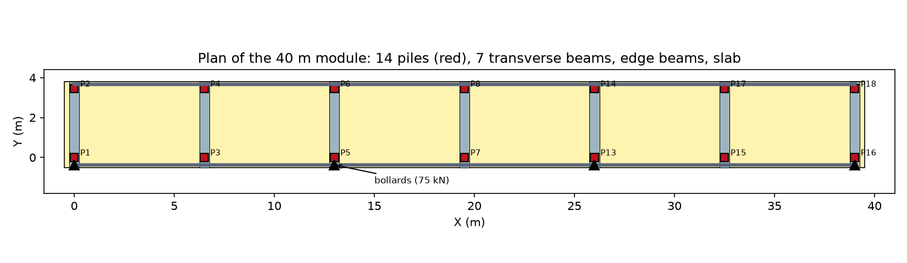
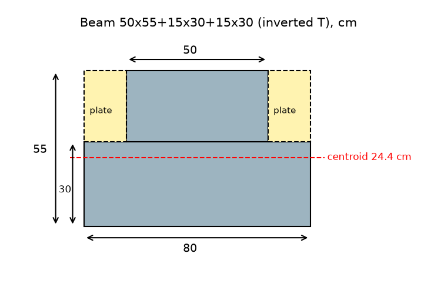
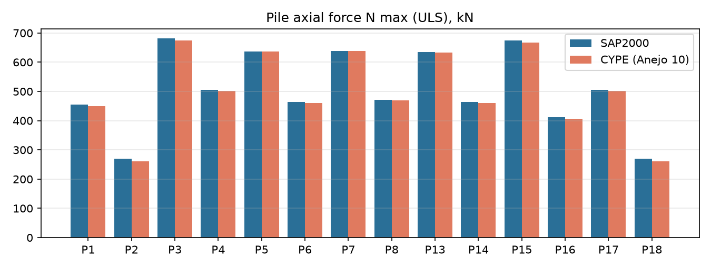
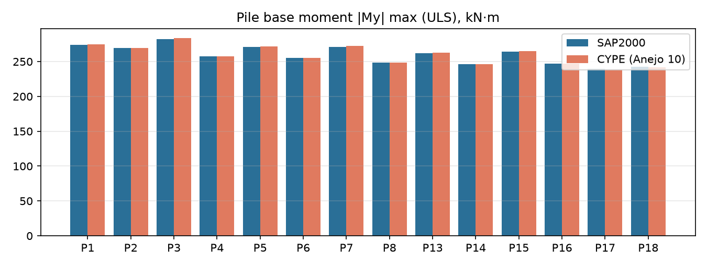
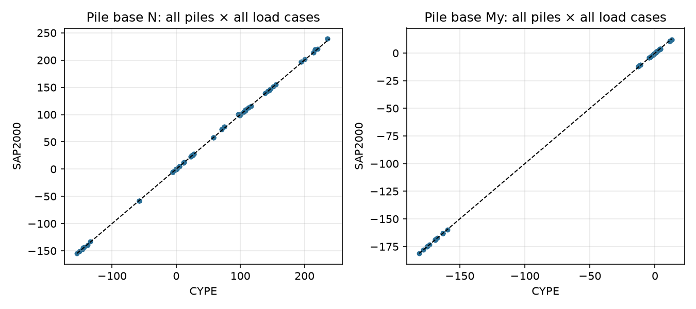
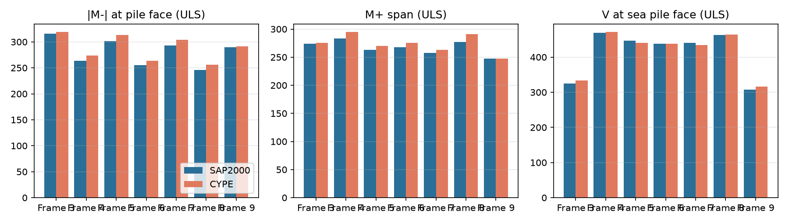

# توضیح کامل پروژه: بازسازی مدل اسکلهٔ Trasmallo در SAP2000 و مقایسه با Anejo 10

> این متن برای کسی نوشته شده که هیچ چیز دربارهٔ این پروژه نمی‌داند و فقط آشنایی اولیه‌ای با مهندسی سازه دارد. هر مفهوم، فرمول و قاعده‌ای که به کار رفته، قدم‌به‌قدم و با عدد توضیح داده شده است.

---

## فهرست

1. [پروژه دربارهٔ چیست؟](#۱-پروژه-دربارهٔ-چیست)
2. [مفاهیم پایه که باید بدانید](#۲-مفاهیم-پایه-که-باید-بدانید)
3. [منابع اطلاعات: Anejo 10 و فایل PDF](#۳-منابع-اطلاعات)
4. [داده‌های سازه: هندسه، مصالح، بارها](#۴-دادههای-سازه)
5. [کشف‌هایی که از دل اعداد CYPE بیرون آمد](#۵-کشفهایی-که-از-دل-اعداد-cype-بیرون-آمد)
6. [ساختن مدل: قدم‌به‌قدم](#۶-ساختن-مدل-قدمبهقدم)
7. [مقاطع تیرها و فرمول‌های خواص مقطع](#۷-مقاطع-تیرها-و-فرمولهای-خواص-مقطع)
8. [دال alveoplaca و رفتار یک‌طرفه](#۸-دال-alveoplaca-و-رفتار-یکطرفه)
9. [بارها و نحوهٔ اعمال آن‌ها](#۹-بارها-و-نحوهٔ-اعمال-آنها)
10. [ترکیب بارها و ضرایب اطمینان](#۱۰-ترکیب-بارها-و-ضرایب-اطمینان)
11. [قرارداد علامت‌ها: چرا CYPE و SAP اعداد را با علامت متفاوت نشان می‌دهند](#۱۱-قرارداد-علامتها)
12. [کنترل‌ها پیش از اجرا در SAP](#۱۲-کنترلها-پیش-از-اجرا-در-sap)
13. [اجرا در SAP2000 و مشکلاتی که پیش آمد](#۱۳-اجرا-در-sap2000-و-مشکلاتی-که-پیش-آمد)
14. [نتایج و مقایسه با Anejo 10](#۱۴-نتایج-و-مقایسه-با-anejo-10)
15. [اختلاف‌ها، دلیل‌ها و محدودیت‌ها](#۱۵-اختلافها-دلیلها-و-محدودیتها)
16. [جمع‌بندی](#۱۶-جمعبندی)
17. [فایل‌های پروژه](#۱۷-فایلهای-پروژه)
18. [واژه‌نامه](#۱۸-واژهنامه)

---

## ۱. پروژه دربارهٔ چیست؟

### ۱.۱ خود سازه
در بندر **Cullera** در استان والنسیای اسپانیا، یک پروژهٔ «گسترش و بازسازی اسکلهٔ ماهیگیری» طراحی شده است. یکی از بخش‌های آن **Muelle de Trasmallo** است؛ اسکله‌ای برای قایق‌های ماهیگیری که با تور «ترامایو» (trasmallo، نوعی تور سه‌لایه) کار می‌کنند.

- طول کل این اسکله ۸۰ متر است.
- با یک **درز انبساط** (junta) به دو **ماژول ۴۰ متری** مستقل تقسیم شده است. درز انبساط یک شکاف عمدی است تا سازه در اثر تغییر دما و جمع‌شدگی بتن ترک نخورد.
- چون دو ماژول مستقل‌اند، کافی است **یک ماژول ۴۰ متری** تحلیل شود.

### ۱.۲ هدف کار ما
مهندس طراح این سازه را با نرم‌افزار **CYPECAD** (نرم‌افزار اسپانیایی تحلیل و طراحی سازه) محاسبه کرده و نتایج را در پیوست ۱۰ پروژه، **Anejo 10 «Cálculo de estructuras»** (پیوست محاسبات سازه)، آورده است.

هدف ما این بود که:
1. همین سازه را در نرم‌افزار دیگری به نام **SAP2000** دوباره مدل کنیم.
2. تحلیل کنیم.
3. نتایج را (نیروی محوری، برش، لنگر، واکنش تکیه‌گاهی) با نتایج CYPE مقایسه کنیم.

اگر دو نرم‌افزار مستقل با یک مدل درست به نتایج نزدیک به هم برسند، هم محاسبات اصلی تأیید می‌شود و هم مدل SAP برای کارهای بعدی (طراحی، بررسی گزینه‌های دیگر) قابل اعتماد است.

*شکل ۱: پلان ماژول ۴۰ متری. مربع‌های قرمز ۱۴ شمع، نوارهای خاکستری ۷ تیر عرضی، خطوط تیره تیرهای لبه، زمینهٔ زرد دال، و مثلث‌ها بولاردها هستند.*

---

## ۲. مفاهیم پایه که باید بدانید

### ۲.۱ اسکلهٔ شمعی باز (Muelle claraboya / open piled pier)
اسکله‌ای است که عرشه‌اش (کفِ قابل راه‌رفتن) روی **شمع‌ها** بالای آب قرار دارد و زیرش آب آزادانه جریان دارد. در اسکلهٔ ما:
- **شمع (Pilote):** ستون بتنی پیش‌ساختهٔ ۴۰×۴۰ سانتی‌متری که در بستر دریا کوبیده شده است. شمع‌ها بار عرشه را به خاک منتقل می‌کنند.
- **تیر عرضی (Viga / Pórtico):** تیر بتنی که روی سر دو شمع قرار دارد و آن‌ها را به هم وصل می‌کند. هر جفت شمع و تیر رویش یک **قاب** (Pórtico) می‌سازند.
- **تیر لبه:** تیرهای باریک ۲۵×۳۰ سانتی‌متری که در دو لبهٔ طولی اسکله، تیرهای عرضی را به هم وصل می‌کنند.
- **دال (Losa):** سطح عرشه، از قطعات پیش‌ساختهٔ **alveoplaca**.

### ۲.۲ Alveoplaca (دال توخالی پیش‌ساخته)
Alveoplaca یا hollow-core slab، دال بتنی پیش‌تنیده‌ای است که داخلش حفره‌های طولی دارد تا سبک‌تر شود.
- در این پروژه از نوع **PRENOR P-25+5** است: ۲۵ سانتی‌متر ضخامت قطعهٔ پیش‌ساخته به‌علاوهٔ ۵ سانتی‌متر **لایهٔ بتن درجا** (capa de compresión) روی آن. ضخامت کل ۳۰ سانتی‌متر است.
- این قطعات فقط در **یک جهت** کار می‌کنند: از یک تیر عرضی تا تیر عرضی بعدی (دهانهٔ ۶.۵ متری). به این رفتار **یک‌طرفه** (one-way) می‌گویند.

### ۲.۳ بولارد (Bolardo) و «کشش بولارد»
بولارد میلهٔ فلزی کوتاهی روی لبهٔ اسکله است که طناب کشتی به آن بسته می‌شود. وقتی باد یا جریان آب کشتی را حرکت می‌دهد، طناب بولارد را می‌کشد. به این نیرو «کشش بولارد» (Tiro de bolardo) می‌گویند. در این پروژه **۷۵ کیلونیوتن** است، تقریباً معادل وزن ۷.۵ تن.

### ۲.۴ انواع بار
- **بار مرده (Permanent / G):** بارهایی که همیشه هستند: وزن خود سازه، کف‌سازی، جانداران دریایی چسبیده به سازه.
- **بار زنده (Variable / Q):** بارهایی که گاهی هستند: مردم، خودروها، کالاهای انبارشده، کشش بولارد.

### ۲.۵ حالت‌های حدی (ELU و ELS)
آیین‌نامه‌های طراحی سازه را در دو وضعیت کنترل می‌کنند:
- **ELU (حالت حدی نهایی، Estado Límite Último):** آیا سازه **نمی‌شکند**؟ بارها با ضرایب بزرگ‌تر از ۱ (مثلاً ۱.۳۵ و ۱.۵) بزرگ می‌شوند تا حاشیهٔ اطمینان ایجاد شود.
- **ELS (حالت حدی بهره‌برداری، Estado Límite de Servicio):** آیا سازه در استفادهٔ روزمره **خوب کار می‌کند** (تغییرشکل زیاد و ترک نمی‌دهد)؟ بارها با ضریب ۱ در نظر گرفته می‌شوند.

### ۲.۶ نیروهای داخلی یک عضو
اگر یک تیر یا ستون را در نقطه‌ای «ببُریم»، در آن مقطع این نیروها وجود دارند:
- **نیروی محوری (N):** در امتداد طول عضو؛ فشاری (له‌کننده) یا کششی (بیرون‌کشنده).
- **برش (V یا Q):** عمود بر طول عضو؛ می‌خواهد دو طرف مقطع را روی هم بلغزاند.
- **لنگر خمشی (M):** عضو را خم می‌کند. واحدش کیلونیوتن‌متر (kN·m) است: نیرو × فاصله.
- **لنگر پیچشی (T):** عضو را حول محور خودش می‌پیچاند.
- **واکنش تکیه‌گاهی:** نیرویی که زمین (تکیه‌گاه) به سازه وارد می‌کند تا آن را نگه دارد.

### ۲.۷ روش اجزای محدود (FEM)
SAP2000 و CYPECAD سازه را به قطعات کوچک (**المان**) تقسیم می‌کنند که در **گره‌ها** به هم وصل‌اند. برای هر گره معادلات تعادل نوشته و همه با هم حل می‌شوند. نتیجه، جابه‌جایی گره‌ها و نیروهای داخلی المان‌هاست.
- **المان قاب (Frame):** برای تیر و ستون؛ یک خط با خواص مقطع.
- **المان پوسته (Shell):** برای دال و دیوار؛ یک سطح نازک.

### ۲.۸ SAP2000 و CYPECAD
- **SAP2000:** نرم‌افزار آمریکایی تحلیل سازه (شرکت CSI)، بسیار رایج در دنیا.
- **CYPECAD:** نرم‌افزار اسپانیایی، رایج در اسپانیا و آمریکای لاتین. مدل اصلی پروژه با آن ساخته شده است.

---

## ۳. منابع اطلاعات

### ۳.۱ Anejo 10 (فایل Word)
منبع اصلی ما بود؛ یک سند حدود ۴۴۰۰۰ پاراگرافی. مهم‌ترین بخش‌هایش:

| بخش | محتوا |
|---|---|
| §2 | توصیف سازه (طول، تعداد شمع، فاصله‌ها) |
| §6 | مصالح (رده‌های بتن و فولاد) |
| §7 | بارها |
| §9 | مدل محاسباتی |
| §10 | نتایج و کنترل‌ها |
| **Apéndice 1** | **خروجی کامل CYPECAD**: مختصات شمع‌ها، بارها، ترکیب‌ها، نیروی شمع‌ها در هر حالت بار، نیروی تیرها، و... |

**همهٔ عددهای مرجعی که با آن‌ها مقایسه کردیم از همین Apéndice 1 آمده‌اند.** این اعداد با شمارهٔ سطر منبع در فایل `sap2000/ref/cype_reference.json` ذخیره شده‌اند.

### ۳.۲ فایل PDF کامل پروژه (۱۳۶۷ صفحه، ۲۱۴ مگابایت)
این فایل روی Google Drive است و نقشه‌ها را دارد. به‌خاطر حجم زیاد، ابزار Drive هیچ متنی از آن برنگرداند. برای همین **ابعادی که باید از نقشه‌ها می‌آمد، از روی تصاویر داخل خود Anejo 10 اندازه‌گیری شد**: تصاویر آرماتوربندی تیرها و پلان دال، با شمردن پیکسل و مقایسه با فاصلهٔ معلوم شمع‌ها.

---

## ۴. داده‌های سازه

### ۴.۱ هندسه
دستگاه مختصات همان دستگاه CYPE است:
- **X:** در طول اسکله (۰ تا ۳۹ متر).
- **Y:** در عرض اسکله (منفی به سمت دریا).
- **Z:** رو به بالا.

| جزء | مقدار | منبع |
|---|---|---|
| تعداد محورهای قاب | ۷، در X = 0، 6.5، 13، 19.5، 26، 32.5 و 39 متر | Apéndice 1 §1.8 |
| شمع‌ها | ۱۴ عدد، دو ردیف: Y = 0 (سمت دریا) و Y = 3.45 متر (سمت خشکی) | §1.8 |
| مقطع شمع | ۴۰×۴۰ سانتی‌متر | §1.9 |
| عرض عرشه | ۴.۳۰ متر (Y از −0.50 تا +3.80) | اندازه‌گیری روی تصاویر |
| طول ماژول | ۴۰.۰ متر (X از −0.50 تا 39.50) | متن و تصاویر |
| تیرهای لبه ۲۵×۳۰ | در Y = −0.375 (دریا) و Y = 3.675 (خشکی) | تصاویر |
| بولاردها | در X = 0، 13، 26 و 39 روی لبهٔ دریا («یکی از هر دو محل پهلوگیری») | §7.5 و §1.4.5 |

### ۴.۲ مصالح
| مصالح | کاربرد | مدول الاستیسیته Ec | توضیح |
|---|---|---|---|
| **HA-50** | شمع‌های پیش‌ساخته | 33550 MPa | بتن با مقاومت مشخصهٔ ۵۰ مگاپاسکال |
| **HA-35** | تیرها و بتن درجا | 30669 MPa | بتن ۳۵ مگاپاسکال |
| **B500SD** | میلگرد | — | فولاد با تنش تسلیم ۵۰۰ مگاپاسکال؛ در تحلیل خطی اثری ندارد و فقط برای طراحی لازم است |

**مدول الاستیسیته (E)** نشان می‌دهد ماده چقدر سخت است: تنش تقسیم بر کرنش.

### ۴.۳ بارها
| نام در مدل | نام اسپانیایی | مقدار |
|---|---|---|
| **PP** | Peso propio (وزن خودی) | وزن بتن تیرها و شمع‌ها + ۴.۱۰ kN/m² وزن alveoplaca |
| **CM** | Cargas muertas (بار مرده اضافه) | ۱.۸ kN/m² در متن (کف‌سازی + ۰.۵ جانداران دریایی). ببینید §۵.۳ |
| **Qa** | Sobrecarga de uso (بار زنده) | ۱۵ kN/m² |
| **TB1** | Tiro bolardo | ۷۵ kN افقی در ۴ بولارد + بار باد روی کالای انبارشده در سر شمع‌ها |
| **TB2 / TB3** | Tiro bolardo 2/3 | مؤلفهٔ قائم بولارد: ۵۳ kN رو به پایین / رو به بالا |

- **زلزله:** در نظر گرفته نشده، چون شتاب مبنای Cullera ۰.۰۷g است و آیین‌نامهٔ زلزلهٔ اسپانیا (NCSE-02) زیر ۰.۰۸g را الزامی نمی‌داند.
- **حرارت:** در نظر گرفته نشده، چون درز انبساط هست.

---

## ۵. کشف‌هایی که از دل اعداد CYPE بیرون آمد

این مهم‌ترین و جالب‌ترین بخش کار بود. **متن Anejo 10 با عددهایی که خود CYPE حساب کرده، در چند جا نمی‌خواند.** چون هدف ما بازتولید نتایج CYPE بود، با «مهندسی معکوس» پیدا کردیم CYPE واقعاً با چه فرض‌هایی حساب کرده است.

### ۵.۱ طول شمع: ۷.۲۵ متر، نه ۷.۰۰ متر

**چرا طول شمع مهم است؟** شمع در خاک فرو رفته و در عمقی مشخص عملاً «گیردار» (کاملاً قفل) می‌شود. متن §9.1 می‌گوید حداکثر لنگر در عمق ۶.۵ متری رخ داده و «برای اطمینان» نقطهٔ گیرداری ۷.۰۰ متر پایین‌تر از عرشه گرفته شده است.

**اما CYPE با ۷.۲۵ متر حساب کرده. سه دلیل:**

**دلیل ۱: تعادل لنگر.** در بخش §3.7 Apéndice 1، CYPE برای هر حالت بار جمع نیروها و لنگرهای پای همهٔ شمع‌ها را نسبت به مبدأ مختصات داده است. طبق **قانون تعادل استاتیکی**، اگر سازه ساکن است، جمع لنگر بارهای وارده حول هر نقطه باید با جمع لنگر واکنش‌ها برابر باشد. لنگر یک نیرو حول یک نقطه برابر است با نیرو × فاصلهٔ عمودی.

برای حالت TB1 (کشش بولارد)، لنگر حول محور X در تراز پای شمع‌ها:

$$M_y = \sum (N_i \cdot y_i) + \sum M_{y,i} + \sum Q_{y,i} \cdot z$$

در این فرمول:
- $N_i \cdot y_i$: لنگر نیروهای قائم (نیرو × فاصلهٔ افقی)
- $M_{y,i}$: لنگرهایی که مستقیم وارد شده‌اند
- $Q_{y,i} \cdot z$: لنگر نیروهای افقی (نیرو × ارتفاع اعمال آن‌ها)

با عددها: $\sum N y = -703.8$، $\sum M_y = -150$، $\sum Q_y = -691$ و CYPE گزارش داده $M_y = -5864$ kN·m. بنابراین:

$$-5864 = -703.8 - 150 - 691 \cdot z \quad\Rightarrow\quad z = \frac{5864 - 853.8}{691} = 7.25 \text{ m}$$

پس بارهای افقی در ارتفاع **۷.۲۵ متری** بالای پای شمع اعمال شده‌اند. اگر ۷.۰۰ بود، نتیجه −5690.8 می‌شد، نه −5864.

**دلیل ۲: فهرست خروجی CYPE** خودش نوشته «Tramo 0.000/7.250 m» (طول قطعه ۰ تا ۷.۲۵ متر) و «Altura libre 6.70 m» (ارتفاع آزاد ۶.۷۰ متر).

**دلیل ۳: شیب لنگر.** در شمعی که بار افقی فقط در سرش وارد شده، لنگر در طول شمع خطی تغییر می‌کند: $M(z) = M_{\text{پا}} - Q \cdot z$. پس اختلاف لنگر سر و پا تقسیم بر برش برابر فاصلهٔ آن دو مقطع است. برای شمع P1 در TB1:

$$\frac{|M_{\text{پا}}| + |M_{\text{سر}}|}{Q} = \frac{177.9 + 169.7}{51.9} = 6.70 \text{ m}$$

یعنی مقطع «سر شمع» در CYPE، ۶.۷۰ متر بالای پای آن است. **۰.۵۵ متر بالایی شمع (از ۶.۷۰ تا ۷.۲۵) داخل تیر (ارتفاع تیر = ۰.۵۵ متر) قرار دارد** و صلب فرض شده است.

**نتیجه:** در مدل، شمع از Z = 0 تا Z = 7.25 است و ۰.۵۵ متر بالایش **ناحیهٔ صلب** (rigid end offset) تعریف شده است. اگر بخواهید طبق متن ۷.۰۰ باشد، فقط کافی است پارامتر `PILE_LENGTH` را تغییر دهید.

### ۵.۲ وزن مخصوص بتن: 24.525 kN/m³، نه 25

متن §7.1 می‌گوید ۲۵ kN/m³. ولی در جدول §3.3، اختلاف نیروی محوری وزن خودی بین پا و سر هر شمع **۲۶.۲ تا ۲۶.۳ کیلونیوتن** است. این اختلاف دقیقاً وزن ۶.۷۰ متر از شمع است:

$$W = A \cdot L \cdot \gamma \quad\Rightarrow\quad \gamma = \frac{W}{A \cdot L} = \frac{26.3}{0.16 \times 6.70} = 24.5 \text{ kN/m}^3$$

دلیلش این است که CYPE چگالی بتن را **۲.۵ تن بر مترمکعب** گرفته و در شتاب ثقل **۹.۸۱** ضرب کرده است: $2.5 \times 9.81 = 24.525$. با ۲۵ عدد ۲۶.۸ به دست می‌آمد.

### ۵.۳ بار مرده: 1.75 kN/m²، نه 1.8

در listing عدد «1.8» چاپ شده (با یک رقم اعشار). اما نسبت نیروی محوری CM به Qa **در همهٔ شمع‌ها** دقیقاً 0.1167 است (مثلاً P3: 27.5 / 235.7 = 0.1167). چون هر دو بار روی یک سطح پخش شده‌اند:

$$\frac{q_{CM}}{q_{Qa}} = 0.1167 \quad\Rightarrow\quad q_{CM} = 0.1167 \times 15 = 1.75 \text{ kN/m}^2$$

کنترل با جمع کل: $297.5 / 1.75 = 170.0$ m² و $2550.1 / 15 = 170.0$ m². هر دو یکی‌اند.

> **توجه:** در مدل **1.75** گذاشته شده تا با CYPE مقایسه شود. اگر برای طراحی 1.80 بخواهید، فقط `Q_CM = 1.80` را عوض کنید. اثرش حدود ۰.۳٪ بار ELU است.

### ۵.۴ بار جاافتاده روی شمع P16
در جدول «بارهای سر شمع» (§1.4.5) که بار باد روی کالای انبارشده را به سر شمع‌ها می‌دهد، شمع **P16** بار ندارد، در حالی که شمع قرینه‌اش P1 بار ۱۷ کیلونیوتنی دارد. جمع‌های §3.7 هم نشان می‌دهد CYPE واقعاً آن را جا انداخته است (جمع نیروی افقی = −691 که بدون P16 درست است). برای تکرار نتایج CYPE، ما هم آن را نگذاشتیم. پارامتر `ADD_MISSING_P16_LOAD` برای اضافه‌کردنش وجود دارد.

### ۵.۵ عرض عرشه ۴.۳۰ متر و محل تیرهای لبه
در اولین مدل، عرشه را متقارن فرض کرده بودیم و شمع‌های سمت خشکی حدود ۱۰٪ کمتر از CYPE بار می‌گرفتند.

**مرکز بار** در §3.7 این را نشان داد: برای Qa، $M_y / N = 4193.6 / 2550.1 = 1.644$ متر. یعنی مرکز سطح بارگذاری‌شده در Y = 1.644 است، که با عرشه‌ای از Y = −0.50 تا +3.80 (مرکز ۱.۶۵) می‌خواند، نه با عرشهٔ باریک‌تری که اول فرض کرده بودیم (مرکز حدود ۱.۵۰).

اندازه‌گیری روی تصاویر آرماتوربندی تأیید کرد که تیرهای عرضی از Y = −0.50 تا +3.80 امتداد دارند (۰.۳۵ متر بیرون‌تر از ردیف شمع خشکی). تیر لبهٔ خشکی هم در Y = 3.675 است. با اصلاح هندسه، اختلاف به ۱ تا ۳٪ رسید.

### ۵.۶ دال پیوسته روی تیرهای میانی
در مدل اولیه، دال را ساده (مفصلی) روی تیرها فرض کرده بودیم و قاب‌های انتهایی ۲۰٪ بار بیشتری از CYPE می‌گرفتند. توضیح این پدیده:

**تیر پیوسته** تیری است که روی چند تکیه‌گاه بدون قطع‌شدن ادامه دارد. در چنین تیری، تکیه‌گاه‌های میانی بار بیشتری می‌گیرند. برای تیر پیوستهٔ چنددهانه با بار یکنواخت q و دهانهٔ L، ضرایب واکنش تکیه‌گاه‌ها تقریباً این‌هاست:

| تکیه‌گاه | واکنش |
|---|---|
| انتهایی | 0.394·qL |
| اولین میانی | 1.132·qL |
| بقیهٔ میانی | حدود 1.0·qL |

در دال ساده، همهٔ تکیه‌گاه‌های میانی 1.0·qL و انتهایی‌ها 0.5·qL می‌گیرند.

نسبت‌های واکنش شمع‌ها در CYPE دقیقاً الگوی تیر پیوسته را نشان داد. listing alveoplaca هم لنگر منفی تکیه‌گاه (−100.32 kN·m/m) دارد، که در دال ساده صفر است. پس دال را **پیوسته روی تیرهای میانی و ساده روی تیرهای انتهایی** مدل کردیم (بخش ۸).

---

## ۶. ساختن مدل: قدم‌به‌قدم

همهٔ داده‌های مدل در **یک فایل پایتون** (`sap2000/model/trasmallo.py`) تعریف شده‌اند. سه خروجی از همین یک منبع ساخته می‌شوند، پس هر سه دقیقاً یک مدل‌اند:
1. فایل متنی `.$2k` برای Import در SAP.
2. اسکریپت پایتون که مدل را مستقیم داخل SAP می‌سازد.
3. مدل کنترلی مستقل در نرم‌افزار PyNite.

### ۶.۱ گره‌ها
- **پای شمع‌ها:** ۱۴ گره در Z = 0.
- **گره‌های عرشه:** یک شبکه (مش) در تراز Z = 7.25:
  - در جهت X هر ۰.۵ متر (۱۳ قسمت در هر دهانهٔ ۶.۵ متری).
  - در جهت Y روی این خطوط: تیر لبه (−0.375)، بَر شمع (−0.20)، محور شمع (0)، بَر شمع (0.20)، ۵ سانتی‌متر بعدش (0.25)، ۶ تقسیم تا 3.20، بَر شمع (3.25)، محور شمع (3.45)، تیر لبه (3.675).
- **جمع:** ۱۱۳۴ گره.

### ۶.۲ تکیه‌گاه (گیرداری)
پای هر شمع **گیردار کامل** است: هر ۶ درجهٔ آزادی (۳ جابه‌جایی و ۳ دوران) بسته است. این همان فرض CYPE است: ضریب گیرداری ۱.۰۰ در پا و سر.

### ۶.۳ اعضای قاب
| دسته | تعداد | مقطع |
|---|---|---|
| شمع | ۱۴ | ۴۰×۴۰ |
| تیر عرضی | ۷ محور × ۱۵ قطعه = ۱۰۵ | T معکوس یا L معکوس |
| تیر لبه | ۲ × ۷۸ = ۱۵۶ | ۲۵×۳۰ |
| **جمع** | **۲۷۵** | |

تیرها در هر گرهٔ مش قطعه‌قطعه شده‌اند تا دال بتواند به آن‌ها وصل شود.

### ۶.۴ ناحیه‌های صلب (Rigid end offsets)
وقتی تیر و ستون به هم می‌رسند، بخشی از هر کدام **داخل** دیگری است. مثلاً ۰.۵۵ متر بالای شمع داخل تیر است. آن بخش عملاً خم نمی‌شود، چون بتن اطرافش آن را قفل کرده است. CYPE این بخش‌ها را صلب (بی‌نهایت سخت) در نظر می‌گیرد. ما هم همین کار را کردیم:
- **شمع:** ۰.۵۵ متر بالایی صلب. طول انعطاف‌پذیر = ۷.۲۵ − ۰.۵۵ = ۶.۷۰ متر.
- **تیر عرضی:** ۰.۲۰ متر دو طرف محور شمع (نصف عرض ۴۰ سانتی‌متری شمع) صلب. قطعه‌هایی که کاملاً داخل شمع‌اند، سختی‌شان ۱۰۰ برابر شده است.
- **تیر لبه:** در محل تقاطع با تیر عرضی، به اندازهٔ نصف عرض جان تیر عرضی صلب.

### ۶.۵ دیافراگم صلب
دال بتنی در صفحهٔ خودش (افقی) بسیار سخت است. نیروی افقی بولارد را بین همهٔ قاب‌ها پخش می‌کند و نمی‌گذارد یک قاب تنها زیر بار برود. در SAP این رفتار با قید **Diaphragm** روی همهٔ گره‌های تراز عرشه مدل شد. این قید حرکت افقی همهٔ گره‌ها را مثل یک صفحهٔ صلب به هم وابسته می‌کند. CYPE هم دقیقاً همین فرض را دارد (forjado rígido).

### ۶.۶ ضریب سختی محوری شمع = ۲
CYPE به‌طور پیش‌فرض سختی محوری ستون‌ها را دو برابر می‌کند. «Coeficiente de rigidez axil 2.00» در listing آمده است. هدف، شبیه‌سازی اثر مراحل ساخت است؛ در واقعیت ستون‌ها قبل از بارگذاری کامل، کوتاه‌شدگی محوری خود را پیدا کرده‌اند. در SAP این با **ضریب اصلاح سطح مقطع** `AMod = 2` اعمال شد. این ضریب فقط سختی محوری را تغییر می‌دهد، نه وزن را.

### ۶.۷ اصلاح وزن برای جلوگیری از شمارش دوبار
- **شمع:** SAP وزن شمع را روی کل ۷.۲۵ متر حساب می‌کند، اما ۰.۵۵ متر بالایی آن در واقع همان بتن تیر است (یک حجم بتن دو بار شمرده می‌شود). پس ضریب وزن شمع برابر $6.70 / 7.25 = 0.924$ شد. CYPE هم وزن شمع را فقط روی ۶.۷۰ متر حساب کرده است.
- **تیر لبه:** جایی که از داخل تیر عرضی عبور می‌کند، وزنش دوباره شمرده می‌شود. ضریب وزن: $(39 - 5 \times 0.50 - 2 \times 0.295) / 39 = 0.921$.

---

## ۷. مقاطع تیرها و فرمول‌های خواص مقطع

### ۷.۱ مقطع T معکوس: تیر اصلی مستطیل ۵۰×۵۵ نیست!
CYPE تیر را «50x55+15x30+15x30» نامیده است. معنی این نماد:
- **50×55:** جانِ تیر ۵۰ سانتی‌متر عرض و ۵۵ سانتی‌متر ارتفاع کل دارد.
- **+15×30 +15×30:** در پایین هر طرف، یک **بال** (ala) به عرض ۱۵ و ضخامت ۳۰ سانتی‌متر. alveoplaca روی این بال‌ها می‌نشیند.

پس مقطع یک **T وارونه** است: پایین ۸۰ سانتی‌متر عرض (۱۵+۵۰+۱۵) و ۳۰ سانتی‌متر ضخامت، بالا ۵۰ سانتی‌متر عرض و ۲۵ سانتی‌متر ارتفاع.

*شکل ۲: مقطع T معکوس تیر عرضی. قطعات زرد، alveoplacaهای نشسته روی بال‌ها هستند.*

### ۷.۲ سطح مقطع (A)
مقطع را به دو مستطیل تقسیم می‌کنیم:
- مستطیل پایین: ۰.۸۰ × ۰.۳۰ = ۰.۲۴۰ m²
- مستطیل بالا: ۰.۵۰ × ۰.۲۵ = ۰.۱۲۵ m²

$$A = 0.240 + 0.125 = 0.365 \text{ m}^2$$

### ۷.۳ مرکز سطح (Centroid)
مرکز سطح نقطه‌ای است که اگر مقطع را روی آن بگذاریم متعادل می‌ماند؛ محور خنثای خمش از آن می‌گذرد. فرمولش **میانگین وزنی** مراکز اجزاست:

$$\bar{y} = \frac{\sum A_i \cdot y_i}{\sum A_i}$$

- $y_i$: ارتفاع مرکز هر مستطیل از کف مقطع. مستطیل پایین: ۰.۱۵. مستطیل بالا: ۰.۳۰ + ۰.۲۵/۲ = ۰.۴۲۵.

$$\bar{y} = \frac{0.240 \times 0.15 + 0.125 \times 0.425}{0.365} = \frac{0.036 + 0.0531}{0.365} = 0.244 \text{ m}$$

یعنی محور خنثی ۲۴.۴ سانتی‌متر بالای کف تیر است، پایین‌تر از وسط ارتفاع (۲۷.۵)، چون پایین مقطع پهن‌تر است.

### ۷.۴ ممان اینرسی (I)
ممان اینرسی نشان می‌دهد مقطع در برابر **خمش** چقدر سخت است. هرچه ماده دورتر از محور خنثی باشد، اثرش بیشتر است؛ به همین دلیل با **توان دوم فاصله** بالا می‌رود.

برای یک مستطیل به عرض b و ارتفاع h، حول محور گذرنده از مرکز خودش:

$$I_0 = \frac{b \cdot h^3}{12}$$

برای مقطع مرکب از **قضیهٔ محورهای موازی (قضیهٔ اشتاینر)** استفاده می‌کنیم: اینرسی هر جزء حول محور خنثی کل مقطع برابر است با اینرسی آن حول مرکز خودش، به‌علاوهٔ سطح آن × مجذور فاصلهٔ مرکزش تا محور خنثی:

$$I = \sum \left( \frac{b_i h_i^3}{12} + A_i \cdot d_i^2 \right)$$

با عددها ($d_i$ = فاصلهٔ مرکز هر جزء تا ۰.۲۴۴):
- **مستطیل پایین:** $\frac{0.80 \times 0.30^3}{12} + 0.240 \times (0.15 - 0.244)^2 = 0.00180 + 0.00213 = 0.00393$
- **مستطیل بالا:** $\frac{0.50 \times 0.25^3}{12} + 0.125 \times (0.425 - 0.244)^2 = 0.00065 + 0.00409 = 0.00474$

$$I_{33} = 0.00393 + 0.00474 = 0.00867 \text{ m}^4$$

**مقایسه:** اگر تیر را مستطیل سادهٔ ۵۰×۵۵ می‌گرفتیم: $I = 0.50 \times 0.55^3 / 12 = 0.00693$ m⁴. یعنی **مقطع واقعی ۲۵٪ سخت‌تر است**. به همین دلیل وارد کردن آن به‌صورت مستطیل ساده خطا بود.

### ۷.۵ ثابت پیچشی (J) و روش Prandtl
ثابت پیچشی نشان می‌دهد مقطع در برابر **پیچش** چقدر سخت است. برای مقاطع غیرمستطیلی فرمول ساده ندارد. از **روش تابع تنش Prandtl** استفاده کردیم:

1. روی سطح مقطع تابعی به نام φ (تابع تنش) تعریف می‌شود که در این معادله صدق کند (**معادلهٔ پواسون**):
$$\frac{\partial^2 \phi}{\partial x^2} + \frac{\partial^2 \phi}{\partial y^2} = -2$$
   و روی مرز مقطع صفر باشد ($\phi = 0$). تنش‌های برشی پیچشی از شیب این تابع به دست می‌آیند.

2. ثابت پیچشی دو برابر «حجم زیر» این تابع است:
$$J = 2 \iint \phi \, dA$$

3. معادله با **روش تفاضل محدود** حل شد: مقطع به مربع‌های ۲.۵ میلی‌متری تقسیم شد و مشتق دوم در هر مربع با این رابطه تقریب زده شد:
$$\frac{\phi_{i+1} - 2\phi_i + \phi_{i-1}}{h^2}$$
   حاصل، یک دستگاه معادلات خطی بزرگ است که کامپیوتر حل می‌کند.

**کنترل روش:** برای مقطع مربع ۴۰×۴۰، فرمول دقیق $J = 0.1406 \, a^4 = 0.0035994$ m⁴ است و روش ما 0.0035993 داد: خطای کمتر از ۰.۰۱٪.

**نتیجه برای T معکوس:** J = 0.01546 m⁴. یک بازبین مستقل با روش دیگری 0.01545 به دست آورد.

### ۷.۶ سطح برشی (Shear area)
برای تغییرشکل برشی، نرم‌افزار «سطح مؤثر برشی» می‌خواهد. با **روش انرژی (ژوراوسکی)** محاسبه شد:

$$A_s = \frac{I^2}{\int \frac{Q(y)^2}{b(y)^2} dA}$$

- $Q(y)$: **لنگر اول سطح**، یعنی سطح بالای برش ضرب در فاصلهٔ مرکزش تا محور خنثی.
- $b(y)$: عرض مقطع در ارتفاع y.

برای مستطیل، این فرمول دقیقاً $\frac{5}{6} A$ می‌دهد؛ روش ما هم همین را داد. برای T معکوس: $A_{s2} = 0.301$ m².

### ۷.۷ جدول نهایی مقاطع

| مقطع | نام CYPE | A (m²) | I₃₃ (m⁴) | I₂₂ (m⁴) | J (m⁴) |
|---|---|---|---|---|---|
| T معکوس (قاب‌های میانی) | 50x55+15x30+15x30 | 0.365 | 0.008667 | 0.015404 | 0.015461 |
| L معکوس (قاب‌های انتهایی) | 80x55+15x30 | 0.485 | 0.012067 | 0.032762 | 0.028245 |
| تیر لبه | 25x30 | 0.075 | 0.000563 | 0.000391 | 0.000779 |
| شمع | 40x40 | 0.160 | 0.002133 | 0.002133 | 0.003599 |

**تیرهای انتهایی** (در X = 0 و X = 39) فقط یک بال دارند، چون فقط یک طرفشان دال است؛ مقطعشان L وارونه است. در X = 39 بال به سمت مخالف است، پس مقطع قرینه (`_M`) تعریف شد.

---

## ۸. دال alveoplaca و رفتار یک‌طرفه

### ۸.۱ چرا المان پوسته (Shell)؟
دال با **المان پوستهٔ نازک** (Shell-Thin) مدل شد. سختی خمشی یک صفحه در واحد عرض:

$$D = \frac{E \cdot t^3}{12}$$

(برای دقت کامل باید بر $1-\nu^2$ هم تقسیم شود؛ اینجا از آن صرف‌نظر شده.)

### ۸.۲ هم‌ارز کردن سختی با داده‌های سازنده
داده‌های CYPE برای PRENOR P-25+5 سختی کل را $EI = 63550$ kN·m²/m (به ازای هر متر عرض) می‌دهد. با ضخامت ۰.۳۰ متر و بتن HA-35:

$$D_{\text{shell}} = \frac{30669000 \times 0.30^3}{12} = 69005 \text{ kN·m}^2/\text{m}$$

**ضریب اصلاح** سختی خمشی در جهت دهانه:

$$m_{11} = \frac{63550}{69005} = 0.921$$

### ۸.۳ رفتار یک‌طرفه
alveoplacaها قطعات کنار هم هستند و در جهت عرضی (Y) تقریباً سختی خمشی ندارند. در SAP:
- **m11 = 0.921:** خمش در جهت X (دهانه).
- **m22 = 0.01:** خمش در جهت Y تقریباً صفر.
- **m12 = 0.01:** پیچش صفحه تقریباً صفر.

**محور محلی ۱** هر المان پوسته در جهت X قرار گرفته است. گره‌های هر المان خلاف جهت عقربه‌های ساعت و با ضلع اول در جهت +X شماره‌گذاری شده‌اند؛ SAP محور ۱ را در امتداد ضلع اول می‌گذارد.

### ۸.۴ مفصل روی تیرهای انتهایی
CYPE دال را روی تیرهای انتهایی **تکیهٔ ساده** (مفصلی) گرفته است؛ لنگر دال آنجا صفر است. برای مدل‌کردنش، ردیف اول و آخر المان‌ها (۰.۵ متر کنار تیرهای انتهایی) مقطع جداگانه‌ای با $m_{11} \times 0.01$ دارند که مثل یک لولا عمل می‌کند.

> ⚠️ این ضریب را کمتر از ۰.۰۱ نکنید. در Shell نازک، کاهش بیشتر توان انتقال برش به تیر انتهایی را هم از بین می‌برد.

### ۸.۵ وزن دال
وزن خودِ المان پوسته صفر شده است (`WMod = 0`)، چون ضخامت ۳۰ سانتی‌متری بتن توپر وزن را اشتباه (۷.۵ kN/m²) می‌دهد. وزن واقعی alveoplaca، یعنی **4.10 kN/m²** طبق داده‌های سازنده، به‌صورت بار سطحی و فقط روی **سطح واقعی قطعات** اعمال شده است: Y از −0.306 تا 3.603، و در X بین بال‌های تیرها.

---

## ۹. بارها و نحوهٔ اعمال آن‌ها

### ۹.۱ بارهای سطحی (CM و Qa)
- روی همهٔ المان‌های دال: $q$ کیلونیوتن بر مترمربع.
- **نوارهای بیرون از دال:** عرشه ۴.۳۰ متر عرض دارد، ولی المان‌های دال فقط بین محور دو تیر لبه (۴.۰۵ متر) هستند. بار نوار بیرونی به‌صورت **بار خطی** روی تیرها داده شد. بار خطی = بار سطحی × عرض نوار:
  - **نیمهٔ بیرونی تیرهای لبه (۰.۱۲۵ متر):** $w = q \times 0.125$ kN/m. مثلاً برای Qa: $15 \times 0.125 = 1.875$ kN/m.
  - **۰.۵ متر انتهای ماژول (پشت تیرهای انتهایی):** $w = q \times 0.50$ kN/m روی تیر انتهایی.

**کنترل جمع:** سطح کل = ۴۰ × ۴.۳۰ = ۱۷۲ m²؛ پس Qa = 15 × 172 = 2580 kN. CYPE عدد 2550 دارد (۱.۲٪ کمتر)، چون حدود ۲ مترمربع را بار نکرده است؛ احتمالاً ناحیه‌ای کنار تیرهای انتهایی.

### ۹.۲ بار بولارد و قاعدهٔ «انتقال نیرو»
نیروی ۷۵ کیلونیوتنی بولارد در ارتفاع ۰.۵ متری بالای عرشه به کلاهک بولارد وارد می‌شود، نه دقیقاً در گره. طبق قانون استاتیک، **یک نیرو را می‌توان به نقطهٔ دیگری منتقل کرد به شرط اضافه‌کردن یک لنگر برابر با حاصل‌ضرب برداری فاصله در نیرو**:

$$\vec{M} = \vec{r} \times \vec{F}$$

- $\vec{r} = (0, 0, 0.5)$: بردار از گره تا نقطهٔ اثر نیرو.
- $\vec{F} = (0, -75, 0)$: نیرو رو به دریا (Y منفی).

مؤلفهٔ X ضرب برداری:

$$M_x = r_y F_z - r_z F_y = 0 - 0.5 \times (-75) = +37.5 \text{ kN·m}$$

پس در گره بولارد: نیروی $F_Y = -75$ و لنگر $M_X = +37.5$. CYPE همین را با «My = −37.5» نشان داده است؛ علامت متفاوت به‌خاطر قرارداد متفاوت است (بخش ۱۱). کنترل با تعادل §3.7 نشان داد علامت ما درست است.

### ۹.۳ بار باد روی کالای انبارشده (بارهای سر شمع)
CYPE در حالت TB1، علاوه بر بولارد، به سر هر شمع نیروی افقی ۳۴ kN (۱۷ kN در شمع‌های انتهایی) و یک جفت نیروی قائم ±۳۴ داده است.
- **نیروی افقی:** باد روی کالاهای انبارشده روی اسکله.
- **جفت‌نیروی قائم:** چون باد در ارتفاع بالاتر از عرشه اثر می‌کند، یک لنگر واژگونی ایجاد می‌کند. به شمع سمت دریا فشار و به شمع سمت خشکی کشش می‌دهد. **جفت‌نیرو** یعنی دو نیروی مساوی و خلاف جهت که فقط لنگر ایجاد می‌کنند.

همهٔ ۲۵ ردیف این جدول عیناً وارد شد.

---

## ۱۰. ترکیب بارها و ضرایب اطمینان

### ۱۰.۱ فرمول کلی ترکیب
طبق آیین‌نامهٔ اسپانیا (Código Estructural، هم‌راستا با یوروکد):

$$E_d = \sum \gamma_G \cdot G + \gamma_{Q,1} \cdot Q_1 + \sum \gamma_{Q,i} \cdot \psi_{0,i} \cdot Q_i$$

- $G$: بارهای دائمی (PP، CM)؛ $\gamma_G$ ضریب اطمینان آن‌ها: **1.35** اگر نامطلوب، **1.00** اگر مطلوب (وقتی وزن به پایداری کمک می‌کند).
- $Q_1$: بار متغیر **اصلی**؛ $\gamma_Q = 1.50$.
- $Q_i$: بارهای متغیر **همراه**. چون احتمال اینکه همهٔ بارهای متغیر هم‌زمان به حداکثر برسند کم است، در ضریب **ψ₀** (psi) ضرب می‌شوند: 0.7 برای بار زنده و 0.6 برای باد/بولارد.

### ۱۰.۲ مثال
**ترکیب ۸ از ELU:** بولارد اصلی است و بار زنده همراه:

$$1.35 \cdot PP + 1.35 \cdot CM + 1.5 \times 0.7 \cdot Qa + 1.5 \cdot TB1 = 1.35 PP + 1.35 CM + 1.05 Qa + 1.5 TB1$$

**ترکیب ۱۰:** بار زنده اصلی است و بولارد همراه:

$$1.35 PP + 1.35 CM + 1.5 Qa + 1.5 \times 0.6 \cdot TB1 = \ldots + 0.9 \cdot TB1$$

### ۱۰.۳ سه خانوادهٔ ترکیب
| خانواده | تعداد | ضرایب | کاربرد |
|---|---|---|---|
| ELU | ۲۲ | G: 1.35/1.00، Q: 1.50 | طراحی بتن |
| CIM (پی) | ۲۲ | G: 1.60/1.00، Q: 1.60 | طراحی شمع و پی |
| ELS | ۸ | همه ۱.۰ | تغییرشکل |

هر ۵۲ ترکیب **عیناً** از جدول Apéndice 1 §1.6.2 وارد شد و یک بازبین مستقل همهٔ ضرایب را یکی‌یکی با جدول CYPE تطبیق داد. برای هر خانواده یک **ترکیب پوش** (Envelope) هم تعریف شد که حداکثر و حداقل همهٔ ترکیب‌ها را می‌دهد.

### ۱۰.۴ اصل جمع آثار (Superposition)
در **تحلیل خطی**، اثر مجموع چند بار برابر مجموع اثر تک‌تک بارهاست. پس کافی است سازه برای ۶ حالت بار پایه یک‌بار تحلیل شود و هر ترکیب از جمع ضرب‌شدهٔ نتایج به دست بیاید. مقایسه‌های ما هم به همین روش ساخته شده‌اند.

---

## ۱۱. قرارداد علامت‌ها

هر نرم‌افزار برای «مثبت» و «منفی» قرارداد خودش را دارد. برای مقایسهٔ درست، باید معادل‌ها را دقیق پیدا کرد.

### ۱۱.۱ قرارداد CYPE
- نیروها در **محورهای محلی شمع**. چون زاویهٔ همهٔ شمع‌ها صفر است، این محورها با محورهای کلی یکی‌اند.
- **N مثبت = فشار.**
- **Mx با Qx جفت است** (خمش در صفحهٔ XZ) و **My با Qy** (خمش در صفحهٔ YZ). رابطه: $M(z) = M_{\text{پا}} - Q \cdot z$.
- نیروهای پای شمع، **اثر شمع روی پی** هستند، یعنی منفی واکنش.

### ۱۱.۲ قرارداد SAP2000
- **واکنش‌ها:** نیرویی که تکیه‌گاه به سازه می‌دهد، در محورهای کلی.
- **نیروهای داخلی:** روی «وجه مثبت» مقطع. برای شمع: محور ۱ = +Z، محور ۲ = +X، محور ۳ = +Y.
- **نکتهٔ ظریف:** در SAP، **M3 مثبت** وجه +2 را فشرده می‌کند، ولی **M2 مثبت** وجه +3 را فشرده می‌کند. پس M2 برخلاف M3 از قاعدهٔ دست راست پیروی نمی‌کند. این نکته اول اشتباه گرفته شده بود؛ بازبین علامت‌ها با مستندات رسمی CSI پیدایش کرد و اصلاح شد.

### ۱۱.۳ جدول تبدیل
| از SAP | به CYPE |
|---|---|
| واکنش پای شمع (F1, F2, F3, M1, M2, M3) | N = F3، Qx = −F1، Qy = −F2، Mx = −M2، My = M1، T = −M3 |
| نیروی داخلی شمع (P, V2, V3, T, M2, M3) | N = −P، Qx = V2، Qy = V3، Mx = M3، My = +M2، T = T |
| تیر عرضی | M (مثبت = کشش در پایین) = M3، V = −V2 |
| بار سر شمع CYPE (N, Mx, My, Qx, Qy, T) | بار گرهی SAP = (Qx, Qy, −N, −My, Mx, T) |

**کنترل:** با این تبدیل‌ها، جمع همهٔ نیروها و لنگرهای §3.7 CYPE در همهٔ ۶ حالت بار دقیقاً بازتولید شد.

---

## ۱۲. کنترل‌ها پیش از اجرا در SAP

### ۱۲.۱ مدل کنترلی مستقل (PyNite)
SAP روی ویندوز اجرا می‌شود و در محیط کار ما (لینوکس) در دسترس نبود. برای همین همان مدل را در نرم‌افزار متن‌باز **PyNite** (کتابخانهٔ پایتون تحلیل سه‌بعدی قاب) هم ساختیم و تحلیل کردیم. با این مدل:
- هندسه، بارها و علامت‌ها کنترل شدند.
- کشف‌های بخش ۵ به کمک همین مدل تأیید شدند؛ هر فرضیه با اجرای مدل آزمایش شد.

### ۱۲.۲ چهار بازبینی مستقل
چهار «بازبین» جداگانه (هر کدام با یک تخصص) کل کار را بررسی کردند:
1. **فرمت فایل `.$2k`:** با ۳۶ فایل واقعی خروجی‌گرفته از SAP (نسخه‌های ۱۶ تا ۲۶) مقایسه شد.
2. **فراخوانی‌های OAPI** (رابط برنامه‌نویسی SAP): با مستندات رسمی CSI و یک SAP شبیه‌سازی‌شده (mock) که تعداد و ترتیب آرگومان‌ها را کنترل می‌کند.
3. **مهندسی مدل:** مقاطع، بارها، ترکیب‌ها و فرض‌ها.
4. **قرارداد علامت‌ها:** با راهنمای تحلیل CSI.

**اشکالات مهم پیداشده و اصلاح‌شده:**
- علامت My در مسیر SAP (بخش ۱۱.۲).
- مش دال در بَرِ شمع‌ها، که برش تیر را ۸٪ کمتر نشان می‌داد.

### ۱۲.۳ کنترل فایل `.$2k`
برنامهٔ `check_s2k.py` بدون SAP کنترل می‌کند که:
- همهٔ ارجاع‌ها درست باشند؛ مثلاً هر عضو به گره موجود وصل باشد.
- فایل فقط کاراکتر ASCII داشته باشد.
- جمع بارها درست باشد.

---

## ۱۳. اجرا در SAP2000 و مشکلاتی که پیش آمد

### ۱۳.۱ Import اول: متوقف شد
فایل اول با قالب SAP نسخهٔ ۲۰ ساخته شده بود. SAP نسخهٔ **27.1** هنگام تبدیل قالب قدیمی، دنبال جدول‌های داخلی طراحی فولاد گشت، آن‌ها را پیدا نکرد و بعد از ۲۰ خطا Import را متوقف کرد. این خطاها ربطی به داده‌های مدل نداشتند.

**راه‌حل:** فایل با قالب نسخهٔ ۲۷ دوباره ساخته شد: نام‌های جدید فیلدها (مثلاً S33Top/S33Bot به جای S33) و بدون فیلد CaseType در ترکیب‌ها.

### ۱۳.۲ Import دوم: موفق
- **۰ خطا و ۴ هشدار بی‌اهمیت.** هشدارها دربارهٔ دو فیلد رفتار غیرخطی بتن بودند که در تحلیل خطی اثری ندارند.
- همهٔ جدول‌ها کامل خوانده شدند: ۱۱۳۴ گره، ۲۷۵ عضو، ۱۰۱۴ المان دال، ۲۳۰ ردیف ترکیب.

### ۱۳.۳ تحلیل و خروجی
تحلیل در چند ثانیه انجام شد. دو جدول به Excel خروجی گرفته شد:
- **Joint Reactions:** واکنش‌ها
- **Element Forces – Frames:** نیروی اعضا

برنامهٔ `compare_sap_tables.py` این دو جدول را می‌خواند، به قرارداد CYPE تبدیل می‌کند و مقایسه می‌کند.

---

## ۱۴. نتایج و مقایسه با Anejo 10

**درصد اختلاف** در همهٔ جدول‌ها این‌طور حساب شده است:

$$\text{اختلاف (\%)} = \frac{\text{مقدار SAP} - \text{مقدار CYPE}}{|\text{مقدار CYPE}|} \times 100$$

### ۱۴.۱ کنترل تعادل (جمع واکنش‌ها)
طبق **قانون اول نیوتن در حالت سکون**، جمع واکنش‌ها باید برابر جمع بارها باشد.

| حالت بار | SAP (kN) | CYPE §3.7 (kN) | اختلاف |
|---|---|---|---|
| PP | 1355.2 | 1343.9 | 0.8٪ |
| CM | 301.0 | 297.5 | 1.2٪ |
| Qa | 2580.0 | 2550.1 | 1.2٪ |
| TB1 (افقی) | 691.0 | 691.0 | 0٪ |
| TB2 | 212.0 | 212.0 | 0٪ |

### ۱۴.۲ شمع‌ها: پوش ترکیب‌های ELU
| کمیت | شمع | SAP | CYPE | اختلاف |
|---|---|---|---|---|
| حداکثر فشار | P3 (ترکیب 10) | 680.7 kN | 673.9 kN | 1.0٪ |
| حداکثر کشش | P2 (ترکیب 5) | −131.7 kN | −136.1 kN | 3.2٪ |
| حداکثر لنگر پای شمع | P3 (ترکیب 8) | 281.9 kN·m | 283.4 kN·m | 0.5٪ |
| حداکثر فشار، ترکیب‌های پی | P3 | 748.5 kN | 741.2 kN | 1.0٪ |
| حداکثر فشار، ELS | P3 | 526.6 kN | 521.7 kN | 0.9٪ |

*شکل ۳: حداکثر نیروی محوری ELU در هر ۱۴ شمع؛ آبی SAP، نارنجی CYPE.*

*شکل ۴: حداکثر لنگر پای شمع (ELU).*

### ۱۴.۳ شمع‌ها: تک‌تک حالت‌های بار
برای همهٔ ۱۴ شمع × ۶ حالت بار × ۶ مؤلفه (۵۰۴ عدد) مقایسه انجام شد. نمونه، شمع P3:

| حالت بار | N در SAP | N در CYPE | My در SAP | My در CYPE |
|---|---|---|---|---|
| PP | 112.6 | 112.3 | −3.8 | −3.9 |
| CM | 27.9 | 27.5 | −1.4 | −1.5 |
| Qa | 239.1 | 235.7 | −12.0 | −13.0 |
| TB1 | 147.0 | 146.2 | −174.8 | −175.0 |

*شکل ۵: همهٔ مقادیر N و My پای شمع‌ها؛ هر نقطه یک شمع در یک حالت بار است. خط‌چین خط ۱:۱ (تطابق کامل) است. نقاط تقریباً روی خط قرار دارند.*

### ۱۴.۴ تیرهای عرضی (پوش ELU)
| کمیت | اختلاف با CYPE |
|---|---|
| لنگر منفی بَرِ شمع سمت دریا | ۰.۷ تا ۳.۶٪ |
| لنگر مثبت وسط دهانه | ۰.۲ تا ۴.۹٪ |
| برش بَرِ شمع سمت دریا | ۰.۲ تا ۲.۶٪ |
| برش بَرِ شمع سمت خشکی | ۴ تا ۸.۵٪ بیشتر از CYPE (سمت اطمینان) |

*شکل ۶: لنگر منفی، لنگر مثبت و برش تیرهای عرضی ۷ قاب.*

---

## ۱۵. اختلاف‌ها، دلیل‌ها و محدودیت‌ها

1. **لنگر طولی شمع‌های انتهایی (Mx):**
   - SAP برای P16 مقدار 36 kN·m می‌دهد و CYPE مقدار 21 kN·m.
   - **دلیل:** در SAP، المان‌های دال با تیرها و سر شمع‌ها در گره مشترک‌اند و دوران‌شان به هم قفل است. در CYPE قطعات alveoplaca فقط روی تیر «می‌نشینند».
   - این لنگر کوچک است (حدود ۱۰٪ لنگر اصلی شمع) و مدل را در سمت اطمینان قرار می‌دهد.
2. **سطح بارگذاری:** مدل ۱۷۲ مترمربع و CYPE ۱۷۰ مترمربع را بار کرده است؛ ۱.۲٪ بار بیشتر. منشأ دقیق ۲ مترمربع روشن نشد.
3. **لنگرهای خودِ دال:**
   - با جدول alveoplaca در CYPE یکی نیستند، چون CYPE در پوش آن بازتوزیع و حداقل لنگر مثبت اعمال می‌کند.
   - **برش دال** می‌خواند: 72.6 و 107.9 در برابر 71.9 و 105.5 kN/m.
4. **ادعای متن ابتدای Anejo 10:** واکنش‌های «۴۰۰/۱۲۵ در ELS و ۵۹۰/۲۲۰ در ELU» با listing همین اجرای CYPE نمی‌خواند و احتمالاً از اجرای دیگری است. مقایسه با خود listing انجام شد.
5. **نقشه‌ها:** به نقشه‌های PDF دسترسی نداشتیم. ابعاد از تصاویر داخل Anejo 10 اندازه‌گیری شد؛ احتمال خطای چند سانتی‌متری وجود دارد.
6. **مدل شمع:** شمع در ۷.۲۵ متری گیردار فرض شده؛ همان روش ساده‌شدهٔ CYPE. مدل دقیق‌تر با فنرهای خاک در طول ۱۵ متر شمع (مدول‌های بستر Anejo 4) کار بعدی می‌تواند باشد.

---

## ۱۶. جمع‌بندی

- مدل SAP2000 ماژول ۴۰ متری اسکلهٔ Trasmallo با **همهٔ جزئیات مدل CYPE** بازسازی شد.
- **فرض‌های پنهان CYPE** پیدا و با استدلال عددی اثبات شدند: طول شمع ۷.۲۵، وزن مخصوص ۲۴.۵۲۵، بار مرده ۱.۷۵، و بار جاافتادهٔ P16.
- مدل قبل از SAP با یک نرم‌افزار مستقل و چهار بازبینی کنترل شد.
- در SAP2000 v27.1 بدون خطا Import و تحلیل شد.
- **نتایج SAP با Anejo 10 در حد ۰ تا ۵٪ یکی است** (به‌جز Mx شمع‌های انتهایی که کوچک و در سمت اطمینان است).
- پس هم محاسبات اصلی پروژه تأیید می‌شود و هم مدل SAP برای ادامهٔ کار قابل اعتماد است.

---

## ۱۷. فایل‌های پروژه

همه در مخزن GitHub، شاخهٔ `claude/add-drive-file-report-3rybju`:

| مسیر | محتوا |
|---|---|
| `report/` | Anejo 10 (Word)، اسکرین‌شات و لینک PDF پروژه |
| `sap2000/model/trasmallo.py` | همهٔ داده‌های مدل؛ هر تغییری فقط اینجا |
| `sap2000/model/sections.py` | محاسبهٔ خواص مقطع (بخش ۷) |
| `sap2000/output/Muelle_Trasmallo_40m.$2k` | فایل Import برای SAP2000 v27 |
| `sap2000/tools/sap_oapi_run.py` | ساخت خودکار مدل در SAP با پایتون |
| `sap2000/tools/compare_sap_tables.py` | مقایسهٔ خروجی Excel از SAP با CYPE |
| `sap2000/output/Comparacion_SAP2000_vs_CYPE.xlsx` | مقایسه با جدول و نمودار |
| `sap2000/ref/cype_reference.json` | اعداد CYPE با شمارهٔ سطر منبع |
| `sap2000/resultados_sap/` | خروجی‌های واقعی SAP |
| `documentacion/` | همین توضیحات و گزارش فنی انگلیسی |

---

## ۱۸. واژه‌نامه

| اصطلاح | معنی |
|---|---|
| Anejo | پیوست (در پروژه‌های اسپانیایی) |
| Apéndice | ضمیمه (داخل یک پیوست) |
| Alveoplaca | دال توخالی پیش‌ساخته |
| Bolardo | بولارد، میلهٔ بستن طناب کشتی |
| Muelle | اسکله |
| Pilote | شمع |
| Pórtico | قاب (تیر + ستون‌ها) |
| Viga | تیر |
| Forjado | سقف یا عرشه |
| Peso propio (PP) | وزن خودی |
| Cargas muertas (CM) | بار مرده |
| Sobrecarga de uso (Qa) | بار زنده |
| Tiro de bolardo | کشش بولارد |
| Empotramiento | گیرداری |
| ELU / ELS | حالت حدی نهایی / بهره‌برداری |
| Arranque | پای ستون (محل اتصال به پی) |
| Cabeza | سر ستون |
| Rigid end offset | ناحیهٔ صلب انتهای عضو |
| Diaphragm | دیافراگم؛ قید صلبیت صفحه‌ای |
| Shell | المان پوسته (برای دال) |
| Frame | المان قاب (برای تیر و ستون) |
| Envelope | پوش؛ حداکثر و حداقل همهٔ ترکیب‌ها |
| Superposition | اصل جمع آثار |
| OAPI | رابط برنامه‌نویسی SAP2000 |
| `.$2k` | فایل متنی مدل SAP2000 |
